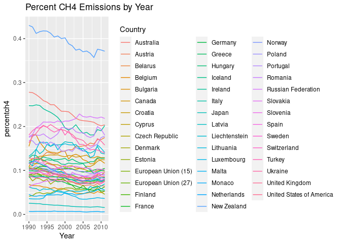
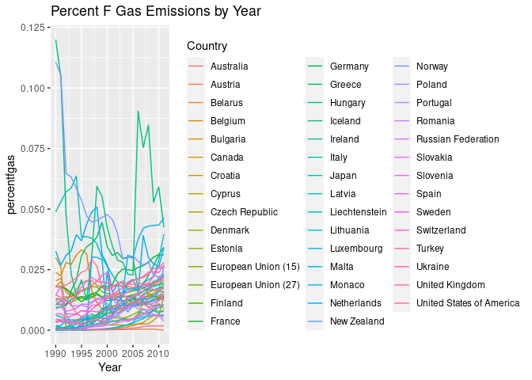
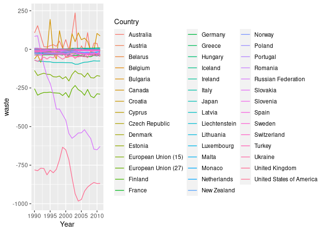

RmarkdownNguyenFinalProject
================
Grant Nguyen
11/1/2020

## R Markdown

Title & description of the project: A deeper dive into GHG Emissions

Your name & partner’s name: Grant
    Nguyen

``` r
library(tidyverse)
```

    ## ── Attaching packages ─────────────────────────────────────── tidyverse 1.3.0 ──

    ## ✓ ggplot2 3.3.2     ✓ purrr   0.3.4
    ## ✓ tibble  3.0.4     ✓ dplyr   1.0.2
    ## ✓ tidyr   1.1.2     ✓ stringr 1.4.0
    ## ✓ readr   1.4.0     ✓ forcats 0.5.0

    ## ── Conflicts ────────────────────────────────────────── tidyverse_conflicts() ──
    ## x dplyr::filter() masks stats::filter()
    ## x dplyr::lag()    masks stats::lag()

``` r
library(zoo)
```

    ## 
    ## Attaching package: 'zoo'

    ## The following objects are masked from 'package:base':
    ## 
    ##     as.Date, as.Date.numeric

``` r
install.packages("RcppRoll")
```

    ## Installing package into '/usr/local/lib/R/site-library'
    ## (as 'lib' is unspecified)

``` r
library(RcppRoll)
library(lubridate)
```

    ## 
    ## Attaching package: 'lubridate'

    ## The following objects are masked from 'package:base':
    ## 
    ##     date, intersect, setdiff, union

``` r
countryGHG <- read.csv("https://raw.githubusercontent.com/espm-157/Nguyen-Grant-Final-Project/master/cait_annex_ghgemissions.csv")
countryGHG
```

    ##                      Country Year Total.GHG.Emissions.Excluding.LUCF..MtCO2e.
    ## 1                  Australia 1990                                    417.7422
    ## 2                    Austria 1990                                     78.1567
    ## 3                    Belarus 1990                                    139.1512
    ## 4                    Belgium 1990                                    143.0948
    ## 5                   Bulgaria 1990                                    109.5408
    ## 6                     Canada 1990                                    591.0794
    ## 7                    Croatia 1990                                     31.6472
    ## 8                     Cyprus 1990                                      6.0908
    ## 9             Czech Republic 1990                                    196.0390
    ## 10                   Denmark 1990                                     70.0877
    ## 11                   Estonia 1990                                     40.5421
    ## 12       European Union (15) 1990                                   4254.5039
    ## 13       European Union (27) 1990                                   5574.4244
    ## 14                   Finland 1990                                     70.4375
    ## 15                    France 1990                                    559.4916
    ## 16                   Germany 1990                                   1250.2636
    ## 17                    Greece 1990                                    104.5866
    ## 18                   Hungary 1990                                     98.9807
    ## 19                   Iceland 1990                                      3.5080
    ## 20                   Ireland 1990                                     55.2471
    ## 21                     Italy 1990                                    518.9842
    ## 22                     Japan 1990                                   1266.6713
    ## 23                    Latvia 1990                                     26.3234
    ## 24             Liechtenstein 1990                                      0.2303
    ## 25                 Lithuania 1990                                     48.7539
    ## 26                Luxembourg 1990                                     12.9010
    ## 27                     Malta 1990                                      2.0066
    ## 28                    Monaco 1990                                      0.1079
    ## 29               Netherlands 1990                                    211.8493
    ## 30               New Zealand 1990                                     59.6431
    ## 31                    Norway 1990                                     50.3624
    ## 32                    Poland 1990                                    457.0146
    ## 33                  Portugal 1990                                     60.9524
    ## 34                   Romania 1990                                    244.4036
    ## 35        Russian Federation 1990                                   3351.9440
    ## 36                  Slovakia 1990                                     71.7818
    ## 37                  Slovenia 1990                                     18.4430
    ## 38                     Spain 1990                                    282.7887
    ## 39                    Sweden 1990                                     72.7504
    ## 40               Switzerland 1990                                     52.9730
    ## 41                    Turkey 1990                                    188.4342
    ## 42                   Ukraine 1990                                    929.8936
    ## 43            United Kingdom 1990                                    770.7837
    ## 44  United States of America 1990                                   6169.5921
    ## 45                 Australia 1991                                    419.3831
    ## 46                   Austria 1991                                     82.1964
    ## 47                   Belarus 1991                                    131.7234
    ## 48                   Belgium 1991                                    145.0799
    ## 49                  Bulgaria 1991                                     86.7432
    ## 50                    Canada 1991                                    583.3949
    ## 51                   Croatia 1991                                     24.9307
    ## 52                    Cyprus 1991                                      6.3548
    ## 53            Czech Republic 1991                                    182.1466
    ## 54                   Denmark 1991                                     80.5928
    ## 55                   Estonia 1991                                     37.3710
    ## 56       European Union (15) 1991                                   4268.7219
    ## 57       European Union (27) 1991                                   5477.4374
    ## 58                   Finland 1991                                     68.2443
    ## 59                    France 1991                                    583.2022
    ## 60                   Germany 1991                                   1203.2507
    ## 61                    Greece 1991                                    104.1804
    ## 62                   Hungary 1991                                     91.5537
    ## 63                   Iceland 1991                                      3.3447
    ## 64                   Ireland 1991                                     56.0286
    ## 65                     Italy 1991                                    520.5135
    ## 66                     Japan 1991                                   1280.9283
    ## 67                    Latvia 1991                                     24.4206
    ## 68             Liechtenstein 1991                                      0.2383
    ## 69                 Lithuania 1991                                     50.1225
    ## 70                Luxembourg 1991                                     13.4467
    ## 71                     Malta 1991                                      2.1828
    ## 72                    Monaco 1991                                      0.1092
    ## 73               Netherlands 1991                                    216.4157
    ## 74               New Zealand 1991                                     60.5968
    ## 75                    Norway 1991                                     48.2652
    ## 76                    Poland 1991                                    447.2457
    ## 77                  Portugal 1991                                     62.8837
    ## 78                   Romania 1991                                    199.5119
    ## 79        Russian Federation 1991                                   3177.8289
    ## 80                  Slovakia 1991                                     63.7461
    ## 81                  Slovenia 1991                                     17.3167
    ## 82                     Spain 1991                                    290.2759
    ## 83                    Sweden 1991                                     72.9249
    ## 84               Switzerland 1991                                     54.6560
    ## 85                    Turkey 1991                                    200.6540
    ## 86                   Ukraine 1991                                    818.2349
    ## 87            United Kingdom 1991                                    777.4737
    ## 88  United States of America 1991                                   6122.2497
    ## 89                 Australia 1992                                    423.8690
    ## 90                   Austria 1992                                     75.4347
    ## 91                   Belarus 1992                                    121.9809
    ## 92                   Belgium 1992                                    143.7962
    ## 93                  Bulgaria 1992                                     80.4927
    ## 94                    Canada 1992                                    600.3317
    ## 95                   Croatia 1992                                     23.2356
    ## 96                    Cyprus 1992                                      6.7822
    ## 97            Czech Republic 1992                                    165.6090
    ## 98                   Denmark 1992                                     74.5152
    ## 99                   Estonia 1992                                     27.3483
    ## 100      European Union (15) 1992                                   4180.1446
    ## 101      European Union (27) 1992                                   5277.5542
    ## 102                  Finland 1992                                     66.8278
    ## 103                   France 1992                                    575.6697
    ## 104                  Germany 1992                                   1153.1160
    ## 105                   Greece 1992                                    105.6121
    ## 106                  Hungary 1992                                     82.1006
    ## 107                  Iceland 1992                                      3.2505
    ## 108                  Ireland 1992                                     56.0205
    ## 109                    Italy 1992                                    517.6930
    ## 110                    Japan 1992                                   1295.3048
    ## 111                   Latvia 1992                                     19.6680
    ## 112            Liechtenstein 1992                                      0.2388
    ## 113                Lithuania 1992                                     30.2119
    ## 114               Luxembourg 1992                                     13.2217
    ## 115                    Malta 1992                                      2.2930
    ## 116                   Monaco 1992                                      0.1163
    ## 117              Netherlands 1992                                    215.0821
    ## 118              New Zealand 1992                                     61.7994
    ## 119                   Norway 1992                                     46.5175
    ## 120                   Poland 1992                                    433.3798
    ## 121                 Portugal 1992                                     67.2688
    ## 122                  Romania 1992                                    174.0505
    ## 123       Russian Federation 1992                                   2685.4731
    ## 124                 Slovakia 1992                                     58.2714
    ## 125                 Slovenia 1992                                     17.2022
    ## 126                    Spain 1992                                    297.0826
    ## 127                   Sweden 1992                                     72.5178
    ## 128              Switzerland 1992                                     54.3856
    ## 129                   Turkey 1992                                    211.7293
    ## 130                  Ukraine 1992                                    727.4651
    ## 131           United Kingdom 1992                                    754.3634
    ## 132 United States of America 1992                                   6238.8758
    ## 133                Australia 1993                                    425.6383
    ## 134                  Austria 1993                                     75.4798
    ## 135                  Belarus 1993                                    107.6064
    ## 136                  Belgium 1993                                    142.8444
    ## 137                 Bulgaria 1993                                     78.7152
    ## 138                   Canada 1993                                    602.0883
    ## 139                  Croatia 1993                                     23.2859
    ## 140                   Cyprus 1993                                      7.0864
    ## 141           Czech Republic 1993                                    159.4367
    ## 142                  Denmark 1993                                     76.6819
    ## 143                  Estonia 1993                                     21.2110
    ## 144      European Union (15) 1993                                   4108.9921
    ## 145      European Union (27) 1993                                   5174.3153
    ## 146                  Finland 1993                                     68.9188
    ## 147                   France 1993                                    546.8761
    ## 148                  Germany 1993                                   1143.8097
    ## 149                   Greece 1993                                    104.6681
    ## 150                  Hungary 1993                                     82.2942
    ## 151                  Iceland 1993                                      3.3127
    ## 152                  Ireland 1993                                     56.3869
    ## 153                    Italy 1993                                    511.1797
    ## 154                    Japan 1993                                   1288.8008
    ## 155                   Latvia 1993                                     15.8890
    ## 156            Liechtenstein 1993                                      0.2461
    ## 157                Lithuania 1993                                     24.3302
    ## 158               Luxembourg 1993                                     13.3338
    ## 159                    Malta 1993                                      2.2939
    ## 160                   Monaco 1993                                      0.1162
    ## 161              Netherlands 1993                                    220.0100
    ## 162              New Zealand 1993                                     61.4711
    ## 163                   Norway 1993                                     48.4500
    ## 164                   Poland 1993                                    433.6576
    ## 165                 Portugal 1993                                     65.8921
    ## 166                  Romania 1993                                    169.3643
    ## 167       Russian Federation 1993                                   2548.9992
    ## 168                 Slovakia 1993                                     53.6053
    ## 169                 Slovenia 1993                                     17.4395
    ## 170                    Spain 1993                                    284.9979
    ## 171                   Sweden 1993                                     72.5147
    ## 172              Switzerland 1993                                     51.5771
    ## 173                   Turkey 1993                                    223.0802
    ## 174                  Ukraine 1993                                    636.0601
    ## 175           United Kingdom 1993                                    733.4297
    ## 176 United States of America 1993                                   6385.0075
    ## 177                Australia 1994                                    426.1486
    ## 178                  Austria 1994                                     76.3381
    ## 179                  Belarus 1994                                     91.7299
    ## 180                  Belgium 1994                                    148.5785
    ## 181                 Bulgaria 1994                                     75.0742
    ## 182                   Canada 1994                                    622.7651
    ## 183                  Croatia 1994                                     22.4690
    ## 184                   Cyprus 1994                                      7.5640
    ## 185           Czech Republic 1994                                    149.4488
    ## 186                  Denmark 1994                                     80.6152
    ## 187                  Estonia 1994                                     21.8655
    ## 188      European Union (15) 1994                                   4108.7102
    ## 189      European Union (27) 1994                                   5148.9827
    ## 190                  Finland 1994                                     74.3109
    ## 191                   France 1994                                    546.9910
    ## 192                  Germany 1994                                   1123.9379
    ## 193                   Greece 1994                                    107.4195
    ## 194                  Hungary 1994                                     81.8420
    ## 195                  Iceland 1994                                      3.2455
    ## 196                  Ireland 1994                                     57.8468
    ## 197                    Italy 1994                                    503.4750
    ## 198                    Japan 1994                                   1360.0857
    ## 199                   Latvia 1994                                     13.9576
    ## 200            Liechtenstein 1994                                      0.2323
    ## 201                Lithuania 1994                                     22.9087
    ## 202               Luxembourg 1994                                     12.5051
    ## 203                    Malta 1994                                      2.4095
    ## 204                   Monaco 1994                                      0.1184
    ## 205              Netherlands 1994                                    219.9764
    ## 206              New Zealand 1994                                     62.5293
    ## 207                   Norway 1994                                     50.4097
    ## 208                   Poland 1994                                    430.0583
    ## 209                 Portugal 1994                                     67.1008
    ## 210                  Romania 1994                                    166.0943
    ## 211       Russian Federation 1994                                   2281.4601
    ## 212                 Slovakia 1994                                     51.4237
    ## 213                 Slovenia 1994                                     17.6260
    ## 214                    Spain 1994                                    301.2245
    ## 215                   Sweden 1994                                     75.0032
    ## 216              Switzerland 1994                                     50.6960
    ## 217                   Turkey 1994                                    218.5300
    ## 218                  Ukraine 1994                                    557.3590
    ## 219           United Kingdom 1994                                    721.4358
    ## 220 United States of America 1994                                   6456.4176
    ## 221                Australia 1995                                    439.1279
    ## 222                  Austria 1995                                     79.7290
    ## 223                  Belarus 1995                                     82.8397
    ## 224                  Belgium 1995                                    150.4079
    ## 225                 Bulgaria 1995                                     75.8387
    ## 226                   Canada 1995                                    639.1397
    ## 227                  Croatia 1995                                     23.0607
    ## 228                   Cyprus 1995                                      7.4653
    ## 229           Czech Republic 1995                                    150.6765
    ## 230                  Denmark 1995                                     77.2883
    ## 231                  Estonia 1995                                     20.0382
    ## 232      European Union (15) 1995                                   4146.3161
    ## 233      European Union (27) 1995                                   5194.6361
    ## 234                  Finland 1995                                     70.8846
    ## 235                   France 1995                                    555.1868
    ## 236                  Germany 1995                                   1118.3279
    ## 237                   Greece 1995                                    109.2891
    ## 238                  Hungary 1995                                     80.2957
    ## 239                  Iceland 1995                                      3.2862
    ## 240                  Ireland 1995                                     58.9857
    ## 241                    Italy 1995                                    530.2407
    ## 242                    Japan 1995                                   1337.7263
    ## 243                   Latvia 1995                                     12.5739
    ## 244            Liechtenstein 1995                                      0.2357
    ## 245                Lithuania 1995                                     22.0610
    ## 246               Luxembourg 1995                                     10.1775
    ## 247                    Malta 1995                                      2.3784
    ## 248                   Monaco 1995                                      0.1157
    ## 249              Netherlands 1995                                    223.1955
    ## 250              New Zealand 1995                                     63.2149
    ## 251                   Norway 1995                                     50.2203
    ## 252                   Poland 1995                                    432.4604
    ## 253                 Portugal 1995                                     71.6040
    ## 254                  Romania 1995                                    172.7906
    ## 255       Russian Federation 1995                                   2199.0245
    ## 256                 Slovakia 1995                                     53.2119
    ## 257                 Slovenia 1995                                     18.5294
    ## 258                    Spain 1995                                    312.6969
    ## 259                   Sweden 1995                                     74.3713
    ## 260              Switzerland 1995                                     51.4658
    ## 261                   Turkey 1995                                    238.8203
    ## 262                  Ukraine 1995                                    498.5663
    ## 263           United Kingdom 1995                                    712.3218
    ## 264 United States of America 1995                                   6541.2267
    ## 265                Australia 1996                                    446.2757
    ## 266                  Austria 1996                                     82.7415
    ## 267                  Belarus 1996                                     84.9079
    ## 268                  Belgium 1996                                    154.4367
    ## 269                 Bulgaria 1996                                     75.7024
    ## 270                   Canada 1996                                    658.1015
    ## 271                  Croatia 1996                                     23.7022
    ## 272                   Cyprus 1996                                      7.8770
    ## 273           Czech Republic 1996                                    154.6797
    ## 274                  Denmark 1996                                     90.2337
    ## 275                  Estonia 1996                                     20.7003
    ## 276      European Union (15) 1996                                   4227.3223
    ## 277      European Union (27) 1996                                   5300.4235
    ## 278                  Finland 1996                                     76.6194
    ## 279                   France 1996                                    569.9918
    ## 280                  Germany 1996                                   1137.2610
    ## 281                   Greece 1996                                    112.3514
    ## 282                  Hungary 1996                                     82.4181
    ## 283                  Iceland 1996                                      3.3762
    ## 284                  Ireland 1996                                     61.0588
    ## 285                    Italy 1996                                    523.9159
    ## 286                    Japan 1996                                   1351.5544
    ## 287                   Latvia 1996                                     12.6023
    ## 288            Liechtenstein 1996                                      0.2386
    ## 289                Lithuania 1996                                     23.3450
    ## 290               Luxembourg 1996                                     10.2386
    ## 291                    Malta 1996                                      2.4286
    ## 292                   Monaco 1996                                      0.1206
    ## 293              Netherlands 1996                                    231.2826
    ## 294              New Zealand 1996                                     65.3703
    ## 295                   Norway 1996                                     53.3526
    ## 296                   Poland 1996                                    445.6555
    ## 297                 Portugal 1996                                     69.3575
    ## 298                  Romania 1996                                    175.4024
    ## 299       Russian Federation 1996                                   2136.5901
    ## 300                 Slovakia 1996                                     53.0872
    ## 301                 Slovenia 1996                                     19.2027
    ## 302                    Spain 1996                                    305.0734
    ## 303                   Sweden 1996                                     78.3355
    ## 304              Switzerland 1996                                     52.0919
    ## 305                   Turkey 1996                                    259.9390
    ## 306                  Ukraine 1996                                    450.5285
    ## 307           United Kingdom 1996                                    733.0229
    ## 308 United States of America 1996                                   6747.5408
    ## 309                Australia 1997                                    458.7685
    ## 310                  Austria 1997                                     82.2693
    ## 311                  Belarus 1997                                     86.7301
    ## 312                  Belgium 1997                                    145.8620
    ## 313                 Bulgaria 1997                                     72.0743
    ## 314                   Canada 1997                                    671.8429
    ## 315                  Croatia 1997                                     25.1187
    ## 316                   Cyprus 1997                                      7.9423
    ## 317           Czech Republic 1997                                    151.7639
    ## 318                  Denmark 1997                                     80.7183
    ## 319                  Estonia 1997                                     20.3142
    ## 320      European Union (15) 1997                                   4164.4028
    ## 321      European Union (27) 1997                                   5206.5503
    ## 322                  Finland 1997                                     75.2371
    ## 323                   France 1997                                    564.5332
    ## 324                  Germany 1997                                   1101.3522
    ## 325                   Greece 1997                                    117.1680
    ## 326                  Hungary 1997                                     80.6180
    ## 327                  Iceland 1997                                      3.5305
    ## 328                  Ireland 1997                                     62.5651
    ## 329                    Italy 1997                                    530.2973
    ## 330                    Japan 1997                                   1344.9561
    ## 331                   Latvia 1997                                     12.0405
    ## 332            Liechtenstein 1997                                      0.2509
    ## 333                Lithuania 1997                                     23.0370
    ## 334               Luxembourg 1997                                      9.5345
    ## 335                    Malta 1997                                      2.4965
    ## 336                   Monaco 1997                                      0.1206
    ## 337              Netherlands 1997                                    224.6536
    ## 338              New Zealand 1997                                     68.1379
    ## 339                   Norway 1997                                     53.3075
    ## 340                   Poland 1997                                    437.1429
    ## 341                 Portugal 1997                                     72.4379
    ## 342                  Romania 1997                                    161.9684
    ## 343       Russian Federation 1997                                   2031.9748
    ## 344                 Slovakia 1997                                     53.1881
    ## 345                 Slovenia 1997                                     19.5613
    ## 346                    Spain 1997                                    326.6202
    ## 347                   Sweden 1997                                     73.2638
    ## 348              Switzerland 1997                                     51.1694
    ## 349                   Turkey 1997                                    273.1725
    ## 350                  Ukraine 1997                                    428.0423
    ## 351           United Kingdom 1997                                    706.6485
    ## 352 United States of America 1997                                   6810.6028
    ## 353                Australia 1998                                    473.1490
    ## 354                  Austria 1998                                     81.6352
    ## 355                  Belarus 1998                                     84.9498
    ## 356                  Belgium 1998                                    151.4338
    ## 357                 Bulgaria 1998                                     67.1272
    ## 358                   Canada 1998                                    679.4556
    ## 359                  Croatia 1998                                     25.2919
    ## 360                   Cyprus 1998                                      8.0316
    ## 361           Czech Republic 1998                                    144.7988
    ## 362                  Denmark 1998                                     76.8825
    ## 363                  Estonia 1998                                     18.7846
    ## 364      European Union (15) 1998                                   4184.7022
    ## 365      European Union (27) 1998                                   5167.4594
    ## 366                  Finland 1998                                     71.6523
    ## 367                   France 1998                                    579.9950
    ## 368                  Germany 1998                                   1075.4058
    ## 369                   Greece 1998                                    122.7513
    ## 370                  Hungary 1998                                     80.0602
    ## 371                  Iceland 1998                                      3.6613
    ## 372                  Ireland 1998                                     65.3642
    ## 373                    Italy 1998                                    541.6607
    ## 374                    Japan 1998                                   1302.3905
    ## 375                   Latvia 1998                                     11.5094
    ## 376            Liechtenstein 1998                                      0.2624
    ## 377                Lithuania 1998                                     23.8030
    ## 378               Luxembourg 1998                                      8.6446
    ## 379                    Malta 1998                                      2.5074
    ## 380                   Monaco 1998                                      0.1186
    ## 381              Netherlands 1998                                    225.5088
    ## 382              New Zealand 1998                                     65.8199
    ## 383                   Norway 1998                                     53.4724
    ## 384                   Poland 1998                                    408.7846
    ## 385                 Portugal 1998                                     77.3015
    ## 386                  Romania 1998                                    145.4892
    ## 387       Russian Federation 1998                                   1996.3706
    ## 388                 Slovakia 1998                                     52.5433
    ## 389                 Slovenia 1998                                     19.3180
    ## 390                    Spain 1998                                    336.6425
    ## 391                   Sweden 1998                                     73.7481
    ## 392              Switzerland 1998                                     52.5101
    ## 393                   Turkey 1998                                    275.3148
    ## 394                  Ukraine 1998                                    419.7390
    ## 395           United Kingdom 1998                                    705.1960
    ## 396 United States of America 1998                                   6825.1730
    ## 397                Australia 1999                                    482.4221
    ## 398                  Austria 1999                                     79.9171
    ## 399                  Belarus 1999                                     81.4761
    ## 400                  Belgium 1999                                    145.2278
    ## 401                 Bulgaria 1999                                     60.3147
    ## 402                   Canada 1999                                    691.6306
    ## 403                  Croatia 1999                                     26.5719
    ## 404                   Cyprus 1999                                      8.3294
    ## 405           Czech Republic 1999                                    136.4314
    ## 406                  Denmark 1999                                     74.1625
    ## 407                  Estonia 1999                                     17.4270
    ## 408      European Union (15) 1999                                   4122.5406
    ## 409      European Union (27) 1999                                   5059.3911
    ## 410                  Finland 1999                                     71.1067
    ## 411                   France 1999                                    565.6810
    ## 412                  Germany 1999                                   1041.5327
    ## 413                   Greece 1999                                    122.6141
    ## 414                  Hungary 1999                                     80.3223
    ## 415                  Iceland 1999                                      3.8909
    ## 416                  Ireland 1999                                     66.2931
    ## 417                    Italy 1999                                    548.0498
    ## 418                    Japan 1999                                   1323.5416
    ## 419                   Latvia 1999                                     10.7140
    ## 420            Liechtenstein 1999                                      0.2613
    ## 421                Lithuania 1999                                     21.2555
    ## 422               Luxembourg 1999                                      9.0625
    ## 423                    Malta 1999                                      2.5938
    ## 424                   Monaco 1999                                      0.1194
    ## 425              Netherlands 1999                                    213.3686
    ## 426              New Zealand 1999                                     67.7859
    ## 427                   Norway 1999                                     54.4853
    ## 428                   Poland 1999                                    398.6422
    ## 429                 Portugal 1999                                     85.4378
    ## 430                  Romania 1999                                    130.7782
    ## 431       Russian Federation 1999                                   2028.6356
    ## 432                 Slovakia 1999                                     51.3778
    ## 433                 Slovenia 1999                                     18.6642
    ## 434                    Spain 1999                                    364.5169
    ## 435                   Sweden 1999                                     70.4079
    ## 436              Switzerland 1999                                     52.6023
    ## 437                   Turkey 1999                                    276.0209
    ## 438                  Ukraine 1999                                    409.5321
    ## 439           United Kingdom 1999                                    674.2471
    ## 440 United States of America 1999                                   6885.2796
    ## 441                Australia 2000                                    493.2718
    ## 442                  Austria 2000                                     80.1981
    ## 443                  Belarus 2000                                     79.1651
    ## 444                  Belgium 2000                                    145.9917
    ## 445                 Bulgaria 2000                                     59.5007
    ## 446                   Canada 2000                                    717.5811
    ## 447                  Croatia 2000                                     26.2902
    ## 448                   Cyprus 2000                                      8.5738
    ## 449           Czech Republic 2000                                    145.8860
    ## 450                  Denmark 2000                                     69.6491
    ## 451                  Estonia 2000                                     17.1422
    ## 452      European Union (15) 2000                                   4137.5439
    ## 453      European Union (27) 2000                                   5066.4636
    ## 454                  Finland 2000                                     69.3297
    ## 455                   France 2000                                    562.9950
    ## 456                  Germany 2000                                   1040.5958
    ## 457                   Greece 2000                                    126.2244
    ## 458                  Hungary 2000                                     78.4400
    ## 459                  Iceland 2000                                      3.8756
    ## 460                  Ireland 2000                                     68.2030
    ## 461                    Italy 2000                                    551.3012
    ## 462                    Japan 2000                                   1342.0875
    ## 463                   Latvia 2000                                     10.0626
    ## 464            Liechtenstein 2000                                      0.2549
    ## 465                Lithuania 2000                                     19.6477
    ## 466               Luxembourg 2000                                      9.7600
    ## 467                    Malta 2000                                      2.5410
    ## 468                   Monaco 2000                                      0.1199
    ## 469              Netherlands 2000                                    213.0057
    ## 470              New Zealand 2000                                     69.4007
    ## 471                   Norway 2000                                     54.0171
    ## 472                   Poland 2000                                    385.3808
    ## 473                 Portugal 2000                                     84.3033
    ## 474                  Romania 2000                                    133.5260
    ## 475       Russian Federation 2000                                   2047.0364
    ## 476                 Slovakia 2000                                     49.2986
    ## 477                 Slovenia 2000                                     18.9202
    ## 478                    Spain 2000                                    378.7758
    ## 479                   Sweden 2000                                     68.9017
    ## 480              Switzerland 2000                                     51.7366
    ## 481                   Turkey 2000                                    298.2148
    ## 482                  Ukraine 2000                                    395.7498
    ## 483           United Kingdom 2000                                    677.4889
    ## 484 United States of America 2000                                   7045.3463
    ## 485                Australia 2001                                    504.0331
    ## 486                  Austria 2001                                     84.1842
    ## 487                  Belarus 2001                                     77.2166
    ## 488                  Belgium 2001                                    145.4008
    ## 489                 Bulgaria 2001                                     62.6593
    ## 490                   Canada 2001                                    710.9696
    ## 491                  Croatia 2001                                     27.4548
    ## 492                   Cyprus 2001                                      8.4704
    ## 493           Czech Republic 2001                                    145.6717
    ## 494                  Denmark 2001                                     71.3024
    ## 495                  Estonia 2001                                     17.5306
    ## 496      European Union (15) 2001                                   4176.3352
    ## 497      European Union (27) 2001                                   5115.4507
    ## 498                  Finland 2001                                     74.5584
    ## 499                   France 2001                                    560.9417
    ## 500                  Germany 2001                                   1055.4223
    ## 501                   Greece 2001                                    127.2218
    ## 502                  Hungary 2001                                     80.2514
    ## 503                  Iceland 2001                                      3.8425
    ## 504                  Ireland 2001                                     70.1705
    ## 505                    Italy 2001                                    557.2281
    ## 506                    Japan 2001                                   1317.1245
    ## 507                   Latvia 2001                                     10.6910
    ## 508            Liechtenstein 2001                                      0.2547
    ## 509                Lithuania 2001                                     20.7133
    ## 510               Luxembourg 2001                                     10.2597
    ## 511                    Malta 2001                                      2.6659
    ## 512                   Monaco 2001                                      0.1189
    ## 513              Netherlands 2001                                    214.5296
    ## 514              New Zealand 2001                                     72.0407
    ## 515                   Norway 2001                                     55.2573
    ## 516                   Poland 2001                                    382.0645
    ## 517                 Portugal 2001                                     84.1269
    ## 518                  Romania 2001                                    136.2594
    ## 519       Russian Federation 2001                                   2070.1863
    ## 520                 Slovakia 2001                                     52.3551
    ## 521                 Slovenia 2001                                     19.7830
    ## 522                    Spain 2001                                    379.2222
    ## 523                   Sweden 2001                                     69.6700
    ## 524              Switzerland 2001                                     52.7988
    ## 525                   Turkey 2001                                    279.2458
    ## 526                  Ukraine 2001                                    400.2432
    ## 527           United Kingdom 2001                                    681.3026
    ## 528 United States of America 2001                                   6935.5835
    ## 529                Australia 2002                                    505.4432
    ## 530                  Austria 2002                                     85.8814
    ## 531                  Belarus 2002                                     76.7879
    ## 532                  Belgium 2002                                    144.2950
    ## 533                 Bulgaria 2002                                     59.6765
    ## 534                   Canada 2002                                    717.8248
    ## 535                  Croatia 2002                                     28.5576
    ## 536                   Cyprus 2002                                      8.7225
    ## 537           Czech Republic 2002                                    141.5393
    ## 538                  Denmark 2002                                     70.6527
    ## 539                  Estonia 2002                                     16.9354
    ## 540      European Union (15) 2002                                   4152.1903
    ## 541      European Union (27) 2002                                   5070.1975
    ## 542                  Finland 2002                                     76.7263
    ## 543                   France 2002                                    556.2269
    ## 544                  Germany 2002                                   1034.1638
    ## 545                   Greece 2002                                    127.0479
    ## 546                  Hungary 2002                                     78.1435
    ## 547                  Iceland 2002                                      3.8758
    ## 548                  Ireland 2002                                     68.2590
    ## 549                    Italy 2002                                    558.4026
    ## 550                    Japan 2002                                   1349.1509
    ## 551                   Latvia 2002                                     10.6457
    ## 552            Liechtenstein 2002                                      0.2603
    ## 553                Lithuania 2002                                     21.2483
    ## 554               Luxembourg 2002                                     11.0372
    ## 555                    Malta 2002                                      2.7002
    ## 556                   Monaco 2002                                      0.1173
    ## 557              Netherlands 2002                                    213.5354
    ## 558              New Zealand 2002                                     72.7061
    ## 559                   Norway 2002                                     54.1036
    ## 560                   Poland 2002                                    369.0364
    ## 561                 Portugal 2002                                     88.3165
    ## 562                  Romania 2002                                    138.2170
    ## 563       Russian Federation 2002                                   2072.0981
    ## 564                 Slovakia 2002                                     51.2053
    ## 565                 Slovenia 2002                                     19.9372
    ## 566                    Spain 2002                                    395.6681
    ## 567                   Sweden 2002                                     70.3659
    ## 568              Switzerland 2002                                     51.7282
    ## 569                   Turkey 2002                                    287.2176
    ## 570                  Ukraine 2002                                    403.0984
    ## 571           United Kingdom 2002                                    661.0824
    ## 572 United States of America 2002                                   6979.3405
    ## 573                Australia 2003                                    509.6304
    ## 574                  Austria 2003                                     91.8755
    ## 575                  Belarus 2003                                     78.5616
    ## 576                  Belgium 2003                                    146.2261
    ## 577                 Bulgaria 2003                                     64.4348
    ## 578                   Canada 2003                                    738.0439
    ## 579                  Croatia 2003                                     29.9628
    ## 580                   Cyprus 2003                                      9.0994
    ## 581           Czech Republic 2003                                    144.5824
    ## 582                  Denmark 2003                                     75.5113
    ## 583                  Estonia 2003                                     18.8391
    ## 584      European Union (15) 2003                                   4206.1999
    ## 585      European Union (27) 2003                                   5157.8898
    ## 586                  Finland 2003                                     84.6310
    ## 587                   France 2003                                    562.2570
    ## 588                  Germany 2003                                   1032.0824
    ## 589                   Greece 2003                                    130.8818
    ## 590                  Hungary 2003                                     81.2348
    ## 591                  Iceland 2003                                      3.8523
    ## 592                  Ireland 2003                                     68.3313
    ## 593                    Italy 2003                                    573.7271
    ## 594                    Japan 2003                                   1352.9039
    ## 595                   Latvia 2003                                     10.8716
    ## 596            Liechtenstein 2003                                      0.2705
    ## 597                Lithuania 2003                                     21.4512
    ## 598               Luxembourg 2003                                     11.4256
    ## 599                    Malta 2003                                      2.8881
    ## 600                   Monaco 2003                                      0.1121
    ## 601              Netherlands 2003                                    214.3149
    ## 602              New Zealand 2003                                     75.1767
    ## 603                   Norway 2003                                     54.8430
    ## 604                   Poland 2003                                    382.0139
    ## 605                 Portugal 2003                                     82.9752
    ## 606                  Romania 2003                                    145.0847
    ## 607       Russian Federation 2003                                   2110.3908
    ## 608                 Slovakia 2003                                     51.5442
    ## 609                 Slovenia 2003                                     19.6457
    ## 610                    Spain 2003                                    402.6300
    ## 611                   Sweden 2003                                     70.7971
    ## 612              Switzerland 2003                                     52.8523
    ## 613                   Turkey 2003                                    303.7731
    ## 614                  Ukraine 2003                                    416.4905
    ## 615           United Kingdom 2003                                    668.0152
    ## 616 United States of America 2003                                   7019.4714
    ## 617                Australia 2004                                    525.2847
    ## 618                  Austria 2004                                     91.5195
    ## 619                  Belarus 2004                                     82.8959
    ## 620                  Belgium 2004                                    147.1649
    ## 621                 Bulgaria 2004                                     63.6382
    ## 622                   Canada 2004                                    744.3897
    ## 623                  Croatia 2004                                     30.0898
    ## 624                   Cyprus 2004                                      9.3151
    ## 625           Czech Republic 2004                                    145.9495
    ## 626                  Denmark 2004                                     69.7177
    ## 627                  Estonia 2004                                     19.1765
    ## 628      European Union (15) 2004                                   4206.6224
    ## 629      European Union (27) 2004                                   5161.6396
    ## 630                  Finland 2004                                     80.6191
    ## 631                   France 2004                                    560.5527
    ## 632                  Germany 2004                                   1019.5739
    ## 633                   Greece 2004                                    131.3427
    ## 634                  Hungary 2004                                     80.4926
    ## 635                  Iceland 2004                                      3.9049
    ## 636                  Ireland 2004                                     68.2075
    ## 637                    Italy 2004                                    576.9894
    ## 638                    Japan 2004                                   1348.8064
    ## 639                   Latvia 2004                                     11.0094
    ## 640            Liechtenstein 2004                                      0.2713
    ## 641                Lithuania 2004                                     22.2415
    ## 642               Luxembourg 2004                                     12.8426
    ## 643                    Malta 2004                                      2.8978
    ## 644                   Monaco 2004                                      0.1060
    ## 645              Netherlands 2004                                    215.5146
    ## 646              New Zealand 2004                                     74.4981
    ## 647                   Norway 2004                                     55.4179
    ## 648                   Poland 2004                                    386.6551
    ## 649                 Portugal 2004                                     85.6804
    ## 650                  Romania 2004                                    142.3008
    ## 651       Russian Federation 2004                                   2145.2182
    ## 652                 Slovakia 2004                                     51.3765
    ## 653                 Slovenia 2004                                     19.9642
    ## 654                    Spain 2004                                    418.5287
    ## 655                   Sweden 2004                                     70.0089
    ## 656              Switzerland 2004                                     53.5304
    ## 657                   Turkey 2004                                    313.2718
    ## 658                  Ukraine 2004                                    417.1392
    ## 659           United Kingdom 2004                                    667.9760
    ## 660 United States of America 2004                                   7147.2662
    ## 661                Australia 2005                                    529.3209
    ## 662                  Austria 2005                                     92.8945
    ## 663                  Belarus 2005                                     84.1737
    ## 664                  Belgium 2005                                    143.2689
    ## 665                 Bulgaria 2005                                     63.7492
    ## 666                   Canada 2005                                    737.4568
    ## 667                  Croatia 2005                                     30.4538
    ## 668                   Cyprus 2005                                      9.3111
    ## 669           Czech Republic 2005                                    145.2594
    ## 670                  Denmark 2005                                     65.3960
    ## 671                  Estonia 2005                                     18.4776
    ## 672      European Union (15) 2005                                   4172.7762
    ## 673      European Union (27) 2005                                   5129.1563
    ## 674                  Finland 2005                                     68.7480
    ## 675                   France 2005                                    563.0652
    ## 676                  Germany 2005                                    997.9294
    ## 677                   Greece 2005                                    134.9207
    ## 678                  Hungary 2005                                     79.4537
    ## 679                  Iceland 2005                                      3.8325
    ## 680                  Ireland 2005                                     69.4506
    ## 681                    Italy 2005                                    574.4334
    ## 682                    Japan 2005                                   1351.4067
    ## 683                   Latvia 2005                                     11.0977
    ## 684            Liechtenstein 2005                                      0.2718
    ## 685                Lithuania 2005                                     23.3433
    ## 686               Luxembourg 2005                                     13.0964
    ## 687                    Malta 2005                                      2.9920
    ## 688                   Monaco 2005                                      0.1047
    ## 689              Netherlands 2005                                    209.4743
    ## 690              New Zealand 2005                                     76.6444
    ## 691                   Norway 2005                                     54.2757
    ## 692                   Poland 2005                                    390.2307
    ## 693                 Portugal 2005                                     88.0372
    ## 694                  Romania 2005                                    141.5605
    ## 695       Russian Federation 2005                                   2128.7497
    ## 696                 Slovakia 2005                                     50.5963
    ## 697                 Slovenia 2005                                     20.3085
    ## 698                    Spain 2005                                    432.8344
    ## 699                   Sweden 2005                                     67.2683
    ## 700              Switzerland 2005                                     54.2274
    ## 701                   Turkey 2005                                    330.9824
    ## 702                  Ukraine 2005                                    417.2967
    ## 703           United Kingdom 2005                                    661.9312
    ## 704 United States of America 2005                                   7169.8993
    ## 705                Australia 2006                                    534.2012
    ## 706                  Austria 2006                                     90.0922
    ## 707                  Belarus 2006                                     88.0440
    ## 708                  Belgium 2006                                    138.5050
    ## 709                 Bulgaria 2006                                     64.5664
    ## 710                   Canada 2006                                    727.1960
    ## 711                  Croatia 2006                                     30.8961
    ## 712                   Cyprus 2006                                      9.5583
    ## 713           Czech Republic 2006                                    147.0381
    ## 714                  Denmark 2006                                     73.2591
    ## 715                  Estonia 2006                                     17.9287
    ## 716      European Union (15) 2006                                   4138.4443
    ## 717      European Union (27) 2006                                   5116.8655
    ## 718                  Finland 2006                                     80.0782
    ## 719                   France 2006                                    551.1131
    ## 720                  Germany 2006                                   1000.3877
    ## 721                   Greece 2006                                    131.3430
    ## 722                  Hungary 2006                                     78.0485
    ## 723                  Iceland 2006                                      4.3635
    ## 724                  Ireland 2006                                     69.0255
    ## 725                    Italy 2006                                    563.6680
    ## 726                    Japan 2006                                   1333.4996
    ## 727                   Latvia 2006                                     11.5924
    ## 728            Liechtenstein 2006                                      0.2740
    ## 729                Lithuania 2006                                     23.7480
    ## 730               Luxembourg 2006                                     12.9478
    ## 731                    Malta 2006                                      2.9920
    ## 732                   Monaco 2006                                      0.0942
    ## 733              Netherlands 2006                                    205.5426
    ## 734              New Zealand 2006                                     76.5171
    ## 735                   Norway 2006                                     54.1007
    ## 736                   Poland 2006                                    406.0115
    ## 737                 Portugal 2006                                     83.0077
    ## 738                  Romania 2006                                    145.8801
    ## 739       Russian Federation 2006                                   2196.0975
    ## 740                 Slovakia 2006                                     50.5029
    ## 741                 Slovenia 2006                                     20.5543
    ## 742                    Spain 2006                                    424.2475
    ## 743                   Sweden 2006                                     67.1640
    ## 744              Switzerland 2006                                     53.8814
    ## 745                   Turkey 2006                                    350.7388
    ## 746                  Ukraine 2006                                    433.7123
    ## 747           United Kingdom 2006                                    658.3330
    ## 748 United States of America 2006                                   7109.3381
    ## 749                Australia 2007                                    542.5307
    ## 750                  Austria 2007                                     87.2462
    ## 751                  Belarus 2007                                     87.3117
    ## 752                  Belgium 2007                                    133.6700
    ## 753                 Bulgaria 2007                                     68.4880
    ## 754                   Canada 2007                                    748.8400
    ## 755                  Croatia 2007                                     32.4301
    ## 756                   Cyprus 2007                                      9.8081
    ## 757           Czech Republic 2007                                    147.6248
    ## 758                  Denmark 2007                                     68.6783
    ## 759                  Estonia 2007                                     21.0470
    ## 760      European Union (15) 2007                                   4074.9038
    ## 761      European Union (27) 2007                                   5059.0337
    ## 762                  Finland 2007                                     78.4169
    ## 763                   France 2007                                    541.0476
    ## 764                  Germany 2007                                    975.9461
    ## 765                   Greece 2007                                    134.1862
    ## 766                  Hungary 2007                                     76.0397
    ## 767                  Iceland 2007                                      4.5917
    ## 768                  Ireland 2007                                     68.4059
    ## 769                    Italy 2007                                    555.3674
    ## 770                    Japan 2007                                   1365.2273
    ## 771                   Latvia 2007                                     12.0854
    ## 772            Liechtenstein 2007                                      0.2442
    ## 773                Lithuania 2007                                     26.1574
    ## 774               Luxembourg 2007                                     12.3589
    ## 775                    Malta 2007                                      3.1056
    ## 776                   Monaco 2007                                      0.0998
    ## 777              Netherlands 2007                                    204.1990
    ## 778              New Zealand 2007                                     74.4611
    ## 779                   Norway 2007                                     56.0113
    ## 780                   Poland 2007                                    407.8610
    ## 781                 Portugal 2007                                     80.5103
    ## 782                  Romania 2007                                    142.7036
    ## 783       Russian Federation 2007                                   2199.5280
    ## 784                 Slovakia 2007                                     48.5197
    ## 785                 Slovenia 2007                                     20.6897
    ## 786                    Spain 2007                                    432.0093
    ## 787                   Sweden 2007                                     65.5056
    ## 788              Switzerland 2007                                     51.9476
    ## 789                   Turkey 2007                                    380.9476
    ## 790                  Ukraine 2007                                    436.3021
    ## 791           United Kingdom 2007                                    648.0357
    ## 792 United States of America 2007                                   7225.9337
    ## 793                Australia 2008                                    550.3388
    ## 794                  Austria 2008                                     86.9624
    ## 795                  Belarus 2008                                     90.5991
    ## 796                  Belgium 2008                                    136.6454
    ## 797                 Bulgaria 2008                                     66.9427
    ## 798                   Canada 2008                                    730.9157
    ## 799                  Croatia 2008                                     31.1667
    ## 800                   Cyprus 2008                                     10.0655
    ## 801           Czech Republic 2008                                    142.1464
    ## 802                  Denmark 2008                                     65.2371
    ## 803                  Estonia 2008                                     19.6177
    ## 804      European Union (15) 2008                                   3989.3106
    ## 805      European Union (27) 2008                                   4952.4118
    ## 806                  Finland 2008                                     70.2103
    ## 807                   France 2008                                    536.3180
    ## 808                  Germany 2008                                    974.9927
    ## 809                   Greece 2008                                    130.3339
    ## 810                  Hungary 2008                                     73.5882
    ## 811                  Iceland 2008                                      4.9936
    ## 812                  Ireland 2008                                     67.6080
    ## 813                    Italy 2008                                    541.1775
    ## 814                    Japan 2008                                   1281.9526
    ## 815                   Latvia 2008                                     11.5625
    ## 816            Liechtenstein 2008                                      0.2642
    ## 817                Lithuania 2008                                     24.9193
    ## 818               Luxembourg 2008                                     12.1876
    ## 819                    Malta 2008                                      3.0608
    ## 820                   Monaco 2008                                      0.0966
    ## 821              Netherlands 2008                                    203.3131
    ## 822              New Zealand 2008                                     74.0662
    ## 823                   Norway 2008                                     54.3438
    ## 824                   Poland 2008                                    400.2140
    ## 825                 Portugal 2008                                     78.4817
    ## 826                  Romania 2008                                    140.4642
    ## 827       Russian Federation 2008                                   2237.4202
    ## 828                 Slovakia 2008                                     49.1138
    ## 829                 Slovenia 2008                                     21.4062
    ## 830                    Spain 2008                                    398.8764
    ## 831                   Sweden 2008                                     63.4072
    ## 832              Switzerland 2008                                     53.6826
    ## 833                   Turkey 2008                                    367.2073
    ## 834                  Ukraine 2008                                    421.2610
    ## 835           United Kingdom 2008                                    633.9822
    ## 836 United States of America 2008                                   7021.5689
    ## 837                Australia 2009                                    549.1230
    ## 838                  Austria 2009                                     79.9560
    ## 839                  Belarus 2009                                     87.8788
    ## 840                  Belgium 2009                                    124.4677
    ## 841                 Bulgaria 2009                                     57.8052
    ## 842                   Canada 2009                                    689.0302
    ## 843                  Croatia 2009                                     29.1587
    ## 844                   Cyprus 2009                                      9.8035
    ## 845           Czech Republic 2009                                    133.4862
    ## 846                  Denmark 2009                                     62.2530
    ## 847                  Estonia 2009                                     16.2616
    ## 848      European Union (15) 2009                                   3710.1569
    ## 849      European Union (27) 2009                                   4593.4423
    ## 850                  Finland 2009                                     66.0502
    ## 851                   France 2009                                    513.0030
    ## 852                  Germany 2009                                    911.3081
    ## 853                   Greece 2009                                    123.6339
    ## 854                  Hungary 2009                                     67.3807
    ## 855                  Iceland 2009                                      4.7509
    ## 856                  Ireland 2009                                     61.8249
    ## 857                    Italy 2009                                    490.7797
    ## 858                    Japan 2009                                   1206.8479
    ## 859                   Latvia 2009                                     10.8822
    ## 860            Liechtenstein 2009                                      0.2480
    ## 861                Lithuania 2009                                     20.4231
    ## 862               Luxembourg 2009                                     11.6900
    ## 863                    Malta 2009                                      2.9790
    ## 864                   Monaco 2009                                      0.0914
    ## 865              Netherlands 2009                                    197.8655
    ## 866              New Zealand 2009                                     71.4409
    ## 867                   Norway 2009                                     51.7733
    ## 868                   Poland 2009                                    380.5868
    ## 869                 Portugal 2009                                     75.2157
    ## 870                  Romania 2009                                    120.2944
    ## 871       Russian Federation 2009                                   2121.4223
    ## 872                 Slovakia 2009                                     43.9561
    ## 873                 Slovenia 2009                                     19.4267
    ## 874                    Spain 2009                                    362.7132
    ## 875                   Sweden 2009                                     59.3378
    ## 876              Switzerland 2009                                     52.3504
    ## 877                   Turkey 2009                                    370.0121
    ## 878                  Ukraine 2009                                    365.3066
    ## 879           United Kingdom 2009                                    580.3820
    ## 880 United States of America 2009                                   6566.1980
    ## 881                Australia 2010                                    548.7444
    ## 882                  Austria 2010                                     85.0122
    ## 883                  Belarus 2010                                     89.4463
    ## 884                  Belgium 2010                                    131.7823
    ## 885                 Bulgaria 2010                                     60.3524
    ## 886                   Canada 2010                                    700.8493
    ## 887                  Croatia 2010                                     28.6155
    ## 888                   Cyprus 2010                                      9.4435
    ## 889           Czech Republic 2010                                    137.4226
    ## 890                  Denmark 2010                                     62.7786
    ## 891                  Estonia 2010                                     19.9888
    ## 892      European Union (15) 2010                                   3790.2247
    ## 893      European Union (27) 2010                                   4705.2002
    ## 894                  Finland 2010                                     74.5367
    ## 895                   France 2010                                    519.8894
    ## 896                  Germany 2010                                    943.5184
    ## 897                   Greece 2010                                    117.2781
    ## 898                  Hungary 2010                                     67.9454
    ## 899                  Iceland 2010                                      4.6180
    ## 900                  Ireland 2010                                     61.4926
    ## 901                    Italy 2010                                    500.3139
    ## 902                    Japan 2010                                   1257.3806
    ## 903                   Latvia 2010                                     12.0345
    ## 904            Liechtenstein 2010                                      0.2341
    ## 905                Lithuania 2010                                     21.1206
    ## 906               Luxembourg 2010                                     12.2521
    ## 907                    Malta 2010                                      2.9979
    ## 908                   Monaco 2010                                      0.0880
    ## 909              Netherlands 2010                                    209.1766
    ## 910              New Zealand 2010                                     71.8478
    ## 911                   Norway 2010                                     54.3173
    ## 912                   Poland 2010                                    401.6704
    ## 913                 Portugal 2010                                     71.3824
    ## 914                  Romania 2010                                    116.6212
    ## 915       Russian Federation 2010                                   2217.2709
    ## 916                 Slovakia 2010                                     45.8964
    ## 917                 Slovenia 2010                                     19.4819
    ## 918                    Spain 2010                                    348.6413
    ## 919                   Sweden 2010                                     65.4874
    ## 920              Switzerland 2010                                     54.0875
    ## 921                   Turkey 2010                                    402.1027
    ## 922                  Ukraine 2010                                    383.2114
    ## 923           United Kingdom 2010                                    597.7793
    ## 924 United States of America 2010                                   6790.6421
    ## 925                Australia 2011                                    552.2864
    ## 926                  Austria 2011                                     82.8416
    ## 927                  Belarus 2011                                     87.3198
    ## 928                  Belgium 2011                                    120.1715
    ## 929                 Bulgaria 2011                                     66.1333
    ## 930                   Canada 2011                                    701.7912
    ## 931                  Croatia 2011                                     28.2564
    ## 932                   Cyprus 2011                                      9.1544
    ## 933           Czech Republic 2011                                    133.4955
    ## 934                  Denmark 2011                                     57.7483
    ## 935                  Estonia 2011                                     20.9556
    ## 936      European Union (15) 2011                                   3630.6572
    ## 937      European Union (27) 2011                                   4550.2122
    ## 938                  Finland 2011                                     67.0189
    ## 939                   France 2011                                    491.4965
    ## 940                  Germany 2011                                    916.4951
    ## 941                   Greece 2011                                    115.0450
    ## 942                  Hungary 2011                                     66.1477
    ## 943                  Iceland 2011                                      4.4132
    ## 944                  Ireland 2011                                     57.5125
    ## 945                    Italy 2011                                    488.7920
    ## 946                    Japan 2011                                   1307.7284
    ## 947                   Latvia 2011                                     11.4942
    ## 948            Liechtenstein 2011                                      0.2220
    ## 949                Lithuania 2011                                     21.6117
    ## 950               Luxembourg 2011                                     12.0979
    ## 951                    Malta 2011                                      3.0212
    ## 952                   Monaco 2011                                      0.0853
    ## 953              Netherlands 2011                                    194.3789
    ## 954              New Zealand 2011                                     72.8349
    ## 955                   Norway 2011                                     53.3642
    ## 956                   Poland 2011                                    399.3895
    ## 957                 Portugal 2011                                     69.9864
    ## 958                  Romania 2011                                    123.3455
    ## 959       Russian Federation 2011                                   2320.8344
    ## 960                 Slovakia 2011                                     45.2970
    ## 961                 Slovenia 2011                                     19.5094
    ## 962                    Spain 2011                                    350.4837
    ## 963                   Sweden 2011                                     61.4489
    ## 964              Switzerland 2011                                     50.0097
    ## 965                   Turkey 2011                                    422.4158
    ## 966                  Ukraine 2011                                    401.5763
    ## 967           United Kingdom 2011                                    556.4578
    ## 968 United States of America 2011                                   6665.7009
    ##     Total.GHG.Emissions.Including.LUCF..MtCO2e.
    ## 1                                      524.0457
    ## 2                                       68.2302
    ## 3                                      110.5768
    ## 4                                      142.1811
    ## 5                                       95.4920
    ## 6                                      529.4513
    ## 7                                       25.2360
    ## 8                                        5.9519
    ## 9                                      192.4211
    ## 10                                      75.5609
    ## 11                                      31.6934
    ## 12                                    4117.7021
    ## 13                                    5319.5404
    ## 14                                      55.2755
    ## 15                                     536.6973
    ## 16                                    1214.5056
    ## 17                                     102.0898
    ## 18                                      96.9618
    ## 19                                       4.6794
    ## 20                                      52.5849
    ## 21                                     506.8304
    ## 22                                    1197.1389
    ## 23                                       4.0174
    ## 24                                       0.2209
    ## 25                                      44.4673
    ## 26                                      13.2488
    ## 27                                       1.9500
    ## 28                                       0.1079
    ## 29                                     214.8490
    ## 30                                      31.5304
    ## 31                                      35.0148
    ## 32                                     440.6854
    ## 33                                      69.4486
    ## 34                                     217.0482
    ## 35                                    3436.4585
    ## 36                                      61.7627
    ## 37                                       9.3870
    ## 38                                     263.6830
    ## 39                                      35.5659
    ## 40                                      49.8174
    ## 41                                     173.0533
    ## 42                                     860.1565
    ## 43                                     774.8059
    ## 44                                    5388.7456
    ## 45                                     572.7432
    ## 46                                      66.5522
    ## 47                                     101.1362
    ## 48                                     144.4438
    ## 49                                      72.8115
    ## 50                                     547.4653
    ## 51                                      16.8463
    ## 52                                       6.1978
    ## 53                                     173.1093
    ## 54                                      84.5885
    ## 55                                      28.5198
    ## 56                                    4099.7437
    ## 57                                    5180.7513
    ## 58                                      39.3586
    ## 59                                     564.0934
    ## 60                                    1167.4015
    ## 61                                     101.5853
    ## 62                                      89.0897
    ## 63                                       4.5167
    ## 64                                      53.3022
    ## 65                                     494.5987
    ## 66                                    1204.2216
    ## 67                                       1.3820
    ## 68                                       0.2288
    ## 69                                      45.9181
    ## 70                                      13.6192
    ## 71                                       2.1263
    ## 72                                       0.1092
    ## 73                                     219.0552
    ## 74                                      31.3479
    ## 75                                      31.8085
    ## 76                                     429.4323
    ## 77                                      71.3584
    ## 78                                     171.5324
    ## 79                                    3265.8522
    ## 80                                      52.6036
    ## 81                                       8.2849
    ## 82                                     271.3587
    ## 83                                      34.7927
    ## 84                                      51.3694
    ## 85                                     183.5934
    ## 86                                     740.4161
    ## 87                                     781.6059
    ## 88                                    5336.2435
    ## 89                                     510.1688
    ## 90                                      64.5889
    ## 91                                      93.1980
    ## 92                                     142.8666
    ## 93                                      66.8737
    ## 94                                     516.0470
    ## 95                                      14.6611
    ## 96                                       6.6220
    ## 97                                     154.8221
    ## 98                                      80.7506
    ## 99                                      18.0594
    ## 100                                   4019.3954
    ## 101                                   4991.5960
    ## 102                                     43.4022
    ## 103                                    552.6141
    ## 104                                   1117.4447
    ## 105                                    102.7534
    ## 106                                     78.8059
    ## 107                                      4.4072
    ## 108                                     53.6378
    ## 109                                    493.1744
    ## 110                                   1218.8882
    ## 111                                     -3.4483
    ## 112                                      0.2292
    ## 113                                     26.0450
    ## 114                                     13.0259
    ## 115                                      2.2365
    ## 116                                      0.1163
    ## 117                                    218.0017
    ## 118                                     33.8223
    ## 119                                     30.0973
    ## 120                                    425.1914
    ## 121                                     71.5639
    ## 122                                    143.3853
    ## 123                                   2671.3806
    ## 124                                     45.4353
    ## 125                                      8.1725
    ## 126                                    279.3346
    ## 127                                     36.5747
    ## 128                                     51.3627
    ## 129                                    203.5935
    ## 130                                    662.3742
    ## 131                                    757.7179
    ## 132                                   5469.0404
    ## 133                                    443.0788
    ## 134                                     64.1978
    ## 135                                     85.1187
    ## 136                                    141.9900
    ## 137                                     65.8624
    ## 138                                    591.2110
    ## 139                                     14.7252
    ## 140                                      6.9913
    ## 141                                    150.0038
    ## 142                                     79.4705
    ## 143                                     11.3704
    ## 144                                   3954.3812
    ## 145                                   4894.9948
    ## 146                                     47.6408
    ## 147                                    517.3733
    ## 148                                   1108.0313
    ## 149                                    101.4653
    ## 150                                     77.2289
    ## 151                                      4.4562
    ## 152                                     53.6560
    ## 153                                    499.9567
    ## 154                                   1210.0129
    ## 155                                     -5.9233
    ## 156                                      0.2365
    ## 157                                     18.8070
    ## 158                                     13.0280
    ## 159                                      2.2373
    ## 160                                      0.1162
    ## 161                                    222.7357
    ## 162                                     33.7883
    ## 163                                     30.2592
    ## 164                                    424.5308
    ## 165                                     68.6955
    ## 166                                    139.4218
    ## 167                                   2447.0195
    ## 168                                     41.6721
    ## 169                                      8.4110
    ## 170                                    268.0264
    ## 171                                     40.3615
    ## 172                                     47.3364
    ## 173                                    203.9373
    ## 174                                    586.5606
    ## 175                                    735.7564
    ## 176                                   5613.3765
    ## 177                                    441.3747
    ## 178                                     66.1888
    ## 179                                     59.9958
    ## 180                                    147.7014
    ## 181                                     62.4124
    ## 182                                    605.5517
    ## 183                                     13.9743
    ## 184                                      7.4504
    ## 185                                    142.3077
    ## 186                                     85.0094
    ## 187                                     11.5204
    ## 188                                   3947.5967
    ## 189                                   4869.3493
    ## 190                                     59.9101
    ## 191                                    517.0332
    ## 192                                   1088.4912
    ## 193                                    104.5769
    ## 194                                     76.3282
    ## 195                                      4.3759
    ## 196                                     55.4306
    ## 197                                    479.9150
    ## 198                                   1279.8183
    ## 199                                     -8.9263
    ## 200                                      0.2227
    ## 201                                     18.5530
    ## 202                                     12.3691
    ## 203                                      2.3530
    ## 204                                      0.1183
    ## 205                                    222.6757
    ## 206                                     36.1819
    ## 207                                     33.3042
    ## 208                                    423.3662
    ## 209                                     67.6792
    ## 210                                    137.4391
    ## 211                                   2106.4834
    ## 212                                     40.3272
    ## 213                                      8.6213
    ## 214                                    282.2200
    ## 215                                     42.8472
    ## 216                                     47.5806
    ## 217                                    198.4008
    ## 218                                    495.1675
    ## 219                                    723.5641
    ## 220                                   5643.4903
    ## 221                                    462.8477
    ## 222                                     68.2292
    ## 223                                     51.6179
    ## 224                                    149.6902
    ## 225                                     62.6611
    ## 226                                    832.9467
    ## 227                                     13.9821
    ## 228                                      7.3165
    ## 229                                    143.4663
    ## 230                                     80.9380
    ## 231                                      9.4418
    ## 232                                   3983.6926
    ## 233                                   4917.6724
    ## 234                                     56.7465
    ## 235                                    526.6843
    ## 236                                   1082.9575
    ## 237                                    106.1348
    ## 238                                     74.7204
    ## 239                                      4.3950
    ## 240                                     57.1726
    ## 241                                    499.8578
    ## 242                                   1257.1326
    ## 243                                     -9.0445
    ## 244                                      0.2261
    ## 245                                     18.6853
    ## 246                                      9.9394
    ## 247                                      2.3218
    ## 248                                      0.1157
    ## 249                                    226.0463
    ## 250                                     38.8674
    ## 251                                     30.4348
    ## 252                                    426.8208
    ## 253                                     75.8080
    ## 254                                    145.5981
    ## 255                                   1979.7034
    ## 256                                     42.4334
    ## 257                                      9.5587
    ## 258                                    293.4403
    ## 259                                     42.7952
    ## 260                                     47.5745
    ## 261                                    218.7468
    ## 262                                    449.8092
    ## 263                                    715.6047
    ## 264                                   5758.8496
    ## 265                                    476.5976
    ## 266                                     74.3476
    ## 267                                     55.6195
    ## 268                                    154.1776
    ## 269                                     64.8933
    ## 270                                    635.7608
    ## 271                                     14.8783
    ## 272                                      7.7252
    ## 273                                    147.0591
    ## 274                                     92.4899
    ## 275                                     10.3038
    ## 276                                   4050.2317
    ## 277                                   5018.8312
    ## 278                                     53.0912
    ## 279                                    540.0953
    ## 280                                   1101.8001
    ## 281                                    109.5741
    ## 282                                     80.7305
    ## 283                                      4.4727
    ## 284                                     59.3651
    ## 285                                    493.5750
    ## 286                                   1266.4269
    ## 287                                     -9.4888
    ## 288                                      0.2289
    ## 289                                     25.1681
    ## 290                                      9.8280
    ## 291                                      2.3721
    ## 292                                      0.1206
    ## 293                                    233.9660
    ## 294                                     41.8518
    ## 295                                     33.9815
    ## 296                                    438.8876
    ## 297                                     70.3917
    ## 298                                    148.2145
    ## 299                                   1844.6498
    ## 300                                     42.4720
    ## 301                                     10.2622
    ## 302                                    285.1585
    ## 303                                     45.2999
    ## 304                                     47.2670
    ## 305                                    239.8965
    ## 306                                    395.4613
    ## 307                                    735.6111
    ## 308                                   5948.1570
    ## 309                                    478.5037
    ## 310                                     65.2116
    ## 311                                     60.3022
    ## 312                                    145.0867
    ## 313                                     61.2311
    ## 314                                    610.0417
    ## 315                                     16.8554
    ## 316                                      7.7935
    ## 317                                    145.1031
    ## 318                                     84.3427
    ## 319                                     10.8463
    ## 320                                   3985.2174
    ## 321                                   4923.7955
    ## 322                                     56.4654
    ## 323                                    530.4849
    ## 324                                   1065.9252
    ## 325                                    114.5317
    ## 326                                     78.6685
    ## 327                                      4.6085
    ## 328                                     60.1050
    ## 329                                    508.4693
    ## 330                                   1259.5179
    ## 331                                     -8.1804
    ## 332                                      0.2415
    ## 333                                     23.2442
    ## 334                                      9.0834
    ## 335                                      2.4399
    ## 336                                      0.1206
    ## 337                                    227.6110
    ## 338                                     43.9418
    ## 339                                     34.3100
    ## 340                                    430.6515
    ## 341                                     74.5404
    ## 342                                    133.3377
    ## 343                                   1645.1788
    ## 344                                     42.7886
    ## 345                                     10.6541
    ## 346                                    305.1371
    ## 347                                     37.8309
    ## 348                                     45.7161
    ## 349                                    252.9628
    ## 350                                    393.2220
    ## 351                                    709.0954
    ## 352                                   6033.8629
    ## 353                                    526.8650
    ## 354                                     66.4734
    ## 355                                     60.4854
    ## 356                                    150.7658
    ## 357                                     56.3339
    ## 358                                    799.9119
    ## 359                                     17.1265
    ## 360                                      8.0571
    ## 361                                    137.8009
    ## 362                                     79.4064
    ## 363                                     11.1824
    ## 364                                   4011.8126
    ## 365                                   4883.6555
    ## 366                                     55.0442
    ## 367                                    545.5231
    ## 368                                   1040.3113
    ## 369                                    119.8492
    ## 370                                     76.8802
    ## 371                                      4.7184
    ## 372                                     63.0558
    ## 373                                    522.8938
    ## 374                                   1217.1637
    ## 375                                     -7.6950
    ## 376                                      0.2532
    ## 377                                     16.1438
    ## 378                                      8.4491
    ## 379                                      2.4509
    ## 380                                      0.1186
    ## 381                                    228.3748
    ## 382                                     40.5672
    ## 383                                     33.5908
    ## 384                                    401.4927
    ## 385                                     80.4714
    ## 386                                    117.1855
    ## 387                                   1609.7655
    ## 388                                     41.5522
    ## 389                                     10.4583
    ## 390                                    314.3052
    ## 391                                     39.2193
    ## 392                                     47.3229
    ## 393                                    252.4145
    ## 394                                    369.1222
    ## 395                                    706.7329
    ## 396                                   6110.5640
    ## 397                                    489.0572
    ## 398                                     61.8807
    ## 399                                     50.1076
    ## 400                                    144.5246
    ## 401                                     49.5487
    ## 402                                    709.4167
    ## 403                                     18.0205
    ## 404                                      8.1583
    ## 405                                    129.2764
    ## 406                                     78.2843
    ## 407                                     12.7933
    ## 408                                   3931.8914
    ## 409                                   4760.1826
    ## 410                                     51.3108
    ## 411                                    528.5127
    ## 412                                   1006.5335
    ## 413                                    119.4762
    ## 414                                     78.6922
    ## 415                                      4.9284
    ## 416                                     64.1413
    ## 417                                    520.2215
    ## 418                                   1238.1674
    ## 419                                     -8.6339
    ## 420                                      0.2525
    ## 421                                     13.5556
    ## 422                                      8.7437
    ## 423                                      2.5379
    ## 424                                      0.1194
    ## 425                                    216.2717
    ## 426                                     42.8016
    ## 427                                     39.6233
    ## 428                                    390.1330
    ## 429                                     87.5984
    ## 430                                    102.1017
    ## 431                                   1605.5317
    ## 432                                     40.3284
    ## 433                                      9.7997
    ## 434                                    341.7725
    ## 435                                     36.3937
    ## 436                                     49.0542
    ## 437                                    252.8017
    ## 438                                    345.6246
    ## 439                                    675.2510
    ## 440                                   6251.2948
    ## 441                                    556.3511
    ## 442                                     65.2623
    ## 443                                     48.2623
    ## 444                                    145.3099
    ## 445                                     50.5825
    ## 446                                    665.3882
    ## 447                                     18.5710
    ## 448                                      8.4235
    ## 449                                    138.3618
    ## 450                                     72.8674
    ## 451                                     18.2419
    ## 452                                   3960.1385
    ## 453                                   4786.2109
    ## 454                                     48.8782
    ## 455                                    536.5641
    ## 456                                   1005.7935
    ## 457                                    123.5086
    ## 458                                     77.7572
    ## 459                                      4.8906
    ## 460                                     66.9493
    ## 461                                    525.4666
    ## 462                                   1256.1096
    ## 463                                     -9.1808
    ## 464                                      0.2463
    ## 465                                     10.4077
    ## 466                                      9.3746
    ## 467                                      2.4851
    ## 468                                      0.1199
    ## 469                                    215.9309
    ## 470                                     45.5055
    ## 471                                     39.0214
    ## 472                                    377.0833
    ## 473                                     86.5641
    ## 474                                    104.3064
    ## 475                                   1589.1096
    ## 476                                     38.5848
    ## 477                                      9.0189
    ## 478                                    355.5129
    ## 479                                     33.3603
    ## 480                                     50.5095
    ## 481                                    252.7148
    ## 482                                    344.9096
    ## 483                                    677.9135
    ## 484                                   6394.6623
    ## 485                                    501.3380
    ## 486                                     67.3600
    ## 487                                     48.2654
    ## 488                                    144.5438
    ## 489                                     53.9037
    ## 490                                    661.7555
    ## 491                                     19.2828
    ## 492                                      8.3480
    ## 493                                    137.7938
    ## 494                                     75.8550
    ## 495                                     22.1067
    ## 496                                   3971.4716
    ## 497                                   4803.8511
    ## 498                                     50.8528
    ## 499                                    528.7908
    ## 500                                   1014.6764
    ## 501                                    124.5582
    ## 502                                     78.0604
    ## 503                                      4.8433
    ## 504                                     68.7969
    ## 505                                    523.9518
    ## 506                                   1231.0468
    ## 507                                     -8.1760
    ## 508                                      0.2464
    ## 509                                      7.9994
    ## 510                                      9.8081
    ## 511                                      2.6100
    ## 512                                      0.1189
    ## 513                                    217.1176
    ## 514                                     49.3339
    ## 515                                     36.6211
    ## 516                                    370.7277
    ## 517                                     83.0917
    ## 518                                    107.2429
    ## 519                                   1525.3326
    ## 520                                     41.8474
    ## 521                                      9.9154
    ## 522                                    355.9895
    ## 523                                     34.0007
    ## 524                                     53.0396
    ## 525                                    231.3402
    ## 526                                    360.3817
    ## 527                                    681.2186
    ## 528                                   6220.1573
    ## 529                                    601.9516
    ## 530                                     75.0015
    ## 531                                     51.1558
    ## 532                                    142.9531
    ## 533                                     50.5589
    ## 534                                    818.9288
    ## 535                                     20.1895
    ## 536                                      8.5484
    ## 537                                    133.9068
    ## 538                                     76.6859
    ## 539                                     20.2770
    ## 540                                   3988.7408
    ## 541                                   4813.4946
    ## 542                                     52.5049
    ## 543                                    518.1761
    ## 544                                   1040.8865
    ## 545                                    124.0816
    ## 546                                     76.4601
    ## 547                                      4.8599
    ## 548                                     66.8594
    ## 549                                    520.0162
    ## 550                                   1261.9872
    ## 551                                     -6.8495
    ## 552                                      0.2522
    ## 553                                     15.9050
    ## 554                                     10.5859
    ## 555                                      2.6443
    ## 556                                      0.1173
    ## 557                                    216.0921
    ## 558                                     53.2755
    ## 559                                     32.9157
    ## 560                                    356.9306
    ## 561                                     87.2320
    ## 562                                    115.8486
    ## 563                                   1496.0249
    ## 564                                     40.4401
    ## 565                                     10.0836
    ## 566                                    372.2740
    ## 567                                     34.6956
    ## 568                                     51.4201
    ## 569                                    242.4432
    ## 570                                    363.2218
    ## 571                                    660.0964
    ## 572                                   6149.1045
    ## 573                                    745.6208
    ## 574                                     91.0418
    ## 575                                     56.2850
    ## 576                                    144.8326
    ## 577                                     55.4090
    ## 578                                    787.7535
    ## 579                                     22.0284
    ## 580                                      8.9366
    ## 581                                    138.8398
    ## 582                                     80.2807
    ## 583                                     19.4965
    ## 584                                   4067.2205
    ## 585                                   4923.9052
    ## 586                                     59.8945
    ## 587                                    522.3557
    ## 588                                   1038.8602
    ## 589                                    128.2423
    ## 590                                     77.3922
    ## 591                                      4.8143
    ## 592                                     66.8496
    ## 593                                    542.9553
    ## 594                                   1256.6275
    ## 595                                     -7.2395
    ## 596                                      0.2625
    ## 597                                     11.6955
    ## 598                                     10.9659
    ## 599                                      2.8311
    ## 600                                      0.1121
    ## 601                                    217.2250
    ## 602                                     54.2163
    ## 603                                     31.6200
    ## 604                                    369.4058
    ## 605                                     88.0963
    ## 606                                    128.6870
    ## 607                                   1549.7118
    ## 608                                     41.3069
    ## 609                                      9.9237
    ## 610                                    380.0825
    ## 611                                     38.2100
    ## 612                                     49.8676
    ## 613                                    254.9486
    ## 614                                    357.3818
    ## 615                                    666.7384
    ## 616                                   6083.9500
    ## 617                                    476.2541
    ## 618                                     85.6274
    ## 619                                     60.0073
    ## 620                                    145.8861
    ## 621                                     54.4464
    ## 622                                    851.4134
    ## 623                                     22.0825
    ## 624                                      9.1430
    ## 625                                    139.7666
    ## 626                                     74.1197
    ## 627                                     16.7900
    ## 628                                   4049.7646
    ## 629                                   4900.7780
    ## 630                                     55.0068
    ## 631                                    519.5985
    ## 632                                   1026.8059
    ## 633                                    128.5035
    ## 634                                     77.6029
    ## 635                                      4.8428
    ## 636                                     65.6800
    ## 637                                    540.6265
    ## 638                                   1253.0267
    ## 639                                     -6.7430
    ## 640                                      0.2635
    ## 641                                     15.6429
    ## 642                                     12.4281
    ## 643                                      2.8397
    ## 644                                      0.1060
    ## 645                                    218.3862
    ## 646                                     52.1981
    ## 647                                     28.6902
    ## 648                                    370.2622
    ## 649                                     86.1892
    ## 650                                    119.3582
    ## 651                                   1603.3226
    ## 652                                     41.7432
    ## 653                                     10.1614
    ## 654                                    394.2627
    ## 655                                     40.6006
    ## 656                                     48.9586
    ## 657                                    264.6825
    ## 658                                    376.7198
    ## 659                                    665.5917
    ## 660                                   6164.4725
    ## 661                                    552.3312
    ## 662                                     85.5970
    ## 663                                     57.9637
    ## 664                                    141.9753
    ## 665                                     54.8148
    ## 666                                    800.1423
    ## 667                                     22.3024
    ## 668                                      9.1369
    ## 669                                    138.5739
    ## 670                                     70.0920
    ## 671                                     13.4402
    ## 672                                   4013.6453
    ## 673                                   4855.6899
    ## 674                                     38.8085
    ## 675                                    521.0253
    ## 676                                   1005.3010
    ## 677                                    132.1489
    ## 678                                     74.3187
    ## 679                                      4.7374
    ## 680                                     66.8783
    ## 681                                    536.1621
    ## 682                                   1262.5789
    ## 683                                     -6.8945
    ## 684                                      0.2641
    ## 685                                     18.5977
    ## 686                                     12.7107
    ## 687                                      2.9349
    ## 688                                      0.1047
    ## 689                                    212.4886
    ## 690                                     54.9955
    ## 691                                     27.4699
    ## 692                                    368.5951
    ## 693                                     92.5587
    ## 694                                    113.4976
    ## 695                                   1588.2172
    ## 696                                     44.4934
    ## 697                                     10.5359
    ## 698                                    408.2894
    ## 699                                     40.1777
    ## 700                                     50.0301
    ## 701                                    285.9742
    ## 702                                    378.8566
    ## 703                                    659.3384
    ## 704                                   6197.4316
    ## 705                                    526.0179
    ## 706                                     88.6072
    ## 707                                     59.6234
    ## 708                                    137.2500
    ## 709                                     56.1682
    ## 710                                    799.9218
    ## 711                                     22.8214
    ## 712                                      9.3919
    ## 713                                    143.5734
    ## 714                                     78.9220
    ## 715                                     10.9391
    ## 716                                   3958.7416
    ## 717                                   4819.3310
    ## 718                                     46.1514
    ## 719                                    504.5395
    ## 720                                   1007.4383
    ## 721                                    128.5111
    ## 722                                     74.8678
    ## 723                                      5.2520
    ## 724                                     66.3210
    ## 725                                    524.5007
    ## 726                                   1250.3857
    ## 727                                     -8.2256
    ## 728                                      0.2664
    ## 729                                     19.0351
    ## 730                                     12.6723
    ## 731                                      2.9332
    ## 732                                      0.0942
    ## 733                                    208.5596
    ## 734                                     56.8374
    ## 735                                     32.4109
    ## 736                                    380.9757
    ## 737                                     80.4454
    ## 738                                    118.0173
    ## 739                                   1675.7959
    ## 740                                     42.0445
    ## 741                                     10.8688
    ## 742                                    396.8243
    ## 743                                     32.8269
    ## 744                                     50.9893
    ## 745                                    302.1338
    ## 746                                    392.2932
    ## 747                                    655.3519
    ## 748                                   6190.3156
    ## 749                                    650.5524
    ## 750                                     86.8249
    ## 751                                     59.7522
    ## 752                                    132.4371
    ## 753                                     61.4017
    ## 754                                    800.5286
    ## 755                                     24.7058
    ## 756                                      9.7018
    ## 757                                    146.8980
    ## 758                                     71.2493
    ## 759                                     12.9348
    ## 760                                   3921.8297
    ## 761                                   4799.3095
    ## 762                                     52.7044
    ## 763                                    493.7949
    ## 764                                    983.4920
    ## 765                                    132.4308
    ## 766                                     72.4552
    ## 767                                      5.4632
    ## 768                                     65.0411
    ## 769                                    537.7657
    ## 770                                   1282.9306
    ## 771                                     -6.5105
    ## 772                                      0.2367
    ## 773                                     22.6526
    ## 774                                     12.0858
    ## 775                                      3.0467
    ## 776                                      0.0998
    ## 777                                    207.0643
    ## 778                                     56.5248
    ## 779                                     34.3245
    ## 780                                    386.0277
    ## 781                                     76.2220
    ## 782                                    117.4848
    ## 783                                   1649.3479
    ## 784                                     40.4222
    ## 785                                     10.9648
    ## 786                                    402.3582
    ## 787                                     34.2501
    ## 788                                     49.1641
    ## 789                                    346.5134
    ## 790                                    382.3829
    ## 791                                    644.7036
    ## 792                                   6333.9829
    ## 793                                    520.5817
    ## 794                                     87.4437
    ## 795                                     63.4607
    ## 796                                    135.4208
    ## 797                                     58.6615
    ## 798                                    719.8535
    ## 799                                     23.3432
    ## 800                                      9.8927
    ## 801                                    137.3735
    ## 802                                     63.9389
    ## 803                                     11.4924
    ## 804                                   3806.3325
    ## 805                                   4649.5671
    ## 806                                     40.5752
    ## 807                                    488.6332
    ## 808                                    982.7520
    ## 809                                    127.4654
    ## 810                                     68.7637
    ## 811                                      5.8525
    ## 812                                     64.9003
    ## 813                                    504.5071
    ## 814                                   1203.8274
    ## 815                                     -8.0981
    ## 816                                      0.2568
    ## 817                                     16.4838
    ## 818                                     11.9153
    ## 819                                      3.0020
    ## 820                                      0.0966
    ## 821                                    206.3389
    ## 822                                     50.5021
    ## 823                                     29.8500
    ## 824                                    375.9126
    ## 825                                     72.2207
    ## 826                                    116.1522
    ## 827                                   1658.9589
    ## 828                                     41.8951
    ## 829                                     11.7033
    ## 830                                    369.7893
    ## 831                                     30.5809
    ## 832                                     52.0667
    ## 833                                    327.7917
    ## 834                                    410.8437
    ## 835                                    630.1941
    ## 836                                   6146.1588
    ## 837                                    589.4025
    ## 838                                     76.4160
    ## 839                                     57.9507
    ## 840                                    123.1469
    ## 841                                     49.4165
    ## 842                                    679.1878
    ## 843                                     21.0930
    ## 844                                      9.6290
    ## 845                                    126.6231
    ## 846                                     65.1851
    ## 847                                      8.9194
    ## 848                                   3524.4565
    ## 849                                   4279.9654
    ## 850                                     26.7764
    ## 851                                    474.3354
    ## 852                                    919.8181
    ## 853                                    121.0203
    ## 854                                     63.3909
    ## 855                                      5.5855
    ## 856                                     58.8214
    ## 857                                    450.8596
    ## 858                                   1132.7594
    ## 859                                     -8.9826
    ## 860                                      0.2408
    ## 861                                      9.7933
    ## 862                                     11.3936
    ## 863                                      2.9201
    ## 864                                      0.0914
    ## 865                                    200.7085
    ## 866                                     49.6251
    ## 867                                     29.5543
    ## 868                                    355.4869
    ## 869                                     68.9891
    ## 870                                     92.0398
    ## 871                                   1474.8162
    ## 872                                     36.5187
    ## 873                                      9.7539
    ## 874                                    334.2053
    ## 875                                     26.4464
    ## 876                                     50.2573
    ## 877                                    331.0535
    ## 878                                    347.0388
    ## 879                                    576.5662
    ## 880                                   5704.0165
    ## 881                                    587.7977
    ## 882                                     81.4945
    ## 883                                     59.2671
    ## 884                                    130.4251
    ## 885                                     52.2433
    ## 886                                    804.0443
    ## 887                                     20.7438
    ## 888                                      9.2780
    ## 889                                    131.9341
    ## 890                                     62.3058
    ## 891                                     14.0471
    ## 892                                   3620.3779
    ## 893                                   4417.2763
    ## 894                                     49.9130
    ## 895                                    485.3081
    ## 896                                    952.2392
    ## 897                                    114.6779
    ## 898                                     63.8607
    ## 899                                      5.4138
    ## 900                                     57.3803
    ## 901                                    456.9730
    ## 902                                   1181.6090
    ## 903                                     -4.3762
    ## 904                                      0.2270
    ## 905                                     10.7231
    ## 906                                     11.9568
    ## 907                                      2.9382
    ## 908                                      0.0880
    ## 909                                    212.1692
    ## 910                                     54.0334
    ## 911                                     30.7392
    ## 912                                    376.6481
    ## 913                                     67.8972
    ## 914                                     90.7904
    ## 915                                   1566.6581
    ## 916                                     38.9812
    ## 917                                      9.8302
    ## 918                                    319.7458
    ## 919                                     34.7868
    ## 920                                     51.6828
    ## 921                                    361.4995
    ## 922                                    345.2563
    ## 923                                    594.1139
    ## 924                                   5921.5478
    ## 925                                    511.9385
    ## 926                                     79.3503
    ## 927                                     58.0862
    ## 928                                    118.9032
    ## 929                                     58.1539
    ## 930                                    789.0583
    ## 931                                     21.2247
    ## 932                                      9.0779
    ## 933                                    125.5363
    ## 934                                     55.0844
    ## 935                                     16.6928
    ## 936                                   3456.6648
    ## 937                                   4260.1287
    ## 938                                     42.4414
    ## 939                                    446.8698
    ## 940                                    925.8297
    ## 941                                    112.5054
    ## 942                                     62.3603
    ## 943                                      5.1595
    ## 944                                     53.8109
    ## 945                                    458.2019
    ## 946                                   1232.2943
    ## 947                                     -5.6850
    ## 948                                      0.2150
    ## 949                                     11.1282
    ## 950                                     11.8037
    ## 951                                      2.9615
    ## 952                                      0.0853
    ## 953                                    197.6448
    ## 954                                     59.2947
    ## 955                                     25.7913
    ## 956                                    377.4772
    ## 957                                     64.6667
    ## 958                                     98.0406
    ## 959                                   1692.3995
    ## 960                                     37.8297
    ## 961                                      9.8906
    ## 962                                    321.4125
    ## 963                                     26.2173
    ## 964                                     46.5987
    ## 965                                    378.7756
    ## 966                                    394.2865
    ## 967                                    553.1485
    ## 968                                   5797.2845
    ##     Total.CO2..excluding.LUCF...MtCO2e. Total.CH4..MtCO2e. Total.N2O..MtCO2e.
    ## 1                              277.9019           116.1267            18.4160
    ## 2                               62.0596             8.3041             6.1978
    ## 3                              103.8068            15.2172            20.1272
    ## 4                              119.0944             9.7080            10.8767
    ## 5                               80.2317            16.9692            12.3361
    ## 6                              459.3130            72.0030            49.0651
    ## 7                               23.3387             3.4202             3.9408
    ## 8                                4.9216             0.7194             0.4499
    ## 9                              164.8127            17.8151            13.3335
    ## 10                              54.1458             6.0684             9.8291
    ## 11                              36.6350             1.6732             2.2340
    ## 12                            3367.1013           435.5722           395.8516
    ## 13                            4406.9633           591.2254           517.0390
    ## 14                              56.6430             6.3153             7.3643
    ## 15                             399.4039            59.2562            90.7756
    ## 16                            1041.9138           109.9405            86.5479
    ## 17                              82.9093            10.3362            10.2395
    ## 18                              73.1542            12.6531            12.8149
    ## 19                               2.1601             0.4062             0.5209
    ## 20                              32.4240            13.6741             9.1120
    ## 21                             434.6563            43.7609            37.3963
    ## 22                            1141.1377            32.1311            31.5625
    ## 23                              19.0419             3.4775             3.8040
    ## 24                               0.2031             0.0144             0.0129
    ## 25                              35.8155             5.7497             7.1887
    ## 26                              11.9503             0.4615             0.4761
    ## 27                               1.8655             0.0911             0.0499
    ## 28                               0.1054             0.0007             0.0018
    ## 29                             159.2359            25.7124            19.9862
    ## 30                              25.0471            25.6503             8.3006
    ## 31                              34.8333             5.0301             4.9287
    ## 32                             372.2884            47.1664            37.4370
    ## 33                              45.1494            10.2605             5.5425
    ## 34                             175.5584            42.8063            23.9231
    ## 35                            2498.5423           593.5790           218.5302
    ## 36                              60.7452             4.4142             6.3510
    ## 37                              14.7920             2.1180             1.2653
    ## 38                             226.7128            26.5865            26.1365
    ## 39                              56.9540             6.9382             8.3696
    ## 40                              44.5973             4.6741             3.4577
    ## 41                             141.5600            34.0536            12.2172
    ## 42                             718.9515           151.6408            59.0980
    ## 43                             590.3839            99.1333            67.4494
    ## 44                            5100.6940           637.4400           341.2537
    ## 45                             279.3231           116.1898            18.5506
    ## 46                              65.6438             8.2676             6.5293
    ## 47                              97.4754            14.4846            19.7635
    ## 48                             121.5522             9.5234            10.7503
    ## 49                              61.4895            15.7168             9.5321
    ## 50                             450.3934            73.5592            47.7833
    ## 51                              17.3525             3.1682             3.7567
    ## 52                               5.1631             0.7427             0.4490
    ## 53                             154.3069            16.2030            11.5594
    ## 54                              64.8073             6.1352             9.5868
    ## 55                              33.6346             1.5943             2.1420
    ## 56                            3391.4899           431.8511           390.6927
    ## 57                            4355.7679           575.2236           488.6952
    ## 58                              55.0620             6.2979             6.8018
    ## 59                             423.8054            59.5030            89.5454
    ## 60                            1004.5953           104.4096            82.7800
    ## 61                              82.6777            10.2908             9.9377
    ## 62                              69.8439            12.3392             9.0344
    ## 63                               2.0902             0.4032             0.5017
    ## 64                              33.2063            13.8469             8.9200
    ## 65                             434.1564            45.0705            38.4247
    ## 66                            1150.0715            31.8671            31.0518
    ## 67                              17.4863             3.3928             3.5416
    ## 68                               0.2108             0.0142             0.0132
    ## 69                              37.9068             5.5289             6.6868
    ## 70                              12.4719             0.4719             0.4896
    ## 71                               2.0410             0.0914             0.0504
    ## 72                               0.1063             0.0007             0.0020
    ## 73                             164.2390            26.0899            20.2565
    ## 74                              25.6896            25.8478             8.4185
    ## 75                              33.3690             5.0475             4.7676
    ## 76                             370.4797            45.6868            30.9568
    ## 77                              46.8348            10.5301             5.5188
    ## 78                             144.0540            35.7539            17.7618
    ## 79                            2352.2128           577.1783           207.8644
    ## 80                              54.0920             4.2830             5.1041
    ## 81                              13.7803             2.0397             1.1840
    ## 82                             234.4515            27.0555            25.6896
    ## 83                              57.2269             6.9261             8.2747
    ## 84                              46.3204             4.6445             3.4603
    ## 85                             148.5457            38.1897            13.1743
    ## 86                             618.2116           144.7757            55.0854
    ## 87                             597.4261            98.3084            67.6278
    ## 88                            5050.5868           638.8548           350.2399
    ## 89                             284.4926           115.4766            18.6402
    ## 90                              60.1383             7.9856             6.1340
    ## 91                              90.0602            14.1433            17.7774
    ## 92                             120.0153             9.3796            10.3834
    ## 93                              57.9022            14.5709             8.0153
    ## 94                             464.6517            77.3083            48.4679
    ## 95                              16.7081             2.8617             3.6549
    ## 96                               5.5063             0.7820             0.4939
    ## 97                             139.9545            15.2611            10.3165
    ## 98                              59.0665             6.1346             9.2248
    ## 99                              24.1809             1.3246             1.8269
    ## 100                           3315.8270           425.1653           383.9076
    ## 101                           4193.8672           556.5457           469.7262
    ## 102                             54.2137             6.2678             6.3003
    ## 103                            415.4632            59.6329            90.7034
    ## 104                            957.4365           100.6857            83.0640
    ## 105                             84.3528            10.4019             9.7845
    ## 106                             63.4590            10.9743             7.4297
    ## 107                              2.2161             0.4073             0.4705
    ## 108                             33.0742            13.9633             8.9120
    ## 109                            433.8676            43.6628            37.8783
    ## 110                           1158.5444            31.6247            31.2157
    ## 111                             14.0076             2.9148             2.7456
    ## 112                              0.2117             0.0140             0.0131
    ## 113                             21.2181             4.4542             4.5397
    ## 114                             12.2421             0.4627             0.5034
    ## 115                              2.1455             0.0944             0.0517
    ## 116                              0.1129             0.0008             0.0021
    ## 117                            162.3161            25.6801            20.4527
    ## 118                             27.5935            25.4488             8.3427
    ## 119                             34.1673             5.1288             4.2113
    ## 120                            361.0971            43.4180            28.7482
    ## 121                             51.0944            10.6502             5.5242
    ## 122                            125.1283            31.4135            16.1566
    ## 123                           1931.0262           530.2966           190.4057
    ## 124                             49.7498             4.0546             4.2185
    ## 125                             13.6910             2.1182             1.2761
    ## 126                            241.3329            27.5701            24.5511
    ## 127                             57.0130             6.9996             8.1338
    ## 128                             46.2140             4.5101             3.4377
    ## 129                            154.1746            41.6410            15.2327
    ## 130                            542.2063           134.1373            50.9988
    ## 131                            580.9831            96.5335            62.8021
    ## 132                           5156.9173           640.3206           355.3688
    ## 133                            288.4969           113.3179            19.2565
    ## 134                             60.5161             7.9341             5.9601
    ## 135                             77.2042            13.4729            16.9293
    ## 136                            119.0181             9.2706            10.6760
    ## 137                             58.4473            12.9376             7.3256
    ## 138                            464.0631            79.6426            49.4336
    ## 139                             17.1652             2.9839             3.1258
    ## 140                              5.7662             0.8185             0.5016
    ## 141                            135.8938            14.3304             9.1359
    ## 142                             61.2161             6.2302             9.0404
    ## 143                             18.7704             1.0519             1.3692
    ## 144                           3259.0524           421.3805           370.8422
    ## 145                           4114.4555           546.6891           453.2651
    ## 146                             56.1228             6.2943             6.4715
    ## 147                            391.9752            59.9074            86.4753
    ## 148                            948.5430           100.2261            80.4864
    ## 149                             83.6635            10.3844             8.9132
    ## 150                             64.2369            10.4279             7.3504
    ## 151                              2.3393             0.4154             0.4812
    ## 152                             33.2068            13.9749             9.1044
    ## 153                            427.1702            43.4577            38.3816
    ## 154                           1150.8771            31.3656            30.9781
    ## 155                             11.7435             2.1917             1.9537
    ## 156                              0.2200             0.0133             0.0127
    ## 157                             16.3871             4.0086             3.9345
    ## 158                             12.3639             0.4667             0.4890
    ## 159                              2.1414             0.0981             0.0528
    ## 160                              0.1128             0.0008             0.0024
    ## 161                            166.7125            25.3682            20.7129
    ## 162                             27.1367            25.5633             8.5711
    ## 163                             35.8052             5.1811             4.3997
    ## 164                            361.4104            43.1563            28.9654
    ## 165                             49.7770            10.6422             5.4729
    ## 166                            120.4730            30.4210            17.0610
    ## 167                           1834.2461           514.5512           174.7800
    ## 168                             46.0788             3.8092             3.5619
    ## 169                             14.0544             2.0574             1.2108
    ## 170                            231.3441            27.7328            22.7515
    ## 171                             56.9045             6.9939             8.1947
    ## 172                             43.6733             4.3749             3.3587
    ## 173                            162.7567            43.9031            15.7353
    ## 174                            464.8136           124.2071            46.9156
    ## 175                            567.3052            93.3020            58.1458
    ## 176                           5267.9051           633.2379           396.9501
    ## 177                            293.2451           110.3170            19.6220
    ## 178                             60.8998             7.7081             6.4407
    ## 179                             64.5062            12.3162            14.9074
    ## 180                            123.4996             9.2419            11.2375
    ## 181                             56.2914            11.5259             7.2521
    ## 182                            478.7482            82.5571            52.9243
    ## 183                             16.4903             2.7771             3.1904
    ## 184                              6.2036             0.8360             0.4998
    ## 185                            126.9086            13.4825             8.9815
    ## 186                             65.1698             6.1261             9.0625
    ## 187                             19.6390             1.0212             1.1814
    ## 188                           3261.6948           409.8927           374.9128
    ## 189                           4095.3498           532.3244           456.7466
    ## 190                             61.4186             6.2586             6.5957
    ## 191                            392.0935            59.6947            87.8237
    ## 192                            932.3604            96.1833            80.3504
    ## 193                             85.9143            10.5683             8.7290
    ## 194                             63.1041             9.9693             8.4432
    ## 195                              2.2869             0.4241             0.4872
    ## 196                             34.4223            13.9023             9.3843
    ## 197                            419.9040            43.8487            37.5917
    ## 198                           1210.6604            30.7232            32.1780
    ## 199                             10.2319             2.0147             1.7109
    ## 200                              0.2061             0.0135             0.0126
    ## 201                             15.7991             3.7150             3.3943
    ## 202                             11.5502             0.4610             0.4788
    ## 203                              2.2529             0.1009             0.0543
    ## 204                              0.1148             0.0008             0.0026
    ## 205                            166.6730            24.6223            20.0208
    ## 206                             27.2594            26.1129             8.9222
    ## 207                             37.7188             5.2541             4.4823
    ## 208                            357.1307            43.4456            29.3358
    ## 209                             50.4662            11.0999             5.5347
    ## 210                            118.3783            30.4400            15.7849
    ## 211                           1622.3608           479.8185           156.4559
    ## 212                             43.5267             3.8305             3.9249
    ## 213                             14.1888             2.0499             1.2707
    ## 214                            243.5128            28.1077            25.2376
    ## 215                             59.3574             6.9163             8.2406
    ## 216                             42.9347             4.2814             3.3174
    ## 217                            161.0139            44.2752            12.6368
    ## 218                            402.9652           112.2140            42.0407
    ## 219                            561.2659            85.9431            58.6207
    ## 220                           5354.5879           640.4111           371.2559
    ## 221                            303.8633           112.1869            20.6357
    ## 222                             63.9440             7.6178             6.6060
    ## 223                             57.5998            11.7050            13.5321
    ## 224                            124.4217             9.2736            11.7205
    ## 225                             58.0432            10.9976             6.7905
    ## 226                            491.1162            85.9095            53.7495
    ## 227                             17.2017             2.7439             3.0541
    ## 228                              6.0882             0.8675             0.5096
    ## 229                            128.0379            13.3081             9.2544
    ## 230                             62.0060             6.1625             8.7940
    ## 231                             17.9815             0.9816             1.0466
    ## 232                           3297.5101           406.6525           375.4316
    ## 233                           4138.5910           528.5792           457.7415
    ## 234                             57.9088             6.1047             6.7703
    ## 235                            398.9295            60.1497            89.5716
    ## 236                            930.7811            92.6314            79.3437
    ## 237                             86.3495            10.5948             8.9968
    ## 238                             62.4770             9.9861             7.4723
    ## 239                              2.3182             0.4219             0.4774
    ## 240                             35.2325            13.9197             9.6206
    ## 241                            444.9437            44.3357            38.4222
    ## 242                           1223.6873            29.8994            32.6468
    ## 243                              9.0364             2.0012             1.5354
    ## 244                              0.2094             0.0134             0.0125
    ## 245                             15.0535             3.6212             3.3834
    ## 246                              9.2101             0.4696             0.4807
    ## 247                              2.2130             0.1047             0.0592
    ## 248                              0.1118             0.0008             0.0027
    ## 249                            170.7380            24.3335            19.8806
    ## 250                             27.3846            26.3663             9.1922
    ## 251                             37.7911             5.1995             4.5336
    ## 252                            358.3023            43.4105            30.3783
    ## 253                             54.4857            11.3722             5.6731
    ## 254                            123.9577            30.5682            16.3959
    ## 255                           1572.5973           461.1772           142.5937
    ## 256                             44.8791             4.0372             4.1597
    ## 257                             15.0111             2.0426             1.3247
    ## 258                            253.8922            28.4505            24.7679
    ## 259                             58.8719             6.8275             8.0698
    ## 260                             43.5844             4.2673             3.3228
    ## 261                            174.0871            47.3933            16.8235
    ## 262                            360.3562            98.9633            39.0933
    ## 263                            552.9302            85.2073            57.1554
    ## 264                           5416.1557           632.8681           384.6212
    ## 265                            311.4131           111.3548            21.6319
    ## 266                             67.3837             7.3982             6.2675
    ## 267                             58.5538            11.8724            14.4779
    ## 268                            128.4524             9.0339            12.0727
    ## 269                             58.3962            10.7247             6.5719
    ## 270                            504.4254            89.0398            56.3007
    ## 271                             17.8343             2.7346             3.0530
    ## 272                              6.4506             0.8943             0.5224
    ## 273                            132.4870            13.1591             8.8507
    ## 274                             75.4168             6.2055             8.2193
    ## 275                             18.6880             0.9957             0.9825
    ## 276                           3372.4831           402.2383           381.4252
    ## 277                           4238.7845           523.4401           463.8868
    ## 278                             63.7169             6.0267             6.7260
    ## 279                            411.8994            59.5750            90.9494
    ## 280                            951.7572            89.7104            80.8959
    ## 281                             88.4350            10.8243             9.2244
    ## 282                             63.7865            10.1670             8.1091
    ## 283                              2.4074             0.4289             0.4981
    ## 284                             36.8399            14.1772             9.7446
    ## 285                            438.3034            44.9975            38.4439
    ## 286                           1236.5818            29.1425            33.6164
    ## 287                              9.1306             1.9509             1.5197
    ## 288                              0.2116             0.0138             0.0125
    ## 289                             15.7028             3.6150             4.0235
    ## 290                              9.2589             0.4732             0.4889
    ## 291                              2.2652             0.1070             0.0549
    ## 292                              0.1161             0.0008             0.0030
    ## 293                            177.6959            23.6462            19.8143
    ## 294                             28.6705            26.9479             9.2994
    ## 295                             41.0405             5.2289             4.5674
    ## 296                            371.6826            43.4455            30.0704
    ## 297                             51.8581            11.4190             5.9851
    ## 298                            127.3347            30.1216            16.0793
    ## 299                           1533.8698           449.0047           133.1037
    ## 300                             44.6991             4.0165             4.3022
    ## 301                             15.6781             2.0044             1.3749
    ## 302                            241.2862            29.7730            27.8995
    ## 303                             62.7430             6.7916             8.1790
    ## 304                             44.2362             4.1933             3.3265
    ## 305                            192.1995            49.8500            16.9954
    ## 306                            324.3997            92.0599            33.9453
    ## 307                            574.7509            82.9988            56.9613
    ## 308                           5602.4452           629.9109           397.3955
    ## 309                            319.7272           114.5103            22.5761
    ## 310                             67.1800             7.0936             6.2994
    ## 311                             59.8680            11.9201            14.9365
    ## 312                            122.8215             8.8988            11.7537
    ## 313                             55.6259            10.1427             6.2936
    ## 314                            517.2543            90.6827            55.0725
    ## 315                             18.8614             2.8094             3.3451
    ## 316                              6.5420             0.9005             0.4998
    ## 317                            129.5960            12.8943             8.9325
    ## 318                             66.0868             6.0460             8.1834
    ## 319                             18.2365             1.0574             0.9809
    ## 320                           3318.0566           391.5406           379.7374
    ## 321                           4155.6330           510.8386           461.3492
    ## 322                             62.3686             5.9502             6.6798
    ## 323                            405.3960            58.4711            92.3264
    ## 324                            922.9574            85.0884            78.0454
    ## 325                             93.2178            10.7331             9.0080
    ## 326                             62.1957             9.9988             7.9706
    ## 327                              2.4957             0.4301             0.4973
    ## 328                             38.2557            14.1968             9.6961
    ## 329                            442.3717            45.5331            39.8419
    ## 330                           1231.4775            28.0929            34.2949
    ## 331                              8.6033             1.9106             1.5241
    ## 332                              0.2239             0.0135             0.0124
    ## 333                             15.1043             3.7230             4.2042
    ## 334                              8.5611             0.4683             0.4860
    ## 335                              2.2553             0.1104             0.0554
    ## 336                              0.1163             0.0009             0.0032
    ## 337                            171.5462            22.6262            19.5212
    ## 338                             30.9250            27.5006             9.4596
    ## 339                             41.1421             5.2329             4.5545
    ## 340                            362.4663            43.8056            30.2815
    ## 341                             54.7026            11.6240             5.9798
    ## 342                            116.1487            28.6639            15.2453
    ## 343                           1458.3805           424.1858           126.6338
    ## 344                             44.8115             4.0802             4.2179
    ## 345                             15.9909             2.0105             1.4059
    ## 346                            262.0963            30.4242            26.9773
    ## 347                             57.6526             6.7414             8.1185
    ## 348                             43.4214             4.0863             3.2150
    ## 349                            205.3664            51.1355            15.5427
    ## 350                            309.7035            85.2511            32.9550
    ## 351                            550.2986            78.4598            57.2714
    ## 352                           5677.6061           621.2222           386.5990
    ## 353                            332.9626           114.4992            23.1572
    ## 354                             66.7630             6.9431             6.4175
    ## 355                             58.0648            11.8795            14.9980
    ## 356                            129.0656             8.7563            11.8849
    ## 357                             52.6357             9.3187             5.1565
    ## 358                            526.3707            92.0677            51.0024
    ## 359                             19.6236             2.6546             2.8829
    ## 360                              6.6239             0.9062             0.5015
    ## 361                            123.2169            12.4625             8.7378
    ## 362                             62.0129             6.0302             8.3576
    ## 363                             16.6575             1.0468             1.0314
    ## 364                           3367.6248           382.2803           360.0808
    ## 365                           4152.5414           496.9768           439.3648
    ## 366                             59.0889             5.7458             6.5159
    ## 367                            427.1711            58.6565            85.0455
    ## 368                            915.0501            79.7616            64.7472
    ## 369                             98.1149            10.9668             8.9532
    ## 370                             61.4181             9.9862             8.1431
    ## 371                              2.5050             0.4401             0.4991
    ## 372                             40.2707            14.4186            10.3028
    ## 373                            453.5241            45.4577            39.7885
    ## 374                           1195.8701            27.2972            32.7814
    ## 375                              8.2204             1.8189             1.4665
    ## 376                              0.2352             0.0135             0.0123
    ## 377                             15.9231             3.4996             4.3721
    ## 378                              7.6727             0.4672             0.4827
    ## 379                              2.2586             0.1122             0.0612
    ## 380                              0.1141             0.0008             0.0032
    ## 381                            173.3811            21.8684            18.7938
    ## 382                             29.3810            26.7252             9.3140
    ## 383                             41.3699             5.0864             4.5938
    ## 384                            335.3268            42.4696            30.3069
    ## 385                             59.2270            12.0547             5.8445
    ## 386                            102.5806            26.6931            14.3076
    ## 387                           1432.7442           424.7038           113.6092
    ## 388                             44.3243             4.3369             3.8040
    ## 389                             15.7307             2.0458             1.3953
    ## 390                            270.4402            31.1896            28.1940
    ## 391                             58.2661             6.5796             8.1393
    ## 392                             44.7230             4.0426             3.2105
    ## 393                            204.5025            52.4441            17.1912
    ## 394                            308.6011            81.2595            29.7628
    ## 395                            555.3504            74.2245            57.0683
    ## 396                           5715.7607           608.6128           363.1359
    ## 397                            342.7857           113.2074            24.0969
    ## 398                             65.3449             6.7740             6.3926
    ## 399                             55.4041            11.6275            14.4362
    ## 400                            123.5453             8.6231            11.7804
    ## 401                             46.1589             8.6877             5.4474
    ## 402                            541.5721            91.6786            48.7868
    ## 403                             20.5353             2.6640             3.2174
    ## 404                              6.8941             0.9119             0.5041
    ## 405                            115.6364            11.8750             8.5730
    ## 406                             59.4578             5.9173             8.2009
    ## 407                             15.5084             0.9823             0.8777
    ## 408                           3344.2347           373.8485           339.2242
    ## 409                           4087.2180           486.3037           416.4991
    ## 410                             58.6695             5.6172             6.4242
    ## 411                            418.7413            58.4158            78.1431
    ## 412                            887.7809            78.2554            61.2975
    ## 413                             97.4082            10.8818             8.8640
    ## 414                             61.3841            10.0854             8.1364
    ## 415                              2.7101             0.4451             0.5207
    ## 416                             41.9071            13.9563             9.9425
    ## 417                            458.8248            45.6808            40.5052
    ## 418                           1230.7973            26.7111            26.3600
    ## 419                              7.6270             1.7014             1.3813
    ## 420                              0.2343             0.0131             0.0121
    ## 421                             13.4557             3.3537             4.4354
    ## 422                              8.0772             0.4752             0.4841
    ## 423                              2.3481             0.1138             0.0565
    ## 424                              0.1148             0.0008             0.0033
    ## 425                            167.8028            20.8366            18.0697
    ## 426                             30.8525            27.1161             9.4778
    ## 427                             42.1196             5.0064             4.8258
    ## 428                            326.0657            42.3141            29.3683
    ## 429                             66.9908            12.2767             5.9366
    ## 430                             89.3659            25.8611            13.7961
    ## 431                           1469.9001           424.9363           108.1166
    ## 432                             43.4346             4.5464             3.3123
    ## 433                             15.1044             2.0224             1.3866
    ## 434                            295.6415            31.3230            29.3504
    ## 435                             55.3251             6.4262             7.7690
    ## 436                             44.8415             3.9828             3.1829
    ## 437                            203.8470            53.6676            17.4746
    ## 438                            302.4492            78.9126            28.0702
    ## 439                            546.4443            69.2299            46.5189
    ## 440                           5788.8870           598.0073           361.6895
    ## 441                            349.4191           115.6351            25.5571
    ## 442                             65.9697             6.6229             6.2890
    ## 443                             53.3193            11.4218            14.4142
    ## 444                            125.2497             8.2900            11.0363
    ## 445                             45.5228             8.5326             5.4205
    ## 446                            564.6425            94.0258            48.6137
    ## 447                             20.0932             2.7291             3.2850
    ## 448                              7.1435             0.9272             0.4837
    ## 449                            125.7111            11.0839             8.6779
    ## 450                             55.0706             5.9128             7.9755
    ## 451                             15.1433             1.0249             0.9017
    ## 452                           3372.9611           366.0146           335.6558
    ## 453                           4111.6515           474.6459           413.0494
    ## 454                             56.8596             5.4069             6.4950
    ## 455                            415.8268            59.4823            77.6741
    ## 456                            891.4003            75.1001            61.4110
    ## 457                            102.5006            10.8340             8.5370
    ## 458                             59.4679             9.9912             8.3598
    ## 459                              2.7759             0.4403             0.4951
    ## 460                             44.6892            13.4122             9.4820
    ## 461                            462.2777            45.8437            39.4832
    ## 462                           1251.4607            26.1337            28.9208
    ## 463                              6.9926             1.6638             1.3998
    ## 464                              0.2276             0.0130             0.0120
    ## 465                             11.8532             3.1580             4.6226
    ## 466                              8.7807             0.4671             0.4814
    ## 467                              2.3452             0.1250             0.0610
    ## 468                              0.1128             0.0008             0.0034
    ## 469                            169.9208            19.9182            17.3990
    ## 470                             31.3503            27.8867             9.8421
    ## 471                             41.7908             5.0576             4.5888
    ## 472                            315.5396            39.3610            29.1763
    ## 473                             65.8632            12.1130             5.9982
    ## 474                             92.3903            26.3975            13.2824
    ## 475                           1471.3374           434.6278           112.0388
    ## 476                             41.3674             4.2477             3.5818
    ## 477                             15.2135             2.1184             1.4260
    ## 478                            307.0232            32.1626            30.5838
    ## 479                             54.1454             6.2520             7.6023
    ## 480                             43.9213             3.9144             3.1835
    ## 481                            225.6086            53.8075            17.1423
    ## 482                            293.5417            75.6058            26.4880
    ## 483                            555.2486            64.9867            45.6521
    ## 484                           5962.7015           597.4936           347.8851
    ## 485                            355.7284           117.6390            26.9786
    ## 486                             69.9994             6.4865             6.1747
    ## 487                             52.3470            11.3673            13.4889
    ## 488                            125.2217             7.9539            10.8023
    ## 489                             49.2558             7.8817             5.4859
    ## 490                            559.0915            95.3104            46.8708
    ## 491                             21.0340             2.8772             3.3379
    ## 492                              6.9996             0.9315             0.5209
    ## 493                            125.4666            10.7900             8.8406
    ## 494                             56.8989             6.0163             7.6742
    ## 495                             15.4978             1.0566             0.8889
    ## 496                           3434.5603           354.6338           326.9186
    ## 497                           4182.6238           461.7586           405.8950
    ## 498                             62.1287             5.2775             6.4321
    ## 499                            416.5441            58.7587            75.0305
    ## 500                            907.4432            72.2734            62.4704
    ## 501                            104.8975            10.0417             8.3581
    ## 502                             60.8225             9.7734             8.9415
    ## 503                              2.7733             0.4487             0.4872
    ## 504                             47.0984            13.4590             8.9694
    ## 505                            468.2840            44.6960            39.5610
    ## 506                           1236.3205            25.2158            25.5041
    ## 507                              7.4121             1.7510             1.5184
    ## 508                              0.2256             0.0136             0.0123
    ## 509                             12.5580             3.2827             4.8542
    ## 510                              9.2972             0.4667             0.4588
    ## 511                              2.4648             0.1255             0.0587
    ## 512                              0.1139             0.0008             0.0035
    ## 513                            175.6920            19.1397            16.3387
    ## 514                             33.4522            27.9735            10.2075
    ## 515                             43.1596             5.0685             4.5061
    ## 516                            312.0834            38.7423            29.3287
    ## 517                             65.5739            12.3728             5.7580
    ## 518                             95.2094            26.4105            13.3782
    ## 519                           1490.3926           439.2679           113.1332
    ## 520                             44.1685             4.2922             3.7630
    ## 521                             16.1250             2.0873             1.3975
    ## 522                            311.3466            32.9636            28.9262
    ## 523                             55.0779             6.2105             7.4198
    ## 524                             44.8728             3.9286             3.2109
    ## 525                            209.1545            53.2006            15.1950
    ## 526                            298.8787            74.3682            26.8732
    ## 527                            566.9372            59.3010            42.9877
    ## 528                           5862.8408           595.2980           351.3379
    ## 529                            360.0643           114.6247            26.6140
    ## 530                             71.7140             6.3891             6.1773
    ## 531                             52.5288            11.2919            12.9503
    ## 532                            124.9713             7.5396            10.2998
    ## 533                             46.2603             8.0121             5.3552
    ## 534                            565.8841            95.4105            46.4504
    ## 535                             22.1080             2.9488             3.2630
    ## 536                              7.1919             0.9640             0.5479
    ## 537                            122.1262            10.3977             8.5428
    ## 538                             56.4662             5.9320             7.5183
    ## 539                             15.0043             1.0043             0.8389
    ## 540                           3426.6868           344.6756           317.7240
    ## 541                           4155.3050           452.0794           394.5346
    ## 542                             64.5836             5.0892             6.5190
    ## 543                            413.0942            57.5057            72.7223
    ## 544                            890.7509            69.1969            61.1347
    ## 545                            104.6347            10.0602             8.2793
    ## 546                             59.2370             9.8343             8.3320
    ## 547                              2.8629             0.4466             0.4543
    ## 548                             45.6762            13.3956             8.5977
    ## 549                            470.5309            43.7606            38.8462
    ## 550                           1273.3966            24.2771            24.7710
    ## 551                              7.4093             1.7382             1.4850
    ## 552                              0.2306             0.0139             0.0123
    ## 553                             12.6761             3.3548             5.1929
    ## 554                             10.0578             0.4674             0.4668
    ## 555                              2.4848             0.1269             0.0582
    ## 556                              0.1118             0.0008             0.0035
    ## 557                            175.9910            17.9578            15.4960
    ## 558                             33.6305            27.9028            10.5813
    ## 559                             42.2825             4.9374             4.7159
    ## 560                            300.5194            37.7013            28.3924
    ## 561                             69.3314            12.6489             5.8012
    ## 562                             97.0272            27.1911            13.0413
    ## 563                           1491.3411           445.0765           114.0440
    ## 564                             42.4054             4.9024             3.7392
    ## 565                             16.2762             2.1768             1.2849
    ## 566                            330.0042            33.2403            27.7357
    ## 567                             55.9928             6.0283             7.3142
    ## 568                             43.8286             3.8752             3.1918
    ## 569                            218.1939            50.8113            15.7976
    ## 570                            302.1034            73.3407            27.5106
    ## 571                            551.0529            56.2246            41.2444
    ## 572                           5903.3928           588.1538           353.9587
    ## 573                            367.4648           111.5509            25.9766
    ## 574                             77.7582             6.3836             6.1034
    ## 575                             52.8913            12.2107            13.4396
    ## 576                            128.1609             7.0763             9.2381
    ## 577                             50.5046             8.8126             5.0508
    ## 578                            582.8960            96.1287            48.7910
    ## 579                             23.5287             3.0508             3.1075
    ## 580                              7.5839             0.9607             0.5357
    ## 581                            125.5109            10.3165             8.0391
    ## 582                             61.6271             5.9116             7.2062
    ## 583                             16.8324             1.0382             0.8752
    ## 584                           3493.5954           334.7878           312.3291
    ## 585                           4253.8602           443.1555           389.6353
    ## 586                             72.3295             4.9092             6.6645
    ## 587                            422.0373            56.0630            69.9805
    ## 588                            892.9318            66.6172            60.0943
    ## 589                            108.7127            10.0866             8.2026
    ## 590                             62.2473             9.8375             8.3018
    ## 591                              2.8546             0.4453             0.4440
    ## 592                             45.1550            13.9388             8.5111
    ## 593                            486.5597            42.7872            38.3341
    ## 594                           1278.5050            23.7818            24.4228
    ## 595                              7.6338             1.6531             1.5645
    ## 596                              0.2400             0.0140             0.0124
    ## 597                             12.6611             3.4105             5.3436
    ## 598                             10.4614             0.4579             0.4554
    ## 599                              2.6637             0.1268             0.0555
    ## 600                              0.1065             0.0007             0.0033
    ## 601                            179.5829            17.1154            15.2823
    ## 602                             35.3642            28.0977            10.9247
    ## 603                             43.6473             5.0150             4.5684
    ## 604                            312.4811            38.0565            28.5589
    ## 605                             64.4411            12.6495             5.2233
    ## 606                            103.2747            27.2813            13.9568
    ## 607                           1521.2887           460.3062           111.2700
    ## 608                             42.8365             4.7291             3.7877
    ## 609                             16.0348             2.1449             1.2364
    ## 610                            333.9134            33.4359            29.4109
    ## 611                             56.6076             5.8823             7.2701
    ## 612                             45.0088             3.7810             3.1366
    ## 613                            232.8003            52.0121            16.1560
    ## 614                            317.8651            72.4299            26.0324
    ## 615                            561.5107            52.2047            40.7700
    ## 616                           5951.5129           595.8363           344.6408
    ## 617                            381.1106           112.8677            26.0916
    ## 618                             78.2159             6.2425             5.4085
    ## 619                             56.2585            12.7772            13.8360
    ## 620                            128.8641             6.9980             9.4315
    ## 621                             49.4331             8.4825             5.6358
    ## 622                            584.6549            97.8432            51.5923
    ## 623                             23.1524             3.1468             3.4774
    ## 624                              7.8048             0.9780             0.5127
    ## 625                            126.5096            10.0369             8.7335
    ## 626                             56.1515             5.7548             6.9902
    ## 627                             17.0821             1.0720             0.9167
    ## 628                           3502.8670           324.5571           313.6305
    ## 629                           4264.5535           430.7143           393.9726
    ## 630                             68.4387             4.7417             6.6738
    ## 631                            423.6173            55.0064            67.9284
    ## 632                            881.0343            62.4045            63.4139
    ## 633                            109.0391            10.1265             8.2107
    ## 634                             60.7147             9.4436             9.2200
    ## 635                              2.9264             0.4471             0.4413
    ## 636                             46.0538            13.1552             8.3315
    ## 637                            489.3670            41.3852            39.3668
    ## 638                           1277.8836            23.3580            24.4379
    ## 639                              7.7991             1.6447             1.5420
    ## 640                              0.2402             0.0141             0.0124
    ## 641                             13.2442             3.3617             5.5847
    ## 642                             11.8345             0.4527             0.5014
    ## 643                              2.6186             0.1328             0.0565
    ## 644                              0.1000             0.0007             0.0032
    ## 645                            180.9854            16.6211            15.7280
    ## 646                             34.9349            28.0144            10.9899
    ## 647                             44.0572             4.9780             4.7190
    ## 648                            316.2048            37.8857            28.8831
    ## 649                             66.8075            12.6393             5.4738
    ## 650                            101.1409            26.3778            14.2589
    ## 651                           1523.5331           490.2609           110.8017
    ## 652                             42.7421             4.6038             3.8138
    ## 653                             16.3925             2.1377             1.1844
    ## 654                            351.7693            33.1810            27.9661
    ## 655                             55.7684             5.9042             7.2321
    ## 656                             45.6341             3.7638             3.0878
    ## 657                            243.5849            49.7500            16.4802
    ## 658                            319.1725            71.3874            26.3278
    ## 659                            563.2584            50.6454            41.3949
    ## 660                           6070.3257           585.8675           356.2727
    ## 661                            384.7500           112.8638            25.8823
    ## 662                             79.7237             6.0834             5.4479
    ## 663                             56.6698            13.1165            14.3598
    ## 664                            125.6105             6.7959             9.1604
    ## 665                             50.3046             7.9310             5.3932
    ## 666                            578.9550            98.0878            50.3081
    ## 667                             23.4852             3.1319             3.4896
    ## 668                              7.8569             0.9598             0.4722
    ## 669                            125.7444            10.4002             8.4246
    ## 670                             52.4953             5.6842             6.3616
    ## 671                             16.4195             1.0439             0.8950
    ## 672                           3484.0951           316.7370           304.3147
    ## 673                           4245.7385           422.6694           385.0889
    ## 674                             56.5699             4.5296             6.7093
    ## 675                            427.7188            54.1673            67.3216
    ## 676                            864.7162            59.4829            60.9159
    ## 677                            112.8023            10.1631             7.9101
    ## 678                             60.4768             9.2632             8.5902
    ## 679                              2.8529             0.4428             0.4497
    ## 680                             47.7792            12.8096             8.1160
    ## 681                            488.0780            41.1069            37.6675
    ## 682                           1282.1284            23.0151            23.9462
    ## 683                              7.7898             1.6645             1.6075
    ## 684                              0.2399             0.0146             0.0126
    ## 685                             14.0176             3.3730             5.8830
    ## 686                             12.1079             0.4518             0.4785
    ## 687                              2.7040             0.1399             0.0585
    ## 688                              0.0987             0.0006             0.0031
    ## 689                            175.9133            16.1006            15.4426
    ## 690                             36.3864            28.3579            11.1094
    ## 691                             43.0595             4.7627             4.7888
    ## 692                            318.0195            38.3256            29.2720
    ## 693                             69.2652            12.6442             5.2541
    ## 694                             99.3920            26.3348            15.2150
    ## 695                           1524.7899           473.7563           108.6905
    ## 696                             42.2245             4.3575             3.7718
    ## 697                             16.6937             2.1391             1.1911
    ## 698                            367.3120            33.1839            26.3735
    ## 699                             53.2312             5.7752             7.0728
    ## 700                             46.2591             3.7700             3.0703
    ## 701                            259.7659            52.8175            14.6735
    ## 702                            320.6026            70.2195            26.0935
    ## 703                            559.4521            48.4614            40.4991
    ## 704                           6100.4031           585.6147           347.6976
    ## 705                            389.4410           113.5089            25.9768
    ## 706                             77.0325             5.9618             5.4820
    ## 707                             59.1285            13.8042            15.0795
    ## 708                            121.7998             6.7054             8.2068
    ## 709                             51.7190             7.8443             4.8300
    ## 710                            571.7474            98.0387            48.1243
    ## 711                             23.7165             3.3789             3.4215
    ## 712                              8.1270             0.9571             0.4503
    ## 713                            127.1277            10.6765             8.2559
    ## 714                             60.4633             5.6929             6.2106
    ## 715                             15.8426             1.0546             0.8949
    ## 716                           3467.4761           310.6686           292.2309
    ## 717                           4250.2713           416.8761           372.4874
    ## 718                             68.0376             4.5943             6.6128
    ## 719                            418.2414            53.6672            64.9476
    ## 720                            870.7392            56.8926            60.0996
    ## 721                            111.2234            10.2099             7.7013
    ## 722                             59.5725             9.1561             8.3621
    ## 723                              3.0293             0.4644             0.4751
    ## 724                             47.3985            12.8845             7.9827
    ## 725                            483.5426            39.5779            32.3219
    ## 726                           1262.9452            22.6620            23.9281
    ## 727                              8.2733             1.6396             1.6097
    ## 728                              0.2416             0.0152             0.0128
    ## 729                             14.4083             3.4047             5.8412
    ## 730                             11.9693             0.4475             0.4683
    ## 731                              2.6710             0.1487             0.0599
    ## 732                              0.0893             0.0005             0.0029
    ## 733                            172.3052            15.7271            15.3125
    ## 734                             36.3117            28.4461            10.9864
    ## 735                             43.4637             4.6506             4.4523
    ## 736                            331.5505            38.7231            30.4832
    ## 737                             64.6553            12.3550             5.0092
    ## 738                            104.8934            25.9998            14.2230
    ## 739                           1581.8654           485.7885           108.8897
    ## 740                             41.7181             4.4436             4.0403
    ## 741                             16.8917             2.1596             1.2057
    ## 742                            357.3071            33.5095            26.8118
    ## 743                             53.1944             5.6988             7.0963
    ## 744                             45.8943             3.7799             3.0690
    ## 745                            276.8797            53.7630            16.0507
    ## 746                            337.3581            69.1651            26.7329
    ## 747                            558.5261            47.4526            38.3843
    ## 748                           6024.1147           597.0736           352.4606
    ## 749                            396.8467           114.6387            25.3078
    ## 750                             74.2746             5.8512             5.5098
    ## 751                             58.2800            14.1764            14.8220
    ## 752                            117.4361             6.6877             7.5456
    ## 753                             55.4787             7.8797             4.9162
    ## 754                            594.6095            96.4072            49.3739
    ## 755                             24.9991             3.5311             3.4803
    ## 756                              8.3721             0.9552             0.4552
    ## 757                            127.3463            10.2882             8.2885
    ## 758                             55.7041             5.6940             6.3662
    ## 759                             18.8734             1.0628             0.9608
    ## 760                           3408.3789           305.6500           290.4900
    ## 761                           4195.9952           409.6687           372.0687
    ## 762                             66.3376             4.4671             6.6477
    ## 763                            408.4035            53.6554            64.5527
    ## 764                            847.3969            54.2240            61.7648
    ## 765                            113.6914            10.0528             7.8848
    ## 766                             57.9699             9.1072             7.8669
    ## 767                              3.2864             0.4658             0.4934
    ## 768                             47.5789            12.3593             7.7359
    ## 769                            475.4412            39.3127            31.6786
    ## 770                           1296.1527            22.2855            22.7018
    ## 771                              8.6292             1.6862             1.6628
    ## 772                              0.2109             0.0155             0.0129
    ## 773                             15.7697             3.3785             6.8857
    ## 774                             11.3826             0.4423             0.4666
    ## 775                              2.7569             0.1588             0.0593
    ## 776                              0.0921             0.0006             0.0031
    ## 777                            172.4090            15.8431            13.5763
    ## 778                             35.6300            27.2932            10.5540
    ## 779                             45.4820             4.7402             4.2798
    ## 780                            332.6128            38.0232            31.3923
    ## 781                             61.9792            12.1155             5.2781
    ## 782                            102.9209            24.9492            13.9105
    ## 783                           1578.9034           490.1701           111.7258
    ## 784                             39.8573             4.3648             3.9708
    ## 785                             17.0293             2.1651             1.2097
    ## 786                            363.8129            33.8740            27.3722
    ## 787                             51.9717             5.4712             6.8253
    ## 788                             43.9274             3.7781             3.0897
    ## 789                            308.0702            55.9013            12.8496
    ## 790                            340.5002            67.7919            27.3725
    ## 791                            549.8899            46.3234            37.7077
    ## 792                           6119.3178           604.2689           362.4156
    ## 793                            403.0878           115.3570            25.6613
    ## 794                             73.9217             5.7055             5.6951
    ## 795                             60.3287            14.5207            15.7115
    ## 796                            120.5326             6.5329             7.4652
    ## 797                             53.7609             7.7290             5.1280
    ## 798                            576.5280            94.0986            51.8022
    ## 799                             23.7557             3.5180             3.4562
    ## 800                              8.6299             0.9657             0.4436
    ## 801                            122.0047            10.3891             8.4156
    ## 802                             52.2519             5.6518             6.4172
    ## 803                             17.3577             1.0538             1.0735
    ## 804                           3331.5010           301.7967           282.7050
    ## 805                           4101.1966           404.5449           363.1178
    ## 806                             58.0068             4.3621             6.7859
    ## 807                            401.7941            53.9948            65.5043
    ## 808                            845.7613            53.6055            63.1959
    ## 809                            109.9096            10.0087             7.4746
    ## 810                             56.5273             8.8322             7.0007
    ## 811                              3.6051             0.4615             0.5042
    ## 812                             47.0186            12.2282             7.6317
    ## 813                            463.9216            38.1916            29.6152
    ## 814                           1213.8295            21.7502            22.6643
    ## 815                              8.1757             1.6576             1.6463
    ## 816                              0.2299             0.0158             0.0130
    ## 817                             15.1039             3.3250             6.3345
    ## 818                             11.2091             0.4448             0.4634
    ## 819                              2.7156             0.1580             0.0557
    ## 820                              0.0901             0.0006             0.0030
    ## 821                            175.1747            16.0849             9.6871
    ## 822                             36.4513            26.4385            10.3151
    ## 823                             44.4110             4.6014             3.8013
    ## 824                            326.8471            37.1279            30.9506
    ## 825                             59.9844            12.1895             5.0235
    ## 826                            100.0808            25.0882            14.3733
    ## 827                           1609.3493           492.9113           116.1865
    ## 828                             40.4929             4.3789             3.8521
    ## 829                             17.9990             2.0428             1.1390
    ## 830                            333.3866            33.2600            24.5057
    ## 831                             50.0055             5.2698             6.9563
    ## 832                             45.4478             3.8428             3.1096
    ## 833                            297.2828            54.3581            12.0539
    ## 834                            324.5406            66.3370            29.6518
    ## 835                            537.6789            44.9917            36.7093
    ## 836                           5935.1837           610.1140           340.8210
    ## 837                            405.0492           112.3605            24.9836
    ## 838                             67.3969             5.6247             5.4139
    ## 839                             56.8277            14.9687            16.0478
    ## 840                            108.2537             6.4477             7.6710
    ## 841                             45.4539             7.3611             4.6399
    ## 842                            542.0499            90.9432            47.1657
    ## 843                             21.9825             3.5218             3.2101
    ## 844                              8.3518             0.9758             0.4356
    ## 845                            114.4277            10.0841             7.8774
    ## 846                             49.7796             5.5589             6.0463
    ## 847                             14.1579             0.9845             0.9796
    ## 848                           3067.0348           296.0849           272.2006
    ## 849                           3770.4563           395.4634           342.6624
    ## 850                             55.0566             4.2860             5.7597
    ## 851                            383.2425            52.7396            61.5567
    ## 852                            783.7343            51.5052            63.2232
    ## 853                            103.5773             9.7392             7.0156
    ## 854                             51.0553             8.6804             6.5414
    ## 855                              3.5718             0.4589             0.4693
    ## 856                             41.7265            11.9298             7.5414
    ## 857                            415.0889            38.0130            28.0530
    ## 858                           1141.4653            21.1748            22.5371
    ## 859                              7.4337             1.6801             1.6804
    ## 860                              0.2142             0.0155             0.0128
    ## 861                             12.9202             3.2263             4.1068
    ## 862                             10.7047             0.4449             0.4677
    ## 863                              2.6285             0.1672             0.0543
    ## 864                              0.0854             0.0006             0.0029
    ## 865                            169.9059            16.1237             9.4256
    ## 866                             33.5212            26.8536            10.1278
    ## 867                             42.9027             4.5059             3.1900
    ## 868                            311.7732            35.9592            27.3025
    ## 869                             57.0498            12.0275             4.7186
    ## 870                             83.3564            24.0573            12.1632
    ## 871                           1526.4242           464.7224           116.8145
    ## 872                             35.8020             4.1954             3.5415
    ## 873                             16.0611             2.0072             1.1392
    ## 874                            296.9497            33.4950            24.2396
    ## 875                             46.4048             5.1698             6.7788
    ## 876                             44.2386             3.7864             3.0643
    ## 877                            299.2673            54.1057            12.9963
    ## 878                            274.6331            62.9953            27.0359
    ## 879                            487.1610            43.6869            34.6943
    ## 880                           5509.6014           598.0765           332.2967
    ## 881                            406.2085           110.5517            24.5745
    ## 882                             72.5908             5.5361             5.1843
    ## 883                             58.3183            15.2219            15.8905
    ## 884                            114.8732             6.5082             8.2681
    ## 885                             47.7705             7.3605             4.8474
    ## 886                            554.0192            90.4008            47.2871
    ## 887                             21.2888             3.5660             3.2791
    ## 888                              7.9916             0.9452             0.4504
    ## 889                            118.0050            10.2844             7.6197
    ## 890                             50.2788             5.6201             6.0049
    ## 891                             17.8015             1.0168             1.0161
    ## 892                           3155.3084           293.4585           262.7704
    ## 893                           3890.9221           391.9114           332.7802
    ## 894                             63.5841             4.3383             5.4145
    ## 895                            391.5737            52.7203            59.3760
    ## 896                            826.0631            50.3850            54.6279
    ## 897                             96.5585             9.7841             7.3156
    ## 898                             51.6084             8.6778             6.4643
    ## 899                              3.4318             0.4595             0.4537
    ## 900                             41.3416            11.6971             7.8230
    ## 901                            425.4994            37.2902            27.0756
    ## 902                           1191.0683            20.7406            21.9934
    ## 903                              8.5290             1.6772             1.7429
    ## 904                              0.1996             0.0151             0.0127
    ## 905                             13.7251             3.1771             4.0224
    ## 906                             11.2553             0.4529             0.4698
    ## 907                              2.6406             0.1754             0.0519
    ## 908                              0.0824             0.0005             0.0027
    ## 909                            181.3804            15.9359             9.2075
    ## 910                             33.4032            26.8757            10.4299
    ## 911                             45.5478             4.5220             3.0526
    ## 912                            332.5737            36.4484            26.8606
    ## 913                             52.6406            12.4843             4.6989
    ## 914                             80.9207            22.5844            12.4081
    ## 915                           1598.2109           491.0838           113.7712
    ## 916                             37.9112             4.1077             3.4163
    ## 917                             16.1364             1.9980             1.1098
    ## 918                            280.9383            33.3486            25.3777
    ## 919                             52.3024             5.0762             7.0327
    ## 920                             45.9030             3.7656             3.1334
    ## 921                            326.5516            57.5869            13.0792
    ## 922                            289.7080            63.8592            28.9530
    ## 923                            504.1904            42.9917            35.2986
    ## 924                           5727.0386           588.0416           338.2703
    ## 925                            406.6023           112.5692            25.0650
    ## 926                             70.4555             5.3618             5.2937
    ## 927                             55.4015            15.2760            16.6399
    ## 928                            104.4666             6.3455             7.0681
    ## 929                             53.2434             7.6828             4.7964
    ## 930                            555.6140            90.5625            46.2217
    ## 931                             20.8693             3.5091             3.3923
    ## 932                              7.6723             0.8976             0.4579
    ## 933                            114.2965            10.2337             7.7710
    ## 934                             45.2987             5.5247             6.0630
    ## 935                             18.8330             0.9574             1.0040
    ## 936                           3002.8154           287.1602           260.4028
    ## 937                           3743.4304           384.0853           331.3906
    ## 938                             56.4928             4.2052             5.2577
    ## 939                            363.3468            51.4446            59.8787
    ## 940                            798.0579            48.8441            56.8712
    ## 941                             94.8136             9.6308             7.0103
    ## 942                             49.7400             8.4596             6.7745
    ## 943                              3.3327             0.4443             0.4485
    ## 944                             37.6645            11.6288             7.6191
    ## 945                            414.2392            36.5677            26.8732
    ## 946                           1240.6845            20.2990            21.6236
    ## 947                              8.0880             1.5804             1.7303
    ## 948                              0.1848             0.0154             0.0130
    ## 949                             13.9705             3.0456             4.3709
    ## 950                             11.1256             0.4370             0.4604
    ## 951                              2.6631             0.1674             0.0504
    ## 952                              0.0792             0.0005             0.0027
    ## 953                            167.5500            15.2613             9.1053
    ## 954                             33.1622            27.0501            10.6897
    ## 955                             44.6511             4.3974             3.0791
    ## 956                            330.3094            35.5379            27.2406
    ## 957                             51.5265            12.4466             4.4789
    ## 958                             87.9493            22.2581            12.6795
    ## 959                           1684.4326           506.6372           117.5688
    ## 960                             37.6719             4.1385             3.0094
    ## 961                             16.1777             1.9662             1.1032
    ## 962                            284.4073            33.1549            23.9343
    ## 963                             48.7257             4.9849             6.6816
    ## 964                             41.8560             3.7323             3.0739
    ## 965                            344.6938            58.8114            12.6520
    ## 966                            305.4636            63.3299            32.0565
    ## 967                            464.6184            42.0349            34.2178
    ## 968                           5603.8206           573.0632           343.4682
    ##     Total.F.Gas..MtCO2e. Energy..MtCO2e. Industrial.Processes..MtCO2e.
    ## 1                 5.2976        289.1548                       24.6697
    ## 2                 1.5952         55.3972                       10.1037
    ## 3                     NA        102.2428                        3.6147
    ## 4                 3.4158        112.3754                       15.7764
    ## 5                 0.0039         75.5292                        8.8465
    ## 6                10.6983        469.1862                       55.9785
    ## 7                 0.9475         22.7965                        3.7885
    ## 8                     NA          4.2138                        0.7281
    ## 9                 0.0777        156.7649                       19.6028
    ## 10                0.0445         53.4132                        2.2395
    ## 11                    NA         35.9569                        1.0482
    ## 12               55.9789       3282.2020                      353.2020
    ## 13               59.1967       4296.8082                      457.6888
    ## 14                0.1150         54.4949                        5.1301
    ## 15               10.0559        385.5033                       59.1473
    ## 16               11.8614       1020.3233                       94.2089
    ## 17                1.1015         77.1709                       10.0729
    ## 18                0.3584         68.2528                       11.5727
    ## 19                0.4208          1.7787                        0.8690
    ## 20                0.0369         30.9705                        3.1793
    ## 21                3.1707        417.7361                       38.3899
    ## 22               61.8400       1078.9753                      130.3402
    ## 23                    NA         19.1363                        0.5989
    ## 24                0.0000          0.2038                        0.0000
    ## 25                    NA         32.7450                        4.3968
    ## 26                0.0131         10.4299                        1.6215
    ## 27                0.0000          1.8781                        0.0003
    ## 28                0.0002          0.1070                        0.0002
    ## 29                6.9148        153.7739                       22.1925
    ## 30                0.6451         23.4877                        3.3928
    ## 31                5.5702         29.4913                       13.8071
    ## 32                0.1229        374.0693                       22.0250
    ## 33                    NA         41.6349                        4.8337
    ## 34                2.1158        177.7682                       24.8065
    ## 35               41.2925       2714.7111                      257.4314
    ## 36                0.2714         53.8758                        9.5433
    ## 37                0.2677         14.4158                        1.3176
    ## 38                3.3530        210.9281                       25.8126
    ## 39                0.4885         53.6696                        6.3298
    ## 40                0.2439         42.0067                        3.3810
    ## 41                0.6034        132.8827                       15.4423
    ## 42                0.2032        735.5564                       79.8410
    ## 43               13.8172        610.7557                       54.3951
    ## 44               90.2045       5267.3471                      316.1474
    ## 45                5.3196        291.0128                       23.9477
    ## 46                1.7556         59.2909                       10.1212
    ## 47                    NA         95.7824                        3.5050
    ## 48                3.2540        115.1742                       15.1028
    ## 49                0.0048         57.5232                        6.9477
    ## 50               11.6590        460.0637                       57.4160
    ## 51                0.6533         17.1025                        2.9136
    ## 52                    NA          4.4972                        0.6872
    ## 53                0.0773        149.4649                       14.6190
    ## 54                0.0635         63.9517                        2.3471
    ## 55                0.0001         32.9678                        1.0268
    ## 56               54.6882       3315.3605                      342.9349
    ## 57               57.7508       4266.2030                      424.1711
    ## 58                0.0827         53.0570                        4.7355
    ## 59               10.3484        411.4808                       58.9060
    ## 60               11.4658        985.0420                       90.2985
    ## 61                1.2742         77.0512                        9.9746
    ## 62                0.3362         67.5423                        7.4508
    ## 63                0.3496          1.7422                        0.7622
    ## 64                0.0555         31.8329                        2.8906
    ## 65                2.8617        417.8747                       38.0286
    ## 66               67.9380       1086.8270                      136.8073
    ## 67                    NA         17.6643                        0.5361
    ## 68                0.0000          0.2117                        0.0000
    ## 69                    NA         34.8838                        4.4342
    ## 70                0.0132         11.0443                        1.5437
    ## 71                0.0000          2.0544                        0.0005
    ## 72                0.0002          0.1080                        0.0002
    ## 73                5.8303        158.8552                       21.1772
    ## 74                0.6408         23.9186                        3.5313
    ## 75                5.0811         28.5715                       12.6578
    ## 76                0.1224        374.5940                       19.0553
    ## 77                    NA         43.2080                        4.9077
    ## 78                1.9421        147.4083                       17.5429
    ## 79               40.5735       2589.3165                      224.0694
    ## 80                0.2670         48.6942                        7.7377
    ## 81                0.3127         13.5482                        1.1981
    ## 82                3.0793        219.3994                       24.3909
    ## 83                0.4972         54.2250                        6.1622
    ## 84                0.2308         44.0995                        3.0233
    ## 85                0.7443        138.8218                       17.7314
    ## 86                0.1622        642.0785                       66.5111
    ## 87               14.1114        620.3789                       52.5799
    ## 88               82.5683       5228.4711                      297.3741
    ## 89                5.2596        297.0332                       24.5871
    ## 90                1.1768         54.3642                        8.9054
    ## 91                    NA         88.9079                        3.2928
    ## 92                4.0179        113.6636                       15.3823
    ## 93                0.0043         55.0930                        5.7200
    ## 94                9.9039        477.7019                       55.2299
    ## 95                0.0109         16.3856                        2.5450
    ## 96                    NA          4.7914                        0.7367
    ## 97                0.0770        133.3840                       16.0692
    ## 98                0.0893         58.0815                        2.3800
    ## 99                0.0160         23.8161                        0.6035
    ## 100              55.2447       3243.7020                      333.3126
    ## 101              57.4152              NA                      410.0003
    ## 102               0.0460         52.3367                        4.4434
    ## 103               9.8703        405.2932                       56.6853
    ## 104              11.9298        936.0226                       92.2840
    ## 105               1.0729         78.7612                        9.8506
    ## 106               0.2376         61.4634                        5.8538
    ## 107               0.1566          1.8654                        0.5673
    ## 108               0.0710         31.7303                        2.8200
    ## 109               2.2843        417.1570                       37.4690
    ## 110              73.9200       1094.1925                      142.6878
    ## 111                   NA         14.4001                        0.2566
    ## 112               0.0000          0.2128                        0.0000
    ## 113                   NA         19.6461                        2.5616
    ## 114               0.0135         10.8951                        1.4739
    ## 115               0.0015          2.1598                        0.0016
    ## 116               0.0005          0.1148                        0.0005
    ## 117               6.6333        157.5429                       21.4733
    ## 118               0.4144         25.7899                        3.3627
    ## 119               3.0101         29.4584                       10.0388
    ## 120               0.1166        365.0794                       18.2171
    ## 121                   NA         47.7799                        4.6233
    ## 122               1.3521        125.7690                       18.3342
    ## 123              33.7446       2145.8952                      202.5065
    ## 124               0.2485         44.5789                        7.4004
    ## 125               0.1169         13.5388                        0.9329
    ## 126               3.6284        228.2628                       22.8426
    ## 127               0.3715         54.3067                        5.7028
    ## 128               0.2239         44.1261                        2.8682
    ## 129               0.6811        145.1173                       18.9269
    ## 130               0.1227        560.4445                       65.7688
    ## 131              14.0447        604.1343                       47.1979
    ## 132              86.2691       5331.8491                      302.2604
    ## 133               4.5669        300.3377                       24.3874
    ## 134               1.0695         54.7802                        8.8165
    ## 135                   NA         76.5396                        2.6392
    ## 136               3.8798        112.7327                       15.4743
    ## 137               0.0046         55.4816                        5.9297
    ## 138               8.9490        477.9484                       55.0342
    ## 139               0.0110         17.2912                        2.0012
    ## 140                   NA          4.9807                        0.8079
    ## 141               0.0766        131.9084                       12.9230
    ## 142               0.1952         60.2822                        2.4566
    ## 143               0.0195         18.6039                        0.3449
    ## 144              57.7170       3190.9999                      325.0910
    ## 145              59.9056       4036.7425                      398.2342
    ## 146               0.0302         54.2918                        4.5019
    ## 147               8.5182        382.1860                       54.8154
    ## 148              14.5543        928.0201                       92.4569
    ## 149               1.7071         78.3748                       10.1305
    ## 150               0.2789         61.7051                        6.9676
    ## 151               0.0768          1.9434                        0.5382
    ## 152               0.1008         31.9570                        2.8106
    ## 153               2.1703        413.7288                       34.2635
    ## 154              75.5800       1087.7093                      143.1422
    ## 155                   NA         12.2974                        0.0837
    ## 156               0.0001          0.2212                        0.0001
    ## 157               0.0001         15.7892                        1.6428
    ## 158               0.0143         11.0426                        1.4525
    ## 159               0.0015          2.1561                        0.0017
    ## 160               0.0002          0.1149                        0.0002
    ## 161               7.2164        162.2844                       22.3272
    ## 162               0.2000         25.2022                        3.2625
    ## 163               3.0639         30.6746                       10.8381
    ## 164               0.1255        367.0912                       18.2066
    ## 165                   NA         46.5310                        4.5468
    ## 166               1.4094        120.8883                       18.1969
    ## 167              25.4219       2065.7231                      168.6487
    ## 168               0.1555         40.7931                        7.2429
    ## 169               0.1169         14.0474                        0.7956
    ## 170               3.1695        218.6646                       21.5780
    ## 171               0.4215         54.1243                        5.8389
    ## 172               0.1701         41.8143                        2.5628
    ## 173               0.6852        151.5590                       20.9181
    ## 174               0.1238        490.7611                       51.3202
    ## 175              14.6766        588.5876                       43.8876
    ## 176              86.9144       5438.9247                      301.7380
    ## 177               2.9645        301.8524                       24.5903
    ## 178               1.2895         54.8149                        9.3101
    ## 179                   NA         64.2901                        2.0049
    ## 180               4.5994        115.9181                       18.0151
    ## 181               0.0049         52.5305                        7.4569
    ## 182               8.5355        494.6446                       56.9550
    ## 183               0.0112         16.3117                        2.2283
    ## 184               0.0247          5.3889                        0.8639
    ## 185               0.0762        121.7452                       13.8557
    ## 186               0.2568         64.2750                        2.5550
    ## 187               0.0238         19.2254                        0.6334
    ## 188              62.2098       3175.3192                      343.3226
    ## 189              64.5619       3993.3722                      424.7273
    ## 190               0.0381         59.5259                        4.6861
    ## 191               7.3792        380.3121                       55.7636
    ## 192              15.0438        906.4893                       98.7021
    ## 193               2.2079         80.6829                       10.6154
    ## 194               0.3253         59.9043                        8.4193
    ## 195               0.0473          1.8907                        0.5101
    ## 196               0.1379         32.9597                        3.0887
    ## 197               2.1307        407.5707                       32.7530
    ## 198              86.5240       1143.6892                      156.3242
    ## 199                   NA         10.7132                        0.1467
    ## 200               0.0001          0.2072                        0.0001
    ## 201               0.0003         14.8499                        1.8275
    ## 202               0.0151         10.3250                        1.3613
    ## 203               0.0015          2.2677                        0.0020
    ## 204               0.0001          0.1171                        0.0001
    ## 205               8.6603        161.5849                       24.3127
    ## 206               0.2347         25.4557                        3.1786
    ## 207               2.9547         32.2676                       11.1665
    ## 208               0.1462        360.7256                       20.7040
    ## 209                   NA         47.2279                        4.5321
    ## 210               1.4910        118.7093                       18.5195
    ## 211              22.8249       1848.7287                      143.9743
    ## 212               0.1415         37.9350                        8.0230
    ## 213               0.1167         14.0579                        0.9527
    ## 214               4.3664        228.9085                       25.2078
    ## 215               0.4889         56.2343                        6.2857
    ## 216               0.1624         40.9198                        2.7241
    ## 217               0.6042        149.3850                       19.2482
    ## 218               0.1390        432.1041                       40.3182
    ## 219              15.6062        575.1018                       46.4151
    ## 220              90.1627       5523.8703                      311.8190
    ## 221               2.4420        313.5726                       24.3621
    ## 222               1.5612         57.6697                        9.8208
    ## 223               0.0028         57.2595                        2.0357
    ## 224               4.9921        116.4614                       19.2232
    ## 225               0.0075         53.0297                        9.4216
    ## 226               8.3646        508.7885                       57.4725
    ## 227               0.0610         17.2630                        2.0159
    ## 228                   NA          5.3076                        0.8049
    ## 229               0.0761        123.6524                       13.1882
    ## 230               0.3258         61.2463                        2.7260
    ## 231               0.0286         17.5965                        0.6755
    ## 232              66.7218       3206.1526                      350.3305
    ## 233              69.7245       4028.6656                      437.4081
    ## 234               0.1008         56.0635                        4.6991
    ## 235               6.5359        386.8006                       56.3054
    ## 236              15.5716        902.0943                       96.8219
    ## 237               3.3480         80.6191                       12.2631
    ## 238               0.3603         59.2272                        7.8768
    ## 239               0.0687          1.9162                        0.5461
    ## 240               0.2129         33.8454                        3.0830
    ## 241               2.5391        431.1110                       35.9289
    ## 242              51.4928       1156.7523                      121.3608
    ## 243               0.0009          9.5146                        0.1602
    ## 244               0.0004          0.2106                        0.0004
    ## 245               0.0028         13.9035                        2.1115
    ## 246               0.0171          8.3409                        1.0016
    ## 247               0.0015          2.2260                        0.0032
    ## 248               0.0003          0.1142                        0.0003
    ## 249               8.2433        165.6636                       23.5662
    ## 250               0.2718         25.5273                        3.3052
    ## 251               2.6961         32.1564                       11.0973
    ## 252               0.3694        361.8679                       21.9415
    ## 253               0.0731         50.7664                        5.2819
    ## 254               1.8688        122.3206                       21.3402
    ## 255              22.6563       1777.9939                      154.3062
    ## 256               0.1359         38.9477                        8.5523
    ## 257               0.1510         14.9193                        1.0017
    ## 258               5.5864        239.5347                       26.6730
    ## 259               0.6022         55.4635                        6.6441
    ## 260               0.2914         41.7741                        2.6532
    ## 261               0.5164        161.5020                       24.2066
    ## 262               0.1535        386.1465                       35.6802
    ## 263              17.0289        567.3850                       46.5919
    ## 264             107.5817       5575.9882                      339.3570
    ## 265               1.8760        320.8683                       24.2616
    ## 266               1.6922         61.4739                        9.6680
    ## 267               0.0037         58.2254                        2.1370
    ## 268               4.8778        121.2514                       18.8543
    ## 269               0.0096         53.7372                        9.1240
    ## 270               8.3356        524.7376                       59.0893
    ## 271               0.0804         17.8233                        2.0894
    ## 272               0.0097          5.6135                        0.8723
    ## 273               0.1829        127.3510                       13.8935
    ## 274               0.3922         74.6762                        2.8281
    ## 275               0.0341         18.3410                        0.6829
    ## 276              71.1756       3286.0999                      349.9061
    ## 277              74.3122       4136.3667                      436.4186
    ## 278               0.1498         61.7614                        4.9193
    ## 279               7.5680        400.9232                       56.0896
    ## 280              14.8974        923.8541                       95.8475
    ## 281               3.8677         82.8066                       12.9097
    ## 282               0.3556         60.9592                        8.0615
    ## 283               0.0418          2.0067                        0.5257
    ## 284               0.2971         35.4332                        3.2308
    ## 285               2.1711        427.2193                       32.7497
    ## 286              52.2136       1168.8989                      123.4178
    ## 287               0.0011          9.5937                        0.1763
    ## 288               0.0007          0.2129                        0.0007
    ## 289               0.0037         14.4079                        2.5258
    ## 290               0.0176          8.4513                        0.9463
    ## 291               0.0015          2.2787                        0.0030
    ## 292               0.0007          0.1187                        0.0007
    ## 293              10.1263        173.3418                       24.8313
    ## 294               0.4524         27.0554                        3.4655
    ## 295               2.5158         35.4646                       10.8990
    ## 296               0.4569        376.9827                       20.8514
    ## 297               0.0953         48.1196                        5.3908
    ## 298               1.8668        126.4354                       20.7763
    ## 299              20.6120       1748.8901                      140.1240
    ## 300               0.0693         38.9294                        8.5475
    ## 301               0.1453         15.6370                        0.9980
    ## 302               6.1148        227.1135                       27.0795
    ## 303               0.6218         59.7218                        6.4351
    ## 304               0.3358         42.6119                        2.5275
    ## 305               0.8941        179.6827                       24.3171
    ## 306               0.1235        350.2373                       33.8073
    ## 307              18.3119        587.0441                       48.4400
    ## 308             117.7893       5765.8363                      350.4042
    ## 309               1.9548        331.7911                       24.3928
    ## 310               1.6963         60.5546                       10.2507
    ## 311               0.0056         59.5229                        2.3031
    ## 312               2.3880        115.1973                       16.3863
    ## 313               0.0121         51.0715                        8.4405
    ## 314               8.8334        539.0540                       58.5233
    ## 315               0.1029         18.7548                        2.3254
    ## 316                   NA          5.7382                        0.8298
    ## 317               0.3412        123.6064                       14.8471
    ## 318               0.4022         65.1736                        3.0167
    ## 319               0.0394         17.8571                        0.7195
    ## 320              75.0682       3223.2051                      356.1619
    ## 321              78.7296       4043.8771                      441.6952
    ## 322               0.2386         60.1681                        5.2269
    ## 323               8.3397        393.5208                       56.8368
    ## 324              15.2610        892.3363                       95.7738
    ## 325               4.2092         87.4418                       13.3063
    ## 326               0.4529         59.7932                        7.6647
    ## 327               0.1074          2.0464                        0.6425
    ## 328               0.4165         36.5748                        3.6870
    ## 329               2.5506        431.4585                       33.2974
    ## 330              51.0908       1165.8201                      120.1259
    ## 331               0.0024          9.0313                        0.1831
    ## 332               0.0010          0.2253                        0.0010
    ## 333               0.0055         13.9637                        2.4844
    ## 334               0.0190          7.8671                        0.8391
    ## 335               0.0754          2.2687                        0.0771
    ## 336               0.0003          0.1191                        0.0003
    ## 337              10.9600        166.1616                       26.1106
    ## 338               0.2527         29.3336                        3.2028
    ## 339               2.3779         35.3741                       11.0239
    ## 340               0.5895        366.7247                       21.4593
    ## 341               0.1315         50.7429                        5.6682
    ## 342               1.9106        115.8612                       19.0406
    ## 343              22.7747       1657.0373                      139.8056
    ## 344               0.0786         38.8058                        8.7596
    ## 345               0.1539         15.9502                        1.0276
    ## 346               7.1225        247.1814                       29.0729
    ## 347               0.7513         54.5805                        6.4115
    ## 348               0.4467         41.9590                        2.4641
    ## 349               1.1279        192.1169                       24.1397
    ## 350               0.1326        329.6008                       37.8572
    ## 351              20.6188        561.4732                       50.6114
    ## 352             125.1755       5838.5109                      354.1390
    ## 353               2.5299        345.4185                       25.5702
    ## 354               1.5116         60.5319                        9.7449
    ## 355               0.0074         57.3155                        2.6544
    ## 356               1.7269        121.3714                       15.8983
    ## 357               0.0162         49.6912                        6.1511
    ## 358              10.0148        548.8044                       55.3699
    ## 359               0.1308         19.4072                        2.1049
    ## 360                   NA          5.8650                        0.7847
    ## 361               0.3816        117.0716                       14.8503
    ## 362               0.4818         61.1686                        2.9936
    ## 363               0.0489         16.2053                        0.7541
    ## 364              74.7163       3268.2432                      335.7213
    ## 365              78.5764       4035.1141                      416.7201
    ## 366               0.3017         56.8560                        5.2323
    ## 367               9.1218        415.0253                       50.6384
    ## 368              15.8468        882.8530                       81.8291
    ## 369               4.7164         92.2580                       13.8920
    ## 370               0.5128         58.7144                        7.6554
    ## 371               0.2172          2.0292                        0.7748
    ## 372               0.3720         38.8221                        3.5311
    ## 373               2.8904        442.9808                       33.7496
    ## 374              46.4418       1135.6052                      108.5803
    ## 375               0.0036          8.6152                        0.1849
    ## 376               0.0014          0.2367                        0.0014
    ## 377               0.0082         14.6766                        2.9103
    ## 378               0.0220          7.1402                        0.6829
    ## 379               0.0754          2.2727                        0.0765
    ## 380               0.0005          0.1169                        0.0005
    ## 381              11.4654        168.0610                       26.4750
    ## 382               0.3997         27.6704                        3.4427
    ## 383               2.4223         35.3822                       11.2749
    ## 384               0.6813        338.9165                       19.7577
    ## 385               0.1753         55.2277                        5.8386
    ## 386               1.9079        101.2508                       17.9080
    ## 387              25.3133       1645.7286                      134.1070
    ## 388               0.0781         37.9416                        8.9542
    ## 389               0.1462         15.6497                        1.0116
    ## 390               6.8188        254.1502                       29.9690
    ## 391               0.7630         55.0605                        6.5984
    ## 392               0.5340         43.2736                        2.5584
    ## 393               1.1769        191.3388                       24.7505
    ## 394               0.1155        325.7398                       37.9194
    ## 395              18.5528        564.2756                       49.0039
    ## 396             137.6637       5872.3273                      358.3739
    ## 397               2.3321        352.0202                       25.9722
    ## 398               1.4057         59.3009                        9.4894
    ## 399               0.0084         54.5372                        2.7323
    ## 400               1.2790        115.5508                       15.5505
    ## 401               0.0208         43.4324                        5.4070
    ## 402               9.5930        563.8805                       52.0529
    ## 403               0.1552         19.9847                        2.5853
    ## 404               0.0194          6.1288                        0.8118
    ## 405               0.3470        111.3707                       12.1029
    ## 406               0.5865         58.6364                        3.2199
    ## 407               0.0587         15.1034                        0.7077
    ## 408              65.2331       3243.2330                      305.4327
    ## 409              69.3703       3973.7108                      378.8712
    ## 410               0.3959         56.3163                        5.3901
    ## 411              10.3808        406.1682                       45.6546
    ## 412              14.1989        858.1271                       74.7274
    ## 413               5.4601         91.6531                       14.5834
    ## 414               0.7164         58.9898                        7.3331
    ## 415               0.2150          2.0981                        0.9222
    ## 416               0.4873         40.1568                        3.5960
    ## 417               3.0389        448.3513                       34.1808
    ## 418              39.6732       1170.9563                       95.2304
    ## 419               0.0043          7.9613                        0.2228
    ## 420               0.0018          0.2360                        0.0018
    ## 421               0.0108         12.3319                        2.8561
    ## 422               0.0260          7.5085                        0.7250
    ## 423               0.0754          2.3634                        0.0758
    ## 424               0.0004          0.1178                        0.0004
    ## 425               6.6595        162.3864                       21.2261
    ## 426               0.3395         29.0823                        3.5797
    ## 427               2.5334         36.2674                       11.4848
    ## 428               0.8942        330.8902                       18.9011
    ## 429               0.2336         62.7131                        6.2408
    ## 430               1.7551         90.0824                       15.1140
    ## 431              25.6826       1671.0838                      151.1583
    ## 432               0.0845         36.8570                        8.8746
    ## 433               0.1509         14.9666                        1.0317
    ## 434               8.2020        278.4171                       32.3556
    ## 435               0.8875         52.0723                        6.6144
    ## 436               0.5950         43.3700                        2.6614
    ## 437               1.0317        191.2972                       23.9279
    ## 438               0.1001        318.3425                       39.5790
    ## 439              12.0541        553.3664                       32.2475
    ## 440             136.6958       5939.6959                      353.8617
    ## 441               2.6604        361.1913                       25.8157
    ## 442               1.3165         59.2460                       10.0589
    ## 443               0.0098         52.6841                        2.6047
    ## 444               1.4157        116.9938                       15.6581
    ## 445               0.0248         42.3507                        6.2346
    ## 446              10.2991        589.4738                       52.0543
    ## 447               0.1829         19.4823                        2.8612
    ## 448               0.0193          6.3605                        0.8306
    ## 449               0.4132        119.6034                       13.5611
    ## 450               0.6902         54.2165                        3.3900
    ## 451               0.0723         14.7710                        0.7059
    ## 452              62.9124       3259.1703                      309.9290
    ## 453              67.1168       3980.7597                      390.2382
    ## 454               0.5682         54.4649                        5.5830
    ## 455              10.0118        402.4315                       43.9718
    ## 456              12.6844        856.1885                       77.4516
    ## 457               4.3529         96.4830                       13.7125
    ## 458               0.6211         56.5975                        8.1594
    ## 459               0.1643          2.0417                        0.9764
    ## 460               0.6196         42.4581                        4.2231
    ## 461               3.6965        449.6866                       36.2490
    ## 462              35.5723       1190.8443                       94.3452
    ## 463               0.0064          7.3411                        0.1794
    ## 464               0.0024          0.2295                        0.0024
    ## 465               0.0139         10.8074                        3.0190
    ## 466               0.0308          8.1891                        0.7566
    ## 467               0.0098          2.3606                        0.0101
    ## 468               0.0029          0.1158                        0.0029
    ## 469               5.7676        164.6988                       20.2615
    ## 470               0.3216         29.6578                        3.5238
    ## 471               2.5799         35.5903                       11.7768
    ## 472               1.3038        317.7978                       21.4579
    ## 473               0.3288         61.2459                        6.4944
    ## 474               1.4558         92.8944                       16.7945
    ## 475              29.0323       1668.0229                      166.6827
    ## 476               0.1018         35.6466                        8.2940
    ## 477               0.1622         15.0584                        1.0628
    ## 478               9.0062        289.2234                       33.8863
    ## 479               0.9020         50.5836                        6.8118
    ## 480               0.7174         42.2899                        2.9300
    ## 481               1.6564        213.1999                       24.3738
    ## 482               0.1143        305.8783                       42.2790
    ## 483              11.6014        560.6706                       31.8110
    ## 484             137.2661       6119.6120                      352.4332
    ## 485               3.6870        367.8348                       26.8380
    ## 486               1.5236         63.3651                       10.0271
    ## 487               0.0134         51.7498                        2.5650
    ## 488               1.4230        117.5108                       14.9337
    ## 489               0.0358         46.0039                        6.1679
    ## 490               9.6968        585.3444                       50.5239
    ## 491               0.2057         20.3994                        2.8829
    ## 492               0.0184          6.2442                        0.8020
    ## 493               0.5744        119.9017                       12.8858
    ## 494               0.7130         56.0850                        3.2991
    ## 495               0.0872         15.1293                        0.7464
    ## 496              60.2226       3324.4042                      299.6671
    ## 497              65.1733       4057.9429                      377.7021
    ## 498               0.7202         59.7569                        5.7268
    ## 499              10.6084        403.0070                       43.8771
    ## 500              13.2353        876.3748                       74.4076
    ## 501               3.9245         98.9555                       13.1820
    ## 502               0.7140         58.3016                        8.0042
    ## 503               0.1333          2.0046                        0.9771
    ## 504               0.6437         44.5696                        4.3306
    ## 505               4.6871        454.5491                       38.3703
    ## 506              30.0840       1177.9310                       84.3035
    ## 507               0.0096          7.7617                        0.2073
    ## 508               0.0032          0.2274                        0.0032
    ## 509               0.0184         11.4614                        3.2656
    ## 510               0.0370          8.7690                        0.7049
    ## 511               0.0169          2.4807                        0.0173
    ## 512               0.0007          0.1170                        0.0007
    ## 513               3.3592        170.9830                       16.7036
    ## 514               0.4076         31.6994                        3.7079
    ## 515               2.5231         37.5084                       11.2537
    ## 516               1.9101        316.4386                       20.1047
    ## 517               0.4222         61.6683                        6.1324
    ## 518               1.2613         95.8104                       15.9303
    ## 519              27.3927       1687.2755                      167.7199
    ## 520               0.1314         38.1328                        8.7701
    ## 521               0.1732         15.8723                        1.1334
    ## 522               5.9859        292.7837                       31.0668
    ## 523               0.9618         51.4604                        6.8096
    ## 524               0.7865         43.2213                        3.0342
    ## 525               1.6958        196.6150                       23.3237
    ## 526               0.1230        307.3887                       44.6436
    ## 527              12.0766        572.1820                       30.5129
    ## 528             126.1068       6036.6840                      318.6409
    ## 529               4.1403        371.2769                       27.4297
    ## 530               1.6011         64.4751                       10.6965
    ## 531               0.0169         51.6740                        2.8181
    ## 532               1.4843        116.1557                       15.3654
    ## 533               0.0488         43.4823                        5.5783
    ## 534              10.0798        591.1131                       51.8812
    ## 535               0.2377         21.5076                        2.8499
    ## 536               0.0187          6.4086                        0.8309
    ## 537               0.4727        116.2554                       12.5465
    ## 538               0.7361         55.6221                        3.2098
    ## 539               0.0880         14.8247                        0.5453
    ## 540              63.1039       3314.1751                      296.8792
    ## 541              68.2786       4027.3731                      372.6189
    ## 542               0.5345         62.3337                        5.4883
    ## 543              12.9047        398.7174                       44.1310
    ## 544              13.0813        860.8772                       72.5112
    ## 545               4.0737         98.8640                       13.2169
    ## 546               0.7403         56.7903                        7.3206
    ## 547               0.1120          2.0797                        0.9539
    ## 548               0.5894         43.3551                        3.7558
    ## 549               5.2649        456.6813                       38.6038
    ## 550              26.7061       1217.6757                       77.9275
    ## 551               0.0132          7.7559                        0.2237
    ## 552               0.0035          0.2324                        0.0035
    ## 553               0.0245         11.5514                        3.4450
    ## 554               0.0452          9.5300                        0.7290
    ## 555               0.0303          2.5008                        0.0306
    ## 556               0.0013          0.1149                        0.0013
    ## 557               4.0905        171.3236                       17.0719
    ## 558               0.5915         31.8822                        3.8645
    ## 559               2.1679         37.1238                       10.5589
    ## 560               2.4232        305.2269                       18.3705
    ## 561               0.5350         65.3281                        6.4562
    ## 562               0.9573         96.6173                       16.5479
    ## 563              21.6365       1690.0212                      166.0107
    ## 564               0.1583         35.8542                        9.1524
    ## 565               0.1993         15.9302                        1.1480
    ## 566               4.6880        310.6985                       30.4599
    ## 567               1.0306         52.2424                        6.9508
    ## 568               0.8326         42.1968                        3.0321
    ## 569               2.4148        204.5851                       25.5473
    ## 570               0.1436        309.2447                       45.2272
    ## 571              12.5606        555.8661                       28.6726
    ## 572             133.8352       6066.6267                      327.8503
    ## 573               4.6381        377.8303                       28.5597
    ## 574               1.6303         70.5892                       10.7470
    ## 575               0.0199         51.8525                        3.0585
    ## 576               1.7508        119.3976                       14.7817
    ## 577               0.0668         47.2764                        6.1994
    ## 578              10.2282        606.9967                       53.5865
    ## 579               0.2759         22.9323                        2.8821
    ## 580               0.0191          6.7932                        0.8404
    ## 581               0.7159        118.7578                       13.6560
    ## 582               0.7665         60.9316                        3.2293
    ## 583               0.0932         16.5944                        0.6054
    ## 584              65.4875       3372.4203                      305.2041
    ## 585              71.2387       4115.3857                      385.5147
    ## 586               0.7278         69.9184                        5.9802
    ## 587              14.1763        407.6674                       45.1903
    ## 588              12.4391        856.8689                       77.4655
    ## 589               3.8799        102.7624                       13.1437
    ## 590               0.8481         60.1855                        7.2039
    ## 591               0.1083          2.0718                        0.9497
    ## 592               0.7264         43.8907                        3.0690
    ## 593               6.0462        471.4877                       40.2040
    ## 594              26.1943       1223.3431                       76.5980
    ## 595               0.0201          7.9537                        0.2473
    ## 596               0.0040          0.2420                        0.0040
    ## 597               0.0359         11.5448                        3.5287
    ## 598               0.0509         10.0124                        0.6745
    ## 599               0.0422          2.6803                        0.0424
    ## 600               0.0016          0.1093                        0.0016
    ## 601               2.3342        174.8214                       15.5038
    ## 602               0.7901         33.2252                        4.2766
    ## 603               1.6122         38.4665                        9.8933
    ## 604               2.9174        316.1618                       21.2652
    ## 605               0.6612         60.6168                        6.4821
    ## 606               0.5718        102.8502                       16.4735
    ## 607              17.5259       1728.5643                      167.7550
    ## 608               0.1909         36.5213                        9.0210
    ## 609               0.2296         15.6460                        1.2274
    ## 610               5.8698        314.0012                       31.9954
    ## 611               1.0371         53.1794                        6.6788
    ## 612               0.9258         43.3973                        3.0790
    ## 613               2.8047        218.5610                       26.2974
    ## 614               0.1631        321.6040                       49.3417
    ## 615              13.5298        564.1881                       30.5301
    ## 616             127.4815       6118.9422                      315.8305
    ## 617               5.2148        392.1586                       29.8952
    ## 618               1.6527         71.0650                       10.1814
    ## 619               0.0242         55.1412                        3.2388
    ## 620               1.8712        119.7865                       15.3587
    ## 621               0.0869         45.9253                        6.2481
    ## 622              10.2992        603.2905                       61.6811
    ## 623               0.3133         22.4002                        3.2470
    ## 624               0.0196          6.9517                        0.9032
    ## 625               0.6695        119.1627                       14.2397
    ## 626               0.8213         55.3333                        3.0391
    ## 627               0.1057         16.7222                        0.7647
    ## 628              65.5678       3370.5680                      312.7693
    ## 629              72.3992       4109.8506                      399.3861
    ## 630               0.7649         65.7868                        6.2982
    ## 631              14.0006        407.9123                       43.1633
    ## 632              12.7212        839.8626                       82.1055
    ## 633               3.9664        103.0787                       13.2234
    ## 634               1.1142         57.9938                        8.4019
    ## 635               0.0902          2.1218                        0.9547
    ## 636               0.6671         44.0340                        3.1742
    ## 637               6.8704        473.5379                       42.7791
    ## 638              23.1268       1223.1349                       73.7655
    ## 639               0.0235          7.9801                        0.3898
    ## 640               0.0046          0.2422                        0.0046
    ## 641               0.0509         12.1641                        3.7241
    ## 642               0.0539         11.3562                        0.7197
    ## 643               0.0899          2.6346                        0.0903
    ## 644               0.0021          0.1026                        0.0021
    ## 645               2.1801        176.1049                       15.9581
    ## 646               0.5589         32.7582                        4.0118
    ## 647               1.6637         38.4032                       10.5913
    ## 648               3.6815        319.3733                       22.9209
    ## 649               0.7599         62.2627                        7.0941
    ## 650               0.5232         98.9594                       17.5317
    ## 651              20.6225       1754.6177                      176.5953
    ## 652               0.2168         35.4399                       10.1313
    ## 653               0.2496         15.9755                        1.2710
    ## 654               5.6123        331.4914                       32.1286
    ## 655               1.1042         51.9605                        7.0711
    ## 656               1.0448         43.8284                        3.3472
    ## 657               3.4566        227.9773                       28.5215
    ## 658               0.2515        320.2570                       51.5930
    ## 659              12.6773        565.0874                       30.9287
    ## 660             134.8004       6227.8734                      327.1292
    ## 661               5.8248        398.2690                       29.0976
    ## 662               1.6395         72.1122                       10.6370
    ## 663               0.0277         55.3115                        3.4846
    ## 664               1.7021        116.2355                       15.3203
    ## 665               0.1204         46.6244                        6.6368
    ## 666              10.1059        597.3366                       60.4614
    ## 667               0.3471         22.6724                        3.2945
    ## 668               0.0222          6.9948                        0.9152
    ## 669               0.6902        120.0843                       12.9792
    ## 670               0.8548         51.6947                        2.4578
    ## 671               0.1192         16.0207                        0.8071
    ## 672              67.6294       3348.2338                      311.0686
    ## 673              75.6594       4084.1763                      402.7227
    ## 674               0.9392         54.0356                        6.3743
    ## 675              13.8575        411.8244                       42.6577
    ## 676              12.8145        824.2138                       78.7792
    ## 677               4.0452        106.2306                       13.8815
    ## 678               1.1234         56.9634                        8.9367
    ## 679               0.0872          2.0756                        0.9346
    ## 680               0.7458         45.7324                        3.2986
    ## 681               7.5809        471.9017                       42.5919
    ## 682              22.3169       1226.8212                       73.6534
    ## 683               0.0359          8.0793                        0.2862
    ## 684               0.0047          0.2421                        0.0047
    ## 685               0.0697         12.8590                        4.0889
    ## 686               0.0582         11.6358                        0.7161
    ## 687               0.0895          2.7224                        0.0899
    ## 688               0.0022          0.1012                        0.0022
    ## 689               2.0178        171.0024                       15.7527
    ## 690               0.7908         34.1531                        4.2911
    ## 691               1.6648         37.6940                       10.2458
    ## 692               4.6136        317.2949                       27.9341
    ## 693               0.8738         64.7779                        7.1354
    ## 694               0.6187         96.6021                       18.1999
    ## 695              21.5130       1739.3100                      178.5397
    ## 696               0.2425         35.5006                        9.4070
    ## 697               0.2846         16.1966                        1.3730
    ## 698               5.9651        346.1580                       33.6086
    ## 699               1.1891         49.6040                        6.9758
    ## 700               1.1280         44.3454                        3.5198
    ## 701               3.7255        242.3445                       28.7808
    ## 702               0.3811        320.1709                       52.3954
    ## 703              13.5186        559.5669                       31.2958
    ## 704             136.1839       6251.6174                      330.7654
    ## 705               5.2746        402.4797                       29.2835
    ## 706               1.6160         68.9298                       11.0285
    ## 707               0.0319         57.6637                        3.7136
    ## 708               1.7930        112.4114                       14.5416
    ## 709               0.1732         47.7854                        6.4550
    ## 710               9.2857        586.8929                       61.0187
    ## 711               0.3791         22.8454                        3.4461
    ## 712               0.0239          7.2565                        0.9266
    ## 713               0.9780        120.7677                       14.1564
    ## 714               0.8923         59.6624                        2.5383
    ## 715               0.1365         15.3854                        0.8715
    ## 716              68.0687       3328.9654                      303.3092
    ## 717              77.2306       4080.0866                      400.2692
    ## 718               0.8334         65.3755                        6.3018
    ## 719              14.2569        402.6547                       41.4597
    ## 720              12.6563        828.8183                       79.5540
    ## 721               2.2084        104.8796                       11.6593
    ## 722               0.9578         56.2264                        8.3116
    ## 723               0.3946          2.1430                        1.3499
    ## 724               0.7599         45.3556                        3.2986
    ## 725               8.2257        466.8134                       38.1435
    ## 726              23.9643       1208.1872                       75.6973
    ## 727               0.0698          8.4917                        0.3481
    ## 728               0.0045          0.2438                        0.0045
    ## 729               0.0937         13.0492                        4.3410
    ## 730               0.0628         11.4390                        0.7732
    ## 731               0.1124          2.6891                        0.1128
    ## 732               0.0015          0.0916                        0.0015
    ## 733               2.1978        167.7474                       15.4872
    ## 734               0.7729         34.1631                        4.2803
    ## 735               1.5340         38.4769                        9.3701
    ## 736               5.2547        328.9768                       30.4174
    ## 737               0.9882         60.1663                        6.9433
    ## 738               0.7639         99.7092                       19.3346
    ## 739              19.5539       1796.3834                      187.4363
    ## 740               0.3008         34.4324                       10.2520
    ## 741               0.2973         16.3513                        1.4329
    ## 742               6.6190        335.3868                       34.4408
    ## 743               1.1745         49.6081                        6.9694
    ## 744               1.1382         44.0099                        3.4962
    ## 745               4.0455        259.1519                       30.6952
    ## 746               0.4563        332.5616                       56.4095
    ## 747              13.9701        558.4010                       30.6815
    ## 748             135.6893       6178.3494                      335.6976
    ## 749               5.7376        411.9745                       30.9157
    ## 750               1.6106         65.7363                       11.4457
    ## 751               0.0333         56.8353                        3.8538
    ## 752               2.0005        108.1021                       13.9547
    ## 753               0.2134         51.4560                        6.8499
    ## 754               8.4494        609.7618                       59.7872
    ## 755               0.4196         24.1676                        3.6293
    ## 756               0.0256          7.5131                        0.9185
    ## 757               1.7019        120.1120                       15.2647
    ## 758               0.9139         54.8503                        2.5593
    ## 759               0.1500         18.2705                        1.0590
    ## 760              70.3849       3265.3061                      307.8925
    ## 761              81.3011       4014.9620                      411.6036
    ## 762               0.9646         63.2868                        6.8298
    ## 763              14.4360        392.3025                       41.6187
    ## 764              12.5604        804.8871                       81.6751
    ## 765               2.5571        107.4365                       11.9113
    ## 766               1.0958         54.4224                        8.0970
    ## 767               0.3461          2.1995                        1.5002
    ## 768               0.7318         45.5163                        3.3122
    ## 769               8.9349        458.1646                       38.6013
    ## 770              24.0873       1242.2432                       74.2944
    ## 771               0.1073          8.8168                        0.4041
    ## 772               0.0048          0.2132                        0.0048
    ## 773               0.1235         13.2833                        6.1952
    ## 774               0.0675         10.8525                        0.7672
    ## 775               0.1306          2.7759                        0.1309
    ## 776               0.0039          0.0947                        0.0039
    ## 777               2.3706        167.6178                       14.7755
    ## 778               0.9838         33.2200                        4.6558
    ## 779               1.5093         40.4056                        9.3498
    ## 780               5.8326        327.6763                       32.7324
    ## 781               1.1375         57.1000                        7.5168
    ## 782               0.9231         96.1235                       20.6031
    ## 783              18.7287       1791.7552                      190.7125
    ## 784               0.3268         32.7495                       10.0101
    ## 785               0.2856         16.4566                        1.4463
    ## 786               6.9501        342.1470                       34.1868
    ## 787               1.2374         48.2494                        6.9217
    ## 788               1.1524         42.0084                        3.5186
    ## 789               4.1264        289.2920                       29.2618
    ## 790               0.6374        329.3157                       62.6732
    ## 791              14.1146        548.1258                       32.3317
    ## 792             139.9315       6266.9031                      347.2313
    ## 793               6.2328        419.0108                       31.3238
    ## 794               1.6400         64.9746                       11.9367
    ## 795               0.0382         58.6595                        3.9710
    ## 796               2.1147        111.4176                       13.8887
    ## 797               0.3247         50.6773                        5.9725
    ## 798               8.4869        592.1957                       58.5458
    ## 799               0.4367         22.9026                        3.5924
    ## 800               0.0263          7.7712                        0.9206
    ## 801               1.3370        115.4710                       14.0854
    ## 802               0.9162         51.6786                        2.2731
    ## 803               0.1327         16.7458                        1.0511
    ## 804              73.3079       3199.6745                      292.4957
    ## 805              83.5525       3936.4435                      388.1263
    ## 806               1.0556         54.7584                        7.1652
    ## 807              15.0249        386.6225                       40.1358
    ## 808              12.4300        805.2215                       78.8578
    ## 809               2.9410        104.1092                       11.7751
    ## 810               1.2279         53.4049                        6.8412
    ## 811               0.4228          2.0747                        2.0195
    ## 812               0.7295         45.2499                        3.0311
    ## 813               9.4491        449.2023                       35.6684
    ## 814              23.7086       1161.5645                       70.7054
    ## 815               0.0830          8.3535                        0.3718
    ## 816               0.0055          0.2323                        0.0055
    ## 817               0.1559         13.1328                        5.5252
    ## 818               0.0703         10.7370                        0.7060
    ## 819               0.1315          2.7348                        0.1317
    ## 820               0.0029          0.0925                        0.0029
    ## 821               2.3664        171.5062                       10.2434
    ## 822               0.8612         34.3485                        4.2940
    ## 823               1.5301         39.0070                        9.1806
    ## 824               5.2884        321.4686                       31.5700
    ## 825               1.2842         55.5633                        7.3906
    ## 826               0.9219         95.9652                       17.9324
    ## 827              18.9731       1834.1443                      180.3814
    ## 828               0.3898         33.5461                        9.9017
    ## 829               0.2255         17.4977                        1.3270
    ## 830               7.7241        314.7865                       31.6875
    ## 831               1.1755         46.4007                        6.8043
    ## 832               1.2824         43.5524                        3.6401
    ## 833               3.5125        278.3333                       29.8299
    ## 834               0.7315        318.7553                       56.1475
    ## 835              14.6023        536.2163                       31.4829
    ## 836             135.4502       6096.2426                      318.7101
    ## 837               6.7296        422.2761                       29.7091
    ## 838               1.5204         60.3562                        9.7552
    ## 839               0.0346         54.8326                        3.9963
    ## 840               2.0955        101.9346                       11.2315
    ## 841               0.3504         44.5934                        3.2101
    ## 842               8.8714        560.4416                       50.8058
    ## 843               0.4443         21.6507                        2.9835
    ## 844               0.0403          7.6653                        0.7626
    ## 845               1.0970        110.1638                       11.1533
    ## 846               0.8681         49.5769                        1.7824
    ## 847               0.1396         14.1297                        0.4510
    ## 848              74.8366       2971.8344                      254.0563
    ## 849              84.8601       3658.9974                      322.6687
    ## 850               0.9480         52.6798                        5.3481
    ## 851              15.4642        370.5601                       37.0148
    ## 852              12.8454        751.5306                       72.1130
    ## 853               3.3018         99.5875                       10.1322
    ## 854               1.1036         48.7373                        5.9739
    ## 855               0.2509          2.0212                        1.8606
    ## 856               0.6271         40.7354                        2.1125
    ## 857               9.6248        405.1922                       30.7431
    ## 858              21.6707       1096.9449                       63.5291
    ## 859               0.0880          7.6911                        0.3396
    ## 860               0.0055          0.2165                        0.0055
    ## 861               0.1698         11.8612                        2.3672
    ## 862               0.0728         10.2985                        0.6416
    ## 863               0.1289          2.6473                        0.1292
    ## 864               0.0025          0.0876                        0.0025
    ## 865               2.4104        166.6380                        9.9577
    ## 866               0.9383         31.5794                        4.2906
    ## 867               1.1746         38.8650                        6.9603
    ## 868               5.5520        310.7176                       23.6414
    ## 869               1.4198         54.3245                        5.7670
    ## 870               0.7175         82.8778                       11.2372
    ## 871              13.4612       1737.2361                      158.1244
    ## 872               0.4172         30.2006                        8.3747
    ## 873               0.2192         15.8777                        0.9722
    ## 874               8.0290        283.1890                       26.8631
    ## 875               0.9844         44.5079                        4.9856
    ## 876               1.2611         42.4297                        3.5052
    ## 877               3.6427        278.9480                       31.6870
    ## 878               0.6423        278.4844                       42.0952
    ## 879              14.8399        489.4814                       26.1107
    ## 880             126.2235       5699.1766                      265.3198
    ## 881               7.4097        421.5560                       32.0670
    ## 882               1.7011         64.6072                       10.8072
    ## 883               0.0155         56.4416                        4.1125
    ## 884               2.1328        108.1557                       12.2197
    ## 885               0.3740         46.7416                        3.5631
    ## 886               9.1423        570.1371                       53.2621
    ## 887               0.4816         21.0091                        3.2112
    ## 888               0.0564          7.4405                        0.6419
    ## 889               1.5135        113.3283                       12.0258
    ## 890               0.8748         50.1955                        1.7037
    ## 891               0.1544         17.7680                        0.4939
    ## 892              78.6873       3047.5273                      260.5809
    ## 893              89.5865       3763.4016                      334.6486
    ## 894               1.1998         60.5501                        5.7725
    ## 895              16.2194        377.3580                       37.8037
    ## 896              12.4424        789.1788                       68.6763
    ## 897               3.6199         92.2931                       10.4962
    ## 898               1.1949         49.0359                        6.4318
    ## 899               0.2731          1.8692                        1.8898
    ## 900               0.6308         40.5305                        1.9299
    ## 901              10.4487        415.2993                       31.8298
    ## 902              23.5784       1144.9623                       65.8493
    ## 903               0.0854          8.4871                        0.6053
    ## 904               0.0067          0.2019                        0.0067
    ## 905               0.1960         12.7578                        2.2280
    ## 906               0.0741         10.8394                        0.6602
    ## 907               0.1300          2.6596                        0.1302
    ## 908               0.0023          0.0844                        0.0023
    ## 909               2.6528        177.8560                       10.4093
    ## 910               1.1390         31.3175                        4.7642
    ## 911               1.1949         40.7224                        7.7395
    ## 912               5.7875        330.2754                       25.9505
    ## 913               1.5586         49.6674                        6.0648
    ## 914               0.7081         79.6240                       12.3959
    ## 915              14.2050       1824.3168                      172.7036
    ## 916               0.4612         31.7897                        8.6212
    ## 917               0.2376         15.9663                        0.9800
    ## 918               8.9766        266.2578                       28.2708
    ## 919               1.0760         48.8044                        6.8103
    ## 920               1.2856         43.9081                        3.7235
    ## 921               4.8851        285.0656                       53.9441
    ## 922               0.6912        290.8575                       46.4806
    ## 923              15.2985        505.4481                       27.6477
    ## 924             137.2917       5889.1178                      303.4397
    ## 925               8.0500        422.0395                       33.3128
    ## 926               1.7306         61.9850                       11.2469
    ## 927               0.0024         53.1580                        4.1486
    ## 928               2.2913         97.6983                       11.2831
    ## 929               0.4107         52.2037                        3.9779
    ## 930               9.3930        571.6014                       54.2713
    ## 931               0.4858         20.7154                        3.0001
    ## 932               0.1266          7.1370                        0.6970
    ## 933               1.1944        109.5146                       11.7906
    ## 934               0.8619         44.9723                        1.8727
    ## 935               0.1612         18.6616                        0.6138
    ## 936              80.2789       2897.7285                      253.2341
    ## 937              91.3058       3614.0112                      331.6847
    ## 938               1.0631         53.3849                        5.5859
    ## 939              16.8263        349.4246                       36.4481
    ## 940              12.7220        760.5722                       69.3261
    ## 941               3.5903         92.1652                        8.8938
    ## 942               1.1737         47.3641                        6.1940
    ## 943               0.1877          1.7698                        1.7984
    ## 944               0.6001         36.9389                        1.7674
    ## 945              11.1120        404.4435                       31.6409
    ## 946              25.1212       1194.4799                       67.1637
    ## 947               0.0954          7.8570                        0.7277
    ## 948               0.0088          0.1871                        0.0088
    ## 949               0.2248         11.8205                        3.7350
    ## 950               0.0749         10.6887                        0.6715
    ## 951               0.1403          2.6817                        0.1406
    ## 952               0.0029          0.0813                        0.0029
    ## 953               2.4623        163.8721                       10.4449
    ## 954               1.9329         31.0033                        5.4310
    ## 955               1.2367         39.8308                        7.6471
    ## 956               6.3016        325.2059                       28.7199
    ## 957               1.5344         48.6105                        5.3239
    ## 958               0.4587         86.3205                       12.5915
    ## 959              12.1957       1920.4015                      174.9605
    ## 960               0.4772         31.5334                        8.2482
    ## 961               0.2623         15.9827                        1.0144
    ## 962               8.9872        271.7272                       26.1277
    ## 963               1.0568         45.0147                        6.6606
    ## 964               1.3475         39.8636                        3.7419
    ## 965               6.2585        301.2503                       56.2058
    ## 966               0.7262        305.2254                       48.7837
    ## 967              15.5867        465.9506                       26.4700
    ## 968             145.3488       5745.6980                      326.4613
    ##     Solvent.and.Other.Product.Use..MtCO2e. Agriculture..MtCO2e. Waste..MtCO2e.
    ## 1                                       NA              86.5067       106.3035
    ## 2                                   0.5118               8.5567        -9.9265
    ## 3                                   0.0744              30.6446       -28.5744
    ## 4                                   0.2134              11.3167        -0.9137
    ## 5                                   0.8978              18.1983       -14.0488
    ## 6                                   0.1787              46.7285       -61.6281
    ## 7                                   0.1170               4.3807        -6.4112
    ## 8                                       NA               0.6789        -0.1389
    ## 9                                   0.7648              16.2333        -3.6179
    ## 10                                  0.1164              12.5856         5.4732
    ## 11                                  0.0264               3.1668        -8.8487
    ## 12                                 13.2122             433.8681      -136.8018
    ## 13                                 16.7384             599.6270      -254.8839
    ## 14                                  0.1784               6.6595       -15.1620
    ## 15                                  2.0711             100.0828       -22.7942
    ## 16                                  4.5386              87.9626       -35.7580
    ## 17                                  0.3083              11.4601        -2.4967
    ## 18                                  0.2262              15.4775        -2.0189
    ## 19                                  0.0091               0.7065         1.1714
    ## 20                                  0.0800              19.6340        -2.6621
    ## 21                                  2.4546              40.7386       -12.1537
    ## 22                                  0.2871              31.0903       -69.5323
    ## 23                                  0.0507               6.0020       -22.3061
    ## 24                                  0.0020               0.0230        -0.0095
    ## 25                                  0.1975              10.2921        -4.2866
    ## 26                                  0.0239               0.7432         0.3477
    ## 27                                  0.0025               0.0878        -0.0565
    ## 28                                  0.0000                   NA         0.0000
    ## 29                                  0.5412              22.5574         2.9997
    ## 30                                  0.0415              30.6619       -28.1127
    ## 31                                  0.1912               5.0126       -15.3476
    ## 32                                  0.6292              49.6553       -16.3292
    ## 33                                  0.3296               8.1595         8.4962
    ## 34                                  0.5405              36.7083       -27.3554
    ## 35                                  0.5616             318.1178        84.5145
    ## 36                                  0.1472               7.1243       -10.0191
    ## 37                                  0.0434               2.1341        -9.0560
    ## 38                                  1.5158              37.2095       -19.1057
    ## 39                                  0.3325               8.9972       -37.1845
    ## 40                                  0.4701               6.0921        -3.1556
    ## 41                                      NA              30.3877       -15.3809
    ## 42                                  0.3768             103.6025       -69.7371
    ## 43                                      NA              58.1526         4.0222
    ## 44                                  4.4040             413.8612      -780.8465
    ## 45                                      NA              87.0464       153.3601
    ## 46                                  0.4660               8.7463       -15.6442
    ## 47                                  0.0724              29.7911       -30.5872
    ## 48                                  0.2103              11.1816        -0.6361
    ## 49                                  0.8957              15.8927       -13.9317
    ## 50                                  0.1699              46.3789       -35.9296
    ## 51                                  0.1204               4.2259        -8.0844
    ## 52                                      NA               0.6799        -0.1570
    ## 53                                  0.7281              14.6117        -9.0373
    ## 54                                  0.1327              12.4251         3.9957
    ## 55                                  0.0281               3.0079        -8.8512
    ## 56                                 12.8604             423.5542      -168.9783
    ## 57                                 16.1540             565.5151      -296.6861
    ## 58                                  0.1705               6.2692       -28.8857
    ## 59                                  1.9883              97.6422       -19.1088
    ## 60                                  4.3986              79.7692       -35.8492
    ## 61                                  0.3155              11.3001        -2.5951
    ## 62                                  0.1766              12.8637        -2.4639
    ## 63                                  0.0086               0.6822         1.1720
    ## 64                                  0.0818              19.7573        -2.7265
    ## 65                                  2.3940              41.5219       -25.9147
    ## 66                                  0.3568              31.0201       -76.7068
    ## 67                                  0.0465               5.6288       -23.0386
    ## 68                                  0.0019               0.0231        -0.0095
    ## 69                                  0.1958               9.4647        -4.2044
    ## 70                                  0.0230               0.7515         0.1724
    ## 71                                  0.0025               0.0855        -0.0565
    ## 72                                  0.0000                   NA         0.0000
    ## 73                                  0.4678              22.9990         2.6395
    ## 74                                  0.0428              31.0132       -29.2489
    ## 75                                  0.1719               5.0168       -16.4567
    ## 76                                  0.6082              42.0407       -17.8134
    ## 77                                  0.3137               8.2612         8.4748
    ## 78                                  0.4482              29.6016       -27.9794
    ## 79                                  0.5289             304.2594        88.0233
    ## 80                                  0.1266               6.0817       -11.1425
    ## 81                                  0.0372               2.0019        -9.0318
    ## 82                                  1.5814              37.1986       -18.9172
    ## 83                                  0.3202               8.7510       -38.1323
    ## 84                                  0.4439               6.0695        -3.2866
    ## 85                                      NA              30.9675       -17.0606
    ## 86                                  0.3776              98.7499       -77.8188
    ## 87                                      NA              57.9181         4.1323
    ## 88                                  4.2817             422.9045      -786.0063
    ## 89                                      NA              85.0330        86.2999
    ## 90                                  0.4176               8.2836       -10.8459
    ## 91                                  0.0704              27.1394       -28.7829
    ## 92                                  0.2093              11.1030        -0.9295
    ## 93                                  0.8966              13.6721       -13.6190
    ## 94                                  0.1418              47.6347       -84.2848
    ## 95                                  0.1016               3.6263        -8.5744
    ## 96                                      NA               0.7417        -0.1603
    ## 97                                  0.6910              12.7313       -10.7869
    ## 98                                  0.1426              12.2002         6.2353
    ## 99                                  0.0217               2.5845        -9.2890
    ## 100                                12.6113             418.0275      -160.7492
    ## 101                                15.5949             540.9490      -285.9583
    ## 102                                 0.1576               5.8627       -23.4256
    ## 103                                 1.9396              98.0558       -23.0557
    ## 104                                 4.2189              77.0189       -35.6713
    ## 105                                 0.3144              11.0638        -2.8587
    ## 106                                 0.1997              11.0275        -3.2947
    ## 107                                 0.0080               0.6509         1.1567
    ## 108                                 0.0823              19.8622        -2.3826
    ## 109                                 2.3937              41.0019       -24.5186
    ## 110                                 0.4130              30.9801       -76.4166
    ## 111                                 0.0442               4.4234       -23.1164
    ## 112                                 0.0018               0.0226        -0.0095
    ## 113                                 0.1939               6.6519        -4.1670
    ## 114                                 0.0219               0.7461        -0.1958
    ## 115                                 0.0025               0.0870        -0.0565
    ## 116                                 0.0000                   NA         0.0000
    ## 117                                 0.4455              22.9376         2.9196
    ## 118                                 0.0431              30.5020       -27.9771
    ## 119                                 0.1760               5.0320       -16.4202
    ## 120                                 0.5586              38.4996        -8.1885
    ## 121                                 0.3242               8.1329         4.2951
    ## 122                                 0.2376              25.2518       -30.6652
    ## 123                                 0.5214             280.1868       -14.0925
    ## 124                                 0.1100               5.0721       -12.8360
    ## 125                                 0.0279               2.1787        -9.0297
    ## 126                                 1.6210              36.2353       -17.7480
    ## 127                                 0.3263               8.7154       -35.9432
    ## 128                                 0.4199               5.9788        -3.0229
    ## 129                                     NA              30.9438        -8.1358
    ## 130                                 0.3790              90.4228       -65.0910
    ## 131                                     NA              57.7271         3.3544
    ## 132                                 4.0370             430.3249      -769.8353
    ## 133                                     NA              83.7967        17.4406
    ## 134                                 0.4185               8.0498       -11.2820
    ## 135                                 0.0664              25.7929       -22.4877
    ## 136                                 0.2072              11.2032        -0.8544
    ## 137                                 0.8296              11.4681       -12.8528
    ## 138                                 0.1594              49.0632       -10.8773
    ## 139                                 0.1087               3.2985        -8.5607
    ## 140                                     NA               0.7644        -0.0951
    ## 141                                 0.6505              11.2049        -9.4329
    ## 142                                 0.1264              12.1067         2.7887
    ## 143                                 0.0208               1.9541        -9.8406
    ## 144                                12.2338             410.1156      -154.6109
    ## 145                                15.0522             522.5423      -279.3206
    ## 146                                 0.1504               5.9527       -21.2780
    ## 147                                 1.8295              93.8660       -29.5029
    ## 148                                 4.1361              76.4387       -35.7784
    ## 149                                 0.3129              10.1999        -3.2027
    ## 150                                 0.2038               9.8237        -5.0653
    ## 151                                 0.0080               0.6580         1.1435
    ## 152                                 0.0826              19.9640        -2.7309
    ## 153                                 2.3507              41.2987       -11.2230
    ## 154                                 0.4117              30.9040       -78.7879
    ## 155                                 0.0413               2.9368       -21.8122
    ## 156                                 0.0017               0.0216        -0.0096
    ## 157                                 0.1915               5.5308        -5.5232
    ## 158                                 0.0208               0.7330        -0.3058
    ## 159                                 0.0025               0.0875        -0.0565
    ## 160                                 0.0000                   NA         0.0000
    ## 161                                 0.4266              22.6140         2.7257
    ## 162                                 0.0437              30.8443       -27.6828
    ## 163                                 0.1772               4.9566       -18.1908
    ## 164                                 0.5194              36.7047        -9.1268
    ## 165                                 0.2842               7.9624         2.8034
    ## 166                                 0.2375              25.5639       -29.9425
    ## 167                                 0.5106             260.1791      -101.9797
    ## 168                                 0.1016               4.3486       -11.9332
    ## 169                                 0.0197               2.0393        -9.0285
    ## 170                                 1.5763              34.6889       -16.9715
    ## 171                                 0.3151               8.8783       -32.1532
    ## 172                                 0.3917               5.8774        -4.2407
    ## 173                                     NA              31.1044       -19.1429
    ## 174                                 0.3780              83.2620       -49.4995
    ## 175                                     NA              57.0501         2.3267
    ## 176                                 4.5875             470.0097      -771.6310
    ## 177                                     NA              83.1504        15.2262
    ## 178                                 0.4033               8.5556       -10.1493
    ## 179                                 0.0643              23.2790       -31.7341
    ## 180                                 0.2045              11.2060        -0.8771
    ## 181                                 0.1267               9.9971       -12.6618
    ## 182                                 0.1754              50.9890       -17.2134
    ## 183                                 0.1105               3.2191        -8.4946
    ## 184                                     NA               0.7580        -0.1137
    ## 185                                 0.6161              10.3725        -7.1411
    ## 186                                 0.1475              11.9973         4.3941
    ## 187                                 0.0230               1.7024       -10.3451
    ## 188                                11.6913             409.6544      -161.1134
    ## 189                                13.7358             517.0328      -279.6334
    ## 190                                 0.1466               5.9852       -14.4008
    ## 191                                 1.8265              94.6357       -29.9578
    ## 192                                 3.6094              73.7356       -35.4468
    ## 193                                 0.3074              10.0155        -2.8426
    ## 194                                 0.1785               9.7113        -5.5138
    ## 195                                 0.0075               0.6650         1.1304
    ## 196                                 0.0837              20.0973        -2.4162
    ## 197                                 2.2666              40.7963       -23.5600
    ## 198                                 0.4380              30.4906       -80.2674
    ## 199                                 0.0405               2.5313       -22.8839
    ## 200                                 0.0017               0.0217        -0.0096
    ## 201                                 0.1890               4.8661        -4.3556
    ## 202                                 0.0196               0.7162        -0.1360
    ## 203                                 0.0025               0.0868        -0.0565
    ## 204                                 0.0000                   NA         0.0000
    ## 205                                 0.4209              21.7472         2.6993
    ## 206                                 0.0443              31.8239       -26.3474
    ## 207                                 0.1903               4.9848       -17.1055
    ## 208                                 0.5211              36.9814        -6.6921
    ## 209                                 0.3133               8.1700         0.5784
    ## 210                                 0.2254              24.1308       -28.6551
    ## 211                                 0.5159             236.2126      -174.9767
    ## 212                                 0.1030               4.1877       -11.0965
    ## 213                                 0.0188               2.0530        -9.0047
    ## 214                                 1.6530              36.6793       -19.0045
    ## 215                                 0.2929               8.9477       -32.1560
    ## 216                                 0.3742               5.8080        -3.1154
    ## 217                                     NA              29.7681       -20.1292
    ## 218                                 0.3752              74.4904       -62.1915
    ## 219                                     NA              57.2536         2.1283
    ## 220                                 4.5875             447.3861      -812.9273
    ## 221                                     NA              84.6435        23.7198
    ## 222                                 0.4225               8.7196       -11.4998
    ## 223                                 0.0623              21.3445       -31.2218
    ## 224                                 0.2002              11.3910        -0.7178
    ## 225                                 0.0956               8.2090       -13.1776
    ## 226                                 0.2126              52.6697       193.8070
    ## 227                                 0.1083               3.0548        -9.0786
    ## 228                                     NA               0.7791        -0.1488
    ## 229                                 0.5963              10.3320        -7.2101
    ## 230                                 0.1373              11.6331         3.6496
    ## 231                                 0.0260               1.4837       -10.5965
    ## 232                                11.7489             412.1561      -162.6235
    ## 233                                13.7952             516.9752      -276.9638
    ## 234                                 0.1428               6.0682       -14.1381
    ## 235                                 1.8188              95.6557       -28.5025
    ## 236                                 3.6149              75.8660       -35.3704
    ## 237                                 0.2998              10.3187        -3.1543
    ## 238                                 0.2051               9.2960        -5.5752
    ## 239                                 0.0075               0.6372         1.1088
    ## 240                                 0.0854              20.3143        -1.8132
    ## 241                                 2.2349              40.5205       -30.3829
    ## 242                                 0.4376              29.8605       -80.5937
    ## 243                                 0.0415               2.3318       -21.6185
    ## 244                                 0.0016               0.0216        -0.0096
    ## 245                                 0.1864               4.6808        -3.3757
    ## 246                                 0.0197               0.7347        -0.2381
    ## 247                                 0.0025               0.0938        -0.0565
    ## 248                                 0.0000                   NA         0.0000
    ## 249                                 0.4399              22.2201         2.8509
    ## 250                                 0.0450              32.2793       -24.3476
    ## 251                                 0.1867               5.0157       -19.7855
    ## 252                                 0.5248              37.0778        -5.6396
    ## 253                                 0.3101               8.1810         4.2039
    ## 254                                 0.2294              24.1356       -27.1926
    ## 255                                 0.5117             212.8288      -219.3211
    ## 256                                 0.1215               4.3576       -10.7786
    ## 257                                 0.0173               2.0419        -8.9707
    ## 258                                 1.7180              35.8372       -19.2566
    ## 259                                 0.3086               8.7216       -31.5761
    ## 260                                 0.3538               5.8193        -3.8914
    ## 261                                     NA              29.2342       -20.0735
    ## 262                                 0.3721              66.4691       -48.7571
    ## 263                                     NA              56.8676         3.2829
    ## 264                                 4.5875             459.5012      -782.3771
    ## 265                                     NA              85.9180        30.3219
    ## 266                                 0.4057               8.2453        -8.3940
    ## 267                                 0.0603              21.8951       -29.2884
    ## 268                                 0.1994              11.1651        -0.2592
    ## 269                                 0.0915               7.6861       -10.8091
    ## 270                                 0.2166              54.2288       -22.3407
    ## 271                                 0.1222               3.0381        -8.8239
    ## 272                                     NA               0.7995        -0.1518
    ## 273                                 0.5866               9.9663        -7.6206
    ## 274                                 0.1480              11.0877         2.2561
    ## 275                                 0.0276               1.3753       -10.3965
    ## 276                                11.7903             416.2845      -177.0906
    ## 277                                13.8667             518.3815      -281.5923
    ## 278                                 0.1380               5.9821       -23.5282
    ## 279                                 1.7905              96.5701       -29.8966
    ## 280                                 3.5332              76.0879       -35.4609
    ## 281                                 0.2982              10.4617        -2.7773
    ## 282                                 0.2313               9.4576        -1.6876
    ## 283                                 0.0082               0.6543         1.0965
    ## 284                                 0.0854              20.7400        -1.6937
    ## 285                                 2.3209              40.3097       -30.3408
    ## 286                                 0.4209              29.2077       -85.1275
    ## 287                                 0.0436               2.2617       -22.0911
    ## 288                                 0.0015               0.0219        -0.0097
    ## 289                                 0.1838               5.0460         1.8232
    ## 290                                 0.0194               0.7441        -0.4106
    ## 291                                 0.0025               0.0909        -0.0565
    ## 292                                 0.0000                   NA         0.0000
    ## 293                                 0.3890              21.7758         2.6834
    ## 294                                 0.0459              32.7196       -23.5185
    ## 295                                 0.1956               5.0659       -19.3711
    ## 296                                 0.5500              36.0650        -6.7679
    ## 297                                 0.3314               8.4495         1.0342
    ## 298                                 0.2253              23.1532       -27.1880
    ## 299                                 0.5106             194.7281      -291.9404
    ## 300                                 0.1155               4.2012       -10.6152
    ## 301                                 0.0187               1.9941        -8.9405
    ## 302                                 1.8234              39.7931       -19.9149
    ## 303                                 0.3118               8.6586       -33.0356
    ## 304                                 0.3308               5.7800        -4.8249
    ## 305                                     NA              29.6507       -20.0426
    ## 306                                 0.3686              56.3248       -55.0673
    ## 307                                     NA              57.1152         2.5882
    ## 308                                 4.5875             468.1382      -799.3838
    ## 309                                     NA              87.5277        19.7352
    ## 310                                 0.4244               8.2228       -17.0576
    ## 311                                 0.0583              22.2224       -26.4279
    ## 312                                 0.1988              11.1208        -0.7753
    ## 313                                 0.0794               7.5103       -10.8432
    ## 314                                 0.2301              54.0534       -61.8012
    ## 315                                 0.1132               3.2787        -8.2633
    ## 316                                     NA               0.7686        -0.1488
    ## 317                                 0.5848               9.7582        -6.6608
    ## 318                                 0.1351              10.9792         3.6243
    ## 319                                 0.0283               1.3728        -9.4679
    ## 320                                11.8265             416.2410      -179.1854
    ## 321                                13.8560             517.3861      -282.7548
    ## 322                                 0.1357               5.9886       -18.7717
    ## 323                                 1.7846              97.8314       -34.0483
    ## 324                                 3.5079              75.2199       -35.4271
    ## 325                                 0.3002              10.3167        -2.6363
    ## 326                                 0.2247               9.1890        -1.9495
    ## 327                                 0.0083               0.6488         1.0780
    ## 328                                 0.0859              20.8584        -2.4601
    ## 329                                 2.3314              41.3571       -21.8280
    ## 330                                 0.4046              28.5730       -85.4382
    ## 331                                 0.0445               2.2500       -20.2209
    ## 332                                 0.0014               0.0215        -0.0094
    ## 333                                 0.1812               5.2210         0.2072
    ## 334                                 0.0190               0.7317        -0.4511
    ## 335                                 0.0025               0.0928        -0.0565
    ## 336                                 0.0000                   NA         0.0000
    ## 337                                 0.3471              21.4102         2.9574
    ## 338                                 0.0462              33.4535       -24.1960
    ## 339                                 0.1900               5.0307       -18.9975
    ## 340                                 0.5486              36.9173        -6.4914
    ## 341                                 0.3550               8.3532         2.1025
    ## 342                                 0.2190              22.0271       -28.6307
    ## 343                                 0.5082             181.4267      -386.7960
    ## 344                                 0.0976               4.0407       -10.3996
    ## 345                                 0.0189               1.9973        -8.9072
    ## 346                                 1.8844              38.7562       -21.4831
    ## 347                                 0.3209               8.7755       -35.4329
    ## 348                                 0.3080               5.6057        -5.4533
    ## 349                                     NA              28.1736       -20.2097
    ## 350                                 0.3654              50.4565       -34.8203
    ## 351                                     NA              57.2210         2.4469
    ## 352                                 4.8795             462.9234      -776.7399
    ## 353                                     NA              87.7378        53.7160
    ## 354                                 0.4063               8.2261       -15.1618
    ## 355                                 0.0695              22.1780       -24.4643
    ## 356                                 0.1977              11.1452        -0.6680
    ## 357                                 0.0641               6.3870       -10.7932
    ## 358                                 0.4014              54.6114       120.4563
    ## 359                                 0.1116               3.0057        -8.1654
    ## 360                                     NA               0.7659         0.0255
    ## 361                                 0.5804               9.2847        -6.9980
    ## 362                                 0.1440              11.2259         2.5239
    ## 363                                 0.0303               1.4227        -7.6021
    ## 364                                11.8411             416.1916      -172.8896
    ## 365                                13.8685             515.4708      -283.8039
    ## 366                                 0.1363               5.8730       -16.6082
    ## 367                                 1.7925              97.7756       -34.4718
    ## 368                                 3.4824              75.2430       -35.0945
    ## 369                                 0.3004              10.3305        -2.9021
    ## 370                                 0.2309               9.6579        -3.1800
    ## 371                                 0.0086               0.6608         1.0571
    ## 372                                 0.0866              21.5128        -2.3084
    ## 373                                 2.3858              40.6104       -18.7669
    ## 374                                 0.3771              28.1369       -85.2267
    ## 375                                 0.0439               2.1312       -19.2044
    ## 376                                 0.0014               0.0213        -0.0091
    ## 377                                 0.1786               4.8486        -7.6592
    ## 378                                 0.0179               0.7260        -0.1955
    ## 379                                 0.0025               0.0954        -0.0565
    ## 380                                 0.0000                   NA         0.0000
    ## 381                                 0.3507              20.4174         2.8660
    ## 382                                 0.0465              32.5635       -25.2527
    ## 383                                 0.1904               5.0452       -19.8816
    ## 384                                 0.5524              37.6753        -7.2919
    ## 385                                 0.2894               8.3255         3.1699
    ## 386                                 0.2219              21.2411       -28.3037
    ## 387                                 0.5173             161.8337      -386.6050
    ## 388                                 0.0945               3.7241       -10.9911
    ## 389                                 0.0280               2.0454        -8.8597
    ## 390                                 1.9374              40.4452       -22.3374
    ## 391                                 0.3177               8.6485       -34.5288
    ## 392                                 0.2863               5.5779        -5.1872
    ## 393                                     NA              28.8617       -22.9003
    ## 394                                 0.3621              45.9364       -50.6168
    ## 395                                     NA              56.6118         1.5370
    ## 396                                 4.8795             446.4970      -714.6090
    ## 397                                     NA              89.8948         6.6352
    ## 398                                 0.3923               8.1031       -18.0364
    ## 399                                 0.0874              21.1974       -31.3684
    ## 400                                 0.1965              11.2099        -0.7033
    ## 401                                 0.0566               6.7777       -10.7660
    ## 402                                 0.4095              55.0201        17.7861
    ## 403                                 0.1062               3.2067        -8.5514
    ## 404                                     NA               0.7648        -0.1711
    ## 405                                 0.5785               9.3501        -7.1550
    ## 406                                 0.1524              10.7853         4.1218
    ## 407                                 0.0300               1.1909        -4.6338
    ## 408                                11.5262             415.6036      -190.6492
    ## 409                                13.5161             512.4538      -299.2085
    ## 410                                 0.1350               5.7900       -19.7959
    ## 411                                 1.7700              97.2989       -37.1683
    ## 412                                 3.2269              76.1697       -34.9992
    ## 413                                 0.3087              10.1776        -3.1379
    ## 414                                 0.2085               9.9271        -1.6300
    ## 415                                 0.0083               0.6704         1.0375
    ## 416                                 0.0837              21.0181        -2.1518
    ## 417                                 2.3692              41.0004       -27.8283
    ## 418                                 0.3625              27.7285       -85.3742
    ## 419                                 0.0450               1.9440       -19.3479
    ## 420                                 0.0013               0.0206        -0.0089
    ## 421                                 0.1761               4.7049        -7.6999
    ## 422                                 0.0173               0.7358        -0.3188
    ## 423                                 0.0027               0.0913        -0.0559
    ## 424                                 0.0000                   NA         0.0000
    ## 425                                 0.3505              20.0061         2.9031
    ## 426                                 0.0468              32.9868       -24.9843
    ## 427                                 0.1883               5.0813       -14.8621
    ## 428                                 0.5472              36.2280        -8.5092
    ## 429                                 0.2908               8.4812         2.1606
    ## 430                                 0.2224              20.3804       -28.6765
    ## 431                                 0.5155             149.3260      -423.1039
    ## 432                                 0.0905               3.4630       -11.0494
    ## 433                                 0.0324               2.0281        -8.8645
    ## 434                                 1.9383              41.3177       -22.7444
    ## 435                                 0.2989               8.4192       -34.0141
    ## 436                                 0.2731               5.5112        -3.5481
    ## 437                                     NA              29.1166       -23.2191
    ## 438                                 0.3586              41.4789       -63.9074
    ## 439                                     NA              56.0119         1.0039
    ## 440                                 4.8795             447.9466      -633.9848
    ## 441                                     NA              92.2190        63.0793
    ## 442                                 0.4251               7.9098       -14.9358
    ## 443                                 0.0760              20.8447       -30.9028
    ## 444                                 0.2135              10.5291        -0.6818
    ## 445                                 0.0684               6.2373        -8.9182
    ## 446                                 0.4496              55.6504       -52.1929
    ## 447                                 0.1092               3.1302        -7.7192
    ## 448                                     NA               0.7436        -0.1503
    ## 449                                 0.5686               9.0949        -7.5242
    ## 450                                 0.1538              10.5126         3.2183
    ## 451                                 0.0268               1.2037         1.0997
    ## 452                                11.2541             413.4464      -177.4054
    ## 453                                13.3328             505.3181      -280.2527
    ## 454                                 0.1247               5.8860       -20.4515
    ## 455                                 1.8357              99.8359       -26.4309
    ## 456                                 2.9712              76.0210       -34.8023
    ## 457                                 0.3066               9.9399        -2.7159
    ## 458                                 0.2136               9.5338        -0.6827
    ## 459                                 0.0083               0.6529         1.0150
    ## 460                                 0.0790              19.9695        -1.2537
    ## 461                                 2.3014              40.1354       -25.8346
    ## 462                                 0.3410              27.4649       -85.9779
    ## 463                                 0.0448               1.9508       -19.2434
    ## 464                                 0.0012               0.0201        -0.0086
    ## 465                                 0.1735               4.4573        -9.2400
    ## 466                                 0.0158               0.7213        -0.3854
    ## 467                                 0.0030               0.1029        -0.0559
    ## 468                                 0.0000                   NA         0.0000
    ## 469                                 0.3069              18.8493         2.9253
    ## 470                                 0.0471              34.0584       -23.8952
    ## 471                                 0.1817               4.9751       -14.9957
    ## 472                                 0.6279              34.4628        -8.2975
    ## 473                                 0.2978               8.6934         2.2608
    ## 474                                 0.2243              18.4551       -29.2196
    ## 475                                 0.5229             152.9802      -457.9268
    ## 476                                 0.0850               3.4960       -10.7139
    ## 477                                 0.0427               2.1335        -9.9012
    ## 478                                 1.9492              42.9537       -23.2629
    ## 479                                 0.2775               8.3131       -35.5414
    ## 480                                 0.2586               5.4957        -1.2271
    ## 481                                     NA              27.8476       -45.5000
    ## 482                                 0.3549              37.3725       -50.8401
    ## 483                                     NA              54.0940         0.4246
    ## 484                                 4.8795             432.1768      -650.6839
    ## 485                                     NA              95.1323        -2.6951
    ## 486                                 0.4248               7.8631       -16.8242
    ## 487                                 0.0834              19.8176       -28.9512
    ## 488                                 0.2134              10.4087        -0.8570
    ## 489                                 0.0548               5.9904        -8.7556
    ## 490                                 0.4195              54.8650       -49.2141
    ## 491                                 0.1138               3.3219        -8.1720
    ## 492                                     NA               0.8076        -0.1224
    ## 493                                 0.5500               9.2209        -7.8779
    ## 494                                 0.1410              10.4196         4.5526
    ## 495                                 0.0245               1.1888         4.5762
    ## 496                                10.8395             404.1478      -204.8636
    ## 497                                12.9190             496.7634      -311.5996
    ## 498                                 0.1220               5.8129       -23.7056
    ## 499                                 1.7808              97.4013       -32.1509
    ## 500                                 2.7486              75.3034       -40.7459
    ## 501                                 0.3043               9.8435        -2.6636
    ## 502                                 0.2579               9.7309        -2.1910
    ## 503                                 0.0076               0.6508         1.0009
    ## 504                                 0.0779              19.5938        -1.3736
    ## 505                                 2.2140              39.2022       -33.2763
    ## 506                                 0.3436              27.1978       -86.0777
    ## 507                                 0.0509               2.0959       -18.8670
    ## 508                                 0.0012               0.0213        -0.0083
    ## 509                                 0.1709               4.5991       -12.7139
    ## 510                                 0.0165               0.6944        -0.4516
    ## 511                                 0.0023               0.0988        -0.0559
    ## 512                                 0.0000                   NA         0.0000
    ## 513                                 0.2685              18.4953         2.5880
    ## 514                                 0.0474              34.4456       -22.7068
    ## 515                                 0.1844               4.8742       -18.6362
    ## 516                                 0.6318              34.1392       -11.3368
    ## 517                                 0.2995               8.4192        -1.0353
    ## 518                                 0.2005              19.0968       -29.0165
    ## 519                                 0.5329             154.3182      -544.8537
    ## 520                                 0.0997               3.5416       -10.5077
    ## 521                                 0.0364               2.1056        -9.8676
    ## 522                                 1.9639              42.2204       -23.2326
    ## 523                                 0.2685               8.2601       -35.6694
    ## 524                                 0.2450               5.5610         0.2408
    ## 525                                     NA              26.4214       -47.9056
    ## 526                                 0.3515              37.8586       -39.8615
    ## 527                                     NA              51.1183        -0.0840
    ## 528                                 4.8795             443.6511      -715.4262
    ## 529                                     NA              92.4138        96.5083
    ## 530                                 0.4271               7.7610       -10.8800
    ## 531                                 0.0807              19.1227       -25.6321
    ## 532                                 0.2129              10.1869        -1.3419
    ## 533                                 0.0574               6.1426        -9.1175
    ## 534                                 0.3855              54.2248       101.1040
    ## 535                                 0.1386               3.2922        -8.3680
    ## 536                                     NA               0.8559        -0.1740
    ## 537                                 0.5396               8.9559        -7.6325
    ## 538                                 0.1654              10.3400         6.0333
    ## 539                                 0.0248               1.1127         3.3416
    ## 540                                10.4494             397.5795      -163.4494
    ## 541                                12.5210             490.7889      -256.7029
    ## 542                                 0.1111               5.8698       -24.2214
    ## 543                                 1.6789              96.8698       -38.0508
    ## 544                                 2.5461              72.7835         6.7226
    ## 545                                 0.3051               9.8138        -2.9663
    ## 546                                 0.1907               9.8751        -1.6834
    ## 547                                 0.0074               0.6293         0.9841
    ## 548                                 0.0756              19.3775        -1.3996
    ## 549                                 2.2154              38.5012       -38.3864
    ## 550                                 0.3341              26.9562       -87.1637
    ## 551                                 0.0365               2.0595       -17.4953
    ## 552                                 0.0011               0.0215        -0.0080
    ## 553                                 0.1682               4.8629        -5.3433
    ## 554                                 0.0168               0.6874        -0.4513
    ## 555                                 0.0026               0.0979        -0.0559
    ## 556                                 0.0000                   NA         0.0000
    ## 557                                 0.2486              17.4611         2.5567
    ## 558                                 0.0561              34.7420       -19.4307
    ## 559                                 0.1872               4.8688       -21.1879
    ## 560                                 0.6610              34.0372       -12.1058
    ## 561                                 0.2893               8.3548        -1.0846
    ## 562                                 0.2223              19.5522       -22.3685
    ## 563                                 0.5315             153.5077      -576.0731
    ## 564                                 0.1319               3.4822       -10.7652
    ## 565                                 0.0365               2.1751        -9.8536
    ## 566                                 1.8860              41.1190       -23.3941
    ## 567                                 0.2756               8.1708       -35.6703
    ## 568                                 0.2333               5.5358        -0.3080
    ## 569                                     NA              24.9448       -44.7744
    ## 570                                 0.3482              38.1062       -39.8766
    ## 571                                     NA              51.1679        -0.9861
    ## 572                                 4.3871             447.8782      -830.2360
    ## 573                                     NA              89.8145       235.9904
    ## 574                                 0.4184               7.5549        -0.8337
    ## 575                                 0.0793              19.5033       -22.2766
    ## 576                                 0.2127               9.7117        -1.3934
    ## 577                                 0.0604               5.9678        -9.0258
    ## 578                                 0.4455              56.5175        49.7096
    ## 579                                 0.1468               3.2017        -7.9344
    ## 580                                     NA               0.8281        -0.1628
    ## 581                                 0.5252               8.3149        -5.7427
    ## 582                                 0.1601               9.8782         4.7693
    ## 583                                 0.0247               1.1636         0.6575
    ## 584                                 9.9533             391.8508      -138.9793
    ## 585                                12.1170             483.8854      -233.9846
    ## 586                                 0.1045               5.8802       -24.7365
    ## 587                                 1.5735              93.1138       -39.9013
    ## 588                                 2.3289              71.2754         6.7777
    ## 589                                 0.3059               9.7503        -2.6395
    ## 590                                 0.2605               9.6114        -3.8426
    ## 591                                 0.0072               0.6172         0.9620
    ## 592                                 0.0744              19.5093        -1.4817
    ## 593                                 2.1631              38.3400       -30.7718
    ## 594                                 0.3208              26.7284       -96.2764
    ## 595                                 0.0294               2.1126       -18.1111
    ## 596                                 0.0011               0.0216        -0.0079
    ## 597                                 0.1656               4.9875        -9.7557
    ## 598                                 0.0151               0.6477        -0.4597
    ## 599                                 0.0024               0.0911        -0.0570
    ## 600                                 0.0000                   NA         0.0000
    ## 601                                 0.2270              17.0984         2.9101
    ## 602                                 0.0524              35.5035       -20.9603
    ## 603                                 0.1906               4.9384       -23.2230
    ## 604                                 0.6450              33.4400       -12.6081
    ## 605                                 0.2879               7.6769         5.1211
    ## 606                                 0.2799              20.0732       -16.3977
    ## 607                                 0.5326             149.5305      -560.6789
    ## 608                                 0.1373               3.3626       -10.2373
    ## 609                                 0.0333               2.0817        -9.7219
    ## 610                                 1.7940              43.3926       -22.5474
    ## 611                                 0.2924               8.0603       -32.5871
    ## 612                                 0.2245               5.4609        -2.9847
    ## 613                                     NA              25.7919       -48.8246
    ## 614                                 0.3455              34.9106       -59.1087
    ## 615                                     NA              50.8059        -1.2768
    ## 616                                 4.3871             442.1081      -935.5214
    ## 617                                     NA              90.1689       -49.0305
    ## 618                                 0.3742               7.4516        -5.8921
    ## 619                                 0.0809              19.9714       -22.8886
    ## 620                                 0.2127               9.6624        -1.2788
    ## 621                                 0.0489               6.5278        -9.1918
    ## 622                                 0.4074              58.1409       107.0238
    ## 623                                 0.1755               3.4382        -8.0074
    ## 624                                     NA               0.8025        -0.1721
    ## 625                                 0.5193               8.7505        -6.1830
    ## 626                                 0.1645              10.0082         4.4019
    ## 627                                 0.0251               1.1964        -2.3865
    ## 628                                 9.7000             391.7806      -156.8578
    ## 629                                11.9762             484.5012      -260.8617
    ## 630                                 0.1051               5.8177       -25.6123
    ## 631                                 1.5151              93.5283       -40.9542
    ## 632                                 2.2573              72.4145         7.2320
    ## 633                                 0.3067               9.8338        -2.8391
    ## 634                                 0.3249               9.7690        -2.8897
    ## 635                                 0.0072               0.6055         0.9378
    ## 636                                 0.0739              19.3134        -2.5275
    ## 637                                 2.1278              38.0343       -36.3629
    ## 638                                 0.2975              26.5421       -95.7798
    ## 639                                 0.0359               2.0761       -17.7524
    ## 640                                 0.0010               0.0217        -0.0078
    ## 641                                 0.1626               4.9937        -6.5986
    ## 642                                 0.0174               0.6778        -0.4145
    ## 643                                 0.0024               0.0957        -0.0582
    ## 644                                 0.0001                   NA         0.0000
    ## 645                                 0.2209              17.0781         2.8716
    ## 646                                 0.0484              35.5470       -22.3000
    ## 647                                 0.1943               4.8838       -26.7277
    ## 648                                 0.6771              33.2754       -16.3929
    ## 649                                 0.3131               7.9640         0.5088
    ## 650                                 0.2774              20.0706       -22.9427
    ## 651                                 0.5348             147.3598      -541.8957
    ## 652                                 0.1635               3.1745        -9.6333
    ## 653                                 0.0392               1.9885        -9.8027
    ## 654                                 1.7047              41.8198       -24.2661
    ## 655                                 0.3110               8.0945       -29.4083
    ## 656                                 0.2113               5.4474        -4.5718
    ## 657                                     NA              25.4431       -48.5893
    ## 658                                 0.3430              34.4724       -40.4193
    ## 659                                     NA              50.9305        -2.3844
    ## 660                                 4.3871             453.3087      -982.7937
    ## 661                                     NA              89.0800        23.0103
    ## 662                                 0.3866               7.4141        -7.2975
    ## 663                                 0.0692              20.6881       -26.2100
    ## 664                                 0.2124               9.4496        -1.2936
    ## 665                                 0.0507               6.2068        -8.9344
    ## 666                                 0.3780              58.1229        62.6855
    ## 667                                 0.1948               3.4777        -8.1514
    ## 668                                     NA               0.7381        -0.1742
    ## 669                                 0.5138               8.3850        -6.6855
    ## 670                                 0.1896               9.8940         4.6961
    ## 671                                 0.0262               1.1708        -5.0374
    ## 672                                 9.6665             385.1335      -159.1309
    ## 673                                11.9929             478.0657      -273.4664
    ## 674                                 0.1064               5.8271       -29.9395
    ## 675                                 1.4799              92.8020       -42.0399
    ## 676                                 2.1136              71.4234         7.3716
    ## 677                                 0.3093               9.5414        -2.7719
    ## 678                                 0.3663               9.1959        -5.1350
    ## 679                                 0.0069               0.6083         0.9049
    ## 680                                 0.0741              18.8557        -2.5724
    ## 681                                 2.1229              37.3625       -38.2713
    ## 682                                 0.2664              26.3661       -88.8278
    ## 683                                 0.0357               2.1683       -17.9922
    ## 684                                 0.0010               0.0221        -0.0077
    ## 685                                 0.1592               5.0628        -4.7456
    ## 686                                 0.0166               0.6578        -0.3857
    ## 687                                 0.0023               0.0936        -0.0571
    ## 688                                 0.0001                   NA         0.0000
    ## 689                                 0.2130              16.9514         3.0143
    ## 690                                 0.0443              35.9863       -21.6489
    ## 691                                 0.1840               4.8782       -26.8058
    ## 692                                 0.6877              33.7870       -21.6356
    ## 693                                 0.3199               7.7428         4.5214
    ## 694                                 0.2697              20.9496       -28.0629
    ## 695                                 0.5319             141.6809      -540.5325
    ## 696                                 0.1715               3.1710        -6.1029
    ## 697                                 0.0433               2.0034        -9.7727
    ## 698                                 1.8243              39.5228       -24.5450
    ## 699                                 0.3028               7.9545       -27.0906
    ## 700                                 0.2108               5.4742        -4.1972
    ## 701                                     NA              26.2801       -45.0082
    ## 702                                 0.3404              33.8091       -38.4401
    ## 703                                     NA              50.5468        -2.5928
    ## 704                                 4.3871             446.1880      -972.4678
    ## 705                                     NA              89.8218        -8.1833
    ## 706                                 0.4150               7.4501        -1.4850
    ## 707                                 0.0675              21.4806       -28.4206
    ## 708                                 0.2120               9.3252        -1.2551
    ## 709                                 0.0537               6.0980        -8.3982
    ## 710                                 0.3294              57.3456        72.7258
    ## 711                                 0.2242               3.4978        -8.0746
    ## 712                                     NA               0.7121        -0.1664
    ## 713                                 0.5129               8.2498        -3.4647
    ## 714                                 0.1711               9.7007         5.6629
    ## 715                                 0.0263               1.1664        -6.9896
    ## 716                                 9.7328             380.0993      -179.7028
    ## 717                                12.0301             474.2256      -297.5345
    ## 718                                 0.1002               5.8273       -33.9268
    ## 719                                 1.4193              91.3507       -46.5736
    ## 720                                 2.1360              69.8963         7.0506
    ## 721                                 0.3119               9.3748        -2.8319
    ## 722                                 0.3347               9.2101        -3.1807
    ## 723                                 0.0073               0.6387         0.8885
    ## 724                                 0.0751              18.7218        -2.7045
    ## 725                                 2.1257              36.7671       -39.1673
    ## 726                                 0.2423              26.3163       -83.1139
    ## 727                                 0.0552               2.1629       -19.8179
    ## 728                                 0.0010               0.0230        -0.0076
    ## 729                                 0.1277               5.0863        -4.7129
    ## 730                                 0.0163               0.6495        -0.2756
    ## 731                                 0.0020               0.0934        -0.0589
    ## 732                                 0.0000                   NA         0.0000
    ## 733                                 0.2122              16.9116         3.0170
    ## 734                                 0.0403              35.9162       -19.6796
    ## 735                                 0.1740               4.7853       -21.6898
    ## 736                                 0.7615              35.3499       -25.0358
    ## 737                                 0.2841               7.5988        -2.5623
    ## 738                                 0.2085              20.8622       -27.8628
    ## 739                                 0.5320             140.5745      -520.3016
    ## 740                                 0.1706               3.1153        -8.4584
    ## 741                                 0.0442               2.0200        -9.6855
    ## 742                                 1.9597              40.3064       -27.4231
    ## 743                                 0.2990               7.9316       -34.3371
    ## 744                                 0.2052               5.4941        -2.8921
    ## 745                                     NA              26.9515       -48.6050
    ## 746                                 0.3385              33.6624       -41.4192
    ## 747                                     NA              49.1015        -2.9811
    ## 748                                 4.3871             454.6201      -919.0225
    ## 749                                     NA              86.7142       108.0217
    ## 750                                 0.3883               7.5165        -0.4213
    ## 751                                 0.0726              21.2097       -27.5595
    ## 752                                 0.2121               9.3968        -1.2329
    ## 753                                 0.0501               6.0149        -7.0863
    ## 754                                 0.3263              57.6418        51.6886
    ## 755                                 0.2468               3.4459        -7.7243
    ## 756                                     NA               0.7172        -0.1063
    ## 757                                 0.5122               8.4030        -0.7268
    ## 758                                 0.1738               9.9290         2.5710
    ## 759                                 0.0244               1.2093        -8.1122
    ## 760                                 9.3365             379.7812      -153.0741
    ## 761                                11.5407             474.8653      -259.7242
    ## 762                                 0.0971               5.8273       -25.7125
    ## 763                                 1.2988              91.9723       -47.2527
    ## 764                                 2.0109              68.7524         7.5459
    ## 765                                 0.3134               9.5900        -1.7554
    ## 766                                 0.3661               9.2366        -3.5845
    ## 767                                 0.0078               0.6597         0.8715
    ## 768                                 0.0757              18.2824        -3.3648
    ## 769                                 2.0750              37.3798       -17.6017
    ## 770                                 0.1600              26.0062       -82.2967
    ## 771                                 0.0633               2.2544       -18.5959
    ## 772                                 0.0010               0.0233        -0.0075
    ## 773                                 0.1176               5.4399        -3.5048
    ## 774                                 0.0175               0.6536        -0.2732
    ## 775                                 0.0027               0.0952        -0.0589
    ## 776                                 0.0001                   NA         0.0000
    ## 777                                 0.2085              16.7302         2.8653
    ## 778                                 0.0434              34.4466       -17.9363
    ## 779                                 0.1751               4.8030       -21.6868
    ## 780                                 0.7216              36.1696       -21.8333
    ## 781                                 0.3005               7.7584        -4.2884
    ## 782                                 0.1378              20.2369       -25.2189
    ## 783                                 0.5414             143.2336      -550.1801
    ## 784                                 0.1662               3.2312        -8.0974
    ## 785                                 0.0422               2.0759        -9.7248
    ## 786                                 1.8882              41.1988       -29.6511
    ## 787                                 0.2814               7.8559       -31.2555
    ## 788                                 0.2043               5.5557        -2.7836
    ## 789                                     NA              26.7584       -34.4342
    ## 790                                 0.3364              33.0764       -53.9191
    ## 791                                     NA              47.7706        -3.3320
    ## 792                                 4.3871             470.9008      -891.9508
    ## 793                                     NA              86.6764       -29.7571
    ## 794                                 0.3672               7.6540         0.4813
    ## 795                                 0.0641              22.2702       -27.1385
    ## 796                                 0.2120               9.2590        -1.2247
    ## 797                                 0.0511               6.1869        -8.2811
    ## 798                                 0.3416              58.6026       -11.0622
    ## 799                                 0.2393               3.4309        -7.8235
    ## 800                                     NA               0.7078        -0.1728
    ## 801                                 0.5153               8.5831        -4.7729
    ## 802                                 0.1574               9.9853        -1.2982
    ## 803                                 0.0220               1.3299        -8.1253
    ## 804                                 8.7902             379.0233      -182.9781
    ## 805                                11.0480             474.3189      -302.8447
    ## 806                                 0.0866               5.9169       -29.6352
    ## 807                                 1.1906              94.6029       -47.6848
    ## 808                                 1.8742              71.6236         7.7593
    ## 809                                 0.3141               9.2111        -2.8685
    ## 810                                 0.4063               9.1134        -4.8245
    ## 811                                 0.0072               0.6763         0.8589
    ## 812                                 0.0743              18.1450        -2.7077
    ## 813                                 1.9537              36.0154       -36.6703
    ## 814                                 0.1291              25.8148       -78.1253
    ## 815                                 0.0436               2.2187       -19.6606
    ## 816                                 0.0010               0.0234        -0.0074
    ## 817                                 0.0909               5.0571        -8.4355
    ## 818                                 0.0169               0.6613        -0.2723
    ## 819                                 0.0021               0.0865        -0.0589
    ## 820                                 0.0001                   NA         0.0000
    ## 821                                 0.2066              16.7696         3.0258
    ## 822                                 0.0310              33.3322       -23.5641
    ## 823                                 0.1703               4.7552       -24.4938
    ## 824                                 0.7972              36.1663       -24.3014
    ## 825                                 0.2638               7.6171        -6.2610
    ## 826                                 0.1351              20.7535       -24.3120
    ## 827                                 0.5437             148.0253      -578.4613
    ## 828                                 0.1666               3.1295        -7.2186
    ## 829                                 0.0276               1.9630        -9.7030
    ## 830                                 1.7898              37.4914       -29.0871
    ## 831                                 0.2878               7.9149       -32.8263
    ## 832                                 0.2010               5.6485        -1.6159
    ## 833                                     NA              25.4730       -39.4155
    ## 834                                 0.3347              35.1765       -10.4173
    ## 835                                     NA              46.9929        -3.7881
    ## 836                                 4.3871             463.5838      -875.4101
    ## 837                                     NA              83.8601        40.2796
    ## 838                                 0.2992               7.6341        -3.5400
    ## 839                                 0.0641              22.7807       -29.9280
    ## 840                                 0.2116               9.3594        -1.3209
    ## 841                                 0.0478               5.9862        -8.3886
    ## 842                                 0.2605              56.1347        -9.8423
    ## 843                                 0.1529               3.3141        -8.0656
    ## 844                                     NA               0.6982        -0.1745
    ## 845                                 0.5061               8.1343        -6.8631
    ## 846                                 0.1702               9.6392         2.9320
    ## 847                                 0.0185               1.2306        -7.3421
    ## 848                                 8.0980             370.3868      -185.7004
    ## 849                                10.2032             462.9672      -313.4769
    ## 850                                 0.0723               5.7636       -39.2738
    ## 851                                 1.0551              91.1691       -38.6676
    ## 852                                 1.6879              69.6179         8.5100
    ## 853                                 0.3156               8.9277        -2.6136
    ## 854                                 0.3401               8.5775        -3.9898
    ## 855                                 0.0063               0.6514         0.8346
    ## 856                                 0.0719              17.9305        -3.0034
    ## 857                                 1.8293              34.7769       -39.9200
    ## 858                                 0.1205              25.5504       -74.0885
    ## 859                                 0.0265               2.2508       -19.8648
    ## 860                                 0.0010               0.0232        -0.0072
    ## 861                                 0.0954               5.0090       -10.6298
    ## 862                                 0.0161               0.6706        -0.2964
    ## 863                                 0.0016               0.0833        -0.0589
    ## 864                                 0.0001                   NA         0.0000
    ## 865                                 0.1978              16.7116         2.8429
    ## 866                                 0.0279              33.5004       -21.8159
    ## 867                                 0.1506               4.5458       -22.2190
    ## 868                                 0.7514              35.2096       -25.0999
    ## 869                                 0.2699               7.5131        -6.2266
    ## 870                                 0.1223              20.3538       -28.2546
    ## 871                                 0.5576             147.3247      -646.6061
    ## 872                                 0.1644               3.0524        -7.4375
    ## 873                                 0.0310               1.9947        -9.6728
    ## 874                                 1.6363              37.5468       -28.5080
    ## 875                                 0.2700               7.6828       -32.8914
    ## 876                                 0.2001               5.5935        -2.0931
    ## 877                                     NA              26.1041       -38.9586
    ## 878                                 0.3334              33.4849       -18.2678
    ## 879                                     NA              46.2455        -3.8159
    ## 880                                 4.3871             459.1906      -862.1815
    ## 881                                     NA              81.6325        39.0533
    ## 882                                 0.3271               7.4668        -3.5177
    ## 883                                 0.1224              22.5866       -30.1792
    ## 884                                 0.2112               9.4272        -1.3572
    ## 885                                 0.0458               6.1856        -8.1090
    ## 886                                 0.2420              55.6128       103.1950
    ## 887                                 0.1525               3.1931        -7.8717
    ## 888                                     NA               0.7221        -0.1655
    ## 889                                 0.4921               7.9646        -5.4885
    ## 890                                 0.1877               9.6550        -0.4729
    ## 891                                 0.0174               1.2566        -5.9416
    ## 892                                 8.2054             369.4908      -169.8467
    ## 893                                10.2623             459.9101      -287.9239
    ## 894                                 0.0736               5.9550       -24.6237
    ## 895                                 1.0989              90.3384       -34.5813
    ## 896                                 1.9445              68.3647         8.7207
    ## 897                                 0.3162               9.2707        -2.6002
    ## 898                                 0.2689               8.5313        -4.0847
    ## 899                                 0.0061               0.6428         0.7958
    ## 900                                 0.0717              17.9948        -4.1123
    ## 901                                 1.6767              33.7226       -43.3409
    ## 902                                 0.0990              25.5175       -75.7716
    ## 903                                 0.0452               2.3217       -16.4108
    ## 904                                 0.0010               0.0227        -0.0071
    ## 905                                 0.0874               4.9847       -10.3975
    ## 906                                 0.0143               0.6779        -0.2953
    ## 907                                 0.0013               0.0780        -0.0597
    ## 908                                 0.0000                   NA         0.0000
    ## 909                                 0.1812              16.6382         2.9926
    ## 910                                 0.0310              33.7223       -17.8144
    ## 911                                 0.1709               4.4565       -23.5780
    ## 912                                 0.7794              34.5606       -25.0222
    ## 913                                 0.2258               7.5174        -3.4853
    ## 914                                 0.1247              18.7609       -25.8308
    ## 915                                 0.5649             141.8535      -650.6128
    ## 916                                 0.1643               3.0983        -6.9151
    ## 917                                 0.0304               1.9549        -9.6517
    ## 918                                 1.5927              38.7440       -28.8955
    ## 919                                 0.2889               7.7856       -30.7006
    ## 920                                 0.1976               5.6472        -2.4047
    ## 921                                     NA              27.1268       -40.6032
    ## 922                                 0.3320              34.5074       -37.9551
    ## 923                                     NA              46.7254        -3.6654
    ## 924                                 4.3871             462.2700      -869.0943
    ## 925                                     NA              84.1429       -40.3479
    ## 926                                 0.3242               7.5771        -3.4913
    ## 927                                 0.0616              23.4647       -29.2336
    ## 928                                 0.2111               9.3659        -1.2683
    ## 929                                 0.0413               6.1485        -7.9794
    ## 930                                 0.2474              53.9250        87.2671
    ## 931                                 0.1442               3.3185        -7.0318
    ## 932                                     NA               0.7299        -0.0765
    ## 933                                 0.4694               8.0648        -7.9592
    ## 934                                 0.1672               9.7123        -2.6640
    ## 935                                 0.0189               1.2705        -4.2628
    ## 936                                 7.9686             369.7847      -173.9925
    ## 937                                10.0704             461.0130      -290.0835
    ## 938                                 0.0698               5.8665       -24.5774
    ## 939                                 1.1252              91.5852       -44.6267
    ## 940                                 1.8559              70.3599         9.3346
    ## 941                                 0.3164               8.9658        -2.5396
    ## 942                                 0.3096               8.7587        -3.7875
    ## 943                                 0.0063               0.6407         0.7463
    ## 944                                 0.0725              17.6912        -3.7016
    ## 945                                 1.6563              33.5304       -30.5901
    ## 946                                 0.0971              25.4023       -75.4341
    ## 947                                 0.0413               2.3155       -17.1792
    ## 948                                 0.0010               0.0234        -0.0070
    ## 949                                 0.0859               4.9800       -10.4835
    ## 950                                 0.0158               0.6637        -0.2942
    ## 951                                 0.0013               0.0709        -0.0597
    ## 952                                 0.0000                   NA         0.0000
    ## 953                                 0.1545              16.0284         3.2659
    ## 954                                 0.0279              34.3873       -13.5402
    ## 955                                 0.1805               4.4845       -27.5729
    ## 956                                 0.7887              34.9298       -21.9123
    ## 957                                 0.2667               7.5049        -5.3198
    ## 958                                 0.1256              18.9415       -25.3049
    ## 959                                 0.5709             144.0438      -628.4349
    ## 960                                 0.1705               3.1175        -7.4673
    ## 961                                 0.0493               1.9007        -9.6187
    ## 962                                 1.4491              37.2791       -29.0712
    ## 963                                 0.2889               7.7721       -35.2317
    ## 964                                 0.1994               5.6035        -3.4109
    ## 965                                     NA              28.8331       -43.6403
    ## 966                                 0.3308              36.1903        -7.2898
    ## 967                                     NA              46.6746        -3.3094
    ## 968                                 4.3871             461.4969      -868.4164
    ##     Land.Use.and.Forestry..Net.Forest.Conversion...MtCO2e.
    ## 1                                                  17.4111
    ## 2                                                   3.5873
    ## 3                                                   2.5747
    ## 4                                                   3.4129
    ## 5                                                   6.0690
    ## 6                                                  19.0074
    ## 7                                                   0.5645
    ## 8                                                   0.4700
    ## 9                                                   2.6732
    ## 10                                                  1.7331
    ## 11                                                  0.3437
    ## 12                                                172.0195
    ## 13                                                203.5620
    ## 14                                                  3.9746
    ## 15                                                 12.6871
    ## 16                                                 43.2302
    ## 17                                                  5.5744
    ## 18                                                  3.4515
    ## 19                                                  0.1447
    ## 20                                                  1.3833
    ## 21                                                 19.6650
    ## 22                                                 25.9784
    ## 23                                                  0.5355
    ## 24                                                  0.0016
    ## 25                                                  1.1225
    ## 26                                                  0.0825
    ## 27                                                  0.0378
    ## 28                                                  0.0008
    ## 29                                                 12.7843
    ## 30                                                  2.0591
    ## 31                                                  1.8602
    ## 32                                                 10.6358
    ## 33                                                  5.9946
    ## 34                                                  4.5801
    ## 35                                                 61.1221
    ## 36                                                  1.0913
    ## 37                                                  0.5320
    ## 38                                                  7.3228
    ## 39                                                  3.4213
    ## 40                                                  1.0110
    ## 41                                                  9.7216
    ## 42                                                 10.5168
    ## 43                                                 47.4803
    ## 44                                                167.8324
    ## 45                                                 17.3762
    ## 46                                                  3.5719
    ## 47                                                  2.5725
    ## 48                                                  3.4110
    ## 49                                                  5.4839
    ## 50                                                 19.3664
    ## 51                                                  0.5682
    ## 52                                                  0.4905
    ## 53                                                  2.7229
    ## 54                                                  1.7363
    ## 55                                                  0.3404
    ## 56                                                174.0119
    ## 57                                                205.3941
    ## 58                                                  4.0121
    ## 59                                                 13.1848
    ## 60                                                 43.7425
    ## 61                                                  5.5389
    ## 62                                                  3.5202
    ## 63                                                  0.1494
    ## 64                                                  1.4660
    ## 65                                                 20.6943
    ## 66                                                 25.9172
    ## 67                                                  0.5450
    ## 68                                                  0.0015
    ## 69                                                  1.1440
    ## 70                                                  0.0842
    ## 71                                                  0.0399
    ## 72                                                  0.0010
    ## 73                                                 12.9164
    ## 74                                                  2.0908
    ## 75                                                  1.8472
    ## 76                                                 10.9475
    ## 77                                                  6.1930
    ## 78                                                  4.5109
    ## 79                                                 59.6547
    ## 80                                                  1.1059
    ## 81                                                  0.5313
    ## 82                                                  7.7056
    ## 83                                                  3.4666
    ## 84                                                  1.0075
    ## 85                                                 13.1334
    ## 86                                                 10.5177
    ## 87                                                 46.5967
    ## 88                                                169.2184
    ## 89                                                 17.2157
    ## 90                                                  3.4639
    ## 91                                                  2.5705
    ## 92                                                  3.4381
    ## 93                                                  5.1110
    ## 94                                                 19.6235
    ## 95                                                  0.5771
    ## 96                                                  0.5124
    ## 97                                                  2.7335
    ## 98                                                  1.7110
    ## 99                                                  0.3226
    ## 100                                               172.4913
    ## 101                                               203.5878
    ## 102                                                 4.0274
    ## 103                                                13.6958
    ## 104                                                43.5716
    ## 105                                                 5.6221
    ## 106                                                 3.5562
    ## 107                                                 0.1589
    ## 108                                                 1.5257
    ## 109                                                19.6714
    ## 110                                                27.0314
    ## 111                                                 0.5437
    ## 112                                                 0.0015
    ## 113                                                 1.1584
    ## 114                                                 0.0846
    ## 115                                                 0.0421
    ## 116                                                 0.0010
    ## 117                                                12.6829
    ## 118                                                 2.1017
    ## 119                                                 1.8123
    ## 120                                                11.0251
    ## 121                                                 6.4084
    ## 122                                                 4.4579
    ## 123                                                56.3632
    ## 124                                                 1.1100
    ## 125                                                 0.5238
    ## 126                                                 8.1209
    ## 127                                                 3.4667
    ## 128                                                 0.9800
    ## 129                                                16.7413
    ## 130                                                10.4500
    ## 131                                                45.3042
    ## 132                                               170.4044
    ## 133                                                17.1165
    ## 134                                                 3.4149
    ## 135                                                 2.5683
    ## 136                                                 3.2270
    ## 137                                                 5.0062
    ## 138                                                19.8831
    ## 139                                                 0.5863
    ## 140                                                 0.5334
    ## 141                                                 2.7499
    ## 142                                                 1.7100
    ## 143                                                 0.2872
    ## 144                                               170.5518
    ## 145                                               201.7441
    ## 146                                                 4.0219
    ## 147                                                14.1792
    ## 148                                                42.7580
    ## 149                                                 5.6500
    ## 150                                                 3.5940
    ## 151                                                 0.1652
    ## 152                                                 1.5726
    ## 153                                                19.5380
    ## 154                                                26.6337
    ## 155                                                 0.5297
    ## 156                                                 0.0015
    ## 157                                                 1.1759
    ## 158                                                 0.0849
    ## 159                                                 0.0460
    ## 160                                                 0.0011
    ## 161                                                12.3578
    ## 162                                                 2.1184
    ## 163                                                 1.8035
    ## 164                                                11.1356
    ## 165                                                 6.5677
    ## 166                                                 4.4777
    ## 167                                                53.9376
    ## 168                                                 1.1190
    ## 169                                                 0.5375
    ## 170                                                 8.4902
    ## 171                                                 3.3581
    ## 172                                                 0.9182
    ## 173                                                19.4987
    ## 174                                                10.3388
    ## 175                                                43.9043
    ## 176                                               169.7476
    ## 177                                                16.5554
    ## 178                                                 3.2542
    ## 179                                                 2.0915
    ## 180                                                 3.2348
    ## 181                                                 4.9630
    ## 182                                                20.0011
    ## 183                                                 0.5994
    ## 184                                                 0.5533
    ## 185                                                 2.8593
    ## 186                                                 1.6403
    ## 187                                                 0.2812
    ## 188                                               168.7227
    ## 189                                               200.1146
    ## 190                                                 3.9671
    ## 191                                                14.4531
    ## 192                                                41.4015
    ## 193                                                 5.7983
    ## 194                                                 3.6286
    ## 195                                                 0.1721
    ## 196                                                 1.6175
    ## 197                                                20.0884
    ## 198                                                29.1438
    ## 199                                                 0.5259
    ## 200                                                 0.0016
    ## 201                                                 1.1762
    ## 202                                                 0.0829
    ## 203                                                 0.0505
    ## 204                                                 0.0011
    ## 205                                                11.9107
    ## 206                                                 2.0268
    ## 207                                                 1.8006
    ## 208                                                11.1263
    ## 209                                                 6.8576
    ## 210                                                 4.5092
    ## 211                                                52.0285
    ## 212                                                 1.1750
    ## 213                                                 0.5435
    ## 214                                                 8.7758
    ## 215                                                 3.2426
    ## 216                                                 0.8569
    ## 217                                                20.1288
    ## 218                                                10.0711
    ## 219                                                42.6653
    ## 220                                               168.7546
    ## 221                                                16.5498
    ## 222                                                 3.0965
    ## 223                                                 2.1376
    ## 224                                                 3.1322
    ## 225                                                 5.0828
    ## 226                                                19.9964
    ## 227                                                 0.6186
    ## 228                                                 0.5738
    ## 229                                                 2.9076
    ## 230                                                 1.5456
    ## 231                                                 0.2565
    ## 232                                               165.9280
    ## 233                                               197.7920
    ## 234                                                 3.9111
    ## 235                                                14.6063
    ## 236                                                39.9307
    ## 237                                                 5.7883
    ## 238                                                 3.6906
    ## 239                                                 0.1791
    ## 240                                                 1.6577
    ## 241                                                20.4454
    ## 242                                                29.3152
    ## 243                                                 0.5259
    ## 244                                                 0.0015
    ## 245                                                 1.1789
    ## 246                                                 0.0805
    ## 247                                                 0.0528
    ## 248                                                 0.0011
    ## 249                                                11.3057
    ## 250                                                 2.0582
    ## 251                                                 1.7641
    ## 252                                                11.0483
    ## 253                                                 7.0647
    ## 254                                                 4.7649
    ## 255                                                53.3839
    ## 256                                                 1.2327
    ## 257                                                 0.5493
    ## 258                                                 8.9341
    ## 259                                                 3.2335
    ## 260                                                 0.8525
    ## 261                                                23.8775
    ## 262                                                 9.8984
    ## 263                                                41.4774
    ## 264                                               161.7928
    ## 265                                                15.2279
    ## 266                                                 2.9487
    ## 267                                                 2.5900
    ## 268                                                 2.9665
    ## 269                                                 5.0637
    ## 270                                                19.8292
    ## 271                                                 0.6292
    ## 272                                                 0.5916
    ## 273                                                 2.8823
    ## 274                                                 1.4937
    ## 275                                                 0.2735
    ## 276                                               163.2414
    ## 277                                               195.3900
    ## 278                                                 3.8187
    ## 279                                                14.6185
    ## 280                                                37.9382
    ## 281                                                 5.8752
    ## 282                                                 3.7084
    ## 283                                                 0.1814
    ## 284                                                 1.5695
    ## 285                                                21.3163
    ## 286                                                29.6091
    ## 287                                                 0.5270
    ## 288                                                 0.0016
    ## 289                                                 1.1814
    ## 290                                                 0.0774
    ## 291                                                 0.0535
    ## 292                                                 0.0011
    ## 293                                                10.9448
    ## 294                                                 2.0839
    ## 295                                                 1.7276
    ## 296                                                11.2064
    ## 297                                                 7.0661
    ## 298                                                 4.8123
    ## 299                                                52.3373
    ## 300                                                 1.2936
    ## 301                                                 0.5549
    ## 302                                                 9.2639
    ## 303                                                 3.2082
    ## 304                                                 0.8284
    ## 305                                                26.2885
    ## 306                                                 9.7905
    ## 307                                                40.4237
    ## 308                                               158.5746
    ## 309                                                15.0569
    ## 310                                                 2.8167
    ## 311                                                 2.6234
    ## 312                                                 2.9588
    ## 313                                                 4.9726
    ## 314                                                19.9821
    ## 315                                                 0.6466
    ## 316                                                 0.6058
    ## 317                                                 2.9674
    ## 318                                                 1.4137
    ## 319                                                 0.3365
    ## 320                                               156.9683
    ## 321                                               189.7358
    ## 322                                                 3.7178
    ## 323                                                14.5596
    ## 324                                                34.5144
    ## 325                                                 5.8030
    ## 326                                                 3.7463
    ## 327                                                 0.1844
    ## 328                                                 1.3590
    ## 329                                                21.8529
    ## 330                                                30.0326
    ## 331                                                 0.5317
    ## 332                                                 0.0016
    ## 333                                                 1.1867
    ## 334                                                 0.0775
    ## 335                                                 0.0553
    ## 336                                                 0.0012
    ## 337                                                10.6240
    ## 338                                                 2.1018
    ## 339                                                 1.6887
    ## 340                                                11.4930
    ## 341                                                 7.3186
    ## 342                                                 4.8205
    ## 343                                                53.1970
    ## 344                                                 1.4845
    ## 345                                                 0.5673
    ## 346                                                 9.7253
    ## 347                                                 3.1754
    ## 348                                                 0.8191
    ## 349                                                28.7423
    ## 350                                                 9.7624
    ## 351                                                37.3430
    ## 352                                               150.1499
    ## 353                                                14.4224
    ## 354                                                 2.7260
    ## 355                                                 2.7325
    ## 356                                                 2.8212
    ## 357                                                 4.8337
    ## 358                                                20.2684
    ## 359                                                 0.6625
    ## 360                                                 0.6160
    ## 361                                                 3.0118
    ## 362                                                 1.3504
    ## 363                                                 0.3722
    ## 364                                               152.7050
    ## 365                                               186.2859
    ## 366                                                 3.5548
    ## 367                                                14.7632
    ## 368                                                31.9983
    ## 369                                                 5.9704
    ## 370                                                 3.8015
    ## 371                                                 0.1879
    ## 372                                                 1.4115
    ## 373                                                21.9341
    ## 374                                                29.6911
    ## 375                                                 0.5342
    ## 376                                                 0.0016
    ## 377                                                 1.1889
    ## 378                                                 0.0775
    ## 379                                                 0.0602
    ## 380                                                 0.0012
    ## 381                                                10.2047
    ## 382                                                 2.0969
    ## 383                                                 1.5797
    ## 384                                                11.8826
    ## 385                                                 7.6203
    ## 386                                                 4.8673
    ## 387                                                54.1839
    ## 388                                                 1.8288
    ## 389                                                 0.5834
    ## 390                                                10.1408
    ## 391                                                 3.1230
    ## 392                                                 0.8003
    ## 393                                                30.3639
    ## 394                                                 9.7813
    ## 395                                                35.3047
    ## 396                                               143.0953
    ## 397                                                14.5349
    ## 398                                                 2.6315
    ## 399                                                 2.9218
    ## 400                                                 2.7202
    ## 401                                                 4.6410
    ## 402                                                20.2674
    ## 403                                                 0.6889
    ## 404                                                 0.6240
    ## 405                                                 3.0293
    ## 406                                                 1.3685
    ## 407                                                 0.3950
    ## 408                                               146.7451
    ## 409                                               180.8392
    ## 410                                                 3.4752
    ## 411                                                14.7894
    ## 412                                                29.2817
    ## 413                                                 5.8913
    ## 414                                                 3.8638
    ## 415                                                 0.1918
    ## 416                                                 1.4385
    ## 417                                                22.1480
    ## 418                                                29.2639
    ## 419                                                 0.5410
    ## 420                                                 0.0016
    ## 421                                                 1.1866
    ## 422                                                 0.0759
    ## 423                                                 0.0606
    ## 424                                                 0.0011
    ## 425                                                 9.3994
    ## 426                                                 2.0903
    ## 427                                                 1.4635
    ## 428                                                12.0758
    ## 429                                                 7.7118
    ## 430                                                 4.9790
    ## 431                                                56.5520
    ## 432                                                 2.0927
    ## 433                                                 0.6054
    ## 434                                                10.4882
    ## 435                                                 3.0031
    ## 436                                                 0.7728
    ## 437                                                31.6792
    ## 438                                                 9.7731
    ## 439                                                32.6213
    ## 440                                               138.8959
    ## 441                                                14.0459
    ## 442                                                 2.5582
    ## 443                                                 2.9556
    ## 444                                                 2.5973
    ## 445                                                 4.6097
    ## 446                                                19.9530
    ## 447                                                 0.7073
    ## 448                                                 0.6391
    ## 449                                                 3.0581
    ## 450                                                 1.3762
    ## 451                                                 0.4348
    ## 452                                               143.7440
    ## 453                                               176.8148
    ## 454                                                 3.2712
    ## 455                                                14.9201
    ## 456                                                27.9634
    ## 457                                                 5.7825
    ## 458                                                 3.9357
    ## 459                                                 0.1962
    ## 460                                                 1.4733
    ## 461                                                22.9289
    ## 462                                                29.0922
    ## 463                                                 0.5465
    ## 464                                                 0.0017
    ## 465                                                 1.1906
    ## 466                                                 0.0772
    ## 467                                                 0.0644
    ## 468                                                 0.0012
    ## 469                                                 8.8892
    ## 470                                                 2.1137
    ## 471                                                 1.4932
    ## 472                                                11.0344
    ## 473                                                 7.5718
    ## 474                                                 5.1577
    ## 475                                                58.8275
    ## 476                                                 1.7770
    ## 477                                                 0.6227
    ## 478                                                10.7632
    ## 479                                                 2.9157
    ## 480                                                 0.7483
    ## 481                                                32.7935
    ## 482                                                 9.8652
    ## 483                                                30.9133
    ## 484                                               136.2448
    ## 485                                                14.2280
    ## 486                                                 2.5041
    ## 487                                                 3.0009
    ## 488                                                 2.3341
    ## 489                                                 4.4423
    ## 490                                                19.8168
    ## 491                                                 0.7369
    ## 492                                                 0.6165
    ## 493                                                 3.1133
    ## 494                                                 1.3577
    ## 495                                                 0.4416
    ## 496                                               137.2765
    ## 497                                               170.1233
    ## 498                                                 3.1398
    ## 499                                                14.8754
    ## 500                                                26.5879
    ## 501                                                 4.9365
    ## 502                                                 3.9569
    ## 503                                                 0.2023
    ## 504                                                 1.5985
    ## 505                                                22.8924
    ## 506                                                27.3486
    ## 507                                                 0.5752
    ## 508                                                 0.0016
    ## 509                                                 1.2162
    ## 510                                                 0.0749
    ## 511                                                 0.0668
    ## 512                                                 0.0012
    ## 513                                                 8.0792
    ## 514                                                 2.1403
    ## 515                                                 1.4366
    ## 516                                                10.7502
    ## 517                                                 7.6075
    ## 518                                                 5.2213
    ## 519                                                60.3397
    ## 520                                                 1.8108
    ## 521                                                 0.6354
    ## 522                                                11.1873
    ## 523                                                 2.8713
    ## 524                                                 0.7233
    ## 525                                                32.8857
    ## 526                                                10.0008
    ## 527                                                27.4893
    ## 528                                               131.7280
    ## 529                                                14.3228
    ## 530                                                 2.5217
    ## 531                                                 3.0924
    ## 532                                                 2.3741
    ## 533                                                 4.4159
    ## 534                                                20.2202
    ## 535                                                 0.7692
    ## 536                                                 0.6271
    ## 537                                                 3.2420
    ## 538                                                 1.3152
    ## 539                                                 0.4278
    ## 540                                               133.1070
    ## 541                                               166.8957
    ## 542                                                 2.9234
    ## 543                                                14.8298
    ## 544                                                25.4458
    ## 545                                                 4.8481
    ## 546                                                 3.9668
    ## 547                                                 0.2055
    ## 548                                                 1.6948
    ## 549                                                22.4009
    ## 550                                                26.2574
    ## 551                                                 0.5701
    ## 552                                                 0.0017
    ## 553                                                 1.2207
    ## 554                                                 0.0741
    ## 555                                                 0.0683
    ## 556                                                 0.0012
    ## 557                                                 7.4302
    ## 558                                                 2.1612
    ## 559                                                 1.3649
    ## 560                                                10.7408
    ## 561                                                 7.8881
    ## 562                                                 5.2773
    ## 563                                                62.0268
    ## 564                                                 2.5845
    ## 565                                                 0.6474
    ## 566                                                11.5047
    ## 567                                                 2.7263
    ## 568                                                 0.7161
    ## 569                                                32.1404
    ## 570                                                10.1720
    ## 571                                                25.3759
    ## 572                                               132.5982
    ## 573                                                13.4258
    ## 574                                                 2.5660
    ## 575                                                 4.0681
    ## 576                                                 2.1223
    ## 577                                                 4.9308
    ## 578                                                20.4978
    ## 579                                                 0.7999
    ## 580                                                 0.6377
    ## 581                                                 3.3285
    ## 582                                                 1.3122
    ## 583                                                 0.4510
    ## 584                                               126.7714
    ## 585                                               160.9870
    ## 586                                                 2.7478
    ## 587                                                14.7121
    ## 588                                                24.1437
    ## 589                                                 4.9195
    ## 590                                                 3.9734
    ## 591                                                 0.2065
    ## 592                                                 1.7879
    ## 593                                                21.5324
    ## 594                                                25.9135
    ## 595                                                 0.5287
    ## 596                                                 0.0018
    ## 597                                                 1.2247
    ## 598                                                 0.0760
    ## 599                                                 0.0719
    ## 600                                                 0.0012
    ## 601                                                 6.6643
    ## 602                                                 2.1190
    ## 603                                                 1.3541
    ## 604                                                10.5020
    ## 605                                                 7.9115
    ## 606                                                 5.4079
    ## 607                                                64.0083
    ## 608                                                 2.5019
    ## 609                                                 0.6572
    ## 610                                                11.4468
    ## 611                                                 2.5861
    ## 612                                                 0.6766
    ## 613                                                33.1229
    ## 614                                                10.2887
    ## 615                                                22.4911
    ## 616                                               138.2035
    ## 617                                                13.0620
    ## 618                                                 2.4472
    ## 619                                                 4.4636
    ## 620                                                 2.1446
    ## 621                                                 4.8881
    ## 622                                                20.8698
    ## 623                                                 0.8289
    ## 624                                                 0.6577
    ## 625                                                 3.2773
    ## 626                                                 1.1726
    ## 627                                                 0.4682
    ## 628                                               121.8045
    ## 629                                               155.9255
    ## 630                                                 2.6113
    ## 631                                                14.4338
    ## 632                                                22.9341
    ## 633                                                 4.9000
    ## 634                                                 4.0030
    ## 635                                                 0.2157
    ## 636                                                 1.6120
    ## 637                                                20.5103
    ## 638                                                25.0663
    ## 639                                                 0.5274
    ## 640                                                 0.0017
    ## 641                                                 1.1970
    ## 642                                                 0.0714
    ## 643                                                 0.0749
    ## 644                                                 0.0012
    ## 645                                                 6.1526
    ## 646                                                 2.1328
    ## 647                                                 1.3454
    ## 648                                                10.4085
    ## 649                                                 8.0465
    ## 650                                                 5.4617
    ## 651                                                66.1106
    ## 652                                                 2.4673
    ## 653                                                 0.6899
    ## 654                                                11.3841
    ## 655                                                 2.5718
    ## 656                                                 0.6819
    ## 657                                                31.3298
    ## 658                                                10.4738
    ## 659                                                21.0294
    ## 660                                               134.5678
    ## 661                                                12.8744
    ## 662                                                 2.3447
    ## 663                                                 4.6202
    ## 664                                                 2.0512
    ## 665                                                 4.2305
    ## 666                                                21.1579
    ## 667                                                 0.8144
    ## 668                                                 0.6629
    ## 669                                                 3.2970
    ## 670                                                 1.1599
    ## 671                                                 0.4529
    ## 672                                               118.6738
    ## 673                                               152.1987
    ## 674                                                 2.4047
    ## 675                                                14.3013
    ## 676                                                21.3994
    ## 677                                                 4.9580
    ## 678                                                 3.9914
    ## 679                                                 0.2072
    ## 680                                                 1.4899
    ## 681                                                20.4544
    ## 682                                                24.2997
    ## 683                                                 0.5283
    ## 684                                                 0.0019
    ## 685                                                 1.1734
    ## 686                                                 0.0700
    ## 687                                                 0.0838
    ## 688                                                 0.0012
    ## 689                                                 5.5548
    ## 690                                                 2.1695
    ## 691                                                 1.2738
    ## 692                                                10.5269
    ## 693                                                 8.0612
    ## 694                                                 5.5393
    ## 695                                                68.6872
    ## 696                                                 2.3461
    ## 697                                                 0.6923
    ## 698                                                11.7207
    ## 699                                                 2.4312
    ## 700                                                 0.6630
    ## 701                                                33.5771
    ## 702                                                10.5809
    ## 703                                                20.5219
    ## 704                                               136.9413
    ## 705                                                12.6163
    ## 706                                                 2.2688
    ## 707                                                 5.1186
    ## 708                                                 2.0149
    ## 709                                                 4.1742
    ## 710                                                21.6095
    ## 711                                                 0.8826
    ## 712                                                 0.6631
    ## 713                                                 3.3512
    ## 714                                                 1.1866
    ## 715                                                 0.4790
    ## 716                                               116.3375
    ## 717                                               150.2539
    ## 718                                                 2.4735
    ## 719                                                14.2288
    ## 720                                                19.9831
    ## 721                                                 5.1174
    ## 722                                                 3.9657
    ## 723                                                 0.2247
    ## 724                                                 1.5743
    ## 725                                                19.8183
    ## 726                                                23.0565
    ## 727                                                 0.5345
    ## 728                                                 0.0018
    ## 729                                                 1.1437
    ## 730                                                 0.0699
    ## 731                                                 0.0948
    ## 732                                                 0.0011
    ## 733                                                 5.1842
    ## 734                                                 2.1172
    ## 735                                                 1.2944
    ## 736                                                10.5059
    ## 737                                                 8.0152
    ## 738                                                 5.7655
    ## 739                                                71.1714
    ## 740                                                 2.5326
    ## 741                                                 0.7059
    ## 742                                                12.1537
    ## 743                                                 2.3559
    ## 744                                                 0.6619
    ## 745                                                33.9402
    ## 746                                                10.7403
    ## 747                                                20.1490
    ## 748                                               136.2839
    ## 749                                                12.9263
    ## 750                                                 2.1593
    ## 751                                                 5.3403
    ## 752                                                 2.0042
    ## 753                                                 4.1171
    ## 754                                                21.3228
    ## 755                                                 0.9406
    ## 756                                                 0.6593
    ## 757                                                 3.3329
    ## 758                                                 1.1659
    ## 759                                                 0.4837
    ## 760                                               112.5875
    ## 761                                               146.0620
    ## 762                                                 2.3759
    ## 763                                                13.8553
    ## 764                                                18.6205
    ## 765                                                 4.9349
    ## 766                                                 3.9176
    ## 767                                                 0.2244
    ## 768                                                 1.2194
    ## 769                                                19.1466
    ## 770                                                22.5236
    ## 771                                                 0.5469
    ## 772                                                 0.0019
    ## 773                                                 1.1215
    ## 774                                                 0.0681
    ## 775                                                 0.1008
    ## 776                                                 0.0012
    ## 777                                                 4.8670
    ## 778                                                 2.0953
    ## 779                                                 1.2779
    ## 780                                                10.5611
    ## 781                                                 7.8346
    ## 782                                                 5.6024
    ## 783                                                73.2853
    ## 784                                                 2.3626
    ## 785                                                 0.6687
    ## 786                                                12.5884
    ## 787                                                 2.1973
    ## 788                                                 0.6464
    ## 789                                                35.6353
    ## 790                                                10.9003
    ## 791                                                19.8077
    ## 792                                               136.5114
    ## 793                                                13.3277
    ## 794                                                 2.0299
    ## 795                                                 5.6343
    ## 796                                                 1.8681
    ## 797                                                 4.0549
    ## 798                                                21.2299
    ## 799                                                 1.0015
    ## 800                                                 0.6659
    ## 801                                                 3.4917
    ## 802                                                 1.1427
    ## 803                                                 0.4690
    ## 804                                               109.3269
    ## 805                                               142.4751
    ## 806                                                 2.2833
    ## 807                                                13.7663
    ## 808                                                17.4156
    ## 809                                                 4.9244
    ## 810                                                 3.8224
    ## 811                                                 0.2159
    ## 812                                                 1.1077
    ## 813                                                18.3377
    ## 814                                                23.7389
    ## 815                                                 0.5748
    ## 816                                                 0.0020
    ## 817                                                 1.1132
    ## 818                                                 0.0664
    ## 819                                                 0.1058
    ## 820                                                 0.0011
    ## 821                                                 4.5872
    ## 822                                                 2.0604
    ## 823                                                 1.2307
    ## 824                                                10.2119
    ## 825                                                 7.6469
    ## 826                                                 5.6779
    ## 827                                                74.3255
    ## 828                                                 2.3700
    ## 829                                                 0.5909
    ## 830                                                13.1211
    ## 831                                                 1.9996
    ## 832                                                 0.6264
    ## 833                                                33.5711
    ## 834                                                10.8471
    ## 835                                                19.2901
    ## 836                                               138.6453
    ## 837                                                13.2777
    ## 838                                                 1.9113
    ## 839                                                 6.2051
    ## 840                                                 1.7306
    ## 841                                                 3.9676
    ## 842                                                21.3876
    ## 843                                                 1.0574
    ## 844                                                 0.6774
    ## 845                                                 3.5286
    ## 846                                                 1.0844
    ## 847                                                 0.4317
    ## 848                                               105.7814
    ## 849                                               138.6057
    ## 850                                                 2.1865
    ## 851                                                13.2039
    ## 852                                                16.3587
    ## 853                                                 4.6709
    ## 854                                                 3.7518
    ## 855                                                 0.2113
    ## 856                                                 0.9746
    ## 857                                                18.2382
    ## 858                                                20.7029
    ## 859                                                 0.5742
    ## 860                                                 0.0018
    ## 861                                                 1.0904
    ## 862                                                 0.0631
    ## 863                                                 0.1176
    ## 864                                                 0.0012
    ## 865                                                 4.3604
    ## 866                                                 2.0427
    ## 867                                                 1.2516
    ## 868                                                10.2667
    ## 869                                                 7.3411
    ## 870                                                 5.7032
    ## 871                                                78.1794
    ## 872                                                 2.1641
    ## 873                                                 0.5511
    ## 874                                                13.4780
    ## 875                                                 1.8916
    ## 876                                                 0.6077
    ## 877                                                33.2730
    ## 878                                                10.9088
    ## 879                                                18.5445
    ## 880                                               138.1239
    ## 881                                                13.4889
    ## 882                                                 1.8040
    ## 883                                                 6.1831
    ## 884                                                 1.7685
    ## 885                                                 3.8163
    ## 886                                                21.5953
    ## 887                                                 1.0495
    ## 888                                                 0.6389
    ## 889                                                 3.6118
    ## 890                                                 1.0368
    ## 891                                                 0.4529
    ## 892                                               104.4202
    ## 893                                               136.9776
    ## 894                                                 2.1855
    ## 895                                                13.2904
    ## 896                                                15.3541
    ## 897                                                 4.9020
    ## 898                                                 3.6775
    ## 899                                                 0.2101
    ## 900                                                 0.9657
    ## 901                                                17.7855
    ## 902                                                20.9526
    ## 903                                                 0.5752
    ## 904                                                 0.0018
    ## 905                                                 1.0627
    ## 906                                                 0.0602
    ## 907                                                 0.1287
    ## 908                                                 0.0013
    ## 909                                                 4.0919
    ## 910                                                 2.0128
    ## 911                                                 1.2280
    ## 912                                                10.1046
    ## 913                                                 7.9071
    ## 914                                                 5.7156
    ## 915                                                77.8321
    ## 916                                                 2.2228
    ## 917                                                 0.5502
    ## 918                                                13.7760
    ## 919                                                 1.7982
    ## 920                                                 0.5969
    ## 921                                                35.9663
    ## 922                                                11.0339
    ## 923                                                17.9581
    ## 924                                               131.4276
    ## 925                                                12.7911
    ## 926                                                 1.7083
    ## 927                                                 6.4870
    ## 928                                                 1.6132
    ## 929                                                 3.7618
    ## 930                                                21.7461
    ## 931                                                 1.0783
    ## 932                                                 0.5904
    ## 933                                                 3.6560
    ## 934                                                 1.0238
    ## 935                                                 0.3908
    ## 936                                               101.9414
    ## 937                                               133.4329
    ## 938                                                 2.1117
    ## 939                                                12.9134
    ## 940                                                14.3809
    ## 941                                                 4.7038
    ## 942                                                 3.5214
    ## 943                                                 0.1981
    ## 944                                                 1.0426
    ## 945                                                17.5209
    ## 946                                                20.5854
    ## 947                                                 0.5526
    ## 948                                                 0.0018
    ## 949                                                 0.9903
    ## 950                                                 0.0583
    ## 951                                                 0.1268
    ## 952                                                 0.0012
    ## 953                                                 3.8790
    ## 954                                                 1.9854
    ## 955                                                 1.2212
    ## 956                                                 9.7453
    ## 957                                                 8.2804
    ## 958                                                 5.3665
    ## 959                                                80.8577
    ## 960                                                 2.2273
    ## 961                                                 0.5623
    ## 962                                                13.9007
    ## 963                                                 1.7126
    ## 964                                                 0.5870
    ## 965                                                36.1266
    ## 966                                                11.0461
    ## 967                                                17.3626
    ## 968                                               127.6574
    ##     Energy.Industries..MtCO2e.
    ## 1                     143.0056
    ## 2                      13.8418
    ## 3                      65.3073
    ## 4                      29.9903
    ## 5                      38.8031
    ## 6                     144.7856
    ## 7                       7.1438
    ## 8                       1.7709
    ## 9                      57.9669
    ## 10                     26.5267
    ## 11                     28.7757
    ## 12                   1166.7552
    ## 13                   1668.1685
    ## 14                     19.1874
    ## 15                     64.4737
    ## 16                    428.0730
    ## 17                     43.1590
    ## 18                     22.7205
    ## 19                      0.0137
    ## 20                     11.2385
    ## 21                    137.2138
    ## 22                    325.2052
    ## 23                      6.2866
    ## 24                      0.0002
    ## 25                     13.5500
    ## 26                      0.0356
    ## 27                      1.3726
    ## 28                      0.0282
    ## 29                     52.6992
    ## 30                      5.9659
    ## 31                      6.9683
    ## 32                    235.8178
    ## 33                     16.3261
    ## 34                     71.1928
    ## 35                   1176.0419
    ## 36                     16.8910
    ## 37                      6.2655
    ## 38                     77.6552
    ## 39                     10.1448
    ## 40                      2.5515
    ## 41                     34.1430
    ## 42                    272.0493
    ## 43                    237.7914
    ## 44                   1828.5137
    ## 45                    146.2659
    ## 46                     14.6794
    ## 47                     58.7640
    ## 48                     29.9299
    ## 49                     30.4573
    ## 50                    143.7215
    ## 51                      4.7795
    ## 52                      1.8332
    ## 53                     57.6582
    ## 54                     35.4184
    ## 55                     26.2649
    ## 56                   1169.4080
    ## 57                   1647.1520
    ## 58                     18.9585
    ## 59                     76.7860
    ## 60                    414.8644
    ## 61                     42.0117
    ## 62                     23.3819
    ## 63                      0.0152
    ## 64                     11.6990
    ## 65                    131.2650
    ## 66                    327.9733
    ## 67                      5.7696
    ## 68                      0.0008
    ## 69                     14.6205
    ## 70                      0.0363
    ## 71                      1.5177
    ## 72                      0.0277
    ## 73                     53.3085
    ## 74                      6.0799
    ## 75                      7.3441
    ## 76                    229.7506
    ## 77                     16.9492
    ## 78                     65.9167
    ## 79                   1105.3603
    ## 80                     15.2282
    ## 81                      5.3453
    ## 82                     78.4317
    ## 83                     11.1422
    ## 84                      2.8179
    ## 85                     36.7715
    ## 86                    232.4495
    ## 87                    235.5811
    ## 88                   1825.8749
    ## 89                    149.6104
    ## 90                     11.3603
    ## 91                     54.6787
    ## 92                     28.7667
    ## 93                     28.7117
    ## 94                    152.7875
    ## 95                      5.3510
    ## 96                      2.1314
    ## 97                     51.5168
    ## 98                     30.4841
    ## 99                     19.8750
    ## 100                  1131.4411
    ## 101                  1567.8460
    ## 102                    18.7296
    ## 103                    69.3337
    ## 104                   391.6041
    ## 105                    44.3024
    ## 106                    24.3176
    ## 107                     0.0137
    ## 108                    12.3636
    ## 109                   130.9846
    ## 110                   334.6791
    ## 111                     4.9439
    ## 112                     0.0019
    ## 113                     8.6028
    ## 114                     0.0371
    ## 115                     1.6027
    ## 116                     0.0306
    ## 117                    53.2559
    ## 118                     7.5623
    ## 119                     7.9226
    ## 120                   220.5178
    ## 121                    20.0233
    ## 122                    55.0552
    ## 123                  1081.2472
    ## 124                    13.2635
    ## 125                     5.8666
    ## 126                    85.8873
    ## 127                    11.7489
    ## 128                     2.9080
    ## 129                    41.9575
    ## 130                   198.8705
    ## 131                   224.3444
    ## 132                  1839.2795
    ## 133                   151.3983
    ## 134                    11.5130
    ## 135                    45.7218
    ## 136                    28.2351
    ## 137                    29.0165
    ## 138                   144.2166
    ## 139                     5.9319
    ## 140                     2.2520
    ## 141                    53.7717
    ## 142                    32.0758
    ## 143                    15.6428
    ## 144                  1085.0398
    ## 145                  1506.4892
    ## 146                    21.4623
    ## 147                    56.9070
    ## 148                   381.2355
    ## 149                    44.2003
    ## 150                    25.4860
    ## 151                     0.0150
    ## 152                    12.3786
    ## 153                   125.4742
    ## 154                   316.5689
    ## 155                     3.9901
    ## 156                     0.0019
    ## 157                     7.2766
    ## 158                     0.0353
    ## 159                     1.5780
    ## 160                     0.0334
    ## 161                    55.4643
    ## 162                     6.6276
    ## 163                     8.1955
    ## 164                   207.6558
    ## 165                    18.0816
    ## 166                    56.9865
    ## 167                  1056.8140
    ## 168                    12.1480
    ## 169                     5.6454
    ## 170                    79.9409
    ## 171                    11.8877
    ## 172                     2.5628
    ## 173                    40.7217
    ## 174                   171.1002
    ## 175                   207.9144
    ## 176                  1914.9743
    ## 177                   152.2930
    ## 178                    11.8092
    ## 179                    39.3758
    ## 180                    30.0165
    ## 181                    26.7152
    ## 182                   146.8954
    ## 183                     4.6812
    ## 184                     2.3837
    ## 185                    53.9554
    ## 186                    36.1236
    ## 187                    15.9078
    ## 188                  1095.5473
    ## 189                  1512.5933
    ## 190                    26.3914
    ## 191                    53.2765
    ## 192                   378.9785
    ## 193                    46.1846
    ## 194                    24.6500
    ## 195                     0.0147
    ## 196                    12.7168
    ## 197                   127.9550
    ## 198                   357.4037
    ## 199                     3.7494
    ## 200                     0.0018
    ## 201                     7.2309
    ## 202                     0.0345
    ## 203                     1.6751
    ## 204                     0.0362
    ## 205                    58.2568
    ## 206                     5.5217
    ## 207                     8.8823
    ## 208                   206.7796
    ## 209                    17.2623
    ## 210                    57.6225
    ## 211                   965.2844
    ## 212                    11.1212
    ## 213                     5.2553
    ## 214                    80.2834
    ## 215                    12.3925
    ## 216                     2.5998
    ## 217                    47.3586
    ## 218                   148.9028
    ## 219                   205.7250
    ## 220                  1939.4715
    ## 221                   158.1487
    ## 222                    12.9708
    ## 223                    33.5697
    ## 224                    29.4224
    ## 225                    27.2246
    ## 226                   151.6063
    ## 227                     5.2750
    ## 228                     2.1752
    ## 229                    60.7453
    ## 230                    32.7159
    ## 231                    14.3913
    ## 232                  1104.2700
    ## 233                  1513.5697
    ## 234                    24.1198
    ## 235                    56.0009
    ## 236                   368.2820
    ## 237                    44.9426
    ## 238                    24.4819
    ## 239                     0.0190
    ## 240                    13.4014
    ## 241                   140.5407
    ## 242                   346.3959
    ## 243                     3.4340
    ## 244                     0.0020
    ## 245                     6.3719
    ## 246                     0.0932
    ## 247                     1.6112
    ## 248                     0.0361
    ## 249                    61.6650
    ## 250                     4.7963
    ## 251                     8.7420
    ## 252                   191.4957
    ## 253                    19.8911
    ## 254                    60.1025
    ## 255                   912.5808
    ## 256                    11.6395
    ## 257                     5.6265
    ## 258                    86.6375
    ## 259                    11.5434
    ## 260                     2.6372
    ## 261                    47.4934
    ## 262                   132.3969
    ## 263                   203.9337
    ## 264                  1956.2304
    ## 265                   162.8561
    ## 266                    13.8563
    ## 267                    33.7044
    ## 268                    29.2445
    ## 269                    27.0375
    ## 270                   151.6876
    ## 271                     5.1221
    ## 272                     2.2899
    ## 273                    64.7128
    ## 274                    45.0936
    ## 275                    14.9112
    ## 276                  1120.7992
    ## 277                  1545.0463
    ## 278                    29.8297
    ## 279                    61.2009
    ## 280                   375.6062
    ## 281                    44.1182
    ## 282                    25.3406
    ## 283                     0.0118
    ## 284                    14.1206
    ## 285                   135.7194
    ## 286                   346.6153
    ## 287                     3.5670
    ## 288                     0.0025
    ## 289                     7.0532
    ## 290                     0.0813
    ## 291                     1.6384
    ## 292                     0.0388
    ## 293                    62.6558
    ## 294                     5.5490
    ## 295                     9.7956
    ## 296                   198.1290
    ## 297                    15.9222
    ## 298                    62.8067
    ## 299                   910.5752
    ## 300                    11.5239
    ## 301                     5.2370
    ## 302                    73.6233
    ## 303                    16.0704
    ## 304                     2.8531
    ## 305                    52.1748
    ## 306                   115.5011
    ## 307                   205.5663
    ## 308                  2029.5181
    ## 309                   169.5387
    ## 310                    13.9248
    ## 311                    35.5277
    ## 312                    28.1095
    ## 313                    29.0642
    ## 314                   160.1265
    ## 315                     5.6068
    ## 316                     2.4215
    ## 317                    60.7020
    ## 318                    35.9483
    ## 319                    14.4890
    ## 320                  1086.0737
    ## 321                  1495.6651
    ## 322                    27.4384
    ## 323                    57.2878
    ## 324                   354.8701
    ## 325                    47.5682
    ## 326                    25.2777
    ## 327                     0.0083
    ## 328                    14.7823
    ## 329                   137.7084
    ## 330                   343.5823
    ## 331                     3.3245
    ## 332                     0.0025
    ## 333                     6.4949
    ## 334                     0.0824
    ## 335                     1.6305
    ## 336                     0.0435
    ## 337                    63.6848
    ## 338                     7.1479
    ## 339                    10.1664
    ## 340                   192.4420
    ## 341                    16.6475
    ## 342                    56.0396
    ## 343                   857.8853
    ## 344                    12.0554
    ## 345                     5.6500
    ## 346                    85.9643
    ## 347                    11.1987
    ## 348                     2.8178
    ## 349                    58.4082
    ## 350                   107.8180
    ## 351                   192.7434
    ## 352                  2097.0928
    ## 353                   182.1054
    ## 354                    13.0582
    ## 355                    33.4509
    ## 356                    30.8392
    ## 357                    27.8584
    ## 358                   176.0540
    ## 359                     6.2868
    ## 360                     2.6547
    ## 361                    58.3583
    ## 362                    32.3318
    ## 363                    12.9155
    ## 364                  1121.7695
    ## 365                  1513.0867
    ## 366                    24.1825
    ## 367                    70.1756
    ## 368                   357.6757
    ## 369                    50.0959
    ## 370                    26.4134
    ## 371                     0.0113
    ## 372                    15.1672
    ## 373                   148.7534
    ## 374                   333.9603
    ## 375                     3.3687
    ## 376                     0.0029
    ## 377                     7.3020
    ## 378                     0.1469
    ## 379                     1.6451
    ## 380                     0.0409
    ## 381                    66.0109
    ## 382                     5.5779
    ## 383                     9.8521
    ## 384                   185.5139
    ## 385                    19.2721
    ## 386                    47.3538
    ## 387                   862.4702
    ## 388                    12.0480
    ## 389                     5.8853
    ## 390                    85.2958
    ## 391                    12.2791
    ## 392                     3.1442
    ## 393                    64.3100
    ## 394                   101.3229
    ## 395                   198.4759
    ## 396                  2186.4742
    ## 397                   189.4411
    ## 398                    12.5808
    ## 399                    32.1042
    ## 400                    27.1284
    ## 401                    24.2289
    ## 402                   184.4600
    ## 403                     6.4824
    ## 404                     2.8409
    ## 405                    56.2906
    ## 406                    29.2469
    ## 407                    12.3453
    ## 408                  1101.2812
    ## 409                  1472.8924
    ## 410                    23.6630
    ## 411                    63.7518
    ## 412                   345.5760
    ## 413                    50.3880
    ## 414                    26.1096
    ## 415                     0.0084
    ## 416                    15.8223
    ## 417                   146.5566
    ## 418                   351.4439
    ## 419                     2.9402
    ## 420                     0.0029
    ## 421                     5.9129
    ## 422                     0.1623
    ## 423                     1.7086
    ## 424                     0.0414
    ## 425                    62.0936
    ## 426                     6.7892
    ## 427                     9.8124
    ## 428                   179.9186
    ## 429                    25.3947
    ## 430                    42.3552
    ## 431                   850.5603
    ## 432                    11.7660
    ## 433                     5.1945
    ## 434                   101.2313
    ## 435                    10.5104
    ## 436                     3.1817
    ## 437                    69.5927
    ## 438                   104.0300
    ## 439                   189.2866
    ## 440                  2199.7964
    ## 441                   192.4727
    ## 442                    12.2754
    ## 443                    30.7512
    ## 444                    28.5280
    ## 445                    24.0715
    ## 446                   196.7241
    ## 447                     5.8950
    ## 448                     2.9683
    ## 449                    59.5702
    ## 450                    26.2128
    ## 451                    11.9121
    ## 452                  1132.8890
    ## 453                  1501.9364
    ## 454                    22.1198
    ## 455                    62.9686
    ## 456                   359.6293
    ## 457                    54.8322
    ## 458                    24.0665
    ## 459                     0.0074
    ## 460                    16.1405
    ## 461                   152.5561
    ## 462                   359.3167
    ## 463                     2.4899
    ## 464                     0.0027
    ## 465                     5.0521
    ## 466                     0.1200
    ## 467                     1.6933
    ## 468                     0.0427
    ## 469                    63.9169
    ## 470                     6.4613
    ## 471                    10.7557
    ## 472                   177.4363
    ## 473                    21.6192
    ## 474                    42.7610
    ## 475                   863.4636
    ## 476                    11.5282
    ## 477                     5.4979
    ## 478                   105.3688
    ## 479                     8.9749
    ## 480                     3.0927
    ## 481                    77.0419
    ## 482                    97.0416
    ## 483                   199.7057
    ## 484                  2306.9427
    ## 485                   199.7428
    ## 486                    13.8889
    ## 487                    31.1873
    ## 488                    27.0054
    ## 489                    27.9542
    ## 490                   200.9771
    ## 491                     6.3950
    ## 492                     2.8502
    ## 493                    61.8495
    ## 494                    27.5811
    ## 495                    11.7282
    ## 496                  1160.5093
    ## 497                  1539.5134
    ## 498                    27.5091
    ## 499                    56.1953
    ## 500                   371.7880
    ## 501                    55.3550
    ## 502                    23.7560
    ## 503                     0.0067
    ## 504                    17.3642
    ## 505                   155.1639
    ## 506                   351.6841
    ## 507                     2.4315
    ## 508                     0.0029
    ## 509                     5.5279
    ## 510                     0.2833
    ## 511                     1.8142
    ## 512                     0.0452
    ## 513                    68.0073
    ## 514                     7.9480
    ## 515                    12.0013
    ## 516                   179.0640
    ## 517                    22.0919
    ## 518                    42.8994
    ## 519                   861.6002
    ## 520                    12.9263
    ## 521                     6.2027
    ## 522                    99.8560
    ## 523                    10.5488
    ## 524                     3.2235
    ## 525                    79.9893
    ## 526                   100.2100
    ## 527                   209.7819
    ## 528                  2268.5169
    ## 529                   201.1576
    ## 530                    13.5372
    ## 531                    30.8342
    ## 532                    28.5017
    ## 533                    25.2857
    ## 534                   199.9593
    ## 535                     7.2691
    ## 536                     3.0119
    ## 537                    60.2305
    ## 538                    27.7581
    ## 539                    11.4498
    ## 540                  1192.1211
    ## 541                  1558.1645
    ## 542                    30.2624
    ## 543                    60.4087
    ## 544                   373.5969
    ## 545                    54.7749
    ## 546                    21.9100
    ## 547                     0.0087
    ## 548                    16.4538
    ## 549                   162.0882
    ## 550                   383.2419
    ## 551                     2.3272
    ## 552                     0.0025
    ## 553                     5.3444
    ## 554                     1.0296
    ## 555                     1.8303
    ## 556                     0.0405
    ## 557                    67.3876
    ## 558                     7.3302
    ## 559                    12.2483
    ## 560                   172.8834
    ## 561                    25.5175
    ## 562                    42.2289
    ## 563                   870.6371
    ## 564                    13.0895
    ## 565                     6.4518
    ## 566                   113.4811
    ## 567                    11.4963
    ## 568                     3.3143
    ## 569                    74.2925
    ## 570                    99.8844
    ## 571                   207.8259
    ## 572                  2285.1084
    ## 573                   207.9745
    ## 574                    16.3613
    ## 575                    30.6664
    ## 576                    29.6219
    ## 577                    27.1668
    ## 578                   205.4012
    ## 579                     7.9491
    ## 580                     3.2391
    ## 581                    60.1875
    ## 582                    32.4821
    ## 583                    13.2483
    ## 584                  1225.4512
    ## 585                  1609.9909
    ## 586                    37.2348
    ## 587                    63.9740
    ## 588                   387.7231
    ## 589                    56.0156
    ## 590                    22.8524
    ## 591                     0.0079
    ## 592                    15.7616
    ## 593                   162.6821
    ## 594                   397.2635
    ## 595                     2.2604
    ## 596                     0.0028
    ## 597                     5.2184
    ## 598                     1.0375
    ## 599                     2.0068
    ## 600                     0.0336
    ## 601                    68.8493
    ## 602                     8.6517
    ## 603                    12.9573
    ## 604                   181.2490
    ## 605                    21.0059
    ## 606                    47.9279
    ## 607                   881.0183
    ## 608                    12.9995
    ## 609                     6.1837
    ## 610                   106.6174
    ## 611                    12.6721
    ## 612                     3.3470
    ## 613                    74.4258
    ## 614                   105.3619
    ## 615                   215.3552
    ## 616                  2317.8137
    ## 617                   216.3781
    ## 618                    16.4049
    ## 619                    32.6909
    ## 620                    29.7780
    ## 621                    26.8622
    ## 622                   199.2595
    ## 623                     6.8437
    ## 624                     3.2944
    ## 625                    60.2193
    ## 626                    26.5918
    ## 627                    13.1724
    ## 628                  1222.2436
    ## 629                  1597.1201
    ## 630                    33.0481
    ## 631                    63.2026
    ## 632                   385.1853
    ## 633                    57.3409
    ## 634                    20.7337
    ## 635                     0.0076
    ## 636                    15.3687
    ## 637                   160.6845
    ## 638                   392.8659
    ## 639                     2.0704
    ## 640                     0.0029
    ## 641                     5.3944
    ## 642                     1.2634
    ## 643                     1.9575
    ## 644                     0.0299
    ## 645                    70.2750
    ## 646                     8.2756
    ## 647                    13.0664
    ## 648                   179.2449
    ## 649                    22.4778
    ## 650                    43.2139
    ## 651                   865.8444
    ## 652                    12.3996
    ## 653                     6.3138
    ## 654                   116.3110
    ## 655                    11.7377
    ## 656                     3.6671
    ## 657                    76.4215
    ## 658                    98.6642
    ## 659                   214.5720
    ## 660                  2352.2289
    ## 661                   219.8421
    ## 662                    16.3627
    ## 663                    32.1213
    ## 664                    29.4275
    ## 665                    27.0436
    ## 666                   194.0144
    ## 667                     6.8016
    ## 668                     3.4831
    ## 669                    61.1585
    ## 670                    23.3355
    ## 671                    12.3946
    ## 672                  1215.1600
    ## 673                  1584.7557
    ## 674                    21.9202
    ## 675                    68.3806
    ## 676                   378.8885
    ## 677                    58.1537
    ## 678                    18.3566
    ## 679                     0.0094
    ## 680                    15.7703
    ## 681                   160.5519
    ## 682                   408.1377
    ## 683                     2.0587
    ## 684                     0.0031
    ## 685                     5.6507
    ## 686                     1.2438
    ## 687                     1.9959
    ## 688                     0.0300
    ## 689                    67.6810
    ## 690                    10.3235
    ## 691                    13.3323
    ## 692                   178.1122
    ## 693                    25.4880
    ## 694                    41.3420
    ## 695                   868.3768
    ## 696                    11.6748
    ## 697                     6.3252
    ## 698                   126.1329
    ## 699                    10.8440
    ## 700                     3.8517
    ## 701                    88.8331
    ## 702                    99.8769
    ## 703                   213.0823
    ## 704                  2418.6007
    ## 705                   224.5190
    ## 706                    15.2542
    ## 707                    32.5578
    ## 708                    27.9345
    ## 709                    27.3563
    ## 710                   187.4911
    ## 711                     6.6497
    ## 712                     3.6649
    ## 713                    60.6116
    ## 714                    31.2668
    ## 715                    11.6596
    ## 716                  1218.8050
    ## 717                  1595.4798
    ## 718                    32.8734
    ## 719                    65.1616
    ## 720                   381.2830
    ## 721                    55.9677
    ## 722                    19.3649
    ## 723                     0.0088
    ## 724                    15.0286
    ## 725                   161.6982
    ## 726                   396.4362
    ## 727                     2.0854
    ## 728                     0.0028
    ## 729                     5.1983
    ## 730                     1.3078
    ## 731                     2.0107
    ## 732                     0.0230
    ## 733                    62.7577
    ## 734                    10.2128
    ## 735                    13.3194
    ## 736                   183.3687
    ## 737                    22.5301
    ## 738                    44.0600
    ## 739                   899.5941
    ## 740                    10.9150
    ## 741                     6.3794
    ## 742                   117.1541
    ## 743                    10.9011
    ## 744                     4.1284
    ## 745                    90.8855
    ## 746                   107.6678
    ## 747                   219.9510
    ## 748                  2363.0766
    ## 749                   227.2541
    ## 750                    13.9860
    ## 751                    30.5151
    ## 752                    27.4356
    ## 753                    30.6790
    ## 754                   194.3628
    ## 755                     7.7607
    ## 756                     3.8137
    ## 757                    64.2277
    ## 758                    26.5723
    ## 759                    13.9045
    ## 760                  1221.4405
    ## 761                  1603.4312
    ## 762                    30.8040
    ## 763                    65.5772
    ## 764                   389.5711
    ## 765                    59.4442
    ## 766                    20.1906
    ## 767                     0.0241
    ## 768                    14.5354
    ## 769                   161.4687
    ## 770                   449.4324
    ## 771                     1.9558
    ## 772                     0.0025
    ## 773                     4.7364
    ## 774                     1.1840
    ## 775                     2.0530
    ## 776                     0.0306
    ## 777                    65.4706
    ## 778                     8.8278
    ## 779                    13.6560
    ## 780                   180.0843
    ## 781                    19.8785
    ## 782                    43.4650
    ## 783                   886.0966
    ## 784                    10.2842
    ## 785                     6.5964
    ## 786                   123.1352
    ## 787                    10.3023
    ## 788                     3.8788
    ## 789                   106.9316
    ## 790                   107.0549
    ## 791                   214.4565
    ## 792                  2430.0107
    ## 793                   229.9995
    ## 794                    13.7807
    ## 795                    31.5449
    ## 796                    25.4701
    ## 797                    32.2035
    ## 798                   181.6846
    ## 799                     6.7263
    ## 800                     3.9799
    ## 801                    59.0613
    ## 802                    24.4742
    ## 803                    12.6079
    ## 804                  1159.6409
    ## 805                  1529.0126
    ## 806                    24.0920
    ## 807                    63.8135
    ## 808                   368.2116
    ## 809                    58.2259
    ## 810                    19.4009
    ## 811                     0.0082
    ## 812                    14.6529
    ## 813                   156.8061
    ## 814                   422.9406
    ## 815                     1.9283
    ## 816                     0.0029
    ## 817                     4.8372
    ## 818                     0.9995
    ## 819                     2.0098
    ## 820                     0.0287
    ## 821                    65.5539
    ## 822                     9.7533
    ## 823                    13.6919
    ## 824                   174.3189
    ## 825                    19.3116
    ## 826                    42.3088
    ## 827                   904.6511
    ## 828                    10.3271
    ## 829                     6.3881
    ## 830                   106.0225
    ## 831                    10.1532
    ## 832                     4.0606
    ## 833                   106.2726
    ## 834                   106.0858
    ## 835                   210.4229
    ## 836                  2378.2085
    ## 837                   237.0110
    ## 838                    12.8485
    ## 839                    30.3403
    ## 840                    25.9109
    ## 841                    29.6242
    ## 842                   166.1361
    ## 843                     6.3922
    ## 844                     4.0053
    ## 845                    56.1920
    ## 846                    24.3380
    ## 847                    10.6911
    ## 848                  1062.0433
    ## 849                  1404.4408
    ## 850                    25.1270
    ## 851                    61.7007
    ## 852                   342.0896
    ## 853                    54.6786
    ## 854                    16.2194
    ## 855                     0.0090
    ## 856                    13.0777
    ## 857                   131.7964
    ## 858                   387.4572
    ## 859                     1.8769
    ## 860                     0.0029
    ## 861                     4.8131
    ## 862                     1.1951
    ## 863                     1.9032
    ## 864                     0.0265
    ## 865                    64.6021
    ## 866                     7.5481
    ## 867                    14.4566
    ## 868                   166.9015
    ## 869                    19.4927
    ## 870                    35.6607
    ## 871                   867.2449
    ## 872                     8.4228
    ## 873                     6.0873
    ## 874                    89.7953
    ## 875                    10.5671
    ## 876                     3.9758
    ## 877                   102.8192
    ## 878                    96.7802
    ## 879                   187.2283
    ## 880                  2163.6548
    ## 881                   232.9930
    ## 882                    14.2352
    ## 883                    31.7734
    ## 884                    26.4353
    ## 885                    31.5469
    ## 886                   166.0385
    ## 887                     5.9047
    ## 888                     3.8803
    ## 889                    58.9050
    ## 890                    24.3288
    ## 891                    14.2386
    ## 892                  1071.4744
    ## 893                  1428.4414
    ## 894                    30.4906
    ## 895                    62.2333
    ## 896                   356.4012
    ## 897                    52.2224
    ## 898                    16.6801
    ## 899                     0.0069
    ## 900                    13.3334
    ## 901                   133.1824
    ## 902                   407.3078
    ## 903                     2.2606
    ## 904                     0.0032
    ## 905                     5.3184
    ## 906                     1.2071
    ## 907                     1.8933
    ## 908                     0.0256
    ## 909                    66.6128
    ## 910                     6.7743
    ## 911                    14.8757
    ## 912                   173.4737
    ## 913                    14.5502
    ## 914                    33.1628
    ## 915                   891.7417
    ## 916                     9.3934
    ## 917                     6.2137
    ## 918                    72.5514
    ## 919                    13.0904
    ## 920                     4.1967
    ## 921                   112.9137
    ## 922                   102.6419
    ## 923                   192.9862
    ## 924                  2278.1058
    ## 925                   230.1836
    ## 926                    13.9884
    ## 927                    29.0730
    ## 928                    22.0493
    ## 929                    36.3601
    ## 930                   154.8545
    ## 931                     6.2754
    ## 932                     3.7220
    ## 933                    58.4239
    ## 934                    20.4175
    ## 935                    14.8756
    ## 936                  1041.1266
    ## 937                  1406.0874
    ## 938                    24.6284
    ## 939                    53.6822
    ## 940                   354.3089
    ## 941                    54.0264
    ## 942                    16.0254
    ## 943                     0.0070
    ## 944                    11.9415
    ## 945                   131.2305
    ## 946                   468.6443
    ## 947                     2.0838
    ## 948                     0.0030
    ## 949                     4.4465
    ## 950                     0.9947
    ## 951                     1.9377
    ## 952                     0.0278
    ## 953                    62.4256
    ## 954                     6.4687
    ## 955                    14.4684
    ## 956                   174.7709
    ## 957                    16.5251
    ## 958                    36.6219
    ## 959                   899.1465
    ## 960                     9.4343
    ## 961                     6.2586
    ## 962                    86.5260
    ## 963                    10.6621
    ## 964                     3.9943
    ## 965                   122.1335
    ## 966                   112.0526
    ## 967                   180.1543
    ## 968                  2176.8977
    ##     Manufacturing.Industries.and.Construction..MtCO2e. Transport..MtCO2e.
    ## 1                                              35.6078            62.0311
    ## 2                                              12.7736            14.0291
    ## 3                                               7.2385            13.0740
    ## 4                                              32.7926            20.8152
    ## 5                                              19.6082             6.7939
    ## 6                                              64.2755           146.0118
    ## 7                                               5.8719             4.0954
    ## 8                                               1.0815             1.1753
    ## 9                                              46.7539             7.7559
    ## 10                                              5.5349            10.9821
    ## 11                                              2.4869             2.4605
    ## 12                                            643.2436           696.6285
    ## 13                                            853.9465           774.2490
    ## 14                                             13.3566            12.7567
    ## 15                                             88.4223           122.1532
    ## 16                                            177.2594           164.7217
    ## 17                                              9.6186            14.5437
    ## 18                                             11.8047             8.3401
    ## 19                                              0.3770             0.6208
    ## 20                                              3.9612             5.1214
    ## 21                                             86.9477           103.1055
    ## 22                                            373.0171           215.5570
    ## 23                                              3.7376             2.9990
    ## 24                                              0.0353             0.0767
    ## 25                                              5.7566             7.5598
    ## 26                                              6.3047             2.7211
    ## 27                                              0.0595             0.3495
    ## 28                                                  NA             0.0334
    ## 29                                             33.0982            26.2552
    ## 30                                              4.7242             8.6257
    ## 31                                              3.5748            11.1015
    ## 32                                             42.4208            20.4727
    ## 33                                              9.8543            10.3089
    ## 34                                             55.7194            11.9622
    ## 35                                            217.5303           342.3652
    ## 36                                             18.1552             5.0217
    ## 37                                              3.1188             2.7298
    ## 38                                             46.9705            55.7431
    ## 39                                             12.0593            19.3011
    ## 40                                              6.1189            14.5975
    ## 41                                             37.7350            26.2866
    ## 42                                            191.8343            91.1236
    ## 43                                            105.4751           116.2502
    ## 44                                            854.6598          1492.3613
    ## 45                                             35.1684            61.4576
    ## 46                                             13.1702            15.5331
    ## 47                                              7.7458            12.8182
    ## 48                                             32.7000            21.0031
    ## 49                                             15.3843             3.9205
    ## 50                                             60.7307           141.2795
    ## 51                                              4.3662             3.0107
    ## 52                                              1.3064             1.1715
    ## 53                                             49.2984             6.9383
    ## 54                                              6.0816            11.3703
    ## 55                                              2.3459             2.2401
    ## 56                                            624.6919           711.3031
    ## 57                                            809.9379           782.5189
    ## 58                                             12.8344            12.3993
    ## 59                                             89.1698           124.9124
    ## 60                                            155.6946           168.0297
    ## 61                                              9.5221            15.3450
    ## 62                                             10.6135             7.4408
    ## 63                                              0.3006             0.6328
    ## 64                                              4.0739             5.3052
    ## 65                                             84.6179           105.7193
    ## 66                                            368.0656           227.1356
    ## 67                                              2.8136             2.8111
    ## 68                                              0.0342             0.0900
    ## 69                                              5.8739             7.7356
    ## 70                                              6.1403             3.2316
    ## 71                                              0.0626             0.3699
    ## 72                                                  NA             0.0382
    ## 73                                             32.8109            26.5509
    ## 74                                              5.2090             8.6355
    ## 75                                              3.4064            10.9822
    ## 76                                             39.5502            21.5233
    ## 77                                              9.9695            10.9201
    ## 78                                             38.1581            10.2677
    ## 79                                            210.6710           332.3687
    ## 80                                             16.7816             4.2202
    ## 81                                              3.0574             2.5768
    ## 82                                             49.4185            58.8179
    ## 83                                             12.1047            18.8575
    ## 84                                              6.2997            15.0922
    ## 85                                             40.6896            24.9905
    ## 86                                            163.0587            79.6729
    ## 87                                            107.7165           115.4449
    ## 88                                            834.2381          1450.3671
    ## 89                                             34.7399            62.6575
    ## 90                                             12.0425            15.5183
    ## 91                                              7.2045            10.5836
    ## 92                                             31.8928            21.7574
    ## 93                                             14.6475             4.1158
    ## 94                                             59.7663           145.0498
    ## 95                                              3.6983             2.8955
    ## 96                                              1.1220             1.3180
    ## 97                                             41.2170             7.8077
    ## 98                                              5.9119            11.5834
    ## 99                                              1.5770             1.1557
    ## 100                                           601.6196           736.1894
    ## 101                                           765.9241           804.4504
    ## 102                                            12.3038            12.3165
    ## 103                                            87.7514           129.6268
    ## 104                                           145.4534           173.4348
    ## 105                                             8.8835            15.7403
    ## 106                                            10.1607             7.2182
    ## 107                                             0.3535             0.6434
    ## 108                                             3.7683             5.7276
    ## 109                                            83.2026           110.0837
    ## 110                                           360.2986           231.6237
    ## 111                                             2.3768             2.5034
    ## 112                                             0.0342             0.0892
    ## 113                                             2.7971             5.2031
    ## 114                                             5.8158             3.5297
    ## 115                                             0.0592             0.3947
    ## 116                                                 NA             0.0438
    ## 117                                            33.4073            27.8647
    ## 118                                             5.0569             8.9869
    ## 119                                             3.3213            11.2128
    ## 120                                            37.0409            21.9931
    ## 121                                            10.4049            11.8368
    ## 122                                            34.9675            10.0178
    ## 123                                           138.0074           270.5767
    ## 124                                            15.6761             3.8820
    ## 125                                             2.6627             2.6515
    ## 126                                            46.5007            62.4415
    ## 127                                            11.0794            19.9915
    ## 128                                             5.9548            15.4170
    ## 129                                            39.6392            25.6346
    ## 130                                           138.8162            69.1337
    ## 131                                           104.5476           116.8845
    ## 132                                           865.5971          1515.5090
    ## 133                                            35.2259            63.9890
    ## 134                                            12.3478            15.6628
    ## 135                                             6.8237             8.5474
    ## 136                                            30.7857            22.2777
    ## 137                                            13.5987             4.7121
    ## 138                                            59.6422           148.7686
    ## 139                                             3.5324             3.0755
    ## 140                                             1.1864             1.3374
    ## 141                                            42.1015             7.7367
    ## 142                                             5.7647            11.6835
    ## 143                                             0.7456             1.2793
    ## 144                                           578.7648           743.5967
    ## 145                                           746.4250           809.4292
    ## 146                                            12.4102            11.8503
    ## 147                                            80.1228           129.4888
    ## 148                                           135.0381           178.0993
    ## 149                                             8.5818            15.9502
    ## 150                                             9.0467             7.2136
    ## 151                                             0.3820             0.6439
    ## 152                                             3.9862             5.7566
    ## 153                                            83.5999           111.7746
    ## 154                                           359.4321           236.4577
    ## 155                                             2.1092             2.2941
    ## 156                                             0.0360             0.0870
    ## 157                                             1.7901             4.0698
    ## 158                                             5.9411             3.5744
    ## 159                                             0.0583             0.4161
    ## 160                                                 NA             0.0411
    ## 161                                            32.6661            28.5041
    ## 162                                             5.3032             9.4537
    ## 163                                             3.5693            11.8655
    ## 164                                            47.5732            21.5291
    ## 165                                            10.4239            12.3496
    ## 166                                            32.1020             8.2952
    ## 167                                           117.9721           227.5853
    ## 168                                            14.8452             3.8533
    ## 169                                             2.5032             3.0958
    ## 170                                            44.6068            61.5583
    ## 171                                            11.9275            19.0821
    ## 172                                             5.8702            14.3508
    ## 173                                            41.0239            31.3319
    ## 174                                           118.8858            59.7955
    ## 175                                           101.9877           118.1186
    ## 176                                           864.5180          1553.1122
    ## 177                                            36.0506            65.6314
    ## 178                                            13.3407            15.7266
    ## 179                                             6.4595             5.3681
    ## 180                                            32.2038            22.7800
    ## 181                                            13.8131             4.3726
    ## 182                                            63.2464           156.0550
    ## 183                                             3.7163             3.2970
    ## 184                                             1.4095             1.3907
    ## 185                                            32.7031             8.0914
    ## 186                                             5.8547            12.1573
    ## 187                                             1.0491             1.6059
    ## 188                                           590.1368           748.7375
    ## 189                                           745.9770           816.1415
    ## 190                                            12.7032            12.1974
    ## 191                                            85.9224           130.6054
    ## 192                                           132.8278           174.3678
    ## 193                                             8.5070            16.2660
    ## 194                                             8.3738             7.0477
    ## 195                                             0.3595             0.6467
    ## 196                                             4.2422             6.0372
    ## 197                                            84.7129           111.5758
    ## 198                                           367.9582           248.4937
    ## 199                                             1.9099             2.1747
    ## 200                                             0.0342             0.0796
    ## 201                                             1.8155             3.3453
    ## 202                                             5.2208             3.6372
    ## 203                                             0.0576             0.4332
    ## 204                                                 NA             0.0425
    ## 205                                            31.1779            29.0056
    ## 206                                             5.6345            10.1370
    ## 207                                             4.1450            11.7345
    ## 208                                            48.3159            22.5968
    ## 209                                            10.7435            13.0355
    ## 210                                            29.6316             8.8001
    ## 211                                            94.6874           200.3937
    ## 212                                            14.0958             4.0979
    ## 213                                             2.6654             3.4476
    ## 214                                            49.8581            64.9633
    ## 215                                            13.0455            19.7197
    ## 216                                             5.8704            14.5386
    ## 217                                            37.2743            29.7903
    ## 218                                           103.0348            51.8470
    ## 219                                           101.1599           118.7478
    ## 220                                           873.2486          1599.4744
    ## 221                                            36.9350            68.3753
    ## 222                                            13.5961            16.0104
    ## 223                                             6.4470             4.8410
    ## 224                                            32.6582            22.8936
    ## 225                                            14.6640             4.7107
    ## 226                                            65.2588           160.1242
    ## 227                                             3.5568             3.4660
    ## 228                                             1.4479             1.4765
    ## 229                                            27.8687             9.8949
    ## 230                                             5.9865            12.3131
    ## 231                                             0.8836             1.5750
    ## 232                                           592.0897           758.9638
    ## 233                                           758.1169           829.9044
    ## 234                                            12.1376            11.9938
    ## 235                                            85.2398           132.4626
    ## 236                                           135.4682           178.1451
    ## 237                                             9.2742            16.6175
    ## 238                                             8.4082             7.2655
    ## 239                                             0.3777             0.6284
    ## 240                                             4.3471             6.3044
    ## 241                                            86.5856           114.1006
    ## 242                                           372.8480           256.1270
    ## 243                                             1.8733             2.0729
    ## 244                                             0.0344             0.0815
    ## 245                                             1.5166             3.8787
    ## 246                                             3.3601             3.4528
    ## 247                                             0.0602             0.4465
    ## 248                                                 NA             0.0412
    ## 249                                            28.9222            29.5427
    ## 250                                             5.7217            10.7915
    ## 251                                             3.8749            12.1475
    ## 252                                            62.8041            23.3662
    ## 253                                            10.9591            13.7482
    ## 254                                            30.2676             8.0806
    ## 255                                           106.3619           186.1110
    ## 256                                            13.6179             4.3489
    ## 257                                             2.6152             3.8243
    ## 258                                            53.6993            65.7047
    ## 259                                            13.6364            19.6342
    ## 260                                             6.0628            14.2280
    ## 261                                            42.1963            33.2836
    ## 262                                            91.2831            45.5056
    ## 263                                            97.7686           118.1297
    ## 264                                           876.9045          1634.3804
    ## 265                                            37.0305            70.7721
    ## 266                                            13.8212            17.5693
    ## 267                                             6.7551             4.8158
    ## 268                                            31.9614            23.3429
    ## 269                                            15.1355             4.6401
    ## 270                                            67.3744           164.4099
    ## 271                                             3.5236             3.8188
    ## 272                                             1.5849             1.5273
    ## 273                                            28.1071            11.0206
    ## 274                                             6.1577            12.5655
    ## 275                                             0.9621             1.6399
    ## 276                                           577.8963           776.2903
    ## 277                                           747.6425           854.9273
    ## 278                                            11.9996            11.9803
    ## 279                                            85.4704           134.3385
    ## 280                                           126.4040           178.2135
    ## 281                                             9.8296            17.0587
    ## 282                                             8.6996             7.2629
    ## 283                                             0.4181             0.6193
    ## 284                                             4.1822             7.3357
    ## 285                                            84.6280           115.6916
    ## 286                                           381.1242           261.8039
    ## 287                                             1.8376             2.0387
    ## 288                                             0.0343             0.0828
    ## 289                                             1.3977             3.9195
    ## 290                                             3.2183             3.5543
    ## 291                                             0.0627             0.4695
    ## 292                                                 NA             0.0411
    ## 293                                            29.3788            30.2793
    ## 294                                             6.1194            10.9428
    ## 295                                             4.3943            12.7465
    ## 296                                            67.3902            25.8589
    ## 297                                            11.2118            14.4758
    ## 298                                            28.9763            11.3940
    ## 299                                           107.2057           178.0441
    ## 300                                            13.1141             4.4031
    ## 301                                             2.4785             4.4625
    ## 302                                            48.6886            70.2603
    ## 303                                            13.6045            19.3728
    ## 304                                             5.8390            14.2925
    ## 305                                            52.2784            35.3774
    ## 306                                            81.3916            40.1556
    ## 307                                            98.8531           122.4753
    ## 308                                           913.3106          1679.0061
    ## 309                                            37.1620            72.1621
    ## 310                                            15.3605            16.5771
    ## 311                                             6.8022             4.3869
    ## 312                                            31.1548            23.5350
    ## 313                                            12.0943             4.5759
    ## 314                                            68.0542           170.6891
    ## 315                                             3.6118             4.1118
    ## 316                                             1.5022             1.5938
    ## 317                                            27.6157            11.7449
    ## 318                                             6.2075            12.7751
    ## 319                                             0.8812             1.7470
    ## 320                                           591.6292           786.3196
    ## 321                                           746.8746           868.4705
    ## 322                                            12.2750            12.5544
    ## 323                                            86.9443           136.8841
    ## 324                                           129.9854           178.6871
    ## 325                                            10.0363            17.7968
    ## 326                                             7.8808             7.7032
    ## 327                                             0.4904             0.6374
    ## 328                                             4.5500             7.7389
    ## 329                                            87.3029           117.6361
    ## 330                                           383.5653           263.8367
    ## 331                                             1.7916             2.0318
    ## 332                                             0.0359             0.0864
    ## 333                                             1.3914             4.2602
    ## 334                                             2.4674             3.7587
    ## 335                                             0.0575             0.4810
    ## 336                                                 NA             0.0393
    ## 337                                            28.3149            30.6754
    ## 338                                             6.5139            11.1717
    ## 339                                             4.2864            12.9960
    ## 340                                            63.6164            27.3288
    ## 341                                            12.1953            15.2615
    ## 342                                            23.4947            11.5817
    ## 343                                           106.8788           164.9942
    ## 344                                            12.6998             4.5723
    ## 345                                             2.2196             4.5303
    ## 346                                            55.2229            71.0638
    ## 347                                            13.9172            19.6222
    ## 348                                             5.7348            14.8499
    ## 349                                            57.3066            33.7457
    ## 350                                            75.4515            36.8183
    ## 351                                            97.2730           123.9562
    ## 352                                           913.9375          1695.8291
    ## 353                                            37.0765            72.2730
    ## 354                                            14.1167            18.7057
    ## 355                                             7.0762             4.0850
    ## 356                                            33.6141            24.2234
    ## 357                                            10.8473             5.7841
    ## 358                                            64.3724           173.9776
    ## 359                                             3.7877             4.2989
    ## 360                                             1.3223             1.6700
    ## 361                                            24.5095            11.9996
    ## 362                                             6.2408            12.7413
    ## 363                                             0.8267             1.7984
    ## 364                                           581.6826           810.7101
    ## 365                                           718.2270           895.9705
    ## 366                                            11.9354            12.7029
    ## 367                                            89.4893           139.1300
    ## 368                                           125.4653           181.8051
    ## 369                                            10.0949            19.6363
    ## 370                                             7.0690             8.6085
    ## 371                                             0.4678             0.6411
    ## 372                                             4.5890             9.1188
    ## 373                                            80.9260           121.6449
    ## 374                                           360.1486           262.8470
    ## 375                                             1.5706             2.0050
    ## 376                                             0.0382             0.0861
    ## 377                                             1.3779             4.3874
    ## 378                                             1.4300             3.9215
    ## 379                                             0.0414             0.4884
    ## 380                                                 NA             0.0380
    ## 381                                            28.2701            31.4148
    ## 382                                             6.1714            11.3648
    ## 383                                             4.4363            13.1220
    ## 384                                            55.0382            28.7612
    ## 385                                            12.0921            17.0523
    ## 386                                            19.6084            10.9987
    ## 387                                            88.9410           193.6968
    ## 388                                            12.0473             4.8544
    ## 389                                             2.2858             3.9046
    ## 390                                            55.6122            77.5706
    ## 391                                            13.2284            19.8990
    ## 392                                             5.9175            15.0612
    ## 393                                            55.6842            31.8848
    ## 394                                            72.9468            41.3363
    ## 395                                            96.1879           123.4993
    ## 396                                           875.2609          1731.2572
    ## 397                                            37.8197            73.0972
    ## 398                                            13.3412            18.1653
    ## 399                                             6.9671             3.3648
    ## 400                                            32.1644            24.5747
    ## 401                                             8.8489             6.0128
    ## 402                                            65.2818           178.7833
    ## 403                                             3.5209             4.5811
    ## 404                                             1.3619             1.7140
    ## 405                                            22.3184            12.2233
    ## 406                                             6.3314            12.7797
    ## 407                                             0.4770             1.6790
    ## 408                                           576.0680           829.3164
    ## 409                                           696.9760           915.2715
    ## 410                                            11.9191            12.9391
    ## 411                                            86.1718           141.5465
    ## 412                                           122.4975           187.0565
    ## 413                                             9.0380            19.9767
    ## 414                                             6.4319             9.1097
    ## 415                                             0.4955             0.6718
    ## 416                                             4.8099             9.7313
    ## 417                                            82.7878           123.3827
    ## 418                                           367.4767           265.0025
    ## 419                                             1.4220             1.9549
    ## 420                                             0.0376             0.0918
    ## 421                                             1.0609             3.8496
    ## 422                                             1.5405             4.2164
    ## 423                                             0.0546             0.4972
    ## 424                                                 NA             0.0386
    ## 425                                            27.9111            32.4013
    ## 426                                             5.9964            11.6027
    ## 427                                             4.0058            13.7572
    ## 428                                            47.3205            31.3453
    ## 429                                            12.1839            17.9024
    ## 430                                            17.9166             9.1188
    ## 431                                            97.4476           195.4691
    ## 432                                            11.3984             4.7384
    ## 433                                             2.2967             3.7123
    ## 434                                            58.0453            82.2278
    ## 435                                            12.2070            20.1984
    ## 436                                             5.9019            15.6688
    ## 437                                            50.0455            33.8040
    ## 438                                            73.1455            35.6164
    ## 439                                            96.6927           124.5135
    ## 440                                           851.0362          1785.9370
    ## 441                                            38.8045            75.1308
    ## 442                                            14.0032            18.9655
    ## 443                                             6.7675             3.1326
    ## 444                                            33.3311            24.8685
    ## 445                                             8.4789             5.7394
    ## 446                                            68.7850           180.1282
    ## 447                                             3.6319             4.5973
    ## 448                                             1.4004             1.7552
    ## 449                                            27.2853            12.3643
    ## 450                                             6.1434            12.5627
    ## 451                                             0.5754             1.6671
    ## 452                                           580.3127           828.3354
    ## 453                                           706.4371           910.1007
    ## 454                                            11.9392            12.8420
    ## 455                                            86.6672           141.1144
    ## 456                                           118.6040           183.0370
    ## 457                                             9.7847            18.9007
    ## 458                                             6.4163             9.1039
    ## 459                                             0.4495             0.6738
    ## 460                                             5.6417            10.7704
    ## 461                                            83.8108           122.4418
    ## 462                                           379.2492           263.9641
    ## 463                                             1.1606             2.1682
    ## 464                                             0.0343             0.0958
    ## 465                                             0.9907             3.4063
    ## 466                                             1.4504             4.8653
    ## 467                                             0.0575             0.5040
    ## 468                                                 NA             0.0368
    ## 469                                            27.4317            32.7594
    ## 470                                             6.2841            12.1456
    ## 471                                             3.8339            12.9005
    ## 472                                            47.7295            27.5500
    ## 473                                            12.7686            19.4595
    ## 474                                            18.7359             9.3963
    ## 475                                           116.0590           153.0268
    ## 476                                            11.0252             4.2490
    ## 477                                             2.2687             3.8617
    ## 478                                            60.5633            84.5107
    ## 479                                            12.6214            19.8747
    ## 480                                             5.7875            15.9005
    ## 481                                            60.2211            35.5155
    ## 482                                            74.6573            34.7433
    ## 483                                            97.0947           123.7341
    ## 484                                           850.6941          1829.6564
    ## 485                                            38.2427            73.7257
    ## 486                                            13.8578            20.4594
    ## 487                                             6.3093             3.1301
    ## 488                                            32.5116            25.4791
    ## 489                                             8.4559             5.8780
    ## 490                                            65.4464           178.2737
    ## 491                                             3.6285             4.6454
    ## 492                                             1.3458             1.8115
    ## 493                                            24.7913            13.2518
    ## 494                                             6.2372            12.5682
    ## 495                                             0.7009             1.9964
    ## 496                                           565.2778           837.7991
    ## 497                                           685.1763           924.5495
    ## 498                                            11.4848            12.9627
    ## 499                                            79.0657           143.8875
    ## 500                                           111.7045           179.1066
    ## 501                                             9.9580            19.7908
    ## 502                                             6.9262             9.5758
    ## 503                                             0.4964             0.6848
    ## 504                                             5.5987            11.2965
    ## 505                                            82.1356           124.4774
    ## 506                                           368.8830           265.8258
    ## 507                                             1.0734             2.5638
    ## 508                                             0.0346             0.0922
    ## 509                                             0.9679             3.6047
    ## 510                                             1.5885             5.0838
    ## 511                                             0.0494             0.5280
    ## 512                                                 NA             0.0370
    ## 513                                            27.1296            33.2523
    ## 514                                             6.6245            12.2256
    ## 515                                             3.9213            13.1987
    ## 516                                            42.6359            27.3410
    ## 517                                            11.6119            19.7524
    ## 518                                            19.7261            11.4059
    ## 519                                           117.5307           161.6259
    ## 520                                            11.0153             4.8095
    ## 521                                             2.2105             3.9841
    ## 522                                            64.9550            88.2702
    ## 523                                            12.7242            20.0661
    ## 524                                             6.0736            15.6013
    ## 525                                            47.1487            35.5846
    ## 526                                            72.5053            36.2764
    ## 527                                            96.3363           123.7896
    ## 528                                           843.2992          1811.2407
    ## 529                                            39.6913            75.4324
    ## 530                                            14.1780            22.3829
    ## 531                                             6.4889             4.1246
    ## 532                                            31.2374            25.7824
    ## 533                                             7.9718             6.1219
    ## 534                                            66.9930           180.2448
    ## 535                                             3.4510             4.9038
    ## 536                                             1.3401             1.7947
    ## 537                                            23.9554            13.8781
    ## 538                                             5.9432            12.6668
    ## 539                                             0.4853             2.1252
    ## 540                                           551.1125           847.3357
    ## 541                                           665.8567           935.2795
    ## 542                                            11.1714            13.1556
    ## 543                                            79.5764           144.7855
    ## 544                                           110.8306           176.7576
    ## 545                                             9.5049            20.0988
    ## 546                                             6.2552            10.2007
    ## 547                                             0.4976             0.6888
    ## 548                                             5.3224            11.4916
    ## 549                                            78.3264           126.3836
    ## 550                                           375.3945           259.9120
    ## 551                                             1.1203             2.6445
    ## 552                                             0.0357             0.0877
    ## 553                                             1.0574             3.7264
    ## 554                                             1.5157             5.2298
    ## 555                                             0.0468             0.5326
    ## 556                                                 NA             0.0369
    ## 557                                            27.5127            33.9561
    ## 558                                             6.9103            12.7064
    ## 559                                             3.6949            13.0340
    ## 560                                            40.0331            26.3956
    ## 561                                            11.0681            20.2576
    ## 562                                            20.2952            11.7233
    ## 563                                           114.3584           167.7818
    ## 564                                             9.9400             4.9364
    ## 565                                             2.2438             3.8642
    ## 566                                            66.3783            90.0826
    ## 567                                            12.4946            20.6227
    ## 568                                             5.8134            15.5256
    ## 569                                            58.4072            36.6342
    ## 570                                            71.2195            40.1780
    ## 571                                            87.7950           126.1452
    ## 572                                           830.1635          1849.5036
    ## 573                                            38.7302            76.9221
    ## 574                                            14.8204            24.2428
    ## 575                                             7.0415             3.9804
    ## 576                                            30.6542            26.3386
    ## 577                                             9.0437             6.7072
    ## 578                                            69.1305           183.4375
    ## 579                                             3.5917             5.2930
    ## 580                                             1.3795             1.9010
    ## 581                                            23.4386            15.7579
    ## 582                                             5.8891            13.1305
    ## 583                                             0.5552             2.0194
    ## 584                                           563.0384           850.3873
    ## 585                                           677.5457           944.8334
    ## 586                                            11.5376            13.3417
    ## 587                                            82.8982           144.2338
    ## 588                                           107.9981           170.2567
    ## 589                                             9.1888            21.1830
    ## 590                                             6.9542            10.6986
    ## 591                                             0.4472             0.7844
    ## 592                                             5.5144            11.6969
    ## 593                                            83.9653           127.2274
    ## 594                                           375.5914           257.0973
    ## 595                                             1.1499             2.7940
    ## 596                                             0.0383             0.0873
    ## 597                                             1.0764             3.7746
    ## 598                                             1.4492             5.6676
    ## 599                                             0.0482             0.5339
    ## 600                                                 NA             0.0365
    ## 601                                            27.8524            34.6181
    ## 602                                             6.2543            13.2497
    ## 603                                             3.9982            13.3971
    ## 604                                            39.0983            28.8577
    ## 605                                            10.6512            20.1411
    ## 606                                            18.8571            12.3518
    ## 607                                           112.9035           176.4219
    ## 608                                            10.7486             5.0466
    ## 609                                             2.1579             4.0035
    ## 610                                            71.1221            94.0330
    ## 611                                            12.2191            20.9203
    ## 612                                             5.9480            15.6932
    ## 613                                            67.7298            38.4138
    ## 614                                            74.9506            41.1216
    ## 615                                            89.0930           125.8360
    ## 616                                           828.9392          1836.8673
    ## 617                                            39.8228            80.7589
    ## 618                                            15.2391            24.7528
    ## 619                                             7.8265             4.4288
    ## 620                                            30.6741            27.3337
    ## 621                                             8.3597             7.0069
    ## 622                                            70.0694           188.6240
    ## 623                                             3.9958             5.4763
    ## 624                                             1.4095             2.0036
    ## 625                                            23.5913            16.5703
    ## 626                                             5.9386            13.4566
    ## 627                                             0.6640             2.0662
    ## 628                                           562.1801           862.2286
    ## 629                                           676.0025           963.8660
    ## 630                                            11.6324            13.6912
    ## 631                                            80.4163           144.7112
    ## 632                                           107.0875           169.9722
    ## 633                                             8.5447            21.6199
    ## 634                                             6.0197            11.1873
    ## 635                                             0.4848             0.8379
    ## 636                                             5.9114            12.4188
    ## 637                                            84.7933           129.1413
    ## 638                                           381.1877           256.2372
    ## 639                                             1.1632             2.9349
    ## 640                                             0.0374             0.0861
    ## 641                                             1.1674             4.1130
    ## 642                                             1.6212             6.6206
    ## 643                                             0.0593             0.5105
    ## 644                                                 NA             0.0356
    ## 645                                            27.6934            34.9618
    ## 646                                             5.7470            13.5570
    ## 647                                             3.7395            13.8773
    ## 648                                            39.8685            32.6334
    ## 649                                            10.9386            20.0957
    ## 650                                            19.1635            13.1534
    ## 651                                           116.9041           183.1822
    ## 652                                            10.0798             5.3045
    ## 653                                             2.2764             4.1535
    ## 654                                            73.5931            97.6135
    ## 655                                            11.8895            21.2563
    ## 656                                             6.0659            15.7688
    ## 657                                            68.6801            41.2279
    ## 658                                            76.0974            44.4295
    ## 659                                            87.9849           127.2678
    ## 660                                           853.1097          1880.4130
    ## 661                                            40.8276            80.9254
    ## 662                                            16.5312            25.0426
    ## 663                                             8.1424             4.4882
    ## 664                                            28.8682            26.3536
    ## 665                                             8.0654             7.6971
    ## 666                                            69.0178           192.4707
    ## 667                                             4.0983             5.6812
    ## 668                                             0.9079             2.0432
    ## 669                                            23.3011            17.9442
    ## 670                                             5.6427            13.5740
    ## 671                                             0.7190             2.1374
    ## 672                                           562.8469           855.1883
    ## 673                                           669.7899           963.3643
    ## 674                                            11.3358            13.7144
    ## 675                                            82.0753           142.9633
    ## 676                                           109.7514           161.7558
    ## 677                                            10.2268            21.6606
    ## 678                                             6.6911            11.8837
    ## 679                                             0.4474             0.8489
    ## 680                                             6.0191            13.1104
    ## 681                                            80.2388           127.4613
    ## 682                                           373.6523           250.5685
    ## 683                                             1.1794             3.0602
    ## 684                                             0.0362             0.0856
    ## 685                                             1.2635             4.3769
    ## 686                                             1.5935             7.0160
    ## 687                                             0.0511             0.5665
    ## 688                                                 NA             0.0341
    ## 689                                            27.4838            34.9573
    ## 690                                             4.9165            13.6176
    ## 691                                             3.4732            13.7560
    ## 692                                            33.4946            35.0690
    ## 693                                            10.6819            19.8607
    ## 694                                            18.3939            12.7054
    ## 695                                           126.4019           191.8384
    ## 696                                            10.3905             6.2648
    ## 697                                             2.4855             4.4276
    ## 698                                            74.5614           100.8480
    ## 699                                            11.3346            21.5069
    ## 700                                             6.1178            15.8294
    ## 701                                            67.7712            41.3066
    ## 702                                            76.0585            44.5679
    ## 703                                            88.4978           128.0557
    ## 704                                           829.8592          1901.4292
    ## 705                                            39.8030            81.2855
    ## 706                                            16.2674            23.7379
    ## 707                                             8.3866             5.6822
    ## 708                                            29.0216            25.7714
    ## 709                                             8.1251             8.3203
    ## 710                                            69.7408           191.5854
    ## 711                                             4.1996             5.9921
    ## 712                                             0.8653             2.0319
    ## 713                                            22.6973            18.2801
    ## 714                                             5.7647            13.9606
    ## 715                                             0.7147             2.2962
    ## 716                                           564.4752           855.0640
    ## 717                                           670.1704           969.8441
    ## 718                                            11.6148            13.8967
    ## 719                                            84.5162           141.4531
    ## 720                                           113.3534           157.9838
    ## 721                                            10.4394            22.4527
    ## 722                                             5.2822            12.6983
    ## 723                                             0.4325             0.9934
    ## 724                                             5.9103            13.8921
    ## 725                                            79.1868           128.8230
    ## 726                                           375.7101           246.9976
    ## 727                                             1.2293             3.3651
    ## 728                                             0.0374             0.0826
    ## 729                                             1.4821             4.6484
    ## 730                                             1.6620             6.7061
    ## 731                                             0.0460             0.5321
    ## 732                                                 NA             0.0339
    ## 733                                            27.9513            35.8656
    ## 734                                             4.8708            13.7402
    ## 735                                             3.7923            14.3951
    ## 736                                            33.5235            38.8937
    ## 737                                            10.4734            19.9031
    ## 738                                            17.8756            13.2091
    ## 739                                           127.7197           200.7402
    ## 740                                            11.2605             5.8575
    ## 741                                             2.5935             4.6474
    ## 742                                            72.6183           103.7931
    ## 743                                            11.5170            21.3108
    ## 744                                             6.2564            15.9518
    ## 745                                            77.6580            44.3941
    ## 746                                            79.5035            45.8744
    ## 747                                            86.1921           128.2287
    ## 748                                           854.7256          1900.5665
    ## 749                                            40.3963            83.3984
    ## 750                                            16.0159            23.8926
    ## 751                                             8.7019             5.6737
    ## 752                                            27.8203            25.6534
    ## 753                                             8.8118             8.1403
    ## 754                                            77.8552           195.0670
    ## 755                                             4.2229             6.4182
    ## 756                                             0.8576             2.1696
    ## 757                                            20.4118            19.2340
    ## 758                                             5.5688            14.5817
    ## 759                                             1.1837             2.4208
    ## 760                                           558.4767           855.8272
    ## 761                                           663.9425           979.0201
    ## 762                                            11.4333            14.2634
    ## 763                                            82.5188           139.7841
    ## 764                                           118.9080           154.5744
    ## 765                                            10.1594            23.1797
    ## 766                                             5.0180            13.0893
    ## 767                                             0.4122             1.0283
    ## 768                                             6.1484            14.4818
    ## 769                                            75.9029           128.8363
    ## 770                                           372.7587           241.0471
    ## 771                                             1.2399             3.8055
    ## 772                                             0.0309             0.0867
    ## 773                                             1.4553             5.4150
    ## 774                                             1.5502             6.4364
    ## 775                                             0.0515             0.5620
    ## 776                                                 NA             0.0345
    ## 777                                            28.0861            35.5055
    ## 778                                             5.3166            13.8609
    ## 779                                             3.5187            15.2259
    ## 780                                            36.5146            42.9949
    ## 781                                            10.6053            19.4996
    ## 782                                            17.4572            13.6158
    ## 783                                           118.4353           208.4612
    ## 784                                            10.1185             6.5170
    ## 785                                             2.3460             5.2288
    ## 786                                            69.7193           107.2491
    ## 787                                            10.9584            21.3978
    ## 788                                             6.0899            16.2837
    ## 789                                            80.8223            51.7897
    ## 790                                            82.2388            46.9362
    ## 791                                            85.2219           129.2842
    ## 792                                           850.8128          1908.3971
    ## 793                                            42.4329            85.1369
    ## 794                                            16.1075            22.6041
    ## 795                                             8.7399             6.4009
    ## 796                                            28.3695            27.9753
    ## 797                                             6.3659             8.5248
    ## 798                                            76.4041           193.8602
    ## 799                                             4.2147             6.2618
    ## 800                                             0.8836             2.2604
    ## 801                                            20.6196            19.0720
    ## 802                                             5.1234            14.3547
    ## 803                                             1.0780             2.3039
    ## 804                                           536.3198           831.3088
    ## 805                                           635.2871           959.3313
    ## 806                                            10.7706            13.5985
    ## 807                                            78.6270           133.4684
    ## 808                                           114.5069           154.4474
    ## 809                                             9.4028            22.1249
    ## 810                                             4.9361            12.9874
    ## 811                                             0.3688             0.9729
    ## 812                                             5.6483            13.7445
    ## 813                                            72.4735           123.7761
    ## 814                                           338.0470           231.1421
    ## 815                                             1.1271             3.5939
    ## 816                                             0.0330             0.0911
    ## 817                                             1.2890             5.3946
    ## 818                                             1.4315             6.5709
    ## 819                                             0.0477             0.5603
    ## 820                                                 NA             0.0329
    ## 821                                            27.6263            35.8056
    ## 822                                             5.3590            13.8689
    ## 823                                             3.5310            14.6601
    ## 824                                            32.3477            45.2015
    ## 825                                            10.0071            19.2024
    ## 826                                            17.9431            15.2534
    ## 827                                           134.4329           220.3506
    ## 828                                            10.0247             6.7126
    ## 829                                             2.3046             6.1577
    ## 830                                            65.5021           101.7334
    ## 831                                            10.3562            20.8289
    ## 832                                             6.0961            16.6618
    ## 833                                            56.2731            47.8048
    ## 834                                            73.4000            46.7158
    ## 835                                            82.4877           123.7382
    ## 836                                           808.1246          1816.3236
    ## 837                                            39.3189            84.6388
    ## 838                                            14.5034            21.7777
    ## 839                                             8.2445             5.3467
    ## 840                                            19.9803            27.2304
    ## 841                                             3.6583             8.1828
    ## 842                                            73.1712           186.3384
    ## 843                                             3.3936             6.2656
    ## 844                                             0.7437             2.2659
    ## 845                                            19.4116            18.4982
    ## 846                                             4.1372            13.5314
    ## 847                                             0.5910             2.1264
    ## 848                                           452.8688           810.7054
    ## 849                                           536.7860           935.1459
    ## 850                                             8.3947            12.9200
    ## 851                                            67.6580           131.8817
    ## 852                                           100.7796           153.9521
    ## 853                                             7.4610            24.9331
    ## 854                                             3.7259            12.9616
    ## 855                                             0.2642             0.9458
    ## 856                                             4.4297            12.5246
    ## 857                                            55.9029           119.3376
    ## 858                                           321.3964           225.6301
    ## 859                                             0.9028             3.1850
    ## 860                                             0.0238             0.0850
    ## 861                                             1.0232             4.4214
    ## 862                                             1.3692             6.0151
    ## 863                                             0.0406             0.5744
    ## 864                                                 NA             0.0300
    ## 865                                            25.0275            34.3856
    ## 866                                             5.0330            13.6877
    ## 867                                             3.2523            14.4783
    ## 868                                            29.5109            45.6478
    ## 869                                             8.6100            19.1522
    ## 870                                            12.8424            15.0791
    ## 871                                           132.3889           199.5274
    ## 872                                             9.5491             6.1725
    ## 873                                             1.9178             5.3254
    ## 874                                            56.6987            96.2744
    ## 875                                             8.6406            20.2203
    ## 876                                             5.7192            16.4731
    ## 877                                            55.4037            47.4397
    ## 878                                            54.6587            40.7095
    ## 879                                            71.4350           119.2048
    ## 880                                           728.2231          1749.2494
    ## 881                                            40.9140            85.6603
    ## 882                                            15.4597            22.4510
    ## 883                                             8.1416             5.2839
    ## 884                                            23.6263            27.1283
    ## 885                                             3.8288             7.9543
    ## 886                                            77.6844           195.5605
    ## 887                                             3.3794             6.0396
    ## 888                                             0.6512             2.3131
    ## 889                                            19.4384            17.4244
    ## 890                                             4.5042            13.4636
    ## 891                                             0.5102             2.2482
    ## 892                                           489.5176           805.3088
    ## 893                                           575.5293           929.8225
    ## 894                                             9.8864            13.4305
    ## 895                                            71.9274           133.6116
    ## 896                                           115.7805           154.9555
    ## 897                                             6.7636            22.0766
    ## 898                                             3.9026            11.8235
    ## 899                                             0.2127             0.9003
    ## 900                                             4.5690            11.6028
    ## 901                                            61.3739           118.9110
    ## 902                                           345.1189           228.1630
    ## 903                                             1.0929             3.2591
    ## 904                                             0.0224             0.0805
    ## 905                                             1.1253             4.5639
    ## 906                                             1.4374             6.3881
    ## 907                                             0.0462             0.5962
    ## 908                                                 NA             0.0261
    ## 909                                            27.3128            34.9756
    ## 910                                             5.2287            13.8299
    ## 911                                             3.5357            15.1059
    ## 912                                            30.9920            48.1137
    ## 913                                             9.2656            18.9296
    ## 914                                            13.2080            14.3001
    ## 915                                           138.7353           228.3812
    ## 916                                             9.3164             6.6519
    ## 917                                             1.8996             5.2651
    ## 918                                            59.5663            91.9086
    ## 919                                            10.1548            20.4594
    ## 920                                             5.8732            16.3800
    ## 921                                            57.1362            45.1424
    ## 922                                            59.0294            40.0254
    ## 923                                            70.7119           117.6467
    ## 924                                           786.2305          1762.4973
    ## 925                                            40.9202            87.6049
    ## 926                                            14.9976            21.7501
    ## 927                                             8.0576             6.6181
    ## 928                                            23.5649            27.0471
    ## 929                                             3.6686             8.1290
    ## 930                                            80.5054           198.5800
    ## 931                                             3.1533             5.8887
    ## 932                                             0.5114             2.2498
    ## 933                                            17.9427            17.2554
    ## 934                                             4.5004            13.1113
    ## 935                                             0.7902             2.2599
    ## 936                                           476.5449           795.7342
    ## 937                                           564.0047           920.5533
    ## 938                                             9.6682            13.2280
    ## 939                                            68.1725           133.4387
    ## 940                                           115.2913           157.1791
    ## 941                                             5.3126            20.3000
    ## 942                                             3.8013            11.3924
    ## 943                                             0.1935             0.8637
    ## 944                                             4.1963            11.2904
    ## 945                                            61.2509           117.8514
    ## 946                                           337.5334           224.7057
    ## 947                                             0.9036             3.1415
    ## 948                                             0.0194             0.0795
    ## 949                                             1.1666             4.4817
    ## 950                                             1.2932             6.8490
    ## 951                                             0.0730             0.5657
    ## 952                                                 NA             0.0266
    ## 953                                            25.8251            35.2184
    ## 954                                             5.1014            14.0146
    ## 955                                             3.3442            15.2385
    ## 956                                            31.3007            48.6872
    ## 957                                             8.6072            17.5502
    ## 958                                            15.7612            14.5777
    ## 959                                           145.8986           283.5858
    ## 960                                             9.8362             6.3800
    ## 961                                             1.7042             5.6987
    ## 962                                            58.6766            87.3855
    ## 963                                             9.5145            20.0001
    ## 964                                             5.3710            16.2058
    ## 965                                            57.5315            47.9458
    ## 966                                            65.4475            36.7369
    ## 967                                            68.7056           116.2258
    ## 968                                           779.1372          1743.6836
    ##     Other.Sectors..MtCO2e. Energy...Other..MtCO2e.
    ## 1                  15.0561                  1.0652
    ## 2                  14.4062                  0.0359
    ## 3                  14.7921                  0.5909
    ## 4                  27.6718                  0.1630
    ## 5                   7.7453                  0.0295
    ## 6                  71.5800                  0.1696
    ## 7                   3.7939                      NA
    ## 8                   0.1841                  0.0011
    ## 9                  33.7024                  1.6275
    ## 10                  9.8718                  0.1286
    ## 11                  2.0084                  0.0444
    ## 12                656.4187                 22.2545
    ## 13                817.8742                 28.7362
    ## 14                  7.1756                  1.7878
    ## 15                100.7470                      NA
    ## 16                208.0662                 12.1171
    ## 17                  8.5922                      NA
    ## 18                 22.8946                      NA
    ## 19                  0.7053                      NA
    ## 20                 10.5180                      NA
    ## 21                 78.5687                  1.1197
    ## 22                162.1222                      NA
    ## 23                  5.7897                      NA
    ## 24                  0.0889                  0.0024
    ## 25                  5.7282                      NA
    ## 26                  1.3232                  0.0291
    ## 27                  0.0965                      NA
    ## 28                  0.0454                      NA
    ## 29                 38.2907                  0.5766
    ## 30                  2.8953                      NA
    ## 31                  4.3434                  0.4628
    ## 32                 56.2774                      NA
    ## 33                  4.6584                  0.1047
    ## 34                 14.7280                  2.5142
    ## 35                264.0559                282.2682
    ## 36                 10.4902                  2.2328
    ## 37                  1.8105                  0.0320
    ## 38                 26.4545                      NA
    ## 39                 10.9157                  0.8632
    ## 40                 18.0607                  0.2057
    ## 41                 32.5336                      NA
    ## 42                 95.1062                  0.1069
    ## 43                110.5585                  5.3371
    ## 44                564.3225                202.8689
    ## 45                 15.2080                  1.0369
    ## 46                 15.5524                  0.0380
    ## 47                 14.7718                  0.5679
    ## 48                 30.5612                  0.1631
    ## 49                  5.5926                  0.0481
    ## 50                 70.9496                  0.1601
    ## 51                  3.1555                      NA
    ## 52                  0.1841                  0.0009
    ## 53                 26.2310                  1.4322
    ## 54                 10.0852                  0.2976
    ## 55                  1.8816                  0.0544
    ## 56                695.8458                 18.0994
    ## 57                857.5057                 23.9168
    ## 58                  6.9845                  1.6299
    ## 59                111.1510                      NA
    ## 60                208.2197                  8.5906
    ## 61                  8.9004                      NA
    ## 62                 23.5850                      NA
    ## 63                  0.7229                      NA
    ## 64                 10.6272                      NA
    ## 65                 84.3359                  1.2735
    ## 66                160.8039                      NA
    ## 67                  5.9569                      NA
    ## 68                  0.0834                  0.0029
    ## 69                  6.4945                      NA
    ## 70                  1.5901                  0.0291
    ## 71                  0.1041                      NA
    ## 72                  0.0421                      NA
    ## 73                 42.8199                  0.5491
    ## 74                  2.6989                      NA
    ## 75                  3.9015                  0.4119
    ## 76                 66.5047                      NA
    ## 77                  4.8738                  0.1137
    ## 78                 13.6049                  2.3320
    ## 79                251.8471                266.8611
    ## 80                  9.3914                  1.9430
    ## 81                  2.1292                  0.0069
    ## 82                 28.7660                      NA
    ## 83                 10.7003                  1.0887
    ## 84                 19.2332                  0.1882
    ## 85                 34.0923                      NA
    ## 86                 85.0488                  0.9496
    ## 87                122.0520                  4.3341
    ## 88                579.2475                215.4354
    ## 89                 15.6370                  1.0907
    ## 90                 15.0638                  0.0346
    ## 91                 14.3627                  0.5823
    ## 92                 30.4048                  0.1630
    ## 93                  5.3656                  0.0621
    ## 94                 73.1887                  0.1598
    ## 95                  2.6451                      NA
    ## 96                  0.2179                  0.0009
    ## 97                 23.9713                  1.3422
    ## 98                  9.2353                  0.1500
    ## 99                  1.0680                  0.0348
    ## 100               664.1964                 15.8211
    ## 101               809.6126                 19.5997
    ## 102                 7.1023                  1.6097
    ## 103               108.9955                      NA
    ## 104               191.2562                  6.5649
    ## 105                 8.5363                      NA
    ## 106                17.4212                      NA
    ## 107                 0.7865                      NA
    ## 108                 9.7478                      NA
    ## 109                80.8648                  1.3600
    ## 110               165.0066                      NA
    ## 111                 4.2861                      NA
    ## 112                 0.0842                  0.0030
    ## 113                 2.8832                      NA
    ## 114                 1.4658                  0.0292
    ## 115                 0.1032                      NA
    ## 116                 0.0404                  0.0000
    ## 117                39.7035                  0.5638
    ## 118                 2.8752                      NA
    ## 119                 3.5774                  0.4955
    ## 120                69.2769                      NA
    ## 121                 5.0336                  0.0864
    ## 122                 9.9695                  0.6823
    ## 123               235.0792                 33.5534
    ## 124                 8.9646                  1.6548
    ## 125                 1.8886                  0.0014
    ## 126                29.2796                      NA
    ## 127                 9.9756                  1.1409
    ## 128                19.2343                  0.1799
    ## 129                35.5198                      NA
    ## 130                76.0629                  1.5668
    ## 131               118.8745                  4.1266
    ## 132               581.6279                210.7878
    ## 133                16.0858                  1.1137
    ## 134                14.8773                  0.0404
    ## 135                13.4283                  0.6052
    ## 136                30.5549                  0.1615
    ## 137                 5.8805                  0.0816
    ## 138                76.0692                  0.1347
    ## 139                 2.6207                      NA
    ## 140                 0.2028                  0.0009
    ## 141                19.6768                  1.2970
    ## 142                 9.8765                  0.2466
    ## 143                 0.8719                  0.0110
    ## 144               675.4071                 14.4626
    ## 145               818.4802                 17.5492
    ## 146                 6.7122                  1.5169
    ## 147               106.1610                      NA
    ## 148               199.8622                  5.2387
    ## 149                 8.3750                      NA
    ## 150                17.5754                      NA
    ## 151                 0.8165                      NA
    ## 152                 9.7137                      NA
    ## 153                80.6304                  1.5382
    ## 154               172.8580                      NA
    ## 155                 3.6241                      NA
    ## 156                 0.0933                  0.0024
    ## 157                 2.4843                      NA
    ## 158                 1.4479                  0.0256
    ## 159                 0.1036                      NA
    ## 160                 0.0404                  0.0000
    ## 161                42.4086                  0.5488
    ## 162                 2.5538                      NA
    ## 163                 3.5340                  0.3723
    ## 164                74.1037                      NA
    ## 165                 5.1913                  0.0792
    ## 166                 8.7337                  0.3222
    ## 167               230.2402                 58.4125
    ## 168                 7.4462                  1.3725
    ## 169                 2.3701                  0.0014
    ## 170                28.4883                      NA
    ## 171                 9.9422                  0.8920
    ## 172                18.4587                  0.1715
    ## 173                36.2385                      NA
    ## 174                68.3265                  2.0127
    ## 175               122.4207                  4.1816
    ## 176               592.7563                199.3201
    ## 177                15.9686                  1.1430
    ## 178                13.5497                  0.0426
    ## 179                11.1416                  0.6553
    ## 180                30.1353                  0.1619
    ## 181                 5.4272                  0.0511
    ## 182                75.7518                  0.1384
    ## 183                 2.7105                      NA
    ## 184                 0.2031                  0.0006
    ## 185                18.7249                  1.3061
    ## 186                 9.2444                  0.2609
    ## 187                 0.5753                  0.0112
    ## 188               641.3478                 13.9723
    ## 189               771.6535                 16.6547
    ## 190                 6.2126                  1.7750
    ## 191               100.8183                      NA
    ## 192               189.4183                  4.8074
    ## 193                 8.4247                      NA
    ## 194                17.2736                      NA
    ## 195                 0.7990                      NA
    ## 196                 9.8453                      NA
    ## 197                71.4193                  1.5411
    ## 198               167.8027                      NA
    ## 199                 2.6005                      NA
    ## 200                 0.0888                  0.0023
    ## 201                 2.2809                      NA
    ## 202                 1.3902                  0.0239
    ## 203                 0.1018                      NA
    ## 204                 0.0383                  0.0000
    ## 205                39.9103                  0.4952
    ## 206                 2.8807                      NA
    ## 207                 3.6946                  0.5149
    ## 208                67.1178                      NA
    ## 209                 5.4422                  0.0853
    ## 210                 7.1580                  0.4439
    ## 211               209.4400                 30.2085
    ## 212                 6.5655                  0.8681
    ## 213                 2.2771                  0.0014
    ## 214                29.5150                      NA
    ## 215                 9.9512                  0.7863
    ## 216                17.3682                  0.1659
    ## 217                32.6312                      NA
    ## 218                62.0067                  2.3421
    ## 219               117.3484                  3.9988
    ## 220               585.6044                209.3206
    ## 221                16.5897                  1.2619
    ## 222                14.7062                  0.0334
    ## 223                10.5474                  0.6179
    ## 224                30.7544                  0.1049
    ## 225                 4.0662                  0.0621
    ## 226                76.1904                  0.1355
    ## 227                 2.9226                      NA
    ## 228                 0.2060                  0.0007
    ## 229                17.0863                  1.2109
    ## 230                 9.4480                  0.2611
    ## 231                 0.6310                  0.0293
    ## 232               652.1637                 12.9967
    ## 233               778.6521                 16.2589
    ## 234                 5.7204                  1.8409
    ## 235               103.4828                      NA
    ## 236               191.9791                  3.9981
    ## 237                 8.4735                      NA
    ## 238                16.4468                      NA
    ## 239                 0.8081                      NA
    ## 240                 9.6780                      NA
    ## 241                78.3004                  1.5113
    ## 242               179.7205                      NA
    ## 243                 1.8556                  0.0062
    ## 244                 0.0899                  0.0022
    ## 245                 1.9443                      NA
    ## 246                 1.4024                  0.0114
    ## 247                 0.1082                      NA
    ## 248                 0.0369                  0.0000
    ## 249                42.3843                  0.5218
    ## 250                 2.9619                      NA
    ## 251                 3.6805                  0.4614
    ## 252                66.7496                      NA
    ## 253                 5.2976                  0.0820
    ## 254                 8.2268                  0.5743
    ## 255               194.4248                 39.3869
    ## 256                 6.7285                  1.3774
    ## 257                 2.4391                  0.0014
    ## 258                29.4262                      NA
    ## 259                 9.5548                  0.7141
    ## 260                18.3490                  0.1483
    ## 261                36.3688                      NA
    ## 262                57.4201                  2.6170
    ## 263               112.9322                  3.9244
    ## 264               584.6934                209.7069
    ## 265                16.9292                  1.3611
    ## 266                15.8915                  0.0399
    ## 267                10.8061                  0.8049
    ## 268                35.9944                  0.0890
    ## 269                 4.5738                  0.0798
    ## 270                81.6249                  0.1374
    ## 271                 3.3475                      NA
    ## 272                 0.2092                  0.0010
    ## 273                15.6324                  1.1591
    ## 274                10.1105                  0.1844
    ## 275                 0.7165                  0.0166
    ## 276               716.4248                 11.6981
    ## 277               844.8206                 14.8092
    ## 278                 5.8250                  1.8890
    ## 279               111.2400                      NA
    ## 280               216.9290                  3.1188
    ## 281                10.3865                      NA
    ## 282                16.9776                      NA
    ## 283                 0.8755                      NA
    ## 284                 9.6844                      NA
    ## 285                80.1163                  1.2424
    ## 286               177.7454                      NA
    ## 287                 1.8824                  0.0033
    ## 288                 0.0903                  0.0023
    ## 289                 1.8381                      NA
    ## 290                 1.5544                  0.0200
    ## 291                 0.1082                      NA
    ## 292                 0.0388                  0.0000
    ## 293                47.9260                  0.5183
    ## 294                 2.8159                      NA
    ## 295                 4.4185                  0.4120
    ## 296                68.0249                      NA
    ## 297                 5.6867                  0.1051
    ## 298                 8.2879                  0.3008
    ## 299               174.6401                 40.8936
    ## 300                 7.0831                  1.5492
    ## 301                 3.0617                  0.0014
    ## 302                30.5406                      NA
    ## 303                 9.6508                  0.6556
    ## 304                19.1570                  0.1374
    ## 305                37.6183                      NA
    ## 306                54.9050                  2.9209
    ## 307               126.3273                  3.8423
    ## 308               624.2161                205.8152
    ## 309                17.1606                  1.3922
    ## 310                14.3076                  0.0380
    ## 311                10.6860                  0.6629
    ## 312                31.7092                  0.0973
    ## 313                 3.1302                  0.0364
    ## 314                78.7642                  0.1391
    ## 315                 3.3979                      NA
    ## 316                 0.2186                  0.0005
    ## 317                15.7387                  1.2092
    ## 318                 9.2921                  0.1792
    ## 319                 0.6332                  0.0139
    ## 320               668.8134                 11.3141
    ## 321               793.5000                 14.0531
    ## 322                 5.8159                  1.8164
    ## 323               104.2391                      NA
    ## 324               202.5835                  3.0150
    ## 325                10.6449                      NA
    ## 326                16.2872                      NA
    ## 327                 0.8456                      NA
    ## 328                 9.3978                      NA
    ## 329                77.5224                  1.2948
    ## 330               173.5104                      NA
    ## 331                 1.6203                  0.0125
    ## 332                 0.0974                  0.0026
    ## 333                 1.6025                      NA
    ## 334                 1.5107                  0.0243
    ## 335                 0.0997                      NA
    ## 336                 0.0364                  0.0000
    ## 337                40.9550                  0.4944
    ## 338                 2.8609                      NA
    ## 339                 3.9860                  0.4315
    ## 340                64.5304                      NA
    ## 341                 5.6375                  0.1009
    ## 342                10.9288                  0.0237
    ## 343               168.4398                 38.3292
    ## 344                 6.7642                  1.4414
    ## 345                 3.1327                  0.0014
    ## 346                30.7441                      NA
    ## 347                 8.8807                  0.5944
    ## 348                18.0945                  0.1473
    ## 349                40.3407                      NA
    ## 350                52.9451                  3.1612
    ## 351               117.1271                  3.6660
    ## 352               604.0469                213.0383
    ## 353                17.2626                  1.2717
    ## 354                14.2437                  0.0434
    ## 355                10.6140                  0.6895
    ## 356                32.0220                  0.0941
    ## 357                 3.3530                  0.0206
    ## 358                70.9380                  0.1061
    ## 359                 3.2517                      NA
    ## 360                 0.2159                  0.0005
    ## 361                14.5038                  1.2903
    ## 362                 9.0520                  0.2128
    ## 363                 0.5591                  0.0175
    ## 364               669.5054                 10.7646
    ## 365               778.4365                 14.2600
    ## 366                 5.8924                  1.9264
    ## 367               108.2178                      NA
    ## 368               194.0230                  3.0231
    ## 369                10.9897                      NA
    ## 370                14.0072                      NA
    ## 371                 0.8242                      NA
    ## 372                 9.8546                      NA
    ## 373                80.6059                  1.0951
    ## 374               177.4684                      NA
    ## 375                 1.4250                  0.0033
    ## 376                 0.1059                  0.0030
    ## 377                 1.3711                      NA
    ## 378                 1.5817                  0.0364
    ## 379                 0.0979                      NA
    ## 380                 0.0380                  0.0000
    ## 381                39.9877                  0.5301
    ## 382                 2.9599                      NA
    ## 383                 4.0445                  0.3680
    ## 384                53.7377                      NA
    ## 385                 5.7630                  0.1052
    ## 386                10.2818                  0.7107
    ## 387               159.0344                 14.1966
    ## 388                 6.2152                  1.4497
    ## 389                 3.1634                  0.0027
    ## 390                31.5009                      NA
    ## 391                 8.7861                  0.4791
    ## 392                18.6993                  0.1463
    ## 393                37.1096                      NA
    ## 394                55.1995                  3.6781
    ## 395               118.5606                  3.2256
    ## 396               552.2175                229.5068
    ## 397                17.3518                  1.1717
    ## 398                14.7899                  0.0426
    ## 399                10.0466                  0.6852
    ## 400                31.0003                  0.0941
    ## 401                 2.8191                  0.0483
    ## 402                74.3427                  0.0871
    ## 403                 3.6544                      NA
    ## 404                 0.2097                  0.0007
    ## 405                13.4036                  1.2726
    ## 406                 8.9080                  0.1910
    ## 407                 0.4987                  0.0175
    ## 408               655.7064                 10.2700
    ## 409               763.7952                 13.1526
    ## 410                 5.7861                  1.8221
    ## 411               107.2813                      NA
    ## 412               178.0761                  2.5821
    ## 413                10.8318                      NA
    ## 414                14.8003                      NA
    ## 415                 0.8095                      NA
    ## 416                 9.6655                      NA
    ## 417                85.4208                  1.1579
    ## 418               185.8666                      NA
    ## 419                 1.4009                  0.0094
    ## 420                 0.0998                  0.0031
    ## 421                 1.2761                      NA
    ## 422                 1.5178                  0.0470
    ## 423                 0.1029                      NA
    ## 424                 0.0378                  0.0000
    ## 425                37.7563                  0.6630
    ## 426                 3.0733                      NA
    ## 427                 4.1397                  0.3982
    ## 428                55.1677                      NA
    ## 429                 6.1732                  0.0805
    ## 430                 8.7735                  0.1266
    ## 431               174.2300                 20.9263
    ## 432                 6.2582                  1.4046
    ## 433                 3.3781                  0.0029
    ## 434                33.0377                      NA
    ## 435                 8.3489                  0.4159
    ## 436                18.1811                  0.1321
    ## 437                35.5836                      NA
    ## 438                50.0621                  3.8944
    ## 439               118.6168                  3.1805
    ## 440               574.5705                236.8617
    ## 441                17.7575                  1.2052
    ## 442                13.5848                  0.0418
    ## 443                 9.7106                  0.8580
    ## 444                29.5410                  0.0937
    ## 445                 2.3959                  0.0118
    ## 446                80.6679                  0.1313
    ## 447                 3.5066                      NA
    ## 448                 0.2344                  0.0006
    ## 449                13.9551                  1.2622
    ## 450                 8.3713                  0.1184
    ## 451                 0.5020                  0.0172
    ## 452               640.3168                  9.4015
    ## 453               739.9229                 12.5051
    ## 454                 5.4326                  1.9479
    ## 455               104.0971                      NA
    ## 456               171.2951                  2.3085
    ## 457                11.4554                      NA
    ## 458                14.4246                      NA
    ## 459                 0.7561                      NA
    ## 460                 9.8201                      NA
    ## 461                81.0032                  0.8507
    ## 462               187.2349                      NA
    ## 463                 1.3015                  0.0001
    ## 464                 0.0928                  0.0030
    ## 465                 1.1094                      NA
    ## 466                 1.7166                  0.0116
    ## 467                 0.1057                      NA
    ## 468                 0.0363                  0.0000
    ## 469                38.4742                  0.5952
    ## 470                 3.1577                      NA
    ## 471                 3.4435                  0.1822
    ## 472                47.5538                      NA
    ## 473                 6.4085                  0.0956
    ## 474                 9.0058                  0.2502
    ## 475               182.8292                 11.8991
    ## 476                 5.9651                  1.5585
    ## 477                 3.0528                  0.0031
    ## 478                34.6707                      NA
    ## 479                 8.2638                  0.4001
    ## 480                17.0892                  0.1364
    ## 481                38.1510                      NA
    ## 482                45.7686                  3.2200
    ## 483               117.7921                  2.9448
    ## 484               607.2711                230.3328
    ## 485                18.5701                  1.2194
    ## 486                14.7271                  0.0424
    ## 487                 8.8276                  0.8238
    ## 488                31.8115                  0.0958
    ## 489                 2.1987                  0.0156
    ## 490                77.1243                  0.0817
    ## 491                 3.6987                      NA
    ## 492                 0.2344                  0.0006
    ## 493                13.9413                  1.2202
    ## 494                 8.7328                  0.1046
    ## 495                 0.5800                  0.0189
    ## 496               688.3975                  8.2484
    ## 497               792.4115                 11.3619
    ## 498                 5.6831                  1.9303
    ## 499               117.2639                      NA
    ## 500               192.2797                  1.8888
    ## 501                12.2959                      NA
    ## 502                15.6023                      NA
    ## 503                 0.6711                      NA
    ## 504                10.1621                      NA
    ## 505                83.8857                  0.3654
    ## 506               190.6673                      NA
    ## 507                 1.4773                  0.0002
    ## 508                 0.0944                  0.0026
    ## 509                 1.0828                  0.0007
    ## 510                 1.7623                  0.0232
    ## 511                 0.0891                      NA
    ## 512                 0.0348                  0.0000
    ## 513                40.7086                  0.4835
    ## 514                 3.2200                      NA
    ## 515                 3.8143                  0.2995
    ## 516                50.6643                      NA
    ## 517                 6.7548                  0.0956
    ## 518                 8.3455                  0.4305
    ## 519               190.1197                 13.0784
    ## 520                 6.6729                  1.4236
    ## 521                 3.1254                  0.0033
    ## 522                35.7736                      NA
    ## 523                 7.4291                  0.2748
    ## 524                17.8986                  0.1336
    ## 525                31.6769                      NA
    ## 526                46.4167                  3.0376
    ## 527               120.7606                  2.9506
    ## 528               592.2548                224.9073
    ## 529                18.6939                  1.1764
    ## 530                13.9631                  0.0430
    ## 531                 8.1433                  0.5978
    ## 532                29.9505                  0.0947
    ## 533                 2.6298                  0.0117
    ## 534                81.0257                  0.0931
    ## 535                 3.7869                      NA
    ## 536                 0.2598                  0.0006
    ## 537                12.5153                  1.1659
    ## 538                 8.4185                  0.0964
    ## 539                 0.6618                  0.0150
    ## 540               652.3132                  8.3962
    ## 541               753.7479                 11.1111
    ## 542                 5.6450                  1.9176
    ## 543               107.7932                      NA
    ## 544               178.9326                  1.9296
    ## 545                12.8424                      NA
    ## 546                15.9693                      NA
    ## 547                 0.7352                      NA
    ## 548                10.0181                      NA
    ## 549                81.2467                  0.3220
    ## 550               198.6898                      NA
    ## 551                 1.4417                  0.0068
    ## 552                 0.1030                  0.0028
    ## 553                 1.1500                  0.0011
    ## 554                 1.7018                  0.0129
    ## 555                 0.0911                      NA
    ## 556                 0.0375                  0.0000
    ## 557                39.6204                  0.5087
    ## 558                 3.3264                      NA
    ## 559                 3.9992                  0.4581
    ## 560                49.8568                      NA
    ## 561                 6.9754                  0.0671
    ## 562                 8.4288                  0.3195
    ## 563               164.1752                 17.0534
    ## 564                 5.4487                  1.1912
    ## 565                 2.9816                  0.0033
    ## 566                36.7318                      NA
    ## 567                 6.9055                  0.3240
    ## 568                17.1409                  0.1397
    ## 569                33.2411                  0.0000
    ## 570                48.7143                  1.6895
    ## 571               113.2522                  3.0869
    ## 572               590.1710                222.9164
    ## 573                19.3266                  1.1720
    ## 574                14.6863                  0.0435
    ## 575                 8.0042                  0.6167
    ## 576                32.1618                  0.0928
    ## 577                 2.8055                      NA
    ## 578                85.1937                  0.0868
    ## 579                 4.0398                      NA
    ## 580                 0.2717                  0.0005
    ## 581                13.8860                  1.0844
    ## 582                 8.5664                  0.0997
    ## 583                 0.6550                  0.0193
    ## 584               664.1425                  8.9559
    ## 585               770.0103                 11.5967
    ## 586                 5.5500                  2.0732
    ## 587               110.8577                      NA
    ## 588               171.2146                  1.9529
    ## 589                14.7777                      NA
    ## 590                17.2089                      NA
    ## 591                 0.6939                      NA
    ## 592                10.2912                      NA
    ## 593                88.1529                  0.7010
    ## 594               192.9670                      NA
    ## 595                 1.5647                  0.0064
    ## 596                 0.1093                  0.0035
    ## 597                 1.2044                  0.0035
    ## 598                 1.8143                  0.0030
    ## 599                 0.0914                      NA
    ## 600                 0.0392                  0.0000
    ## 601                40.7635                  0.4454
    ## 602                 3.5895                      NA
    ## 603                 4.2867                  0.1743
    ## 604                49.8677                      NA
    ## 605                 7.1529                  0.0535
    ## 606                 9.9770                  0.4276
    ## 607               166.6170                 21.6173
    ## 608                 5.4328                  1.0958
    ## 609                 2.9026                  0.0033
    ## 610                38.6423                      NA
    ## 611                 6.6445                  0.3042
    ## 612                18.0437                  0.1251
    ## 613                36.1429                  0.0000
    ## 614                50.3446                  1.7090
    ## 615               114.5346                  3.1934
    ## 616               619.5749                226.8269
    ## 617                19.1443                  1.2398
    ## 618                14.1960                  0.0441
    ## 619                 7.9202                  0.6387
    ## 620                31.3941                  0.0927
    ## 621                 2.3695                  0.0028
    ## 622                80.9712                  0.0827
    ## 623                 3.9496                      NA
    ## 624                 0.2433                  0.0005
    ## 625                13.4397                  1.1317
    ## 626                 8.2338                  0.2492
    ## 627                 0.6777                  0.0283
    ## 628               658.8606                  8.9013
    ## 629               765.5822                 12.3477
    ## 630                 5.4280                  1.8170
    ## 631               114.1676                      NA
    ## 632               160.6521                  1.6704
    ## 633                13.9367                      NA
    ## 634                17.7436                      NA
    ## 635                 0.6666                      NA
    ## 636                10.2689                      NA
    ## 637                89.8359                  1.1803
    ## 638               192.4360                      NA
    ## 639                 1.6281                  0.0115
    ## 640                 0.1119                  0.0031
    ## 641                 1.2216                  0.0094
    ## 642                 1.8059                      NA
    ## 643                 0.1074                      NA
    ## 644                 0.0371                  0.0000
    ## 645                40.4764                  0.4493
    ## 646                 3.5366                      NA
    ## 647                 3.8386                  0.3337
    ## 648                50.7044                      NA
    ## 649                 7.3978                  0.0407
    ## 650                10.7636                  0.7238
    ## 651               161.9739                 24.2171
    ## 652                 4.9849                  1.5350
    ## 653                 2.8380                  0.0034
    ## 654                40.0510                      NA
    ## 655                 6.3832                  0.2826
    ## 656                17.9710                  0.1138
    ## 657                39.8710                  0.0000
    ## 658                51.5177                  1.5853
    ## 659               116.2570                  3.0826
    ## 660               608.1666                248.7006
    ## 661                19.4888                  1.2982
    ## 662                13.7066                  0.0446
    ## 663                 8.3128                  0.6545
    ## 664                30.9623                  0.0932
    ## 665                 2.3745                      NA
    ## 666                78.3594                  0.0899
    ## 667                 3.9791                      NA
    ## 668                 0.5602                  0.0004
    ## 669                11.9456                  1.1189
    ## 670                 8.2079                  0.2811
    ## 671                 0.6170                  0.0355
    ## 672               652.5683                  8.7330
    ## 673               760.6922                 12.6439
    ## 674                 5.1168                  1.7567
    ## 675               113.3573                      NA
    ## 676               158.0954                  1.7211
    ## 677                14.5705                      NA
    ## 678                17.8262                      NA
    ## 679                 0.6514                      NA
    ## 680                10.7758                      NA
    ## 681                94.5329                  1.2914
    ## 682               194.0292                      NA
    ## 683                 1.6064                  0.0076
    ## 684                 0.1127                  0.0035
    ## 685                 1.2925                  0.0125
    ## 686                 1.7382                      NA
    ## 687                 0.1090                      NA
    ## 688                 0.0372                  0.0000
    ## 689                38.0433                  0.3827
    ## 690                 3.5857                      NA
    ## 691                 3.5104                  0.2922
    ## 692                53.4075                      NA
    ## 693                 7.2469                  0.0732
    ## 694                11.0731                  1.2996
    ## 695               136.8504                 27.9057
    ## 696                 4.7267                  1.4331
    ## 697                 2.5852                  0.0033
    ## 698                40.6712                      NA
    ## 699                 5.2753                  0.2264
    ## 700                18.1871                  0.1236
    ## 701                42.3610                  0.0000
    ## 702                51.4441                  1.5046
    ## 703               111.9622                  2.8698
    ## 704               587.2960                233.5425
    ## 705                19.3542                  1.0902
    ## 706                13.1679                  0.0451
    ## 707                 8.6906                  0.6781
    ## 708                29.0367                  0.0933
    ## 709                 2.6256                      NA
    ## 710                73.5155                  0.1080
    ## 711                 3.7408                      NA
    ## 712                 0.6817                  0.0128
    ## 713                13.2545                  1.0981
    ## 714                 7.8626                  0.1375
    ## 715                 0.5638                  0.0322
    ## 716               630.5337                  8.9084
    ## 717               742.9360                 11.7565
    ## 718                 5.0121                  1.8084
    ## 719               106.2449                      NA
    ## 720               161.3984                  1.5682
    ## 721                14.4933                      NA
    ## 722                16.6605                      NA
    ## 723                 0.5687                      NA
    ## 724                10.4775                      NA
    ## 725                88.6800                  1.0585
    ## 726               188.5991                      NA
    ## 727                 1.6574                  0.0089
    ## 728                 0.1162                  0.0037
    ## 729                 1.4470                  0.0122
    ## 730                 1.7165                      NA
    ## 731                 0.1003                      NA
    ## 732                 0.0347                  0.0000
    ## 733                38.4257                  0.3885
    ## 734                 3.4860                      NA
    ## 735                 3.5120                  0.2806
    ## 736                55.8949                      NA
    ## 737                 6.0624                  0.0760
    ## 738                12.7937                  0.6269
    ## 739               139.0267                 30.4420
    ## 740                 4.3627                  1.0537
    ## 741                 2.3603                  0.0033
    ## 742                38.0141                      NA
    ## 743                 4.6744                  0.2450
    ## 744                17.3070                  0.1273
    ## 745                44.0096                  0.0000
    ## 746                51.6567                  1.7631
    ## 747               106.9484                  3.4976
    ## 748               535.3394                232.7871
    ## 749                19.5622                  1.3926
    ## 750                11.3310                  0.0456
    ## 751                 9.4311                  0.6766
    ## 752                26.5879                  0.0685
    ## 753                 2.3314                      NA
    ## 754                79.3459                  0.1291
    ## 755                 3.3956                      NA
    ## 756                 0.6530                  0.0192
    ## 757                10.6593                  1.1097
    ## 758                 7.2656                  0.1845
    ## 759                 0.6118                  0.0312
    ## 760               571.8881                  8.8160
    ## 761               671.3952                 12.1312
    ## 762                 4.8427                  1.7605
    ## 763                99.5455                      NA
    ## 764               128.8976                  1.3041
    ## 765                13.0835                      NA
    ## 766                13.9112                      NA
    ## 767                 0.5851                      NA
    ## 768                10.2907                      NA
    ## 769                83.7797                  0.9688
    ## 770               178.5512                      NA
    ## 771                 1.6661                  0.0028
    ## 772                 0.0886                  0.0034
    ## 773                 1.4026                  0.0160
    ## 774                 1.6384                      NA
    ## 775                 0.1095                      NA
    ## 776                 0.0296                  0.0000
    ## 777                35.9443                  0.3782
    ## 778                 3.3795                      NA
    ## 779                 3.2890                  0.2119
    ## 780                51.6744                      NA
    ## 781                 5.9066                  0.0733
    ## 782                10.9150                  0.9899
    ## 783               138.4592                 32.9919
    ## 784                 3.6583                  1.1430
    ## 785                 1.9146                  0.0035
    ## 786                38.1777                      NA
    ## 787                 4.3417                  0.2517
    ## 788                15.4075                  0.1199
    ## 789                47.3107                  0.0000
    ## 790                46.4294                  1.5539
    ## 791               102.0022                  3.7885
    ## 792               566.1340                218.9718
    ## 793                19.6700                  1.4504
    ## 794                11.9993                  0.0462
    ## 795                 9.6746                  0.5463
    ## 796                29.0264                  0.0617
    ## 797                 2.0927                      NA
    ## 798                78.1453                  0.1167
    ## 799                 3.5129                      NA
    ## 800                 0.6057                  0.0415
    ## 801                11.0860                  1.1590
    ## 802                 7.0869                  0.1189
    ## 803                 0.6315                  0.0110
    ## 804               616.7783                  7.9066
    ## 805               718.5512                 11.3090
    ## 806                 4.4293                  1.6791
    ## 807               105.6430                      NA
    ## 808               155.2207                  1.3238
    ## 809                12.7967                      NA
    ## 810                13.8222                      NA
    ## 811                 0.5363                      NA
    ## 812                11.1526                      NA
    ## 813                88.0014                  0.8010
    ## 814               168.9885                      NA
    ## 815                 1.5658                  0.0034
    ## 816                 0.1005                  0.0036
    ## 817                 1.3377                  0.0124
    ## 818                 1.6934                      NA
    ## 819                 0.1170                      NA
    ## 820                 0.0309                  0.0000
    ## 821                39.7128                  0.3606
    ## 822                 3.2373                      NA
    ## 823                 3.1342                  0.2569
    ## 824                54.1322                      NA
    ## 825                 5.5106                  0.0857
    ## 826                 9.9991                  0.8638
    ## 827               142.7508                 33.8423
    ## 828                 4.1058                  1.3077
    ## 829                 2.2774                  0.0036
    ## 830                38.1412                      NA
    ## 831                 3.9010                  0.1543
    ## 832                16.3849                  0.1146
    ## 833                65.4194                  0.0000
    ## 834                46.7700                  1.2635
    ## 835               104.0881                  3.2855
    ## 836               576.6577                218.1098
    ## 837                19.6741                  1.4214
    ## 838                10.6811                  0.0467
    ## 839                 8.8201                  0.6032
    ## 840                28.2406                  0.0564
    ## 841                 1.8376                      NA
    ## 842                75.9054                  0.0848
    ## 843                 3.5306                      NA
    ## 844                 0.6344                  0.0160
    ## 845                10.7706                  1.1432
    ## 846                 7.0080                  0.1778
    ## 847                 0.6139                  0.0297
    ## 848               592.3076                  7.8286
    ## 849               693.7448                 10.3307
    ## 850                 4.4537                  1.6243
    ## 851               104.4772                      NA
    ## 852               142.9638                  1.3534
    ## 853                10.9623                      NA
    ## 854                13.5331                      NA
    ## 855                 0.6289                      NA
    ## 856                10.6678                      NA
    ## 857                90.0983                  0.9199
    ## 858               162.0317                      NA
    ## 859                 1.5819                  0.0053
    ## 860                 0.1002                  0.0037
    ## 861                 1.3229                  0.0114
    ## 862                 1.6769                      NA
    ## 863                 0.1292                      NA
    ## 864                 0.0311                  0.0000
    ## 865                39.8995                  0.3263
    ## 866                 2.9613                      NA
    ## 867                 3.3500                  0.2683
    ## 868                54.7081                      NA
    ## 869                 5.3240                  0.0860
    ## 870                10.1943                  0.3113
    ## 871               142.5221                 28.1402
    ## 872                 3.9256                  0.9819
    ## 873                 2.1855                  0.0033
    ## 874                37.1681                      NA
    ## 875                 3.8105                  0.2441
    ## 876                15.9141                  0.1163
    ## 877                70.6693                  0.0000
    ## 878                43.8595                  0.8950
    ## 879                96.4186                  3.0098
    ## 880               566.1757                202.6404
    ## 881                20.0099                  1.5054
    ## 882                11.9349                  0.0473
    ## 883                 8.8458                  0.6744
    ## 884                30.3690                  0.0481
    ## 885                 2.0129                      NA
    ## 886                72.2030                  0.0794
    ## 887                 3.5962                      NA
    ## 888                 0.5799                  0.0160
    ## 889                12.1978                  1.1077
    ## 890                 7.2964                  0.1327
    ## 891                 0.6461                  0.0416
    ## 892               628.0984                  7.4719
    ## 893               741.0658                  9.9149
    ## 894                 4.7937                  1.7710
    ## 895               105.1976                      NA
    ## 896               150.7439                  1.3113
    ## 897                 9.8389                      NA
    ## 898                14.2695                      NA
    ## 899                 0.5561                      NA
    ## 900                10.9937                      NA
    ## 901                93.6448                  0.6694
    ## 902               163.9636                      NA
    ## 903                 1.7256                  0.0079
    ## 904                 0.0913                  0.0035
    ## 905                 1.4643                  0.0160
    ## 906                 1.7614                      NA
    ## 907                 0.1239                      NA
    ## 908                 0.0326                  0.0000
    ## 909                45.8824                  0.3333
    ## 910                 2.9293                      NA
    ## 911                 3.6064                  0.2739
    ## 912                63.0876                      NA
    ## 913                 5.2292                  0.0863
    ## 914                10.1922                  0.3131
    ## 915               136.1361                 26.6931
    ## 916                 4.4418                  0.9380
    ## 917                 2.2259                  0.0029
    ## 918                38.9398                      NA
    ## 919                 3.9223                  0.1761
    ## 920                17.1101                  0.1209
    ## 921                67.4109                  0.0000
    ## 922                45.5874                  1.0037
    ## 923               109.2009                  2.9209
    ## 924               560.8864                216.9749
    ## 925                20.4510                  1.6011
    ## 926                10.7280                  0.0478
    ## 927                 7.4045                  0.6021
    ## 928                24.4860                  0.0503
    ## 929                 2.2839                      NA
    ## 930                77.8865                  0.0691
    ## 931                 3.3930                      NA
    ## 932                 0.6347                  0.0192
    ## 933                10.5594                  1.1160
    ## 934                 6.3595                  0.2166
    ## 935                 0.6406                  0.0202
    ## 936               533.1427                  7.0930
    ## 937               635.1066                  9.9126
    ## 938                 4.0472                  1.6547
    ## 939                90.0440                      NA
    ## 940               122.7260                  1.2157
    ## 941                11.0896                      NA
    ## 942                13.8208                      NA
    ## 943                 0.5235                      NA
    ## 944                 9.4829                      NA
    ## 945                86.1785                  0.5266
    ## 946               163.1895                      NA
    ## 947                 1.6254                  0.0072
    ## 948                 0.0802                  0.0040
    ## 949                 1.4429                  0.0129
    ## 950                 1.5126                      NA
    ## 951                 0.1052                      NA
    ## 952                 0.0268                  0.0000
    ## 953                37.7293                  0.3610
    ## 954                 3.0855                      NA
    ## 955                 3.2727                  0.2488
    ## 956                54.9453                      NA
    ## 957                 4.6969                  0.0776
    ## 958                10.2031                  0.6035
    ## 959               145.9714                 27.5939
    ## 960                 3.7489                  1.0372
    ## 961                 1.9537                  0.0034
    ## 962                35.3862                      NA
    ## 963                 3.6545                  0.1862
    ## 964                13.9579                  0.1081
    ## 965                71.1360                  0.0000
    ## 966                47.5328                  1.1763
    ## 967                86.5632                  2.7780
    ## 968               556.5401                212.4400
    ##     Fugitive.Emissions.from.Fuels..MtCO2e.
    ## 1                                  32.3890
    ## 2                                   0.3106
    ## 3                                   1.2400
    ## 4                                   0.9425
    ## 5                                   2.5492
    ## 6                                  42.3636
    ## 7                                   1.8915
    ## 8                                   0.0009
    ## 9                                   8.9584
    ## 10                                  0.3691
    ## 11                                  0.1811
    ## 12                                 96.9016
    ## 13                                153.8338
    ## 14                                  0.2308
    ## 15                                  9.7071
    ## 16                                 30.0859
    ## 17                                  1.2573
    ## 18                                  2.4929
    ## 19                                  0.0620
    ## 20                                  0.1313
    ## 21                                 10.7806
    ## 22                                  3.0739
    ## 23                                  0.3232
    ## 24                                  0.0003
    ## 25                                  0.1504
    ## 26                                  0.0163
    ## 27                                      NA
    ## 28                                  0.0000
    ## 29                                  2.8539
    ## 30                                  1.2766
    ## 31                                  3.0404
    ## 32                                 19.0805
    ## 33                                  0.3826
    ## 34                                 21.6516
    ## 35                                432.4497
    ## 36                                  1.0848
    ## 37                                  0.4591
    ## 38                                  4.1049
    ## 39                                  0.3855
    ## 40                                  0.4724
    ## 41                                  2.1846
    ## 42                                 85.3360
    ## 43                                 35.3435
    ## 44                                324.6209
    ## 45                                 31.8760
    ## 46                                  0.3177
    ## 47                                  1.1147
    ## 48                                  0.8169
    ## 49                                  2.1205
    ## 50                                 43.2223
    ## 51                                  1.7906
    ## 52                                  0.0011
    ## 53                                  7.9068
    ## 54                                  0.6986
    ## 55                                  0.1809
    ## 56                                 96.0123
    ## 57                                145.1717
    ## 58                                  0.2504
    ## 59                                  9.4616
    ## 60                                 29.6430
    ## 61                                  1.2720
    ## 62                                  2.5211
    ## 63                                  0.0706
    ## 64                                  0.1276
    ## 65                                 10.6631
    ## 66                                  2.8486
    ## 67                                  0.3132
    ## 68                                  0.0004
    ## 69                                  0.1594
    ## 70                                  0.0169
    ## 71                                      NA
    ## 72                                  0.0000
    ## 73                                  2.8159
    ## 74                                  1.2953
    ## 75                                  2.5255
    ## 76                                 17.2650
    ## 77                                  0.3816
    ## 78                                 17.1290
    ## 79                                422.2083
    ## 80                                  1.1298
    ## 81                                  0.4326
    ## 82                                  3.9653
    ## 83                                  0.3316
    ## 84                                  0.4682
    ## 85                                  2.2779
    ## 86                                 80.8991
    ## 87                                 35.2502
    ## 88                                323.3081
    ## 89                                 33.2978
    ## 90                                  0.3447
    ## 91                                  1.4961
    ## 92                                  0.6790
    ## 93                                  2.1903
    ## 94                                 46.7498
    ## 95                                  1.7958
    ## 96                                  0.0011
    ## 97                                  7.5291
    ## 98                                  0.7168
    ## 99                                  0.1057
    ## 100                                94.4345
    ## 101                               139.9895
    ## 102                                 0.2749
    ## 103                                 9.5858
    ## 104                                27.7092
    ## 105                                 1.2988
    ## 106                                 2.3458
    ## 107                                 0.0682
    ## 108                                 0.1230
    ## 109                                10.6612
    ## 110                                 2.5845
    ## 111                                 0.2900
    ## 112                                 0.0004
    ## 113                                 0.1599
    ## 114                                 0.0176
    ## 115                                     NA
    ## 116                                 0.0000
    ## 117                                 2.7478
    ## 118                                 1.3086
    ## 119                                 2.9288
    ## 120                                16.2507
    ## 121                                 0.3949
    ## 122                                15.0766
    ## 123                               387.4313
    ## 124                                 1.1378
    ## 125                                 0.4681
    ## 126                                 4.1537
    ## 127                                 0.3704
    ## 128                                 0.4321
    ## 129                                 2.3663
    ## 130                                75.9944
    ## 131                                35.3568
    ## 132                               319.0477
    ## 133                                32.5251
    ## 134                                 0.3389
    ## 135                                 1.4133
    ## 136                                 0.7177
    ## 137                                 2.1920
    ## 138                                49.1171
    ## 139                                 2.1306
    ## 140                                 0.0011
    ## 141                                 7.3247
    ## 142                                 0.6350
    ## 143                                 0.0534
    ## 144                                93.7289
    ## 145                               138.3697
    ## 146                                 0.3399
    ## 147                                 9.5064
    ## 148                                28.5463
    ## 149                                 1.2675
    ## 150                                 2.3835
    ## 151                                 0.0860
    ## 152                                 0.1219
    ## 153                                10.7115
    ## 154                                 2.3926
    ## 155                                 0.2800
    ## 156                                 0.0005
    ## 157                                 0.1685
    ## 158                                 0.0183
    ## 159                                     NA
    ## 160                                 0.0000
    ## 161                                 2.6925
    ## 162                                 1.2640
    ## 163                                 3.1380
    ## 164                                16.2295
    ## 165                                 0.4055
    ## 166                                14.4487
    ## 167                               374.6990
    ## 168                                 1.1278
    ## 169                                 0.4315
    ## 170                                 4.0702
    ## 171                                 0.3928
    ## 172                                 0.4003
    ## 173                                 2.2429
    ## 174                                70.6404
    ## 175                                33.9646
    ## 176                               314.2437
    ## 177                                30.7656
    ## 178                                 0.3462
    ## 179                                 1.2898
    ## 180                                 0.6206
    ## 181                                 2.1514
    ## 182                                52.5576
    ## 183                                 1.9068
    ## 184                                 0.0013
    ## 185                                 6.9643
    ## 186                                 0.6341
    ## 187                                 0.0762
    ## 188                                85.5776
    ## 189                               130.3523
    ## 190                                 0.2462
    ## 191                                 9.6894
    ## 192                                26.0896
    ## 193                                 1.3006
    ## 194                                 2.5592
    ## 195                                 0.0708
    ## 196                                 0.1182
    ## 197                                10.3667
    ## 198                                 2.0308
    ## 199                                 0.2786
    ## 200                                 0.0005
    ## 201                                 0.1772
    ## 202                                 0.0184
    ## 203                                     NA
    ## 204                                 0.0000
    ## 205                                 2.7392
    ## 206                                 1.2817
    ## 207                                 3.2962
    ## 208                                15.9155
    ## 209                                 0.6591
    ## 210                                15.0532
    ## 211                               348.7147
    ## 212                                 1.1866
    ## 213                                 0.4112
    ## 214                                 4.2887
    ## 215                                 0.3391
    ## 216                                 0.3770
    ## 217                                 2.3306
    ## 218                                63.9707
    ## 219                                28.1217
    ## 220                               316.7508
    ## 221                                32.2620
    ## 222                                 0.3528
    ## 223                                 1.2366
    ## 224                                 0.6279
    ## 225                                 2.3020
    ## 226                                55.4731
    ## 227                                 2.0427
    ## 228                                 0.0012
    ## 229                                 6.8463
    ## 230                                 0.5217
    ## 231                                 0.0863
    ## 232                                85.6688
    ## 233                               132.1635
    ## 234                                 0.2510
    ## 235                                 9.6145
    ## 236                                24.2218
    ## 237                                 1.3113
    ## 238                                 2.6247
    ## 239                                 0.0830
    ## 240                                 0.1144
    ## 241                                10.0724
    ## 242                                 1.6609
    ## 243                                 0.2728
    ## 244                                 0.0005
    ## 245                                 0.1919
    ## 246                                 0.0210
    ## 247                                     NA
    ## 248                                 0.0000
    ## 249                                 2.6276
    ## 250                                 1.2558
    ## 251                                 3.2501
    ## 252                                17.4522
    ## 253                                 0.7885
    ## 254                                15.0688
    ## 255                               339.1287
    ## 256                                 1.2356
    ## 257                                 0.4128
    ## 258                                 4.0670
    ## 259                                 0.3806
    ## 260                                 0.3487
    ## 261                                 2.1598
    ## 262                                56.9239
    ## 263                                30.6963
    ## 264                               314.0727
    ## 265                                31.9194
    ## 266                                 0.2957
    ## 267                                 1.3392
    ## 268                                 0.6193
    ## 269                                 2.2705
    ## 270                                59.5034
    ## 271                                 2.0113
    ## 272                                 0.0011
    ## 273                                 6.7191
    ## 274                                 0.5645
    ## 275                                 0.0948
    ## 276                                82.9913
    ## 277                               129.1207
    ## 278                                 0.2376
    ## 279                                 8.6734
    ## 280                                23.5826
    ## 281                                 1.4136
    ## 282                                 2.6785
    ## 283                                 0.0820
    ## 284                                 0.1103
    ## 285                                 9.8215
    ## 286                                 1.6100
    ## 287                                 0.2648
    ## 288                                 0.0006
    ## 289                                 0.1993
    ## 290                                 0.0230
    ## 291                                     NA
    ## 292                                 0.0000
    ## 293                                 2.5836
    ## 294                                 1.6283
    ## 295                                 3.6976
    ## 296                                17.5796
    ## 297                                 0.7180
    ## 298                                14.6696
    ## 299                               337.5314
    ## 300                                 1.2560
    ## 301                                 0.3961
    ## 302                                 4.0007
    ## 303                                 0.3677
    ## 304                                 0.3329
    ## 305                                 2.2338
    ## 306                                55.3631
    ## 307                                29.9798
    ## 308                               313.9702
    ## 309                                34.3755
    ## 310                                 0.3466
    ## 311                                 1.4571
    ## 312                                 0.5914
    ## 313                                 2.1705
    ## 314                                61.2809
    ## 315                                 2.0266
    ## 316                                 0.0015
    ## 317                                 6.5958
    ## 318                                 0.7714
    ## 319                                 0.0927
    ## 320                                79.0551
    ## 321                               125.3139
    ## 322                                 0.2680
    ## 323                                 8.1656
    ## 324                                23.1951
    ## 325                                 1.3955
    ## 326                                 2.6442
    ## 327                                 0.0647
    ## 328                                 0.1058
    ## 329                                 9.9939
    ## 330                                 1.3254
    ## 331                                 0.2506
    ## 332                                 0.0006
    ## 333                                 0.2148
    ## 334                                 0.0235
    ## 335                                     NA
    ## 336                                 0.0000
    ## 337                                 2.0371
    ## 338                                 1.6391
    ## 339                                 3.5079
    ## 340                                18.8070
    ## 341                                 0.9001
    ## 342                                13.7927
    ## 343                               320.5100
    ## 344                                 1.2726
    ## 345                                 0.4162
    ## 346                                 4.1863
    ## 347                                 0.3673
    ## 348                                 0.3145
    ## 349                                 2.3157
    ## 350                                53.4067
    ## 351                                26.7074
    ## 352                               314.5664
    ## 353                                35.4293
    ## 354                                 0.3640
    ## 355                                 1.3999
    ## 356                                 0.5786
    ## 357                                 1.8278
    ## 358                                63.3563
    ## 359                                 1.7822
    ## 360                                 0.0016
    ## 361                                 6.4101
    ## 362                                 0.5898
    ## 363                                 0.0880
    ## 364                                73.8110
    ## 365                               115.1335
    ## 366                                 0.2165
    ## 367                                 8.0126
    ## 368                                20.8608
    ## 369                                 1.4411
    ## 370                                 2.6163
    ## 371                                 0.0848
    ## 372                                 0.0924
    ## 373                                 9.9554
    ## 374                                 1.1808
    ## 375                                 0.2426
    ## 376                                 0.0007
    ## 377                                 0.2382
    ## 378                                 0.0237
    ## 379                                     NA
    ## 380                                 0.0000
    ## 381                                 1.8475
    ## 382                                 1.5964
    ## 383                                 3.5593
    ## 384                                15.8656
    ## 385                                 0.9429
    ## 386                                12.2973
    ## 387                               327.3896
    ## 388                                 1.3270
    ## 389                                 0.4079
    ## 390                                 4.1706
    ## 391                                 0.3886
    ## 392                                 0.3050
    ## 393                                 2.3502
    ## 394                                51.2564
    ## 395                                24.3264
    ## 396                               297.6107
    ## 397                                33.1386
    ## 398                                 0.3811
    ## 399                                 1.3694
    ## 400                                 0.5889
    ## 401                                 1.4744
    ## 402                                60.9255
    ## 403                                 1.7459
    ## 404                                 0.0017
    ## 405                                 5.8622
    ## 406                                 1.1795
    ## 407                                 0.0858
    ## 408                                70.5910
    ## 409                               111.6231
    ## 410                                 0.1869
    ## 411                                 7.4169
    ## 412                                22.3387
    ## 413                                 1.4185
    ## 414                                 2.5383
    ## 415                                 0.1129
    ## 416                                 0.1279
    ## 417                                 9.0454
    ## 418                                 1.1666
    ## 419                                 0.2338
    ## 420                                 0.0007
    ## 421                                 0.2324
    ## 422                                 0.0245
    ## 423                                     NA
    ## 424                                 0.0000
    ## 425                                 1.5612
    ## 426                                 1.6206
    ## 427                                 4.1541
    ## 428                                17.1382
    ## 429                                 0.9785
    ## 430                                11.7916
    ## 431                               332.4505
    ## 432                                 1.2914
    ## 433                                 0.3822
    ## 434                                 3.8750
    ## 435                                 0.3917
    ## 436                                 0.3044
    ## 437                                 2.2714
    ## 438                                51.5941
    ## 439                                21.0763
    ## 440                               291.4941
    ## 441                                35.8206
    ## 442                                 0.3752
    ## 443                                 1.4642
    ## 444                                 0.6315
    ## 445                                 1.6532
    ## 446                                63.0374
    ## 447                                 1.8515
    ## 448                                 0.0017
    ## 449                                 5.1663
    ## 450                                 0.8079
    ## 451                                 0.0972
    ## 452                                67.9149
    ## 453                               109.8575
    ## 454                                 0.1834
    ## 455                                 7.5843
    ## 456                                21.3146
    ## 457                                 1.5100
    ## 458                                 2.5862
    ## 459                                 0.1549
    ## 460                                 0.0854
    ## 461                                 9.0239
    ## 462                                 1.0793
    ## 463                                 0.2207
    ## 464                                 0.0007
    ## 465                                 0.2489
    ## 466                                 0.0252
    ## 467                                     NA
    ## 468                                 0.0000
    ## 469                                 1.5214
    ## 470                                 1.6091
    ## 471                                 4.4745
    ## 472                                17.5282
    ## 473                                 0.8945
    ## 474                                12.7451
    ## 475                               340.7452
    ## 476                                 1.3207
    ## 477                                 0.3743
    ## 478                                 4.1099
    ## 479                                 0.4487
    ## 480                                 0.2836
    ## 481                                 2.2703
    ## 482                                50.4475
    ## 483                                19.3992
    ## 484                               294.7149
    ## 485                                36.3340
    ## 486                                 0.3894
    ## 487                                 1.4717
    ## 488                                 0.6074
    ## 489                                 1.5016
    ## 490                                63.4413
    ## 491                                 2.0317
    ## 492                                 0.0017
    ## 493                                 4.8477
    ## 494                                 0.8610
    ## 495                                 0.1050
    ## 496                                64.1722
    ## 497                               104.9303
    ## 498                                 0.1869
    ## 499                                 6.5946
    ## 500                                19.6072
    ## 501                                 1.5558
    ## 502                                 2.4412
    ## 503                                 0.1456
    ## 504                                 0.1481
    ## 505                                 8.5211
    ## 506                                 0.8707
    ## 507                                 0.2155
    ## 508                                 0.0008
    ## 509                                 0.2774
    ## 510                                 0.0281
    ## 511                                     NA
    ## 512                                 0.0000
    ## 513                                 1.4016
    ## 514                                 1.6813
    ## 515                                 4.2733
    ## 516                                16.7335
    ## 517                                 1.3618
    ## 518                                13.0030
    ## 519                               343.3206
    ## 520                                 1.2852
    ## 521                                 0.3463
    ## 522                                 3.9288
    ## 523                                 0.4175
    ## 524                                 0.2906
    ## 525                                 2.2154
    ## 526                                48.9426
    ## 527                                18.5630
    ## 528                               296.4651
    ## 529                                35.1253
    ## 530                                 0.3710
    ## 531                                 1.4853
    ## 532                                 0.5890
    ## 533                                 1.4613
    ## 534                                62.7971
    ## 535                                 2.0968
    ## 536                                 0.0016
    ## 537                                 4.5101
    ## 538                                 0.7392
    ## 539                                 0.0876
    ## 540                                62.8964
    ## 541                               103.2134
    ## 542                                 0.1817
    ## 543                                 6.1535
    ## 544                                18.8299
    ## 545                                 1.6430
    ## 546                                 2.4552
    ## 547                                 0.1494
    ## 548                                 0.0693
    ## 549                                 8.3144
    ## 550                                 0.4375
    ## 551                                 0.2154
    ## 552                                 0.0008
    ## 553                                 0.2721
    ## 554                                 0.0402
    ## 555                                     NA
    ## 556                                 0.0000
    ## 557                                 2.3380
    ## 558                                 1.6089
    ## 559                                 3.6893
    ## 560                                16.0580
    ## 561                                 1.4424
    ## 562                                13.6217
    ## 563                               356.0153
    ## 564                                 1.2484
    ## 565                                 0.3855
    ## 566                                 4.0247
    ## 567                                 0.3995
    ## 568                                 0.2627
    ## 569                                 2.0100
    ## 570                                47.5591
    ## 571                                17.7608
    ## 572                               288.7639
    ## 573                                33.7050
    ## 574                                 0.4350
    ## 575                                 1.5433
    ## 576                                 0.5284
    ## 577                                 1.5534
    ## 578                                63.7469
    ## 579                                 2.0587
    ## 580                                 0.0014
    ## 581                                 4.4034
    ## 582                                 0.7638
    ## 583                                 0.0972
    ## 584                                60.4450
    ## 585                               101.4088
    ## 586                                 0.1811
    ## 587                                 5.7036
    ## 588                                17.7234
    ## 589                                 1.5973
    ## 590                                 2.4714
    ## 591                                 0.1383
    ## 592                                 0.6266
    ## 593                                 8.7590
    ## 594                                 0.4240
    ## 595                                 0.1784
    ## 596                                 0.0009
    ## 597                                 0.2675
    ## 598                                 0.0407
    ## 599                                     NA
    ## 600                                 0.0000
    ## 601                                 2.2926
    ## 602                                 1.4799
    ## 603                                 3.6530
    ## 604                                17.0891
    ## 605                                 1.6123
    ## 606                                13.3088
    ## 607                               369.9863
    ## 608                                 1.1981
    ## 609                                 0.3951
    ## 610                                 3.5864
    ## 611                                 0.4192
    ## 612                                 0.2402
    ## 613                                 1.8487
    ## 614                                48.1163
    ## 615                                16.1759
    ## 616                               288.9201
    ## 617                                34.8148
    ## 618                                 0.4281
    ## 619                                 1.6360
    ## 620                                 0.5139
    ## 621                                 1.3241
    ## 622                                64.2838
    ## 623                                 2.1348
    ## 624                                 0.0004
    ## 625                                 4.2105
    ## 626                                 0.8634
    ## 627                                 0.1137
    ## 628                                56.1538
    ## 629                                94.9321
    ## 630                                 0.1700
    ## 631                                 5.4145
    ## 632                                15.2951
    ## 633                                 1.6366
    ## 634                                 2.3095
    ## 635                                 0.1248
    ## 636                                 0.0662
    ## 637                                 7.9026
    ## 638                                 0.4081
    ## 639                                 0.1719
    ## 640                                 0.0009
    ## 641                                 0.2583
    ## 642                                 0.0451
    ## 643                                     NA
    ## 644                                 0.0000
    ## 645                                 2.2489
    ## 646                                 1.6420
    ## 647                                 3.5478
    ## 648                                16.9222
    ## 649                                 1.3121
    ## 650                                11.9413
    ## 651                               402.4961
    ## 652                                 1.1361
    ## 653                                 0.3904
    ## 654                                 3.9229
    ## 655                                 0.4112
    ## 656                                 0.2420
    ## 657                                 1.7769
    ## 658                                47.9629
    ## 659                                15.9231
    ## 660                               285.2545
    ## 661                                35.8869
    ## 662                                 0.4245
    ## 663                                 1.5923
    ## 664                                 0.5307
    ## 665                                 1.4438
    ## 666                                63.3843
    ## 667                                 2.1122
    ## 668                                     NA
    ## 669                                 4.6161
    ## 670                                 0.6535
    ## 671                                 0.1172
    ## 672                                53.7374
    ## 673                                92.9302
    ## 674                                 0.1917
    ## 675                                 5.0479
    ## 676                                14.0016
    ## 677                                 1.6190
    ## 678                                 2.2059
    ## 679                                 0.1184
    ## 680                                 0.0569
    ## 681                                 7.8255
    ## 682                                 0.4335
    ## 683                                 0.1668
    ## 684                                 0.0010
    ## 685                                 0.2629
    ## 686                                 0.0444
    ## 687                                     NA
    ## 688                                 0.0000
    ## 689                                 2.4543
    ## 690                                 1.7098
    ## 691                                 3.3298
    ## 692                                17.2115
    ## 693                                 1.4271
    ## 694                                11.7881
    ## 695                               387.9368
    ## 696                                 1.0109
    ## 697                                 0.3698
    ## 698                                 3.9445
    ## 699                                 0.4168
    ## 700                                 0.2360
    ## 701                                 2.0726
    ## 702                                46.7190
    ## 703                                15.0990
    ## 704                               280.8899
    ## 705                                36.4278
    ## 706                                 0.4572
    ## 707                                 1.6684
    ## 708                                 0.5540
    ## 709                                 1.3580
    ## 710                                64.4521
    ## 711                                 2.2631
    ## 712                                     NA
    ## 713                                 4.8261
    ## 714                                 0.6701
    ## 715                                 0.1189
    ## 716                                51.1790
    ## 717                                89.8997
    ## 718                                 0.1700
    ## 719                                 5.2789
    ## 720                                13.2315
    ## 721                                 1.5266
    ## 722                                 2.2206
    ## 723                                 0.1397
    ## 724                                 0.0472
    ## 725                                 7.3670
    ## 726                                 0.4443
    ## 727                                 0.1456
    ## 728                                 0.0011
    ## 729                                 0.2611
    ## 730                                 0.0466
    ## 731                                     NA
    ## 732                                 0.0000
    ## 733                                 2.3586
    ## 734                                 1.8533
    ## 735                                 3.1774
    ## 736                                17.2960
    ## 737                                 1.1213
    ## 738                                11.1440
    ## 739                               398.8606
    ## 740                                 0.9830
    ## 741                                 0.3674
    ## 742                                 3.8072
    ## 743                                 0.9597
    ## 744                                 0.2389
    ## 745                                 2.2046
    ## 746                                46.0960
    ## 747                                13.5832
    ## 748                               291.8542
    ## 749                                39.9709
    ## 750                                 0.4651
    ## 751                                 1.8370
    ## 752                                 0.5364
    ## 753                                 1.4934
    ## 754                                63.0018
    ## 755                                 2.3701
    ## 756                                     NA
    ## 757                                 4.4695
    ## 758                                 0.6774
    ## 759                                 0.1186
    ## 760                                48.8577
    ## 761                                85.0417
    ## 762                                 0.1830
    ## 763                                 4.8769
    ## 764                                11.6319
    ## 765                                 1.5698
    ## 766                                 2.2133
    ## 767                                 0.1497
    ## 768                                 0.0599
    ## 769                                 7.2082
    ## 770                                 0.4538
    ## 771                                 0.1466
    ## 772                                 0.0011
    ## 773                                 0.2581
    ## 774                                 0.0436
    ## 775                                     NA
    ## 776                                 0.0000
    ## 777                                 2.2330
    ## 778                                 1.8351
    ## 779                                 4.5041
    ## 780                                16.4082
    ## 781                                 1.1368
    ## 782                                 9.6806
    ## 783                               407.3110
    ## 784                                 1.0284
    ## 785                                 0.3673
    ## 786                                 3.8658
    ## 787                                 0.9975
    ## 788                                 0.2286
    ## 789                                 2.4378
    ## 790                                45.1026
    ## 791                                13.3725
    ## 792                               292.5767
    ## 793                                40.3210
    ## 794                                 0.4368
    ## 795                                 1.7529
    ## 796                                 0.5146
    ## 797                                 1.4905
    ## 798                                61.9849
    ## 799                                 2.1869
    ## 800                                     NA
    ## 801                                 4.4730
    ## 802                                 0.5205
    ## 803                                 0.1135
    ## 804                                47.7201
    ## 805                                82.9523
    ## 806                                 0.1889
    ## 807                                 5.0705
    ## 808                                11.5112
    ## 809                                 1.5589
    ## 810                                 2.2583
    ## 811                                 0.1886
    ## 812                                 0.0516
    ## 813                                 7.3442
    ## 814                                 0.4463
    ## 815                                 0.1350
    ## 816                                 0.0011
    ## 817                                 0.2620
    ## 818                                 0.0417
    ## 819                                     NA
    ## 820                                 0.0000
    ## 821                                 2.4471
    ## 822                                 2.1301
    ## 823                                 3.7329
    ## 824                                15.4683
    ## 825                                 1.4459
    ## 826                                 9.5972
    ## 827                               398.1167
    ## 828                                 1.0681
    ## 829                                 0.3663
    ## 830                                 3.3874
    ## 831                                 1.0071
    ## 832                                 0.2345
    ## 833                                 2.5634
    ## 834                                44.5202
    ## 835                                12.1939
    ## 836                               298.8183
    ## 837                                40.2119
    ## 838                                 0.4988
    ## 839                                 1.4777
    ## 840                                 0.5161
    ## 841                                 1.2906
    ## 842                                58.8058
    ## 843                                 2.0686
    ## 844                                     NA
    ## 845                                 4.1483
    ## 846                                 0.3845
    ## 847                                 0.0777
    ## 848                                46.0807
    ## 849                                78.5492
    ## 850                                 0.1602
    ## 851                                 4.8426
    ## 852                                10.3921
    ## 853                                 1.5525
    ## 854                                 2.2972
    ## 855                                 0.1733
    ## 856                                 0.0355
    ## 857                                 7.1372
    ## 858                                 0.4295
    ## 859                                 0.1391
    ## 860                                 0.0010
    ## 861                                 0.2692
    ## 862                                 0.0421
    ## 863                                     NA
    ## 864                                 0.0000
    ## 865                                 2.3970
    ## 866                                 2.3492
    ## 867                                 3.0596
    ## 868                                13.9492
    ## 869                                 1.6594
    ## 870                                 8.7900
    ## 871                               367.4127
    ## 872                                 1.1487
    ## 873                                 0.3584
    ## 874                                 3.2525
    ## 875                                 1.0253
    ## 876                                 0.2313
    ## 877                                 2.6160
    ## 878                                41.5814
    ## 879                                12.1848
    ## 880                               289.2332
    ## 881                                40.4734
    ## 882                                 0.4791
    ## 883                                 1.7225
    ## 884                                 0.5487
    ## 885                                 1.3987
    ## 886                                58.5712
    ## 887                                 2.0893
    ## 888                                     NA
    ## 889                                 4.2550
    ## 890                                 0.4698
    ## 891                                 0.0832
    ## 892                                45.6563
    ## 893                                78.6276
    ## 894                                 0.1779
    ## 895                                 4.3881
    ## 896                                 9.9863
    ## 897                                 1.3916
    ## 898                                 2.3601
    ## 899                                 0.1931
    ## 900                                 0.0316
    ## 901                                 7.5178
    ## 902                                 0.4090
    ## 903                                 0.1410
    ## 904                                 0.0011
    ## 905                                 0.2698
    ## 906                                 0.0453
    ## 907                                     NA
    ## 908                                 0.0000
    ## 909                                 2.7390
    ## 910                                 2.5554
    ## 911                                 3.3248
    ## 912                                14.6084
    ## 913                                 1.6064
    ## 914                                 8.4478
    ## 915                               402.6294
    ## 916                                 1.0482
    ## 917                                 0.3591
    ## 918                                 3.2918
    ## 919                                 1.0014
    ## 920                                 0.2273
    ## 921                                 2.4623
    ## 922                                42.5697
    ## 923                                11.9816
    ## 924                               284.4229
    ## 925                                41.2788
    ## 926                                 0.4731
    ## 927                                 1.4026
    ## 928                                 0.5008
    ## 929                                 1.7621
    ## 930                                59.7058
    ## 931                                 2.0049
    ## 932                                     NA
    ## 933                                 4.2172
    ## 934                                 0.3670
    ## 935                                 0.0751
    ## 936                                44.0871
    ## 937                                78.3466
    ## 938                                 0.1583
    ## 939                                 4.0872
    ## 940                                 9.8513
    ## 941                                 1.4367
    ## 942                                 2.3242
    ## 943                                 0.1821
    ## 944                                 0.0278
    ## 945                                 7.4056
    ## 946                                 0.4070
    ## 947                                 0.0954
    ## 948                                 0.0010
    ## 949                                 0.2698
    ## 950                                 0.0393
    ## 951                                     NA
    ## 952                                 0.0000
    ## 953                                 2.3128
    ## 954                                 2.3331
    ## 955                                 3.2583
    ## 956                                15.5018
    ## 957                                 1.1535
    ## 958                                 8.5530
    ## 959                               418.2053
    ## 960                                 1.0967
    ## 961                                 0.3641
    ## 962                                 3.7528
    ## 963                                 0.9974
    ## 964                                 0.2264
    ## 965                                 2.5035
    ## 966                                42.2793
    ## 967                                11.5238
    ## 968                               276.9994

``` r
countryGHG0 <- rename(countryGHG, "totalGHGemissions" = "Total.GHG.Emissions.Excluding.LUCF..MtCO2e.", "totalGHGemissionsLUCF" = "Total.GHG.Emissions.Including.LUCF..MtCO2e.", "totalCO2" = "Total.CO2..excluding.LUCF...MtCO2e.", "totalCH4" = "Total.CH4..MtCO2e.", "totalN2O" = "Total.N2O..MtCO2e.", "totalFgas" = "Total.F.Gas..MtCO2e.", "energy" = "Energy..MtCO2e.", "industrialprocesses" = "Industrial.Processes..MtCO2e.", "Solvent" = "Solvent.and.Other.Product.Use..MtCO2e.", "agriculture" = "Agriculture..MtCO2e.", "waste" = "Waste..MtCO2e.", "LUCF" = "Land.Use.and.Forestry..Net.Forest.Conversion...MtCO2e.", "energyindustries" = "Energy.Industries..MtCO2e.", "ManuIndusConst" = "Manufacturing.Industries.and.Construction..MtCO2e.", "transport" = "Transport..MtCO2e.", "othersectors" = "Other.Sectors..MtCO2e.", "energyother" = "Energy...Other..MtCO2e.", "fugitiveemissions" = "Fugitive.Emissions.from.Fuels..MtCO2e.")
```

``` r
countryGHG1 <- countryGHG0 %>%
  group_by(Year, Country) 
countryGHG1
```

    ## # A tibble: 968 x 20
    ## # Groups:   Year, Country [968]
    ##    Country  Year totalGHGemissio… totalGHGemissio… totalCO2 totalCH4 totalN2O
    ##    <chr>   <int>            <dbl>            <dbl>    <dbl>    <dbl>    <dbl>
    ##  1 Austra…  1990           418.             524.     278.    116.      18.4  
    ##  2 Austria  1990            78.2             68.2     62.1     8.30     6.20 
    ##  3 Belarus  1990           139.             111.     104.     15.2     20.1  
    ##  4 Belgium  1990           143.             142.     119.      9.71    10.9  
    ##  5 Bulgar…  1990           110.              95.5     80.2    17.0     12.3  
    ##  6 Canada   1990           591.             529.     459.     72.0     49.1  
    ##  7 Croatia  1990            31.6             25.2     23.3     3.42     3.94 
    ##  8 Cyprus   1990             6.09             5.95     4.92    0.719    0.450
    ##  9 Czech …  1990           196.             192.     165.     17.8     13.3  
    ## 10 Denmark  1990            70.1             75.6     54.1     6.07     9.83 
    ## # … with 958 more rows, and 13 more variables: totalFgas <dbl>, energy <dbl>,
    ## #   industrialprocesses <dbl>, Solvent <dbl>, agriculture <dbl>, waste <dbl>,
    ## #   LUCF <dbl>, energyindustries <dbl>, ManuIndusConst <dbl>, transport <dbl>,
    ## #   othersectors <dbl>, energyother <dbl>, fugitiveemissions <dbl>

``` r
G1 <- countryGHG1 %>% 
  ggplot(aes(x = Year, y = totalGHGemissions, color = Country)) +
  geom_line() + 
  ggtitle("GHG Emissions by Year") + 
  labs(y="Total GHG Emissions", x = "Year")
G1
```

<!-- -->

``` r
ghg <- countryGHG1 %>% group_by(Year) %>% mutate(meanghg = mean(totalGHGemissions), na.rm=TRUE)

G2 <- ghg %>% 
  ggplot(aes(x = Year, y = meanghg, color = Country)) +
  geom_line() + 
  ggtitle("Average GHG Emissions by Year") + 
  labs(y="Avg GHG Emissions", x = "Year")
G2
```

<!-- -->

``` r
percent <- countryGHG1 %>% mutate(percentco2 = totalCO2 / totalGHGemissions)

percent %>% 
  ggplot(aes(x = Year, y = percentco2, color = Country)) +
  geom_line() + 
  ggtitle("Percent CO2 Emissions by Year")
```

<!-- -->

``` r
percent3 <- percent %>% group_by(Country) %>% summarize(mean = mean(percentco2), na.rm=TRUE)
```

    ## `summarise()` ungrouping output (override with `.groups` argument)

``` r
percent3
```

    ## # A tibble: 44 x 3
    ##    Country         mean na.rm
    ##    <chr>          <dbl> <lgl>
    ##  1 Australia      0.708 TRUE 
    ##  2 Austria        0.828 TRUE 
    ##  3 Belarus        0.686 TRUE 
    ##  4 Belgium        0.856 TRUE 
    ##  5 Bulgaria       0.772 TRUE 
    ##  6 Canada         0.781 TRUE 
    ##  7 Croatia        0.754 TRUE 
    ##  8 Cyprus         0.831 TRUE 
    ##  9 Czech Republic 0.856 TRUE 
    ## 10 Denmark        0.803 TRUE 
    ## # … with 34 more rows

``` r
percent3 %>% summarize(mean1 = mean(mean), na.rm=TRUE)
```

    ## # A tibble: 1 x 2
    ##   mean1 na.rm
    ##   <dbl> <lgl>
    ## 1 0.792 TRUE

``` r
percent1 <- countryGHG1 %>% mutate(percentch4 = totalCH4 / totalGHGemissions)

percent1 %>% 
  ggplot(aes(x = Year, y = percentch4, color = Country)) +
  geom_line() + 
  ggtitle("Percent CH4 Emissions by Year")
```

<!-- -->

``` r
percent2 <- percent1 %>% group_by(Country) %>% summarize(mean = mean(percentch4), na.rm=TRUE)
```

    ## `summarise()` ungrouping output (override with `.groups` argument)

``` r
percent2
```

    ## # A tibble: 44 x 3
    ##    Country          mean na.rm
    ##    <chr>           <dbl> <lgl>
    ##  1 Australia      0.235  TRUE 
    ##  2 Austria        0.0816 TRUE 
    ##  3 Belarus        0.145  TRUE 
    ##  4 Belgium        0.0560 TRUE 
    ##  5 Bulgaria       0.139  TRUE 
    ##  6 Canada         0.131  TRUE 
    ##  7 Croatia        0.113  TRUE 
    ##  8 Cyprus         0.108  TRUE 
    ##  9 Czech Republic 0.0801 TRUE 
    ## 10 Denmark        0.0821 TRUE 
    ## # … with 34 more rows

``` r
percent2 %>% summarize(mean1 = mean(mean), na.rm=TRUE)
```

    ## # A tibble: 1 x 2
    ##   mean1 na.rm
    ##   <dbl> <lgl>
    ## 1 0.113 TRUE

``` r
percent4 <- countryGHG1 %>% mutate(percentn2o = totalN2O / totalGHGemissions)

percent4 %>% 
  ggplot(aes(x = Year, y = percentn2o, color = Country)) +
  geom_line() + 
  ggtitle("Percent N2O Emissions by Year")
```

<!-- -->

``` r
percent5 <- percent4 %>% group_by(Country) %>% summarize(mean = mean(percentn2o), na.rm=TRUE)
```

    ## `summarise()` ungrouping output (override with `.groups` argument)

``` r
percent5
```

    ## # A tibble: 44 x 3
    ##    Country          mean na.rm
    ##    <chr>           <dbl> <lgl>
    ##  1 Australia      0.0478 TRUE 
    ##  2 Austria        0.0721 TRUE 
    ##  3 Belarus        0.169  TRUE 
    ##  4 Belgium        0.0698 TRUE 
    ##  5 Bulgaria       0.0872 TRUE 
    ##  6 Canada         0.0735 TRUE 
    ##  7 Croatia        0.123  TRUE 
    ##  8 Cyprus         0.0591 TRUE 
    ##  9 Czech Republic 0.0595 TRUE 
    ## 10 Denmark        0.106  TRUE 
    ## # … with 34 more rows

``` r
percent5 %>% summarize(mean1 = mean(mean), na.rm=TRUE)
```

    ## # A tibble: 1 x 2
    ##    mean1 na.rm
    ##    <dbl> <lgl>
    ## 1 0.0822 TRUE

``` r
percent6 <- countryGHG1 %>% mutate(percentfgas = totalFgas / totalGHGemissions)

percent6 %>% 
  ggplot(aes(x = Year, y = percentfgas, color = Country)) +
  geom_line() + 
  ggtitle("Percent F Gas Emissions by Year")
```

    ## Warning: Removed 23 row(s) containing missing values (geom_path).

<!-- -->

``` r
percent7 <- percent6 %>% group_by(Country) %>% summarize(mean = mean(percentfgas), na.rm=TRUE) 
```

    ## `summarise()` ungrouping output (override with `.groups` argument)

``` r
percent7 <- na.omit(percent7)

percent7 %>% summarize(mean1 = mean(mean), na.rm=TRUE)
```

    ## # A tibble: 1 x 2
    ##    mean1 na.rm
    ##    <dbl> <lgl>
    ## 1 0.0144 TRUE

GHG by Sector

``` r
G6 <- countryGHG1 %>% 
  ggplot(aes(x = Year, y = energy, color = Country)) +
  geom_line() 
G6
```

<!-- -->

``` r
G7 <- countryGHG1 %>% 
  ggplot(aes(x = Year, y = industrialprocesses, color = Country)) +
  geom_line() 
G7
```

<!-- -->

``` r
G8 <- countryGHG1 %>% 
  ggplot(aes(x = Year, y = agriculture, color = Country)) +
  geom_line() 
G8
```

    ## Warning: Removed 22 row(s) containing missing values (geom_path).

<!-- -->

``` r
G9 <- countryGHG1 %>% 
  ggplot(aes(x = Year, y = waste, color = Country)) +
  geom_line() 
G9
```

<!-- -->

``` r
USA <- countryGHG0 %>% filter(Country == "United States of America")
USA
```

    ##                     Country Year totalGHGemissions totalGHGemissionsLUCF
    ## 1  United States of America 1990          6169.592              5388.746
    ## 2  United States of America 1991          6122.250              5336.243
    ## 3  United States of America 1992          6238.876              5469.040
    ## 4  United States of America 1993          6385.007              5613.377
    ## 5  United States of America 1994          6456.418              5643.490
    ## 6  United States of America 1995          6541.227              5758.850
    ## 7  United States of America 1996          6747.541              5948.157
    ## 8  United States of America 1997          6810.603              6033.863
    ## 9  United States of America 1998          6825.173              6110.564
    ## 10 United States of America 1999          6885.280              6251.295
    ## 11 United States of America 2000          7045.346              6394.662
    ## 12 United States of America 2001          6935.583              6220.157
    ## 13 United States of America 2002          6979.341              6149.105
    ## 14 United States of America 2003          7019.471              6083.950
    ## 15 United States of America 2004          7147.266              6164.472
    ## 16 United States of America 2005          7169.899              6197.432
    ## 17 United States of America 2006          7109.338              6190.316
    ## 18 United States of America 2007          7225.934              6333.983
    ## 19 United States of America 2008          7021.569              6146.159
    ## 20 United States of America 2009          6566.198              5704.016
    ## 21 United States of America 2010          6790.642              5921.548
    ## 22 United States of America 2011          6665.701              5797.284
    ##    totalCO2 totalCH4 totalN2O totalFgas   energy industrialprocesses Solvent
    ## 1  5100.694 637.4400 341.2537   90.2045 5267.347            316.1474  4.4040
    ## 2  5050.587 638.8548 350.2399   82.5683 5228.471            297.3741  4.2817
    ## 3  5156.917 640.3206 355.3688   86.2691 5331.849            302.2604  4.0370
    ## 4  5267.905 633.2379 396.9501   86.9144 5438.925            301.7380  4.5875
    ## 5  5354.588 640.4111 371.2559   90.1627 5523.870            311.8190  4.5875
    ## 6  5416.156 632.8681 384.6212  107.5817 5575.988            339.3570  4.5875
    ## 7  5602.445 629.9109 397.3955  117.7893 5765.836            350.4042  4.5875
    ## 8  5677.606 621.2222 386.5990  125.1755 5838.511            354.1390  4.8795
    ## 9  5715.761 608.6128 363.1359  137.6637 5872.327            358.3739  4.8795
    ## 10 5788.887 598.0073 361.6895  136.6958 5939.696            353.8617  4.8795
    ## 11 5962.702 597.4936 347.8851  137.2661 6119.612            352.4332  4.8795
    ## 12 5862.841 595.2980 351.3379  126.1068 6036.684            318.6409  4.8795
    ## 13 5903.393 588.1538 353.9587  133.8352 6066.627            327.8503  4.3871
    ## 14 5951.513 595.8363 344.6408  127.4815 6118.942            315.8305  4.3871
    ## 15 6070.326 585.8675 356.2727  134.8004 6227.873            327.1292  4.3871
    ## 16 6100.403 585.6147 347.6976  136.1839 6251.617            330.7654  4.3871
    ## 17 6024.115 597.0736 352.4606  135.6893 6178.349            335.6976  4.3871
    ## 18 6119.318 604.2689 362.4156  139.9315 6266.903            347.2313  4.3871
    ## 19 5935.184 610.1140 340.8210  135.4502 6096.243            318.7101  4.3871
    ## 20 5509.601 598.0765 332.2967  126.2235 5699.177            265.3198  4.3871
    ## 21 5727.039 588.0416 338.2703  137.2917 5889.118            303.4397  4.3871
    ## 22 5603.821 573.0632 343.4682  145.3488 5745.698            326.4613  4.3871
    ##    agriculture     waste     LUCF energyindustries ManuIndusConst transport
    ## 1     413.8612 -780.8465 167.8324         1828.514       854.6598  1492.361
    ## 2     422.9045 -786.0063 169.2184         1825.875       834.2381  1450.367
    ## 3     430.3249 -769.8353 170.4044         1839.280       865.5971  1515.509
    ## 4     470.0097 -771.6310 169.7476         1914.974       864.5180  1553.112
    ## 5     447.3861 -812.9273 168.7546         1939.472       873.2486  1599.474
    ## 6     459.5012 -782.3771 161.7928         1956.230       876.9045  1634.380
    ## 7     468.1382 -799.3838 158.5746         2029.518       913.3106  1679.006
    ## 8     462.9234 -776.7399 150.1499         2097.093       913.9375  1695.829
    ## 9     446.4970 -714.6090 143.0953         2186.474       875.2609  1731.257
    ## 10    447.9466 -633.9848 138.8959         2199.796       851.0362  1785.937
    ## 11    432.1768 -650.6839 136.2448         2306.943       850.6941  1829.656
    ## 12    443.6511 -715.4262 131.7280         2268.517       843.2992  1811.241
    ## 13    447.8782 -830.2360 132.5982         2285.108       830.1635  1849.504
    ## 14    442.1081 -935.5214 138.2035         2317.814       828.9392  1836.867
    ## 15    453.3087 -982.7937 134.5678         2352.229       853.1097  1880.413
    ## 16    446.1880 -972.4678 136.9413         2418.601       829.8592  1901.429
    ## 17    454.6201 -919.0225 136.2839         2363.077       854.7256  1900.566
    ## 18    470.9008 -891.9508 136.5114         2430.011       850.8128  1908.397
    ## 19    463.5838 -875.4101 138.6453         2378.209       808.1246  1816.324
    ## 20    459.1906 -862.1815 138.1239         2163.655       728.2231  1749.249
    ## 21    462.2700 -869.0943 131.4276         2278.106       786.2305  1762.497
    ## 22    461.4969 -868.4164 127.6574         2176.898       779.1372  1743.684
    ##    othersectors energyother fugitiveemissions
    ## 1      564.3225    202.8689          324.6209
    ## 2      579.2475    215.4354          323.3081
    ## 3      581.6279    210.7878          319.0477
    ## 4      592.7563    199.3201          314.2437
    ## 5      585.6044    209.3206          316.7508
    ## 6      584.6934    209.7069          314.0727
    ## 7      624.2161    205.8152          313.9702
    ## 8      604.0469    213.0383          314.5664
    ## 9      552.2175    229.5068          297.6107
    ## 10     574.5705    236.8617          291.4941
    ## 11     607.2711    230.3328          294.7149
    ## 12     592.2548    224.9073          296.4651
    ## 13     590.1710    222.9164          288.7639
    ## 14     619.5749    226.8269          288.9201
    ## 15     608.1666    248.7006          285.2545
    ## 16     587.2960    233.5425          280.8899
    ## 17     535.3394    232.7871          291.8542
    ## 18     566.1340    218.9718          292.5767
    ## 19     576.6577    218.1098          298.8183
    ## 20     566.1757    202.6404          289.2332
    ## 21     560.8864    216.9749          284.4229
    ## 22     556.5401    212.4400          276.9994

``` r
USA1 <- USA %>% 
  ggplot(aes(x = Year, y = totalGHGemissions)) +
  geom_line() + 
  ggtitle("USA's GHG Emission by Year") + 
  labs(y="Total GHG Emissions", x = "Year")
USA1
```

<!-- -->

``` r
USA2 <- USA %>% mutate(meanenergy = mean(energy), meanip = mean(industrialprocesses), meansolvent = mean(Solvent), meanagri = mean(agriculture), meanwaste = mean(waste), meanlucf = mean(LUCF), na.rm=TRUE) %>% mutate(ghgsector = meanenergy + meanip + meansolvent + meanagri + meanwaste + meanlucf)
USA2
```

    ##                     Country Year totalGHGemissions totalGHGemissionsLUCF
    ## 1  United States of America 1990          6169.592              5388.746
    ## 2  United States of America 1991          6122.250              5336.243
    ## 3  United States of America 1992          6238.876              5469.040
    ## 4  United States of America 1993          6385.007              5613.377
    ## 5  United States of America 1994          6456.418              5643.490
    ## 6  United States of America 1995          6541.227              5758.850
    ## 7  United States of America 1996          6747.541              5948.157
    ## 8  United States of America 1997          6810.603              6033.863
    ## 9  United States of America 1998          6825.173              6110.564
    ## 10 United States of America 1999          6885.280              6251.295
    ## 11 United States of America 2000          7045.346              6394.662
    ## 12 United States of America 2001          6935.583              6220.157
    ## 13 United States of America 2002          6979.341              6149.105
    ## 14 United States of America 2003          7019.471              6083.950
    ## 15 United States of America 2004          7147.266              6164.472
    ## 16 United States of America 2005          7169.899              6197.432
    ## 17 United States of America 2006          7109.338              6190.316
    ## 18 United States of America 2007          7225.934              6333.983
    ## 19 United States of America 2008          7021.569              6146.159
    ## 20 United States of America 2009          6566.198              5704.016
    ## 21 United States of America 2010          6790.642              5921.548
    ## 22 United States of America 2011          6665.701              5797.284
    ##    totalCO2 totalCH4 totalN2O totalFgas   energy industrialprocesses Solvent
    ## 1  5100.694 637.4400 341.2537   90.2045 5267.347            316.1474  4.4040
    ## 2  5050.587 638.8548 350.2399   82.5683 5228.471            297.3741  4.2817
    ## 3  5156.917 640.3206 355.3688   86.2691 5331.849            302.2604  4.0370
    ## 4  5267.905 633.2379 396.9501   86.9144 5438.925            301.7380  4.5875
    ## 5  5354.588 640.4111 371.2559   90.1627 5523.870            311.8190  4.5875
    ## 6  5416.156 632.8681 384.6212  107.5817 5575.988            339.3570  4.5875
    ## 7  5602.445 629.9109 397.3955  117.7893 5765.836            350.4042  4.5875
    ## 8  5677.606 621.2222 386.5990  125.1755 5838.511            354.1390  4.8795
    ## 9  5715.761 608.6128 363.1359  137.6637 5872.327            358.3739  4.8795
    ## 10 5788.887 598.0073 361.6895  136.6958 5939.696            353.8617  4.8795
    ## 11 5962.702 597.4936 347.8851  137.2661 6119.612            352.4332  4.8795
    ## 12 5862.841 595.2980 351.3379  126.1068 6036.684            318.6409  4.8795
    ## 13 5903.393 588.1538 353.9587  133.8352 6066.627            327.8503  4.3871
    ## 14 5951.513 595.8363 344.6408  127.4815 6118.942            315.8305  4.3871
    ## 15 6070.326 585.8675 356.2727  134.8004 6227.873            327.1292  4.3871
    ## 16 6100.403 585.6147 347.6976  136.1839 6251.617            330.7654  4.3871
    ## 17 6024.115 597.0736 352.4606  135.6893 6178.349            335.6976  4.3871
    ## 18 6119.318 604.2689 362.4156  139.9315 6266.903            347.2313  4.3871
    ## 19 5935.184 610.1140 340.8210  135.4502 6096.243            318.7101  4.3871
    ## 20 5509.601 598.0765 332.2967  126.2235 5699.177            265.3198  4.3871
    ## 21 5727.039 588.0416 338.2703  137.2917 5889.118            303.4397  4.3871
    ## 22 5603.821 573.0632 343.4682  145.3488 5745.698            326.4613  4.3871
    ##    agriculture     waste     LUCF energyindustries ManuIndusConst transport
    ## 1     413.8612 -780.8465 167.8324         1828.514       854.6598  1492.361
    ## 2     422.9045 -786.0063 169.2184         1825.875       834.2381  1450.367
    ## 3     430.3249 -769.8353 170.4044         1839.280       865.5971  1515.509
    ## 4     470.0097 -771.6310 169.7476         1914.974       864.5180  1553.112
    ## 5     447.3861 -812.9273 168.7546         1939.472       873.2486  1599.474
    ## 6     459.5012 -782.3771 161.7928         1956.230       876.9045  1634.380
    ## 7     468.1382 -799.3838 158.5746         2029.518       913.3106  1679.006
    ## 8     462.9234 -776.7399 150.1499         2097.093       913.9375  1695.829
    ## 9     446.4970 -714.6090 143.0953         2186.474       875.2609  1731.257
    ## 10    447.9466 -633.9848 138.8959         2199.796       851.0362  1785.937
    ## 11    432.1768 -650.6839 136.2448         2306.943       850.6941  1829.656
    ## 12    443.6511 -715.4262 131.7280         2268.517       843.2992  1811.241
    ## 13    447.8782 -830.2360 132.5982         2285.108       830.1635  1849.504
    ## 14    442.1081 -935.5214 138.2035         2317.814       828.9392  1836.867
    ## 15    453.3087 -982.7937 134.5678         2352.229       853.1097  1880.413
    ## 16    446.1880 -972.4678 136.9413         2418.601       829.8592  1901.429
    ## 17    454.6201 -919.0225 136.2839         2363.077       854.7256  1900.566
    ## 18    470.9008 -891.9508 136.5114         2430.011       850.8128  1908.397
    ## 19    463.5838 -875.4101 138.6453         2378.209       808.1246  1816.324
    ## 20    459.1906 -862.1815 138.1239         2163.655       728.2231  1749.249
    ## 21    462.2700 -869.0943 131.4276         2278.106       786.2305  1762.497
    ## 22    461.4969 -868.4164 127.6574         2176.898       779.1372  1743.684
    ##    othersectors energyother fugitiveemissions meanenergy   meanip meansolvent
    ## 1      564.3225    202.8689          324.6209   5839.985 325.2265    4.515509
    ## 2      579.2475    215.4354          323.3081   5839.985 325.2265    4.515509
    ## 3      581.6279    210.7878          319.0477   5839.985 325.2265    4.515509
    ## 4      592.7563    199.3201          314.2437   5839.985 325.2265    4.515509
    ## 5      585.6044    209.3206          316.7508   5839.985 325.2265    4.515509
    ## 6      584.6934    209.7069          314.0727   5839.985 325.2265    4.515509
    ## 7      624.2161    205.8152          313.9702   5839.985 325.2265    4.515509
    ## 8      604.0469    213.0383          314.5664   5839.985 325.2265    4.515509
    ## 9      552.2175    229.5068          297.6107   5839.985 325.2265    4.515509
    ## 10     574.5705    236.8617          291.4941   5839.985 325.2265    4.515509
    ## 11     607.2711    230.3328          294.7149   5839.985 325.2265    4.515509
    ## 12     592.2548    224.9073          296.4651   5839.985 325.2265    4.515509
    ## 13     590.1710    222.9164          288.7639   5839.985 325.2265    4.515509
    ## 14     619.5749    226.8269          288.9201   5839.985 325.2265    4.515509
    ## 15     608.1666    248.7006          285.2545   5839.985 325.2265    4.515509
    ## 16     587.2960    233.5425          280.8899   5839.985 325.2265    4.515509
    ## 17     535.3394    232.7871          291.8542   5839.985 325.2265    4.515509
    ## 18     566.1340    218.9718          292.5767   5839.985 325.2265    4.515509
    ## 19     576.6577    218.1098          298.8183   5839.985 325.2265    4.515509
    ## 20     566.1757    202.6404          289.2332   5839.985 325.2265    4.515509
    ## 21     560.8864    216.9749          284.4229   5839.985 325.2265    4.515509
    ## 22     556.5401    212.4400          276.9994   5839.985 325.2265    4.515509
    ##    meanagri meanwaste meanlucf na.rm ghgsector
    ## 1  450.3121 -818.2521 146.2454  TRUE  5948.032
    ## 2  450.3121 -818.2521 146.2454  TRUE  5948.032
    ## 3  450.3121 -818.2521 146.2454  TRUE  5948.032
    ## 4  450.3121 -818.2521 146.2454  TRUE  5948.032
    ## 5  450.3121 -818.2521 146.2454  TRUE  5948.032
    ## 6  450.3121 -818.2521 146.2454  TRUE  5948.032
    ## 7  450.3121 -818.2521 146.2454  TRUE  5948.032
    ## 8  450.3121 -818.2521 146.2454  TRUE  5948.032
    ## 9  450.3121 -818.2521 146.2454  TRUE  5948.032
    ## 10 450.3121 -818.2521 146.2454  TRUE  5948.032
    ## 11 450.3121 -818.2521 146.2454  TRUE  5948.032
    ## 12 450.3121 -818.2521 146.2454  TRUE  5948.032
    ## 13 450.3121 -818.2521 146.2454  TRUE  5948.032
    ## 14 450.3121 -818.2521 146.2454  TRUE  5948.032
    ## 15 450.3121 -818.2521 146.2454  TRUE  5948.032
    ## 16 450.3121 -818.2521 146.2454  TRUE  5948.032
    ## 17 450.3121 -818.2521 146.2454  TRUE  5948.032
    ## 18 450.3121 -818.2521 146.2454  TRUE  5948.032
    ## 19 450.3121 -818.2521 146.2454  TRUE  5948.032
    ## 20 450.3121 -818.2521 146.2454  TRUE  5948.032
    ## 21 450.3121 -818.2521 146.2454  TRUE  5948.032
    ## 22 450.3121 -818.2521 146.2454  TRUE  5948.032

``` r
USA2 %>% summarise(meanenergy / ghgsector, meanip / ghgsector, meansolvent / ghgsector, meansolvent / ghgsector, meanagri / ghgsector, meanwaste / ghgsector, meanlucf / ghgsector)
```

    ##    meanenergy/ghgsector meanip/ghgsector meansolvent/ghgsector
    ## 1             0.9818348       0.05467801          0.0007591602
    ## 2             0.9818348       0.05467801          0.0007591602
    ## 3             0.9818348       0.05467801          0.0007591602
    ## 4             0.9818348       0.05467801          0.0007591602
    ## 5             0.9818348       0.05467801          0.0007591602
    ## 6             0.9818348       0.05467801          0.0007591602
    ## 7             0.9818348       0.05467801          0.0007591602
    ## 8             0.9818348       0.05467801          0.0007591602
    ## 9             0.9818348       0.05467801          0.0007591602
    ## 10            0.9818348       0.05467801          0.0007591602
    ## 11            0.9818348       0.05467801          0.0007591602
    ## 12            0.9818348       0.05467801          0.0007591602
    ## 13            0.9818348       0.05467801          0.0007591602
    ## 14            0.9818348       0.05467801          0.0007591602
    ## 15            0.9818348       0.05467801          0.0007591602
    ## 16            0.9818348       0.05467801          0.0007591602
    ## 17            0.9818348       0.05467801          0.0007591602
    ## 18            0.9818348       0.05467801          0.0007591602
    ## 19            0.9818348       0.05467801          0.0007591602
    ## 20            0.9818348       0.05467801          0.0007591602
    ## 21            0.9818348       0.05467801          0.0007591602
    ## 22            0.9818348       0.05467801          0.0007591602
    ##    meanagri/ghgsector meanwaste/ghgsector meanlucf/ghgsector
    ## 1          0.07570774          -0.1375669         0.02458719
    ## 2          0.07570774          -0.1375669         0.02458719
    ## 3          0.07570774          -0.1375669         0.02458719
    ## 4          0.07570774          -0.1375669         0.02458719
    ## 5          0.07570774          -0.1375669         0.02458719
    ## 6          0.07570774          -0.1375669         0.02458719
    ## 7          0.07570774          -0.1375669         0.02458719
    ## 8          0.07570774          -0.1375669         0.02458719
    ## 9          0.07570774          -0.1375669         0.02458719
    ## 10         0.07570774          -0.1375669         0.02458719
    ## 11         0.07570774          -0.1375669         0.02458719
    ## 12         0.07570774          -0.1375669         0.02458719
    ## 13         0.07570774          -0.1375669         0.02458719
    ## 14         0.07570774          -0.1375669         0.02458719
    ## 15         0.07570774          -0.1375669         0.02458719
    ## 16         0.07570774          -0.1375669         0.02458719
    ## 17         0.07570774          -0.1375669         0.02458719
    ## 18         0.07570774          -0.1375669         0.02458719
    ## 19         0.07570774          -0.1375669         0.02458719
    ## 20         0.07570774          -0.1375669         0.02458719
    ## 21         0.07570774          -0.1375669         0.02458719
    ## 22         0.07570774          -0.1375669         0.02458719
